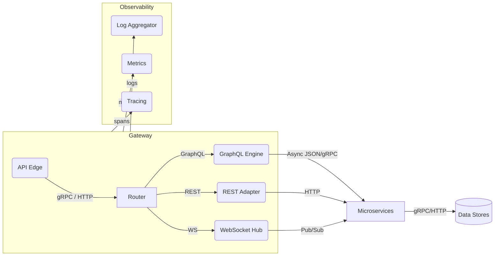

```markdown
# SynestheticCanvas ‑ API Gateway Architecture  
*(Module: `api_graphql`)*  

> “Treat every endpoint as a brush stroke.”  
> — Lead Architect, SynestheticCanvas

---

## 1. Purpose

The API Gateway is the single ingress/egress point for **all** client traffic—GraphQL, REST fall-backs, metrics, health checks, and WebSocket subscriptions.  
It **does not** implement business logic; it orchestrates:

* Request validation & normalization  
* Schema version negotiation  
* Dynamic routing to the appropriate microservice  
* Response shaping, pagination, and caching  
* Observability (structured logging, tracing, metrics)  
* Rate-limiting and traffic shaping  

---

## 2. High-Level Diagram



---

## 3. Technology Stack

| Concern            | Technology / Library                               |
| ------------------ | -------------------------------------------------- |
| HTTP / HTTP/2      | [libh2o](https://github.com/h2o/h2o)               |
| GraphQL Engine     | [cgql](https://github.com/graphql-c/cgql)          |
| JSON Parsing       | [yyjson](https://github.com/ibireme/yyjson)        |
| gRPC Client        | [gRPC-C](https://github.com/Juniper/grpc-c)        |
| WebSocket          | Built-in H2O WS API                                |
| Caching            | pluggable: Redis, in-process LRU                   |
| Metrics            | [Prometheus-C](https://github.com/digitalocean/prometheus-client-c)|
| Tracing            | OpenTelemetry C SDK                                |
| Logging            | [spdlog-c](https://github.com/irsl/spdlog-c)       |

> All third-party dependencies are vendored and version-pinned via `cmake/FetchContent` to ensure reproducibility.

---

## 4. Request Life-Cycle

1. **Ingress**  
   – `libh2o` accepts the TCP/TLS connection and performs ALPN (HTTP/2, HTTP/1.1, WebSocket).  
2. **Pre-flight Filters**  
   – IP allow/deny, rate limiter, TLS client-certificate check.  
3. **Protocol Router**  
   – Based on `:path` and `Content-Type` headers:  
     * `/graphql` → GraphQL handler  
     * `/v{N}/**`  → REST adapter (versioned)  
     * `/ws`       → WebSocket Hub  
4. **Validation**  
   – JSON Schema (REST) or GraphQL AST validation, depth-limit, complexity analyzer.  
5. **Service Discovery**  
   – Resolve microservice target via Consul or static registry.  
6. **Proxy / Execution**  
   – Forward the request (gRPC or HTTP).  
   – Collect partial responses for **federated** GraphQL queries.  
7. **Response Filters**  
   – Pagination, error redaction, ETag/caching headers.  
   – Observability emit (metrics, traces).  
8. **Egress**  
   – Send response, close connection if needed.  

---

## 5. Key Design Decisions

### 5.1 Versioned GraphQL Schemas

Schemas are **append-only**; breaking changes require a new major (`v2`, `v3`, …).  
Gateway negotiates version through:

1. `X-SC-GraphQL-Schema: vN` header (preferred)  
2. `SC-GQL-Schema` cookie (Web clients)  
3. Fallback to the greatest supported version.  

### 5.2 REST as a Compatibility Layer

Every GraphQL field with `@rest` directive automatically spawns a REST endpoint during build:

```graphql
type Palette {
    id: ID!
    name: String! @rest(path: "/v1/palettes/{id}", method: GET)
    colors: [Color!]!
}
```

The code-gen step creates a façade function in `rest_adapter.c` that marshals to the GraphQL resolver internally (see §6).

---

## 6. Core Source Walk-through

Below are trimmed but **compilable** excerpts that illustrate best practices.

### 6.1 gateway.c – Entry Point

```c
/**
 * gateway.c
 * ----------
 * SynestheticCanvas API Gateway entry point.
 * Bootstraps the web server, loads plugin modules, 
 * and wires observability hooks.
 */
#include <h2o.h>
#include <cgql/cgql.h>
#include <yyjson.h>
#include <prom.h>
#include <signal.h>

#include "config.h"
#include "router.h"
#include "observability.h"

static h2o_globalconf_t   g_config;
static h2o_context_t      g_ctx;
static h2o_multithread_queue_t *g_queue = NULL;

static void on_sigterm(int signo) {
    h2o_context_request_shutdown(&g_ctx);
}

int main(int argc, char **argv)
{
    // 1. Parse CLI / ENV configuration
    sc_config_t cfg = {0};
    if (sc_config_load(&cfg, argc, argv) != 0) {
        fprintf(stderr, "Failed to load configuration\n");
        return EXIT_FAILURE;
    }

    // 2. Initialize logging ASAP
    sc_log_init(cfg.log_level, cfg.log_file);

    // 3. Observability stack
    if (sc_observe_init(&cfg.observe) != 0) {
        SC_LOG_ERROR("Observability init failed");
        return EXIT_FAILURE;
    }

    // 4. Setup H2O global configuration
    h2o_config_init(&g_config);
    sc_router_register(&g_config, &cfg);

    // 5. Create listener sockets
    int listener_fd = sc_socket_create_listener(cfg.bind_address, cfg.port);
    if (listener_fd < 0) {
        SC_LOG_ERROR("Cannot bind %s:%d", cfg.bind_address, cfg.port);
        return EXIT_FAILURE;
    }

    // 6. Initialize thread pool
    h2o_context_init(&g_ctx, h2o_evloop_create(), &g_config);
    g_queue = h2o_multithread_create_queue(&g_ctx, "sc-queue");

    // 7. Signal handling
    signal(SIGTERM, on_sigterm);
    signal(SIGINT,  on_sigterm);

    SC_LOG_INFO("SynestheticCanvas Gateway started on %s:%d", 
                cfg.bind_address, cfg.port);

    // 8. Main event loop
    while (h2o_evloop_run(g_ctx.loop, INT32_MAX) == 0);

    // 9. Graceful shutdown
    h2o_context_dispose(&g_ctx);
    h2o_config_dispose(&g_config);
    sc_observe_shutdown();
    sc_config_free(&cfg);

    SC_LOG_INFO("Gateway shut down gracefully");
    return EXIT_SUCCESS;
}
```

### 6.2 router.c – URL Multiplexer

```c
/**
 * router.c
 * --------
 * Declarative URL routing. New routes are appended
 * here by code-gen scripts to avoid scattered logic.
 */
#include "router.h"
#include "handlers/graphql_handler.h"
#include "handlers/rest_handler.h"
#include "handlers/ws_handler.h"

void sc_router_register(h2o_globalconf_t *glob, const sc_config_t *cfg)
{
    h2o_pathconf_t *graphql  = h2o_config_register_path(glob, "/graphql", 0);
    graphql->handlers = (h2o_handler_t *[]){
        sc_graphql_handler_create(glob, cfg), NULL
    };

    h2o_pathconf_t *rest_v1  = h2o_config_register_path(glob, "/v1", H2O_URL_EGL_LIKELY);
    rest_v1->handlers = (h2o_handler_t *[]){
        sc_rest_handler_create(glob, cfg, 1), NULL
    };

    h2o_pathconf_t *rest_v2  = h2o_config_register_path(glob, "/v2", 0);
    rest_v2->handlers = (h2o_handler_t *[]){
        sc_rest_handler_create(glob, cfg, 2), NULL
    };

    h2o_pathconf_t *ws       = h2o_config_register_path(glob, "/ws", 0);
    ws->handlers = (h2o_handler_t *[]){
        sc_ws_handler_create(glob, cfg), NULL
    };
}
```

### 6.3 graphql_handler.c – Streaming Execution

```c
/**
 * GraphQL Handler
 */
#include <cgql/executor.h>
#include <cgql/validator.h>
#include "handlers/graphql_handler.h"
#include "services/federation.h"

typedef struct {
    h2o_handler_t super;
    sc_config_t  *cfg;
} sc_graphql_handler_t;

static int on_req(h2o_handler_t *self, h2o_req_t *req)
{
    sc_graphql_handler_t *h = (sc_graphql_handler_t *)self;

    // 1. Ensure method POST
    if (req->method.len != 4 || memcmp(req->method.base, "POST", 4) != 0) {
        return h2o_send_error_405(req, "Method Not Allowed", "", H2O_SEND_ERROR_KEEP_HEADERS);
    }

    // 2. Parse JSON body
    yyjson_doc *doc = NULL;
    if (sc_json_parse_request(req, &doc) != 0) {
        return h2o_send_error_400(req, "Invalid JSON", "", 0);
    }

    // 3. Extract "query" and "variables"
    const char *query     = sc_json_get_string(doc, "query");
    yyjson_val *vars_node = yyjson_get(doc, "variables");

    // 4. Parse & validate GraphQL
    cgql_parser_t *parser = cgql_parser_new(query);
    cgql_ast_t    *ast    = cgql_parse(parser);

    if (!ast) {
        sc_json_free(doc);
        cgql_parser_free(parser);
        return h2o_send_error_400(req, "GraphQL parse error", parser->last_error, 0);
    }

    char *validation_err = NULL;
    if (!cgql_validate(ast, &validation_err)) {
        sc_json_free(doc);
        cgql_ast_free(ast);
        cgql_parser_free(parser);
        int res = h2o_send_error_400(req, "GraphQL validation error", 
                                     validation_err, 0);
        free(validation_err);
        return res;
    }

    // 5. Execute against federated services
    yyjson_mut_doc *result = sc_fed_execute(h->cfg, ast, vars_node);

    // 6. Serialize response
    sc_http_send_json(req, result);

    // Cleanup
    sc_json_free(doc);
    yyjson_mut_doc_free(result);
    cgql_ast_free(ast);
    cgql_parser_free(parser);
    return 0;
}

h2o_handler_t *sc_graphql_handler_create(h2o_globalconf_t *glob, const sc_config_t *cfg)
{
    sc_graphql_handler_t *h = h2o_mem_alloc_shared(NULL, sizeof(*h), NULL);
    h2o_handler_init((h2o_handler_t *)h, sizeof(*h));
    h->super.on_req = on_req;
    h->cfg          = (sc_config_t *)cfg;
    return (h2o_handler_t *)h;
}
```

### 6.4 rest_adapter.c – Auto-Generated Example

```c
/**
 * Auto-generated REST endpoint for Palette retrieval.
 * Mirrors the GraphQL field: Palette.name
 */
#include "handlers/rest_handler.h"
#include "proto/palette.pb-c.h"
#include "services/palette_client.h"

static int handle_get_palette(h2o_handler_t *self, h2o_req_t *req)
{
    const h2o_iovec_t *id = h2o_req_extract_path_param(req, "id");
    if (!id || id->len == 0) {
        return h2o_send_error_400(req, "Missing palette id", "", 0);
    }

    PaletteRequest pr = PALETTE_REQUEST__INIT;
    pr.id = strndup(id->base, id->len);

    PaletteResponse *resp = palette_client_get(&pr);
    free(pr.id);

    if (!resp) {
        return h2o_send_error_502(req, "Upstream failure", "", 0);
    }

    yyjson_mut_doc *doc = yyjson_mut_doc_new(NULL);
    yyjson_mut_obj_add_str(doc, doc, "id", resp->id);
    yyjson_mut_obj_add_str(doc, doc, "name", resp->name);

    sc_http_send_json(req, doc);
    palette_response__free_unpacked(resp, NULL);
    yyjson_mut_doc_free(doc);
    return 0;
}
```

---

## 7. Observability Blueprint

1. **Structured Logging** → JSON lines,  `stderr` fallback.  
2. **Metrics** → Prometheus exposition `/metrics`.  
3. **Tracing** → OpenTelemetry exporter (Jaeger by default).  
4. **Health** → `GET /healthz` (liveness) and `/readyz` (readiness).  

Example Prometheus metric naming:

```text
sc_gateway_request_total{method="POST",endpoint="/graphql",status="2xx"} 135
sc_gateway_upstream_latency_seconds_bucket{service="texture_svc",le="0.1"} 512
```

---

## 8. Resilience & Scaling

* **Circuit Breakers:** Per-service rolling window on failure rate.  
* **Rate Limiting:** Token bucket via Redis or in-mem fallback.  
* **Autoscaling Signals:** P95 latency, CPU, custom “brush_stroke” metric.  
* **Blue/Green Deploy:** Canary header `X-SC-Canary: true`.  

---

## 9. Future Work

* GraphQL defer/stream support (incremental delivery)  
* WASM plugin sandbox for user-defined resolvers  
* QUIC/HTTP-3 transport evaluation  

---

## 10. References

* “Building an API Gateway in C”, *C90Con* (2022).  
* “GraphQL Federation at Scale”, *FOSDEM* (2023).  

---

> **Document ID:** `SC-ARCH-APIGW`  
> **Last Reviewed:** 2024-05-09  
> **Maintainers:** `@infra-paint`, `@canvas-ops`

```