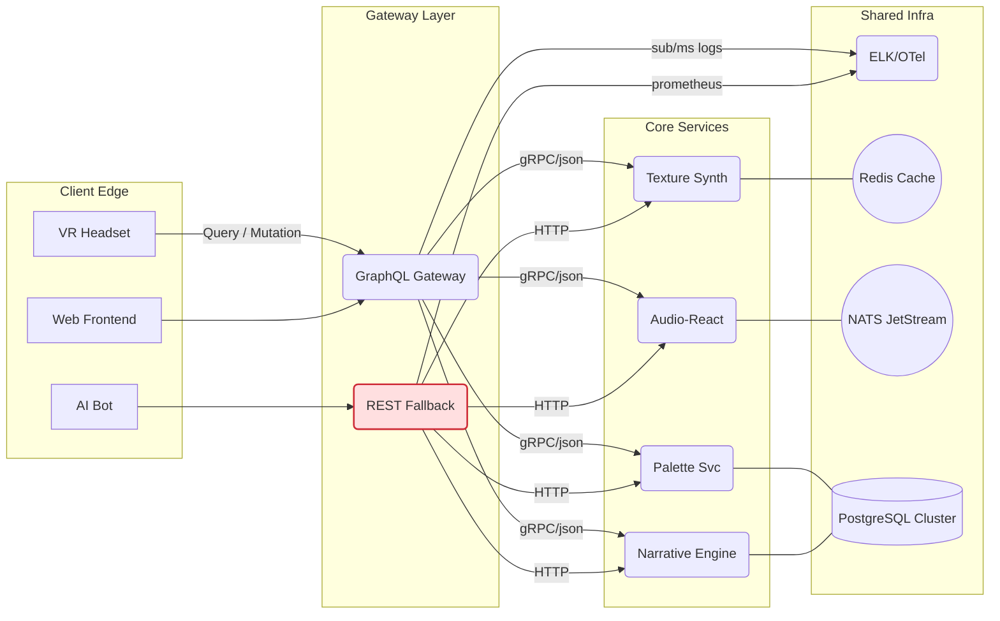
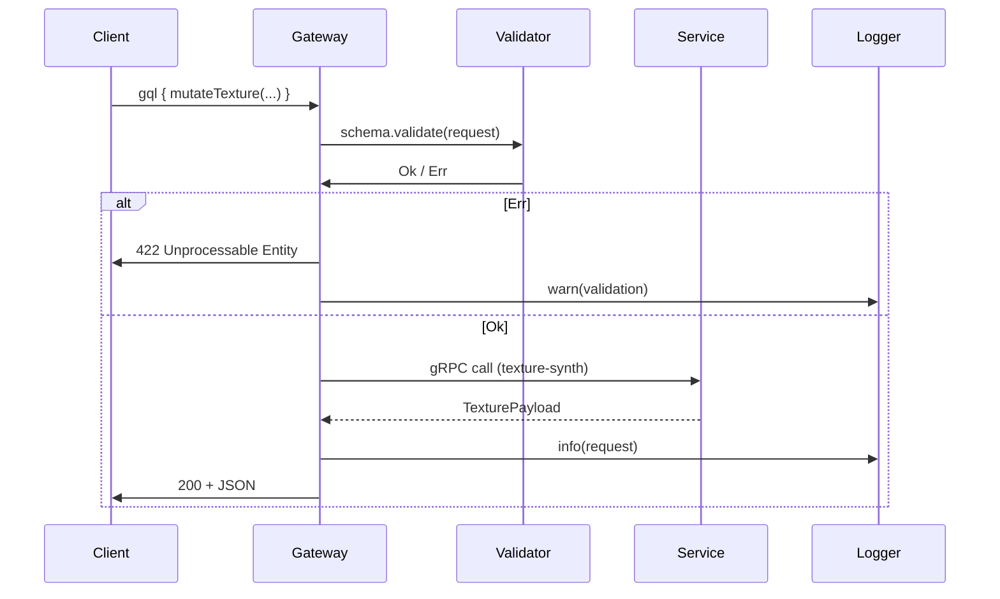

```md
# SynestheticCanvas – Architectural Overview
> Document Path: `SynestheticCanvas/docs/architecture/overview.md`  
> Project: **SynestheticCanvas API Suite (`api_graphql`)**  
> Revision: `v1.2.3` – _last updated 2024-06-14_

---

## 1. Vision

SynestheticCanvas transforms every HTTP or WebSocket request into a _brush-stroke_ on a living digital canvas.  
Microservices supply the colors, textures, and motion, while the **GraphQL/REST gateway** orchestrates them into a single, time-synchronous response.  
The architecture has three non-negotiable goals:

1. **Expressiveness** – Artists can combine services like mixing paint.  
2. **Evolution** – New art forms (e.g., volumetric audio) can be added without breaking existing exhibitions.  
3. **Performance** – Frame-accurate (< 16 ms) responses even under festival-scale load.

---

## 2. Macro-Level Topology



---

## 3. Layered Breakdown

| Layer                | Responsibility                                           | Key Patterns                        |
|----------------------|----------------------------------------------------------|-------------------------------------|
| **Gateway**          | Auth, rate-limit, schema stitching, cache-aside          | API Gateway, GraphQL Schema         |
| **Service Layer**    | Domain orchestrations, streaming, CQRS                   | Command/Query Separation            |
| **Repository Layer** | Data access, DAO mapping, migrations                     | Repository Pattern                  |
| **Infra**            | Observability, tracing, message bus, persistence         | Sidecar + 12-Factor                 |

---

## 4. Gateway Internals

### 4.1 GraphQL Route Lifecycle



#### 4.1.1 Validation Rules
* **Static** – schema-compiled (enum ranges, non-null fields)  
* **Dynamic** – cross-service (`audioId` exists, `paletteId` owns user)  
* **Security** – depth limit, cost analysis, JWT claims scoping  

### 4.2 REST Fallback

* Code-generated from the GraphQL schema using `gnostic` + custom templates.  
* Follows HATEOAS, supports `?page[limit]=`, `?page[offset]=` for pagination.  

---

## 5. Versioning Strategy

1. Breaking changes → new _major_ (e.g., `v2`) schema namespace.  
2. Additive changes → patch bump (`v1.3 → v1.4`) and feature flag.  
3. Deprecated fields emit `Deprecation-Notice` headers for 90 days.  

```
query v1_3 {
  palette(id: "ultra-violet") {          # valid
    swatches { hex }                     
  }
}

query v2_0 {
  paletteGet(id: "ultra-violet") {       # renamed
    swatches { hex, rgb }                # new field
  }
}
```

---

## 6. Service Blueprint (C Reference)

A microservice is a standalone **statically-linked** ELF built with **C17** and a thin **gRPC** layer.  
Below is a simplified excerpt from `palette_svc/src/service.c`.

```c
/**
 * @file service.c
 * @brief Palette microservice – Service entry point & request handlers.
 */

#include <stdlib.h>
#include <signal.h>
#include "core/palette.h"
#include "infra/logger.h"
#include "infra/repository.h"
#include "gen/palette.grpc.pb-c.h"

static palette_repo_t *repo = NULL;

/* gRPC → C callback ------------------------------------------------------- */
static void handle_palette_get(
        const PaletteGetRequest *req,
        PaletteGetReply **resp,
        void *user_data)
{
    (void)user_data;
    sc_trace_span_t span = sc_trace_start("palette_get");

    /* 1. Validate -------------------------------- */
    if (!req->id || req->id[0] == '\0') {
        sc_log_warn("palette_get: empty id");
        *resp = palette_get_reply__error(
            HTTP_BAD_REQUEST, "Palette ID must not be empty");
        goto finish;
    }

    /* 2. Repository ------------------------------ */
    palette_t pal = {0};
    sc_error_t err = repo->get(repo, req->id, &pal);
    if (err.code == SC_ERR_NOT_FOUND) {
        *resp = palette_get_reply__error(
            HTTP_NOT_FOUND, "Palette not found");
        goto finish;
    } else if (err.code != SC_OK) {
        sc_log_error("repo->get failed: %s", err.msg);
        *resp = palette_get_reply__error(
            HTTP_INTERNAL_SERVER_ERROR, "Internal error");
        goto finish;
    }

    /* 3. Mapping → ProtoBuf ---------------------- */
    *resp = palette_get_reply__success(&pal);

finish:
    sc_trace_end(&span);
}

int main(int argc, char **argv)
{
    sc_logger_init_default();          /* JSON-structured logs          */
    sc_trace_init_otel();              /* OpenTelemetry exporter        */

    repo = palette_repo_init(getenv("PG_DSN"));
    if (!repo) {
        sc_log_fatal("failed to init repository");
        return EXIT_FAILURE;
    }

    sc_grpc_server_t *srv = sc_grpc_server_create("0.0.0.0:7001");
    sc_grpc_server_register_palette_get(srv, handle_palette_get, NULL);

    /* Graceful shutdown ------------------------- */
    signal(SIGTERM, sc_grpc_server_stop);
    signal(SIGINT,  sc_grpc_server_stop);

    sc_log_info("palette_svc listening on :7001");
    sc_grpc_server_serve(srv);

    palette_repo_free(repo);
    sc_grpc_server_free(srv);
    sc_logger_flush();
    return EXIT_SUCCESS;
}
```

---

## 7. Observability & Monitoring

| Metric                    | Target             | Alert Threshold                    |
|---------------------------|--------------------|------------------------------------|
| `http_request_duration`   | < 150 ms p95       | > 250 ms for 5 min                 |
| `grpc_error_rate`         | < 0.2 %            | > 5 % rolling 1 min                |
| `redis_cache_hit_ratio`   | > 0.9              | < 0.7 rolling 15 min               |
| `jetstream_lag`           | < 1 msg           | > 50 msg for 30 s                  |

Logs are shipped to **ELK**, traces to **Jaeger**, metrics scraped by **Prometheus** and rendered in **Grafana** dashboards (`dashboards/` folder).

---

## 8. Security Posture

* **mTLS** between services (`SPIFFE` identities).  
* **OPA** sidecar on gateway for fine-grained policy.  
* Every JWT carries:
  - `cid` (canvas-id) – tenant sharding
  - `scopes` – `palette:rw`, `texture:r`  
  - `aud` (service audience)  

*Rate limiting* – token-bucket (Redis) keyed by `sub:cid`.

---

## 9. Failure Modes & Resilience

| Scenario                        | Mitigation                                  |
|---------------------------------|---------------------------------------------|
| Network partition               | gRPC retries + circuit-breaker (Hystrix-c)  |
| Gateway overload                | Adaptive LRU cache, request shedder         |
| Service crash                   | Kubernetes restart, health probes           |
| DB connection pool exhaustion   | PgBouncer & slow-query logger               |
| Upstream incompatible version   | Dual-run old/new schema + feature flags     |

---

## 10. Deployment Pipeline

1. **Pre-merge** – `clang-tidy`, `cppcheck`, `unit-tests` (CTEST).  
2. **Build** – `docker build --platform=linux/amd64 --target runtime`.  
3. **Security** – `trivy fs`, SBOM via `syft`.  
4. **Canary** – 5 % traffic for 30 min, monitored saturation SLOs.  
5. **Promotion** – Git tag + Helm release (`charts/`).  

---

## 11. Glossary

| Term       | Meaning                                                    |
|------------|------------------------------------------------------------|
| Brush-Stroke | Individual API call altering the live canvas state.       |
| Swatch       | A semantically-named color token (`#FF22AA`, “ultra-violet”). |
| Texture Node | Procedural fragment generating a 2D/3D texture.          |
| Narrative Arc| Branch in story graph triggered by user input.           |

---

## 12. References

* _Reactive Design Patterns_ – R. Kuhn  
* _Clean Architecture in C_ – A. Martin  
* GraphQL Spec `2021-10`  
* OpenTelemetry v1.26.0  

---

> © 2024 SynestheticCanvas Consortium – Released under the Apache 2.0 License
```