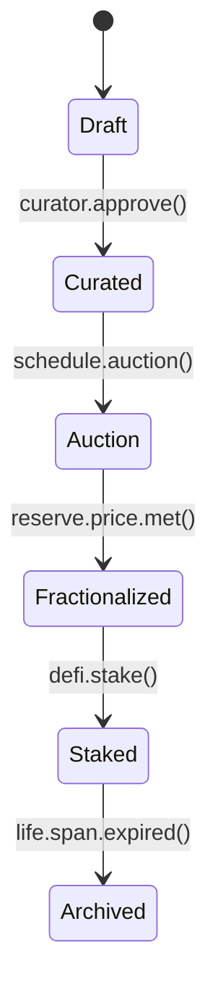

```markdown
# HoloCanvas — System Architecture  
*A Micro-Gallery Blockchain for Generative Artifacts*  

**Version:** 1.0  
**Status:** Production  
**Author:** Core Engineering Team  
**Last-Updated:** 2024-05-29  

---

## Table of Contents
1. Executive Summary  
2. High-Level Blueprint  
3. Component Reference  
4. Event & Data Contracts  
5. Life-Cycle State Machine  
6. Consensus Engine Plug-In Model  
7. Design Patterns In-Use  
8. Fault-Tolerance & Recovery  
9. Deployment Topology  
10. Appendix (Code Snippets, CLI, Make Targets)

---

## 1  Executive Summary
HoloCanvas is an open, **C-based** micro-service ecosystem that orchestrates the minting, governance, and market evolution of **generative, living NFTs**. The system exposes deterministic *creative recipes* on-chain while delegating heavy media processing to off-chain worker pods. Each component is decoupled via **Kafka** event-streams and **gRPC** contracts, allowing horizontal scale-out and plug-and-play experimentation with consensus algorithms, artistic strategies, and DeFi mechanics.

---

## 2  High-Level Blueprint

```text
+------------------+        Kafka        +------------------+
|  Wallet-Proxy    | <---- Topics ----> |  Gallery-Gateway |
+--------+---------+                    +----+-------------+
         |  gRPC HTTP /1.1                   |
         |                                    |  Artifact REST
         v                                    v
 +--------+---------+       +-----------------+-----------------+
 |  LedgerCore      | <---> |   Mint-Factory (Factory Pattern)  |
 +--------+---------+       +-----------------+-----------------+
         |                                     ^
         |  RocksDB (UTXO + State)             |  Event
         v                                     |
 +--------+---------+       Kafka         +----+-------------+
 |  Governance-Hall | <---- Topics ---->  |  DeFi-Garden     |
 +------------------+                    +------------------+
```

---

## 3  Component Reference

### 3.1 Wallet-Proxy (Proxy Pattern)
* Hides raw blockchain mechanics from UI clients.  
* Signs and bundles transactions, batching micro-payments into rollups.  
* Rate-limits requests per API key (Leaky-Bucket, per-tenant).  

### 3.2 Gallery-Gateway  
* API layer (OpenAPI v3) that exposes queryable GraphQL interface.  
* HTTP → gRPC translation, static file CDN for media layers.  

### 3.3 Mint-Factory (Factory Pattern)  
* Composes shader fragments, audio grains, and metadata into an `ArtifactRecipe`.  
* Emits `ArtifactCreated` events; persists recipe to **IPFS** and CID to chain.  

### 3.4 LedgerCore  
* Custom UTxO‐style ledger written in C with **RocksDB** backing store.  
* Pluggable Consensus Engine (see §6).  
* Provides `LedgerService` (gRPC) with the following RPCs:  
  - `SubmitTx(Tx)`  
  - `StreamBlocks(Height)`  
  - `QueryState(Key)`  

### 3.5 Governance-Hall  
* DAO voting, quorum tracking, parameter upgrades.  
* Runs embedded **SQLite** + **Raft** for internal persistence.  

### 3.6 DeFi-Garden  
* Yield farming, staking pools, and fractional ownership of high-value NFTs.  
* Uses **libsecp256k1** for cryptographic ops.  

### 3.7 Oracle-Bridge  
* Bridges external data (weather, stock, sensor) into on-chain events.  
* Provides `WeatherOracleService.Report(WeatherFrame)`  

### 3.8 Muse Services (Observer Pattern)  
* Stateless pods that watch event streams (`ArtifactLiked`, `AuctionEnded`, etc.)  
* Trigger generative `Strategy` plug-ins that mutate media layers.

---

## 4  Event & Data Contracts

### 4.1 Kafka Topics
| Topic | Publisher | Subscriber(s) | Payload Avro Schema |
|-------|-----------|---------------|---------------------|
| `tx.submitted` | Wallet-Proxy | LedgerCore | `TxEnvelope` |
| `artifact.created` | Mint-Factory | Gallery-Gateway, Muse-* | `ArtifactMeta` |
| `gov.vote.cast` | Wallet-Proxy | Governance-Hall | `VoteCast` |
| `defi.stake` | Wallet-Proxy | DeFi-Garden | `StakeEvent` |
| `oracle.weather` | Oracle-Bridge | Muse-Weather | `WeatherFrame` |

### 4.2 gRPC / Protobuf
```proto
syntax = "proto3";
package holo.ledger.v1;

message Tx {
  bytes  tx_id      = 1;
  bytes  sender     = 2;
  bytes  recipient  = 3;
  uint64 amount     = 4;
  bytes  signature  = 5;
}

service LedgerService {
  rpc SubmitTx     (Tx)       returns (Ack);
  rpc StreamBlocks (Height)   returns (stream Block);
  rpc QueryState   (StateKey) returns (StateValue);
}
```

---

## 5  Life-Cycle State Machine



States are enforced inside **LedgerCore** by a compiled **deterministic automaton** defined in `state_machine.c` (see Appendix).

---

## 6  Consensus Engine Plug-In Model

`LedgerCore` dynamically loads shared-object libraries at runtime:

```c
typedef struct {
    const char  *name;
    int  (*init)(void);
    int  (*validate_block)(const block_t *);
    int  (*commit)(const block_t *);
    void (*shutdown)(void);
} consensus_vtable_t;
```

1. `libconsensus_pos.so` – traditional Proof-of-Stake.  
2. `libconsensus_da.so`  – Delegated-Artistry (weighted by curation reputation).  

Each plug-in must export a `consensus_vtable` symbol.

---

## 7  Design Patterns In-Use
* **Factory** – `Mint-Factory` building artifacts.  
* **Observer** – Muse services listening to events.  
* **Strategy** – Generation strategies loaded by Muse pods.  
* **Proxy** – Wallet-Proxy shielding clients.  
* **State Machine** – Artifact life-cycle.  
* **Event Driven** – Kafka message bus.

---

## 8  Fault-Tolerance & Recovery
1. **At-Least-Once** event semantics; idempotent consumers use `dedupe_key`.  
2. **Circuit Breakers** guard cross-service gRPC calls.  
3. **Checksum** of every CID before pinning to IPFS & chain.  
4. **Snapshotting** Ledger state each 1000 blocks; restores via **RocksDB checkpoint API**.  
5. **Draining Mode**: Kubernetes preStop hook flushes pending tx to `tx.submitted`.

---

## 9  Deployment Topology

```text
 ┌─────────────────────────────────────────────────────────┐
 │                  Kubernetes Cluster                    │
 │ ┌───────────────┐  ┌───────────────┐  ┌───────────────┐ │
 │ │ Wallet-Proxy  │  │ Gallery-Gate  │  │ Oracle-Bridge │ │
 │ └───────────────┘  └───────────────┘  └───────────────┘ │
 │        |^                 |^                |^          │
 │        v|                 v|                v|          │
 │  ┌───────────────┐  ┌───────────────┐  ┌───────────────┐│
 │  │ LedgerCore    │  │ Mint-Factory  │  │ Governance    ││
 │  └───────────────┘  └───────────────┘  └───────────────┘│
 │        |                                         |      │
 │        v                                         v      │
 │   ┌───────────────┐                        ┌──────────┐ │
 │   │ DeFi-Garden   │                        │   Kafka  │ │
 │   └───────────────┘                        └──────────┘ │
 └─────────────────────────────────────────────────────────┘
 ```

*Observability*: Prometheus + Grafana dashboards for per-service latency & error-rate.

---

## 10  Appendix

### 10.1 `state_machine.c` (excerpt)

```c
#include "state_machine.h"

static const char *state_names[] = {
    "DRAFT", "CURATED", "AUCTION", "FRACTIONALIZED",
    "STAKED", "ARCHIVED"
};

static transition_t transitions[] = {
    { DRAFT,         CURATED,        EVT_CURATOR_APPROVE  },
    { CURATED,       AUCTION,        EVT_SCHEDULE_AUCTION },
    { AUCTION,       FRACTIONALIZED, EVT_RESERVE_MET      },
    { FRACTIONALIZED,STAKED,         EVT_DEFI_STAKE       },
    { STAKED,        ARCHIVED,       EVT_LIFE_EXPIRE      },
};

artifact_state_t sm_next_state(artifact_state_t s, artifact_event_t e)
{
    for (size_t i = 0; i < ARRAY_LEN(transitions); ++i) {
        if (transitions[i].from == s && transitions[i].event == e)
            return transitions[i].to;
    }
    return s; /* No-op if invalid transition */
}
```

### 10.2 Make Targets

```make
build: ## Build all micro-services
	@for svc in wallet_proxy gallery_gateway ledger_core mint_factory governance_hall defi_garden oracle_bridge ; do \
		$(MAKE) -C "$$svc" ; \
	done

docker-build: ## Build container images
	@./scripts/docker-build-all.sh
```

### 10.3 CLI Quick Start

```bash
make build
docker-compose up -d kafka postgres
./bin/ledger_core --init-db
./bin/gallery_gateway --listen :8080
```

---

> “The canvas is infinite when every node carries a brush.”

```