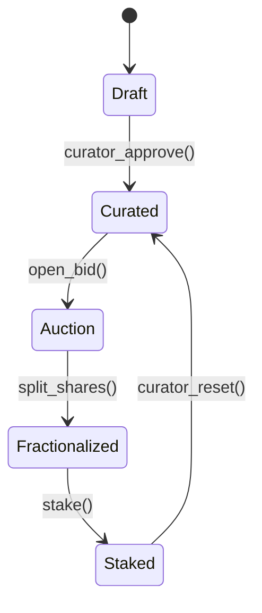

```markdown
<!--
  HoloCanvas › API Docs › Main Page
  =================================
  Copyright © 2024 HoloCanvas
  SPDX-License-Identifier: Apache-2.0

  NOTE:
      • This file acts as the single-source-of-truth for all public-facing
        developer documentation. All downstream READMEs and swagger/grpc
        descriptors are generated from the Markdown herein.
      • Update version numbers and checksum references atomically across
        all sections to keep CI integrity checks green.
-->

# HoloCanvas — Developer API Documentation

Welcome to the **HoloCanvas** micro-gallery blockchain SDK.  
This document describes the network protocol, service boundaries,
data structures, and reference client implementations used to build
on top of the platform.

> Version: `v0.9.4`  
> Chain ID: `holo-canvas-l2-rollup-0013`  
> Spec Hash (SHA-256): `94b5e2a44742ff8e6fb5b4d1ad5cbe5257572f5e80b4d6e3b7b746c3c0e5f437`

---

## Table of Contents

1. High-Level Overview
2. Microservice Matrix
3. Transport & Wire-Format
4. Canonical Data Structures
5. Error Model
6. Authentication & Signing
7. Quick-Start Examples
8. Event Subscription
9. Governance & DAO Endpoints
10. State-Machine Lifecycle
11. Code-Gen & Tooling
12. Changelog

---

## 1. High-Level Overview

HoloCanvas splits its runtime into **seven** orthogonal microservices
communicating over a *gRPC* control plane and a *Kafka* event mesh:

```
+-------------+      +---------------+      +---------------+
| MintFactory | <--> | LedgerCore    | <--> | ConsensusEngine|
+-------------+      +---------------+      +---------------+
      |                       ^                     |
      v                       |                     v
+-------------+       +-------+-------+     +---------------+
| GalleryGate | <-->  | DeFi-Garden    | <--> | GovernanceHall|
+-------------+       +---------------+     +---------------+
      |
      v
+-------------+
| WalletProxy |
+-------------+
```

Every **NFT Artifact** is a deterministic program (audio/visual shader
graph) recorded immutably on-chain. Collectors can influence its
evolution via staking, DAO votes or oracular triggers.

---

## 2. Microservice Matrix

| Service          | gRPC Port | Kafka Topic(s)                  | Purpose                                  |
|------------------|-----------|---------------------------------|------------------------------------------|
| `MintFactory`    | 7001      | `mint.req`, `mint.res`          | Mints NFT artifacts using factory pattern|
| `LedgerCore`     | 7002      | `tx.append`, `tx.finalize`      | Core ledger; UTXO + EVM hybrid           |
| `GalleryGate`    | 7003      | `gallery.events`                | Public REST/gRPC gateway                 |
| `DeFi-Garden`    | 7004      | `staking.*`, `pool.*`           | Yield farming and fractionalization      |
| `Oracle-Bridge`  | 7005      | `oracle.push`                   | Off-chain data feed                      |
| `GovernanceHall` | 7006      | `gov.vote`, `gov.result`        | DAO governance                           |
| `Wallet-Proxy`   | 7007      | *None*                          | Thin JSON-RPC wrapper                    |

---

## 3. Transport & Wire-Format

* Control-plane calls: **gRPC over HTTP/2, protobuf v3**  
* Data-plane events: **Kafka** (snappy compression, Avro schema)  
* Public fallback: **REST/JSON** (OpenAPI 3.1) for mobile wallets  
* Binary messages are **little-endian** and **TLS 1.3** encrypted.

### gRPC Base URL

```
grpcs://api.holocanvas.io:<PORT>
```

### Health-Check

```protobuf
service Health {
    rpc Ping (PingReq) returns (PongRes) {
        option (google.api.http) = {
            get: "/v1/health/ping"
        };
    }
}
```

---

## 4. Canonical Data Structures

```c
/* api/include/hc_types.h */

#ifndef HC_TYPES_H
#define HC_TYPES_H

#include <stdint.h>
#include <stddef.h>

#define HC_SHA256_BYTES 32
#define HC_ADDR_BYTES   20
#define HC_SIG_BYTES    64

typedef struct {
    uint8_t bytes[HC_SHA256_BYTES];
} hc_hash_t;

typedef struct {
    uint8_t bytes[HC_ADDR_BYTES];
} hc_address_t;

typedef struct {
    uint8_t bytes[HC_SIG_BYTES];
} hc_signature_t;

/* NFT Artifact Descriptor */
typedef struct {
    hc_hash_t     artifact_id;
    char          title[128];
    char          artist[64];
    char          media_type[16];      /* "shader", "audio", "video" */
    uint64_t      block_height;
    uint64_t      mint_timestamp;      /* unix epoch ms */
    hc_address_t  owner;
    hc_hash_t     recipe_hash;         /* IPFS / Arweave CID digest */
} hc_artifact_t;

/* Transaction Receipt */
typedef struct {
    uint64_t      nonce;
    hc_hash_t     tx_hash;
    uint64_t      gas_used;
    uint64_t      block_number;
    uint8_t       success;             /* 1 == OK, 0 == reverted */
} hc_tx_receipt_t;

#endif /* HC_TYPES_H */
```

Protobuf mirror (excerpt):

```protobuf
message Artifact {
  bytes  artifact_id   = 1; // 32-byte SHA-256
  string title         = 2;
  string artist        = 3;
  string media_type    = 4;
  uint64 block_height  = 5;
  uint64 mint_ts_ms    = 6;
  bytes  owner         = 7; // 20-byte addr
  bytes  recipe_hash   = 8;
}
```

---

## 5. Error Model

All RPCs return an `ErrorEnvelope` when status != OK:

```protobuf
message ErrorEnvelope {
  int32  code       = 1; // see hc_error.h
  string reason     = 2;
  bytes  debug_ctx  = 3; // optional CBOR blob
}
```

```c
/* api/include/hc_error.h */
#define HC_ERR_OK                 0
#define HC_ERR_TIMEOUT           -1
#define HC_ERR_INVALID_SIG       -2
#define HC_ERR_INSUFFICIENT_FUNDS -3
#define HC_ERR_ARTIFACT_NOT_FOUND -4
```

---

## 6. Authentication & Signing

* **ECDSA-secp256k1** for wallet layer  
* **Ed25519** for microservice mutual auth  
* Messages carry a detached signature in the `authorization` header:
  `HC1-ED25519 base64(signature)::base64(public_key)`

Example signing helper (libsecp256k1):

```c
/* tools/sign_tx.c */
#include <secp256k1.h>
#include "hc_types.h"
#include "hc_error.h"
...
int hc_sign_digest(const uint8_t *digest32,
                   const uint8_t *priv32,
                   hc_signature_t *out_sig)
{
    secp256k1_context *ctx = secp256k1_context_create(SECP256K1_CONTEXT_SIGN);
    secp256k1_ecdsa_signature sig;
    if (!secp256k1_ecdsa_sign(ctx, &sig, digest32, priv32, NULL, NULL)) {
        secp256k1_context_destroy(ctx);
        return HC_ERR_INVALID_SIG;
    }
    /* Serialize in compact (64 bytes) form */
    secp256k1_ecdsa_signature_serialize_compact(ctx, out_sig->bytes, &sig);
    secp256k1_context_destroy(ctx);
    return HC_ERR_OK;
}
```

---

## 7. Quick-Start Examples

### 7.1 Minting an Artifact (gRPC-C)

```c
/* examples/mint_artifact.c */
#include <grpc/grpc.h>
#include <grpc/impl/codegen/port_platform.h>
#include "mint_factory.grpc-c.h" /* generated via grpc_c_plugin */
#include "hc_types.h"

int main(int argc, char **argv)
{
    grpc_init();

    grpc_channel *chan = grpc_insecure_channel_create(
        "api.holocanvas.io:7001", NULL, NULL);

    MintFactory__Stub *stub = mint_factory__new_stub(chan);

    MintFactory__MintReq req = MINT_FACTORY__MINT_REQ__INIT;
    MintFactory__MintRes *res;

    req.title        = "Chaotic Harmonics #42";
    req.artist       = "0x9cf6...b7e1";
    req.media_type   = "shader";
    req.recipe_cid   = "bafybeia6b..."; /* truncated */
    req.ask_price_wei= 5e18;            /* 5 HC */

    grpc_call_error err = mint_factory__mint(&req, &res, stub, NULL);
    if (err != GRPC_CALL_OK) {
        fprintf(stderr, "gRPC error: %d\n", err);
        goto cleanup;
    }

    if (res->base.res_case == MINT_FACTORY__MINT_RES__RES_SUCCESS) {
        printf("Minted! Artifact ID: %s\n", res->success->artifact_id.data);
    } else {
        fprintf(stderr, "Mint failed: %s\n", res->error->reason);
    }

cleanup:
    mint_factory__mint_res__free_unpacked(res, NULL);
    mint_factory__free_stub(stub);
    grpc_channel_destroy(chan);
    grpc_shutdown();
    return 0;
}
```

Compile:

```bash
$ gcc -o mint_artifact examples/mint_artifact.c \
      $(pkg-config --cflags --libs grpc grprcc) \
      -lprotobuf-c -lpthread
```

---

### 7.2 REST Fallback (cURL)

```bash
curl -X POST https://api.holocanvas.io/v1/mint \
  -H 'Authorization: HC1-ED25519 <sig>::<pub>' \
  -H 'Content-Type: application/json' \
  -d '{
        "title": "Chaotic Harmonics #42",
        "artist": "0x9cf6...b7e1",
        "media_type": "shader",
        "recipe_cid": "bafybeia6b..."
      }'
```

---

## 8. Event Subscription (Kafka + librdkafka)

```c
/* examples/subscribe_gallery.c */
#include <librdkafka/rdkafka.h>
#include "hc_types.h"

static void on_msg(rd_kafka_message_t *rkmessage, void *opaque)
{
    if (rkmessage->err) {
        fprintf(stderr, "Kafka error: %s\n",
                rd_kafka_message_errstr(rkmessage));
        return;
    }
    printf("Gallery Event ‹%.*s›\n",
           (int)rkmessage->len, (char *)rkmessage->payload);
}

int main(void)
{
    char errstr[512];
    rd_kafka_conf_t *conf = rd_kafka_conf_new();

    rd_kafka_conf_set(conf, "group.id", "canvas-listener", errstr, sizeof errstr);
    rd_kafka_conf_set(conf, "bootstrap.servers", "kafka.hc:9092", errstr, sizeof errstr);

    rd_kafka_t *rk = rd_kafka_new(RD_KAFKA_CONSUMER, conf, errstr, sizeof errstr);
    rd_kafka_poll_set_consumer(rk);

    rd_kafka_topic_partition_list_t *topics = rd_kafka_topic_partition_list_new(1);
    rd_kafka_topic_partition_list_add(topics, "gallery.events", RD_KAFKA_PARTITION_UA);

    rd_kafka_subscribe(rk, topics);

    while (!rd_kafka_consumer_poll(rk, 1000)) { /* loop forever */ }

    rd_kafka_topic_partition_list_destroy(topics);
    rd_kafka_destroy(rk);
    return 0;
}
```

---

## 9. Governance & DAO Endpoints

Proposal creation:

```protobuf
rpc ProposeChange (Gov.Proposal) returns (Gov.Receipt) {
  option (google.api.http) = {
    post: "/v1/governance/proposals"
    body: "*"
  };
}
```

Governance vote body:

```json
{
  "proposal_id": "0x7d551726",
  "vote": "FOR",
  "weight": "auto"          // defaults to wallet's HC balance
}
```

---

## 10. State-Machine Lifecycle



---

## 11. Code-Gen & Tooling

* `make proto` — regenerates C stubs with *grpc-c-plugin*  
* `make docs`  — lints Markdown, updates Swagger & Doxygen  
* `make test`  — executes contract fixtures in simulation VM  

CI is orchestrated via **GitHub Actions** and **buildkite** runners.
All pushes to `main` must pass the `ledger-replay` regression suite
to ensure historical determinism.

---

## 12. Changelog

```
v0.9.4 (2024-05-12)
    ✨ Added fractionalization pooling in DeFi-Garden
    🔒 Enabled TLS 1.3 session tickets across all services
    🐛 Fixed nonce off-by-one in LedgerCore append path
```

---

© 2024 HoloCanvas – Shaping On-Chain Creativity.
```