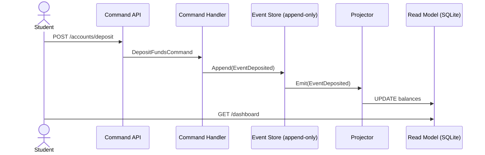

```markdown
---
title: EduPay Ledger Academy – CQRS & Event Sourcing Architecture
description: Technical deep-dive into how the EduPay Ledger Academy executes Command-Query Responsibility Segregation (CQRS) and Event Sourcing in C while remaining faithful to Clean Architecture.
slug: /architecture/cqrs-and-event-sourcing
---

# 03 – CQRS & Event Sourcing

> “Separate **what** the system does from **what** the system knows.”  
> — EduPay Core Team

EduPay Ledger Academy employs **CQRS** to divide **mutations** (Commands) from **reads** (Queries) so that educators can swap persistence technologies, message buses, or reporting databases without touching domain logic.   
All state-changing requests are persisted as **immutable domain events**, enabling deterministic replay, powerful audit trails, and student-friendly time-travel debugging.

---

## Table of Contents

1. Domain Vocabulary  
2. High Level Flow Diagram  
3. Command Pipeline (Write Model)  
4. Event Store Implementation (C)  
5. Query Model & Projections  
6. Consistency, Concurrency, and Idempotency  
7. Failure Injection Labs  
8. Further Reading

---

## 1. Domain Vocabulary

Term | Definition
---- | ----------
**Command** | An intent _to do_ something. Must either succeed or return an error.
**Event** | A fact _that something happened_. Can never change or be removed.
**Aggregate** | A transactional consistency boundary, e.g., `LedgerAccount`.
**Projection / Read Model** | A denormalized view optimized for reads: dashboards, ledgers, etc.

---

## 2. High Level Flow Diagram



---

## 3. Command Pipeline (Write Model)

Below is a **compile-ready** excerpt (C17) showing how a `CommandBus` validates and dispatches commands to their handlers.  
It purposefully decouples IO so professors can mock the bus during unit tests.

```c
/* File: src/cqrs/command_bus.h */
#ifndef EDU_PAY_COMMAND_BUS_H
#define EDU_PAY_COMMAND_BUS_H

#include <stdint.h>
#include <stddef.h>
#include "utils/uuid.h"

/* ---------- Generic Command Definition ---------- */
typedef struct {
    uuid_t   id;         /* Correlation ID for tracing */
    uint64_t timestamp;  /* epoch millis (monotonic)   */
    const char *type;    /* "DepositFundsCommand" etc  */
    void     *payload;   /* domain-specific struct ptr */
} command_t;

/* Error codes follow POSIX semantics for reuse in shell scripts */
typedef enum {
    CMD_OK          = 0,
    CMD_ERR_INPUT   = 22,  /* EINVAL */
    CMD_ERR_HANDLER = 38,  /* ENOSYS */
    CMD_ERR_REJECT  = 35   /* EDEADLK – business rule violated */
} command_status_e;

/* Opaque route handle resolves to specific handler at runtime */
typedef command_status_e (*command_handler_f)(const command_t *cmd);

/* Register handler */
int command_bus_register(const char *type, command_handler_f fn);

/* Dispatch (synchronous) */
command_status_e command_bus_execute(const command_t *cmd);

#endif /* EDU_PAY_COMMAND_BUS_H */
```

```c
/* File: src/cqrs/command_bus.c */
#include "cqrs/command_bus.h"
#include <stdlib.h>
#include <string.h>
#include "utils/hashtable.h"

/* --- Very light associative table (string → function ptr) --- */
static hash_table_t *router = NULL;

int command_bus_register(const char *type, command_handler_f fn) {
    if (!type || !fn) return -CMD_ERR_INPUT;
    if (!router) router = ht_create(32);
    return ht_put(router, type, fn);
}

command_status_e command_bus_execute(const command_t *cmd) {
    if (!cmd || !cmd->type) return CMD_ERR_INPUT;
    command_handler_f fn = ht_get(router, cmd->type);
    if (!fn) return CMD_ERR_HANDLER;
    return fn(cmd);
}
```

Example Domain Command + Handler:

```c
/* File: src/payments/commands/deposit_funds.h */
#ifndef EDU_PAY_COMMAND_DEPOSIT_H
#define EDU_PAY_COMMAND_DEPOSIT_H
#include <stdint.h>

typedef struct {
    char     account_id[36];
    uint64_t amount_cents;
    char     currency[4];        /* "USD" | "EUR" | etc. */
} deposit_funds_payload_t;

#endif
```

```c
/* File: src/payments/handlers/deposit_funds_handler.c */
#include "cqrs/command_bus.h"
#include "events/event_bus.h"
#include "payments/commands/deposit_funds.h"
#include "payments/events/funds_deposited.h"
#include "domain/accounts_repository.h"
#include "utils/clock.h"
#include "utils/currency.h"

static command_status_e handle_deposit(const command_t *cmd)
{
    if (!cmd || !cmd->payload) return CMD_ERR_INPUT;
    const deposit_funds_payload_t *pl = cmd->payload;

    /* --- Business Rule Enforcement --- */
    if (!currency_is_supported(pl->currency) || pl->amount_cents == 0)
        return CMD_ERR_REJECT;

    /* Optimistic lock fetch */
    ledger_account_t acct;
    if (accounts_repo_load(pl->account_id, &acct) != 0)
        return CMD_ERR_REJECT; /* Unknown account */

    /* Domain invariants can run here (e.g., AML limits) */
    /* ... */

    /* --- Produce Event (immutably) --- */
    funds_deposited_event_t ev = {
        .base.id        = uuid_v4(),
        .base.timestamp = clock_epoch_ms(),
        .base.type      = "FundsDepositedEvent",
        .account_id     = {0},
        .amount_cents   = pl->amount_cents,
        .currency       = {0}
    };
    strncpy(ev.account_id, pl->account_id, sizeof(ev.account_id)-1);
    strncpy(ev.currency, pl->currency,   sizeof(ev.currency)-1);

    /* Persist via Event Bus (which writes through to Event Store) */
    if (event_bus_publish((event_t *)&ev) != EVT_OK)
        return CMD_ERR_HANDLER;

    return CMD_OK;
}

/* Auto-register at startup */
__attribute__((constructor))
static void _deposit_register(void) {
    command_bus_register("DepositFundsCommand", handle_deposit);
}
```

---

## 4. Event Store Implementation (C)

The **Event Store** is append-only, leverages `mmap(2)` for re-play speed, and stores each record as length-prefixed JSON so that students can grep logs with *jq*.

```c
/* File: src/event_store/event_store.h */
#ifndef EDU_PAY_EVENT_STORE_H
#define EDU_PAY_EVENT_STORE_H

#include <stddef.h>
#include <stdint.h>
#include "events/event.h"

#define EVT_STORE_OK          0
#define EVT_STORE_ERR_IO    (-5)
#define EVT_STORE_ERR_FULL (-28)    /* ENOSPC */

/* Append single event (thread-safe, fsync’ed) */
int event_store_append(const event_t *ev);

/* Stream all events for replay (blocking). 
   Calls `callback` for each event; stop when it returns non-zero. */
typedef int (*event_stream_cb)(const event_t *ev, void *ctx);
int event_store_stream(event_stream_cb callback, void *ctx);

#endif
```

```c
/* File: src/event_store/event_store.c */
#define _POSIX_C_SOURCE 200809L
#include "event_store/event_store.h"
#include <fcntl.h>
#include <sys/mman.h>
#include <sys/stat.h>
#include <unistd.h>
#include <pthread.h>
#include <stdio.h>
#include <string.h>
#include "utils/serialize_json.h"
#include "utils/spinlock.h"

#define EVENT_STORE_FILE "./var/event_store.log"
#define MAX_EVENT_SIZE   4096   /* hard cap to aid undergrad sanity */

static int fd = -1;
static pthread_spinlock_t lock;

__attribute__((constructor))
static void _init_store(void) {
    fd = open(EVENT_STORE_FILE, O_RDWR | O_CREAT | O_APPEND, 0640);
    pthread_spin_init(&lock, PTHREAD_PROCESS_PRIVATE);
}

__attribute__((destructor))
static void _close_store(void) {
    if (fd != -1) close(fd);
    pthread_spin_destroy(&lock);
}

int event_store_append(const event_t *ev)
{
    if (!ev) return EVT_STORE_ERR_IO;

    char buffer[MAX_EVENT_SIZE];
    ssize_t len = json_serialize_event(ev, buffer, sizeof(buffer));
    if (len < 0) return EVT_STORE_ERR_IO;

    /* Length-prefixed frame */
    uint32_t nlen = (uint32_t)len;
    pthread_spin_lock(&lock);
    ssize_t w = write(fd, &nlen, sizeof(nlen));
    w += write(fd, buffer, len);
    fsync(fd);
    pthread_spin_unlock(&lock);

    return (w == (ssize_t)(sizeof(nlen) + len)) ? EVT_STORE_OK
                                                : EVT_STORE_ERR_IO;
}

int event_store_stream(event_stream_cb cb, void *ctx)
{
    if (!cb) return EVT_STORE_ERR_IO;

    int sfd = open(EVENT_STORE_FILE, O_RDONLY);
    if (sfd < 0) return EVT_STORE_ERR_IO;

    uint32_t nlen;
    while (read(sfd, &nlen, sizeof(nlen)) == sizeof(nlen)) {
        if (nlen > MAX_EVENT_SIZE) { close(sfd); return EVT_STORE_ERR_IO; }
        char buffer[MAX_EVENT_SIZE];
        if (read(sfd, buffer, nlen) != (ssize_t)nlen) break;

        event_t *ev = json_deserialize_event(buffer, nlen);
        if (!ev) continue;
        if (cb(ev, ctx) != 0) { free(ev); break; }
        free(ev);
    }
    close(sfd);
    return EVT_STORE_OK;
}
```

---

## 5. Query Model & Projections

Read models are **eventually consistent**. Every event published above is fanned-out to one or more *Projectors* that transform it into query-optimized databases (SQLite, Redis, CSV for Excel labs).

```c
/* File: src/projections/balance_projection.c */
#include "events/event_bus.h"
#include "payments/events/funds_deposited.h"
#include "database/sqlite.h"

static int on_funds_deposited(const event_t *ev)
{
    const funds_deposited_event_t *e = (const funds_deposited_event_t *)ev;
    return sqlite_exec(
        "INSERT INTO account_balance(account_id, currency, balance_cents) "
        "VALUES (?1, ?2, ?3) "
        "ON CONFLICT(account_id, currency) "
        "DO UPDATE SET balance_cents = balance_cents + excluded.balance_cents;",
        e->account_id, e->currency, (int64_t)e->amount_cents);
}

__attribute__((constructor))
static void _register_projector(void) {
    event_bus_subscribe("FundsDepositedEvent", on_funds_deposited);
}
```

Students can query via the REST shell or `sqlite3 var/read_models.db`.

---

## 6. Consistency, Concurrency, and Idempotency

• **Concurrency Control** – Each aggregate carries a monotonically increasing `version`. Handlers pass the expected `version` into `event_store_append()`.  
• **At-Least-Once Delivery** – Projectors keep an `offset` table so they can re-play events idempotently.  
• **Snap-Shots** – Long-lived aggregates (>2 000 events) periodically persist snapshots to avoid hot-loop rehydration in class.

---

## 7. Failure Injection Labs

Activate with:

```bash
# Simulate projector downtime
$ make simulate_projector_outage DURATION=30s

# Induce write-model crash mid-transaction
$ make chaos_saga MODULE=payments
```

Students then debug replay & compensating actions per the **Saga Pattern**.

---

## 8. Further Reading

* Greg Young – *CQRS Journey*  
* Pat Helland – *Immutability Changes Everything*  
* Martin Fowler – *Event Sourcing*  

---

*© 2024 EduPay Ledger Academy.*  
_All code snippets licensed under Apache-2.0 for educational purposes._
```