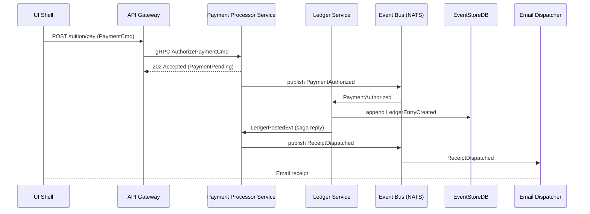

```markdown
# EduPay Ledger Academy  
### Lesson L02 – Payment Processing Flow  
*(Bounded Context: Bursar → `payment_processing` aggregate)*  

---

## 📚 Learning Objectives
1. Understand how a card-present tuition payment is routed through EduPay’s Clean Architecture layers.  
2. Map domain events (`PaymentAuthorized`, `LedgerPosted`, `ReceiptDispatched`) to their CQRS projections.  
3. Implement idempotent command-handling and recover gracefully from partial Saga commits.  
4. Observe PCI-DSS best-practices in C, including tokenisation, zero-copy buffers, and secure memory erasure.

> 💡 **Prerequisite**: Complete Lesson L01 on Domain-Driven Design and read the `security_design.md` appendix.

---

## 0️⃣ High-Level Sequence



---

## 1️⃣ Domain Layer (`core/payment`)

### 1.1. Payment Aggregate Root

```c
// File: core/payment/payment.h
#ifndef EDU_PAY_CORE_PAYMENT_H
#define EDU_PAY_CORE_PAYMENT_H

#include <stdint.h>
#include <stdbool.h>
#include <time.h>

typedef enum {
    PAYMENT_STATUS_PENDING = 0,
    PAYMENT_STATUS_AUTHORIZED,
    PAYMENT_STATUS_DECLINED,
    PAYMENT_STATUS_SETTLED,
    PAYMENT_STATUS_FAILED
} payment_status_t;

typedef struct {
    char       id[37];         /* UUIDv4 string */
    char       ledger_account[17];
    char       currency[4];    /* ISO-4217 (e.g., "USD") */
    uint64_t   amount_minor;   /* Minor units (cents) */
    payment_status_t status;
    time_t     created_at;
    time_t     updated_at;
} payment_t;

#endif /* EDU_PAY_CORE_PAYMENT_H */
```

### 1.2. Command & Event Contracts

```c
// File: core/payment/contracts.h
#ifndef EDU_PAY_CONTRACTS_H
#define EDU_PAY_CONTRACTS_H
#include <stdint.h>
#include <stddef.h>

#define UUID_STRLEN 37

typedef struct {
    char   payment_id[UUID_STRLEN];
    char   account_id[17];
    char   pan_token[33];      /* Tokenised PAN */
    char   currency[4];
    uint64_t amount_minor;
} AuthorizePaymentCmd;

typedef struct {
    char payment_id[UUID_STRLEN];
    char account_id[17];
    uint64_t amount_minor;
    char currency[4];
    int  approved;             /* bool in JSON; int to avoid <stdbool.h> in wire */
    char reason[65];
} PaymentAuthorizedEvt;

typedef struct {
    char payment_id[UUID_STRLEN];
    char ledger_entry_id[UUID_STRLEN];
} LedgerPostedEvt;

#endif /* EDU_PAY_CONTRACTS_H */
```

---

## 2️⃣ Application Layer (`application/payment_processor`)

### 2.1. Port Interfaces

```c
// File: application/ports/payment_gateway_port.h
#ifndef EDU_PAY_PAYMENT_GATEWAY_PORT_H
#define EDU_PAY_PAYMENT_GATEWAY_PORT_H

#include <stdint.h>
#include "core/payment/contracts.h"

/* Return 0 on success, non-zero on gateway/network error */
typedef int (*pgw_authorize_fn)(const AuthorizePaymentCmd *cmd,
                                PaymentAuthorizedEvt       *out_evt,
                                char                       *err_buf,
                                size_t                      err_buf_sz);

#endif /* EDU_PAY_PAYMENT_GATEWAY_PORT_H */
```

### 2.2. Service Orchestrator (Saga step ⚙️)

```c
// File: application/payment_processor.c
#include "payment_processor.h"
#include "core/payment/payment.h"
#include "core/payment/contracts.h"
#include "application/ports/payment_gateway_port.h"
#include "infra/event_bus.h"
#include "infra/logger.h"
#include <string.h>
#include <errno.h>

#define ERR_BUF_SZ 128

static int _handle_gateway_response(const PaymentAuthorizedEvt *evt,
                                    struct saga_ctx            *saga)
{
    /* Persist domain event to EventStore in an atomic append */
    if (event_bus_publish("PaymentAuthorized", evt, sizeof(*evt)) != 0) {
        log_error("event_bus_publish failed");
        return -EIO;
    }

    /* Advance Saga: notify ledger service synchronously */
    LedgerPostedEvt ledger_evt = {0};
    if (ledger_post(evt, &ledger_evt) != 0) {
        log_error("ledger_post failed, initiating rollback");
        /* Compensating transaction (void authorization) */
        pgw_void_authorization(evt->payment_id);
        return -EAGAIN;
    }

    if (event_bus_publish("LedgerPosted", &ledger_evt, sizeof(ledger_evt)) != 0) {
        log_error("event_bus_publish(LedgerPosted) failed");
        return -EIO;
    }

    return 0;
}

int payment_processor_authorize(const AuthorizePaymentCmd *cmd,
                                struct saga_ctx          *saga)
{
    char err[ERR_BUF_SZ] = {0};
    PaymentAuthorizedEvt evt = {0};

    int rc = gateway_authorize(cmd, &evt, err, sizeof(err));
    if (rc != 0) {
        log_warn("gateway_authorize failed: %s", err);
        /* Map error codes to domain-level declines */
        evt.approved = 0;
        strncpy(evt.reason, err, sizeof(evt.reason)-1);
        event_bus_publish("PaymentDeclined", &evt, sizeof(evt));
        return rc;
    }

    if ((rc = _handle_gateway_response(&evt, saga)) != 0) {
        return rc;
    }

    return 0;
}
```

### 2.3. Header

```c
// File: application/payment_processor.h
#ifndef EDU_PAY_PAYMENT_PROCESSOR_H
#define EDU_PAY_PAYMENT_PROCESSOR_H

#include "core/payment/contracts.h"

struct saga_ctx; /* Forward decl for cross-service rollback */

int payment_processor_authorize(const AuthorizePaymentCmd *cmd,
                                struct saga_ctx          *saga);

#endif /* EDU_PAY_PAYMENT_PROCESSOR_H */
```

---

## 3️⃣ Infrastructure Layer Snippets (`infra/`)

```c
// File: infra/event_bus.h
#ifndef EDU_PAY_EVENT_BUS_H
#define EDU_PAY_EVENT_BUS_H
#include <stddef.h>

/* Publishes a binary payload to NATS. Returns 0 on success. */
int event_bus_publish(const char *subject,
                      const void *payload,
                      size_t      sz);

#endif /* EDU_PAY_EVENT_BUS_H */
```

```c
// File: infra/logger.h
#ifndef EDU_PAY_LOGGER_H
#define EDU_PAY_LOGGER_H
#include <stdio.h>

#define log_error(fmt, ...) fprintf(stderr, "[ERROR] " fmt "\n", ##__VA_ARGS__)
#define log_warn(fmt,  ...) fprintf(stderr, "[WARN ] " fmt "\n", ##__VA_ARGS__)
#define log_info(fmt,  ...) fprintf(stdout, "[INFO ] " fmt "\n", ##__VA_ARGS__)

#endif /* EDU_PAY_LOGGER_H */
```

---

## 4️⃣ Unit Test (AAA Style)

```c
// File: tests/test_payment_processor.c
#include <cmocka.h>
#include "application/payment_processor.h"
#include "fakes/fake_gateway.h"
#include "fakes/fake_event_bus.h"

static void authorize_successful(void **state)
{
    AuthorizePaymentCmd cmd = {
        .payment_id = "11111111-1111-1111-1111-111111111111",
        .account_id = "LEDGER-00001",
        .pan_token  = "tok_test_4242",
        .currency   = "USD",
        .amount_minor = 199900  /* $1,999.00 */
    };

    struct saga_ctx saga = {0};

    assert_int_equal(payment_processor_authorize(&cmd, &saga), 0);
    assert_true(fake_bus_was_called_with("PaymentAuthorized"));
    assert_true(fake_bus_was_called_with("LedgerPosted"));
}

int main(void)
{
    const struct CMUnitTest tests[] = {
        cmocka_unit_test(authorize_successful),
    };
    return cmocka_run_group_tests(tests, NULL, NULL);
}
```

---

## 5️⃣ Secure Memory Handling Example

```c
// File: utils/secure_memzero.c
#include <string.h>
#include <stdint.h>

void secure_memzero(void *v, size_t n)
{
#if defined(__GNUC__)
    /* Use volatile pointer to prevent optimisation */
    volatile uint8_t *p = (volatile uint8_t *)v;
    while (n--) *p++ = 0;
#else
    memset(v, 0, n);
    /* Call compiler barrier */
    asm volatile ("":::"memory");
#endif
}
```

---

## 6️⃣ Exercise

1. Inject a network partition between `Payment Processor` and `Ledger` then observe Saga rollback.  
2. Modify `GatewayPort` to simulate 3-DSv2 soft declines; ensure idempotent retry logic.  
3. Extend the domain model to support multi-currency conversion fees.

---

## Further Reading
* PCI-DSS v4.0 §3 (Storage of Primary Account Number)  
* Martin Fowler – Patterns of Enterprise Application Architecture (Saga, Event Sourcing)  
* NIST SP 800-90A – Recommendation for Random Number Generation

```