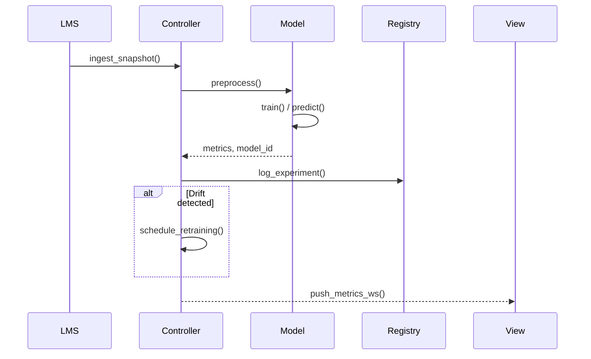

```markdown
# LexiLearn MVC Orchestrator – System Architecture  
_Author: Core Platform Team_  
_Last updated: 2024-05-30_

---

## 1  Overview

LexiLearn MVC Orchestrator (repo root: `ml_nlp/lexilearn_orchestrator`) is a **modular, C-based, MVC platform** for large-scale, adaptive language-learning applications.  
The orchestrator stitches together Machine-Learning Ops essentials—hyper-parameter tuning, model registry, automated retraining—behind a clean Controller façade exposing a single public header `lexilearn.h`.

Key design drivers:

* **High throughput** ingestion of multimodal classroom data.
* **Pluggable NLP/ML strategies** switchable at run-time.
* **Deterministic** builds, reproducible experiments, and strong type-safety.
* **Embeddability** in web servers, desktop LMS plug-ins, and edge devices.

---

## 2  Top-Level Component Diagram

```text
┌─────────────────────────────────────────────────────────────────────────┐
│                            Application Layer                           │
│ ┌────────────┐    ┌──────────────┐    ┌──────────────┐                 │
│ │  REST API  │    │ CLI Pipeline │    │  Batch Jobs  │ <─┐             │
│ └────┬───────┘    └──────┬───────┘    └──────┬───────┘   │ Application │
└──────│───────────────────│───────────────────│───────────┘             │
       ▼                   ▼                   ▼                         ▼
┌─────────────────────────────────────────────────────────────────────────┐
│                           MVC Orchestrator                             │
│ ┌──────────┐  uses  ┌──────────┐  uses  ┌──────────┐                   │
│ │  View    │◀──────▶│ Controller│◀──────▶│  Model   │                   │
│ └──────────┘        └──────────┘        └──────────┘                   │
│  │                       ▲                   │                         │
│  │ Observer Pattern      │ Factory Pattern   │ Strategy Pattern        │
│  ▼                       │                   ▼                         │
│ ┌──────────┐    emits ┌──────────────┐    ┌──────────────┐             │
│ │ DriftMon │──────────▶  JobScheduler│────▶ ModelRegistry│             │
│ └──────────┘          └──────────────┘    └──────────────┘             │
└─────────────────────────────────────────────────────────────────────────┘
```

Legend:

* **Controller** – Pipeline orchestrator (`controller/*.c`).
* **Model** – NLP/ML pipeline (`model/*.c`), pluggable via Strategy Pattern.
* **View** – Dashboards & WebSocket push (`view/*.c`).
* **Feature Store** – External component accessed via gRPC (`external/featstore`).

---

## 3  Directory Layout

```text
lexilearn_orchestrator/
├── include/
│   ├── lexilearn.h         # Umbrella public header
│   ├── controller.h        # Controller API
│   ├── model.h             # Model Strategy API
│   └── view.h              # Visualization API
├── src/
│   ├── controller/
│   ├── model/
│   ├── view/
│   ├── util/
│   └── main.c              # Embeddable entry
├── conf/
│   └── orchestrator.toml   # Build-time & run-time parameters
└── docs/
    └── architecture.md
```

---

## 4  Key Design Patterns

| Concern              | Pattern            | Implementation Notes                                     |
|----------------------|--------------------|----------------------------------------------------------|
| Pipeline management  | Pipeline Pattern   | `controller/pipeline.c` composes discrete stages.        |
| Model hot-swapping   | Strategy Pattern   | `model/strategy_*.c` registered in a function pointer v-table. |
| Training job factory | Factory Pattern    | `controller/job_factory.c` builds diverse training jobs. |
| Experiment tracking  | Model Registry     | `model/registry.c` (backed by SQLite + JSONB).           |
| Drift detection       | Observer Pattern  | `util/drift_monitor.c` emits `EVENT_DRIFT_*`.            |

---

## 5  Runtime Flow



---

## 6  Concurrency & Memory Safety

1. **Actor Model Threads**  
   Controller spins lightweight actors (`pthread`) pinned to CPU cores:
   * `actor_ingest`
   * `actor_train`
   * `actor_drift`
   * `actor_view`

2. **Zero-Copy Buffers**  
   Multimodal records reside in lock-free, ring buffers (`util/ringbuf.c`).

3. **Ownership Annotation**  
   Every public API symbol suffixed with `_ref` uses **Reference-Counted Handles**.

Example:

```c
// src/model/model.c
ml_model_ref
ml_model_create(const char *strategy_name, const ml_hparam_set *hparams) {
    ml_model_impl *impl = strategy_vtable_get(strategy_name);
    if (!impl) { return NULL; }
    ml_model_ref ref = RC_ALLOC(sizeof(struct ml_model));
    ref->impl = impl;
    ref->impl->init(ref, hparams);
    return ref;
}
```

---

## 7  Error Handling Philosophy

* **Fail-Fast** in development, **graceful degradation** in production.
* Rich machine-parsable error structs:

```c
typedef struct {
    ll_err_code code;        /* Enumerated error code */
    char        msg[256];    /* Human-readable context */
    char        trace_id[64];/* Correlation ID for logs & metrics */
} ll_error_t;
```

* Controller propagates root-cause via Observer Pattern (`EVENT_ERROR`),
  surfaced as HTTP 5xx or WebSocket messages in View.

---

## 8  Extending the Model Layer

To add a custom summarizer:

1. Implement `model/strategy_summarizer.c`, exporting:
   ```c
   const ml_strategy_vtable *lexi_summarizer_strategy(void);
   ```
2. Register the strategy in `model/strategy_registry.c`:
   ```c
   REGISTER_STRATEGY("lexi_summarizer", lexi_summarizer_strategy);
   ```
3. Specify in `orchestrator.toml`:
   ```toml
   [strategy]
   active = "lexi_summarizer"
   ```
Strategy picked up at run-time—no Controller code touched.

---

## 9  Build & Deployment

```sh
$ mkdir build && cd build
$ cmake -DCMAKE_BUILD_TYPE=Release ..
$ make -j$(nproc)
$ ctest        # unit + integration tests
$ ninja docs   # regenerate this file from sources
```

CI pipeline (`.github/workflows/ci.yml`) enforces:

* Clang-Tidy, MISRA-C subset.
* Code coverage ≥ 85 %.
* Static analysis (`cppcheck`, `infer`).
* Containerized regression tests using Docker Compose (PostgreSQL + MinIO).

---

## 10  MLOps Integration

* **Hyper-Parameter Sweep** – `controller/hparam_tuner.c` interfaces with Optuna via gRPC.
* **Model Registry** – Lightweight SQLite + S3 artifacts, versioned by semantic hash.
* **Drift Monitoring** – KL divergence threshold triggers retraining jobs.
* **Automated Retraining** – Controller pushes jobs onto RabbitMQ queue; workers auto-scale via K8s HPA.
* **Audit Trail** – `model/registry.c` persists lineage: dataset → commit SHA → metrics.

---

## 11  Security Considerations

* Data at rest encrypted using libsodium XChaCha20-Poly1305.
* TLS 1.3 enforced for gRPC and WebSocket endpoints.
* Role-Based Access Control (RBAC) integrated with LMS OAuth2 scopes.
* Secrets managed via HashiCorp Vault sidecar injector.

---

## 12  Future Roadmap

| Version | Planned Feature                               | Status |
|---------|-----------------------------------------------|--------|
| v2.1    | Federated Learning across districts           | 🟡 PoC |
| v2.2    | On-device speech assessment (Edge TPU)        | ⬜ Backlog |
| v3.0    | Rust FFI for safety-critical routines         | ⬜ Backlog |

---

## 13  Glossary

* **Feature Store** – Centralized service storing engineered features for offline & online use.
* **Model Registry** – Database tracking model versions, metrics, and provenance.
* **Strategy Pattern** – Encapsulates interchangeable algorithms behind a stable API.
* **Observer Pattern** – Event dispatcher decoupling producers & consumers.

---

© 2024 LexiLearn Inc. – Licensed under the Apache 2.0 License
```