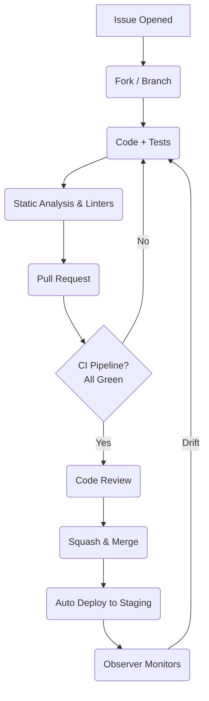

<!--
  LexiLearn Orchestrator – CONTRIBUTING GUIDE
  ==========================================

  Thank you for considering a contribution to LexiLearn MVC Orchestrator
  (`ml_nlp`).  This document describes the project’s development workflow,
  coding standards, and review process.  All contributors—students, faculty,
  and industry partners alike—are expected to read and follow these
  guidelines before submitting pull-requests.
-->

# Table of Contents
1. Key Principles
2. Code of Conduct
3. Getting Started
4. Development Workflow
5. Coding Standards
6. Testing & Quality Gates
7. Adding New Components
8. Documentation Guidelines
9. Security & Responsible Disclosure
10. License Notice

---

# 1. Key Principles

* **Pedagogy First** – Features must improve student outcomes, never just
  “look cool.”
* **Observable by Default** – All production code _must_ emit metrics and
  structured logs routed through the
  Observer Pattern hooks included in `src/infra/metrics`.
* **Configurable via Composition** – Favor the Strategy Pattern and
  dependency injection over compile-time flags.
* **Fail Fast, Roll Forward** – Automated retraining and canary deployments
  replace manual hot-fixes in prod.
* **Minimal Tech-Debt** – PRs are rejected if they increase _net_ tech-debt
  (tracked in the issue board).

---

# 2. Code of Conduct

We adhere to the [Contributor Covenant 2.1](https://www.contributor-covenant.org/)
for all interactions—Slack, e-mail, code reviews, and classrooms included.
Report violations privately to **security@lexilearn.org**.

---

# 3. Getting Started

## 3.1 Prerequisites

| Tool               | Min Version | Install Hint             |
| ------------------ | ----------: | ------------------------ |
| GCC / Clang        | 12.0        | `brew`, `apt`, `choco`   |
| CMake              | 3.24        | `brew install cmake`     |
| Python             | 3.10        | For CLI tooling          |
| Conan              | 2.0         | Dependency management    |
| Git LFS            | —           | Large model artifacts    |

> 💡 **Faculty Machines** – A pre-built Docker image
> `ghcr.io/lexilearn/base:latest` ships with all dependencies.

## 3.2 Cloning

```bash
git clone --recursive git@github.com:lexilearn/ml_nlp.git
cd ml_nlp
conan install . --build=missing -pr default
cmake -B build -DCMAKE_BUILD_TYPE=Debug
cmake --build build -j$(nproc)
```

---

# 4. Development Workflow



1. **Branch** from `main` using the GitHub *template*:
   `feature/🏷️issue-id-descriptor`.
2. Use conventional commits:
   ```
   feat(controller): add LMS canvas ingestion pipeline (#123)
   ```
3. Keep PRs < 1k LOC; larger features must be split into milestones.
4. **Squash-and-merge** only.  The PR title becomes the commit message.

---

# 5. Coding Standards

## 5.1 Compiler Flags

* `-Wall -Wextra -Werror`
* `-Wpedantic -Wshadow -Wconversion`
* AddressSanitizer & UndefinedBehaviorSanitizer in CI.

## 5.2 Style Guide

| Aspect           | Rule                                    |
| ---------------- | --------------------------------------- |
| Formatting       | `clang-format --style=file` (`.clang-format`) |
| Naming           | `snake_case` for functions, `PascalCase` for structs, `kSCREAMING_SNAKE` for constants |
| Header Guards    | `LL_<RELATIVE_PATH>_H`                  |
| Pointer Ownership| Use `ll_owned_*` typedefs + `cleanup` attribute macros |
| Function Length  | ≤ 75 LOC (logical)                      |
| Comments         | Doxygen triple-slash `///`              |

## 5.3 Module Layout

```
src/
 ├── controller/  <-- Pipeline Pattern
 ├── model/       <-- Strategy Pattern implementations
 ├── view/        <-- Visualization adapters (C → Python FFI)
 ├── infra/
 │    ├── logging/
 │    ├── metrics/
 │    └── registry/  <-- Model Registry adapters
 └── cli/
```

---

# 6. Testing & Quality Gates

| Gate                 | Tool(s)                        | Target |
| -------------------- | ------------------------------ | ------ |
| Unit Tests           | CTest + Unity                  | 85% statement coverage |
| Integration Tests    | Testcontainers + Mock LMS      | All IO |
| Static Analysis      | clang-tidy, cppcheck           | 0 warnings |
| Fuzzing              | libFuzzer, 72-hour OSS-Fuzz    | 🟢     |
| Memory / UB Checks   | ASan + UBSan                   | 🟢     |
| Docs Build           | Doxygen + MkDocs               | 🟢     |

Run the full suite locally:

```bash
cmake --build build --target tests
cd build && ctest --output-on-failure
```

---

# 7. Adding New Components

## 7.1 New Model Strategy

1. Create header `src/model/strategies/ll_<algo>_strategy.h`.
2. Implement `ll_model_strategy_t` v-table:
   ```c
   const ll_model_strategy_t *ll_<algo>_strategy(void);
   ```
3. Register factory in `model/factory/ll_model_factory.c`:
   ```c
   LL_FACTORY_REGISTER_STRATEGY(<algo>, ll_<algo>_strategy);
   ```
4. Provide YAML example in `examples/configs/<algo>.yml`.
5. Add unit tests under `tests/model/test_<algo>_strategy.c`.

## 7.2 New Pipeline Step

Follow the Pipeline Pattern interface:

```c
bool ll_pipeline_step_execute(
        ll_pipeline_ctx_t *ctx,
        const ll_pipeline_cfg_t *cfg,
        ll_error_t **err);
```

* Pipeline steps must be idempotent and side-effect free except logging.
* Register via `LL_PIPELINE_REGISTER_STEP`.

---

# 8. Documentation Guidelines

* API docs are generated via Doxygen (`make docs`).
* Tutorials live in `docs/tutorials/*.md` and are built with MkDocs.
* Every public function requires:
  ```c
  /**
   * @brief
   * @param[in] ...
   * @return LL_OK on success; LL_ERR_* otherwise.
   */
  ```

---

# 9. Security & Responsible Disclosure

If you discover a vulnerability:

1. **Do not** open a public issue.
2. E-mail `security@lexilearn.org` with steps to reproduce.
3. We commit to a 90-day disclosure timeline per
   [Google Project Zero](https://googleprojectzero.blogspot.com/) norms.

---

# 10. License Notice

LexiLearn MVC Orchestrator is dual-licensed:

* **AGPL-3.0-or-later** for the open-source community.
* **Commercial License** for proprietary deployments.

By contributing code, you agree that your work is licensed under AGPL-3.0-or-later
and that you have the right to do so.

---

Happy coding!  
— The LexiLearn Core Team