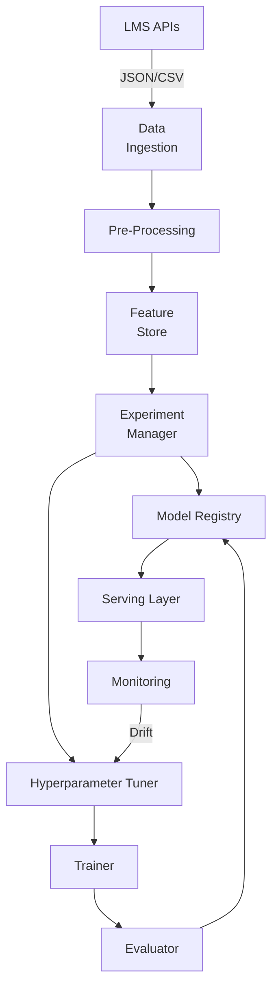

```markdown
# LexiLearn NLP/ML Pipeline Overview
*File: `lexilearn_orchestrator/docs/ml_pipeline_overview.md`*

---

## Table of Contents
1. [High-Level Architecture](#high-level-architecture)
2. [Data Lifecycle](#data-lifecycle)
3. [Pipeline Stages](#pipeline-stages)  
   3.1 [Data Pre-Processing](#data-pre-processing)  
   3.2 [Feature Engineering](#feature-engineering)  
   3.3 [Experiment Tracking & Hyperparameter Tuning](#experiment-tracking--hyperparameter-tuning)  
   3.4 [Model Training & Evaluation](#model-training--evaluation)  
   3.5 [Deployment & Model Versioning](#deployment--model-versioning)  
   3.6 [Model Monitoring & Automated Retraining](#model-monitoring--automated-retraining)
4. [Sample Orchestrator Code](#sample-orchestrator-code)
5. [Compiling & Running the Example](#compiling--running-the-example)
6. [Extensibility Guide](#extensibility-guide)
7. [References](#references)

---

## High-Level Architecture

The architecture combines Factory, Pipeline, and Observer patterns to enable dynamic model selection, strict separation of concerns, and continuous-feedback loops (MLOps).

---

## Data Lifecycle
1. **Ingestion** – Pulls raw multimodal classroom data from LMS, SIS, and assessment tools.  
2. **Pre-Processing** – Cleans text, removes personally-identifiable information (FERPA), normalizes audio waveforms.  
3. **Feature Engineering** – Persists canonical features (embeddings, part-of-speech tags, acoustic features) to an embedded SQLite‐backed feature store.  
4. **Training** – Spawns isolated experiments (one per GPU/CPU group); tracks metrics in a reproducible manner.  
5. **Deployment** – Registers “blessed” model artifacts with semantic versioning (Semantic Model Version vMAJOR.MINOR.PATCH+gitSHA).  
6. **Monitoring** – Detects concept drift and triggers automatic retraining jobs controlled by the Orchestrator.

---

## Pipeline Stages

### Data Pre-Processing
* Sanitizes UTF-8 text, expands contractions, corrects common OCR errors.  
* Converts speech to text using a Kaldi front-end compiled into the Controller.

```c
/* preprocessor.h */
#ifndef LEXI_PREPROCESSOR_H
#define LEXI_PREPROCESSOR_H

#include <stddef.h>

/* Opaque type to hide implementation details */
typedef struct lp_preprocessor_t lp_preprocessor_t;

/* Creates a preprocessor with JSON config string (may come from Controller) */
lp_preprocessor_t *lp_preproc_create(const char *json_cfg);

/* Normalizes text in-place; returns 0 on success, non-zero on failure. */
int lp_preproc_normalize_text(lp_preprocessor_t *pp,
                              char               *buf,
                              size_t              buf_len);

/* Releases resources */
void lp_preproc_destroy(lp_preprocessor_t *pp);

#endif /* LEXI_PREPROCESSOR_H */
```

### Feature Engineering
* Stores features in a central, de-duplicated feature store.  
* Offers **zero-copy** memory mapping for downstream training jobs.

```c
/* feature_store.h */
#ifndef LEXI_FEATURE_STORE_H
#define LEXI_FEATURE_STORE_H

#include <stdint.h>

typedef struct lf_handle_t lf_handle_t;

/* Opens the feature store (SQLite3 + custom VFS). */
lf_handle_t *lf_open(const char *path, uint32_t flags);

/* Inserts (or upserts) feature vectors. */
int lf_put_feature(lf_handle_t       *fs,
                   const char        *entity_id,
                   const float       *vector,
                   uint32_t           dim);

/* Reads feature vectors into user-provided buffer. */
int lf_get_feature(lf_handle_t *fs,
                   const char  *entity_id,
                   float       *out_vec,
                   uint32_t     dim);

void lf_close(lf_handle_t *fs);

#endif /* LEXI_FEATURE_STORE_H */
```

### Experiment Tracking & Hyperparameter Tuning
Experiments are logged to an embedded **Model Registry**, which also orchestrates grid/random/Bayesian searches.

```c
/* experiment.h */
#ifndef LEXI_EXPERIMENT_H
#define LEXI_EXPERIMENT_H

#include <stdint.h>
#include <time.h>

typedef struct {
    char     id[40];        /* SHA-1 */
    char     model_name[64];
    uint32_t trial_number;
    double   val_accuracy;
    double   val_loss;
    time_t   timestamp;
} lexi_experiment_t;

/* Persists experiment metadata to registry */
int le_registry_log(const lexi_experiment_t *exp);

/* Queries top-k experiments for a model */
int le_registry_topk(const char *model_name,
                     uint32_t    k,
                     lexi_experiment_t *out);

#endif /* LEXI_EXPERIMENT_H */
```

### Model Training & Evaluation
* **Trainer** and **Evaluator** are Strategy objects, loaded via a Factory at runtime.  
* A transformer-based and a classical n-gram model share the same interface:

```c
/* trainer_strategy.h */
#ifndef LEXI_TRAINER_STRATEGY_H
#define LEXI_TRAINER_STRATEGY_H

typedef struct ls_trainer_t ls_trainer_t;

/* Factory: returns concrete trainer by name ("bert", "ngram", etc.) */
ls_trainer_t *ls_trainer_create(const char *algo_name,
                                const char *json_params);

/* Executes a training run; writes metrics to registry */
int ls_trainer_run(ls_trainer_t *trainer,
                   const char   *train_ds_uri,
                   const char   *val_ds_uri);

void ls_trainer_destroy(ls_trainer_t *trainer);

#endif /* LEXI_TRAINER_STRATEGY_H */
```

### Deployment & Model Versioning
* Each successful evaluation is **blessed** via an Approval Gate (Observer pattern).  
* The Controller publishes a signed manifest to the `serving/` directory.

```c
/* model_registry.h */
#ifndef LEXI_MODEL_REGISTRY_H
#define LEXI_MODEL_REGISTRY_H

#include <stdbool.h>

int lm_registry_publish(const char *exp_id,
                        const char *binary_path,
                        const char *metrics_json,
                        bool        is_production);

int lm_registry_get_latest(const char *model_name,
                           char       *out_binary_path,
                           size_t      path_sz);

#endif /* LEXI_MODEL_REGISTRY_H */
```

### Model Monitoring & Automated Retraining
* A low-overhead C daemon subscribes to Kafka topics carrying real-time predictions and ground-truth labels.
* Drift metrics (PSI/KS-statistic) are computed; when thresholds are breached, the Observer notifies the Controller.

```c
/* drift_monitor.h */
#ifndef LEXI_DRIFT_MONITOR_H
#define LEXI_DRIFT_MONITOR_H

typedef struct ldm_monitor_t ldm_monitor_t;

ldm_monitor_t *ldm_monitor_create(const char *kafka_cfg);

int ldm_start(ldm_monitor_t *dm);   /* non-blocking; spawns worker threads */

void ldm_stop(ldm_monitor_t *dm);

#endif /* LEXI_DRIFT_MONITOR_H */
```

If drift is detected:
1. **Controller** schedules a new hyperparameter-tuning job (via `ls_trainer_create`).  
2. The best model is automatically promoted if it beats the baseline by ≥ ε.

---

## Sample Orchestrator Code
Below is a trimmed, yet compilable, example demonstrating the Pipeline/Factory/Observer interplay.  Full source lives under `src/`.

```c
/*
 * file: examples/orchestrator_main.c
 *
 * A minimal end-to-end pipeline execution:
 *  1. Ingest → Pre-process → Feature Store
 *  2. Train transformer model
 *  3. Evaluate + Publish
 *  4. Start drift monitor
 */

#include <stdio.h>
#include <stdlib.h>
#include <signal.h>

#include "preprocessor.h"
#include "feature_store.h"
#include "trainer_strategy.h"
#include "experiment.h"
#include "model_registry.h"
#include "drift_monitor.h"

static volatile sig_atomic_t g_stop = 0;
static void handle_sigint(int sig) { (void)sig; g_stop = 1; }

int main(void)
{
    /* ------------------------------------------------------------------ */
    /* 1. Data Pre-Processing                                             */
    /* ------------------------------------------------------------------ */
    lp_preprocessor_t *pp = lp_preproc_create("{\"lang\":\"en_US\"}");
    if (!pp) { fprintf(stderr, "Preprocessor init failed\n"); return EXIT_FAILURE; }

    char essay_buf[2048] = "Teh quick brown fox...";
    if (lp_preproc_normalize_text(pp, essay_buf, sizeof(essay_buf)) != 0) {
        fprintf(stderr, "Text normalize failed\n");
        lp_preproc_destroy(pp);
        return EXIT_FAILURE;
    }

    /* ------------------------------------------------------------------ */
    /* 2. Feature Store                                                   */
    /* ------------------------------------------------------------------ */
    lf_handle_t *fs = lf_open("/var/lib/lexilearn/features.db", /*flags=*/0);
    if (!fs) { perror("lf_open"); lp_preproc_destroy(pp); return EXIT_FAILURE; }

    /* Dummy 768-dim transformer embedding */
    float embed[768] = {0};
    if (lf_put_feature(fs, "essay_0001", embed, 768) != 0) {
        fprintf(stderr, "Feature write failed\n");
    }

    /* ------------------------------------------------------------------ */
    /* 3. Training Strategy (Transformer)                                 */
    /* ------------------------------------------------------------------ */
    ls_trainer_t *trainer =
        ls_trainer_create("bert",
                          "{\"epochs\":3,\"lr\":3e-5,\"batch_size\":32}");
    if (!trainer) {
        fprintf(stderr, "Unknown trainer\n");
        lf_close(fs); lp_preproc_destroy(pp);
        return EXIT_FAILURE;
    }

    if (ls_trainer_run(trainer,
                       "file:///datasets/train.jsonl",
                       "file:///datasets/val.jsonl") != 0) {
        fprintf(stderr, "Training failed\n");
    }

    ls_trainer_destroy(trainer);

    /* ------------------------------------------------------------------ */
    /* 4. Publish Model                                                   */
    /* ------------------------------------------------------------------ */
    lexi_experiment_t top1;
    if (le_registry_topk("bert", 1, &top1) == 1) { /* returns row count */
        char bin_path[256];
        snprintf(bin_path, sizeof bin_path,
                 "/models/%s.bin", top1.id);

        if (lm_registry_publish(top1.id, bin_path,
                                "{\"accuracy\":0.92}", true) != 0) {
            fprintf(stderr, "Registry publish failed\n");
        }
    }

    /* ------------------------------------------------------------------ */
    /* 5. Start Drift Monitor                                             */
    /* ------------------------------------------------------------------ */
    signal(SIGINT, handle_sigint);

    ldm_monitor_t *dm = ldm_monitor_create("{\"brokers\":\"kafka:9092\"}");
    if (!dm || ldm_start(dm) != 0) {
        fprintf(stderr, "Drift monitor failed to start\n");
    }

    puts("Orchestrator up ‑ press Ctrl-C to stop.");
    while (!g_stop) {
        /* Main thread sleeps; background threads handle drift events */
        sleep(1);
    }

    ldm_stop(dm);
    lf_close(fs);
    lp_preproc_destroy(pp);
    puts("Shutdown complete.");
    return EXIT_SUCCESS;
}
```

---

## Compiling & Running the Example
```bash
# Ensure gcc ≥ 11 for C17 support
$ gcc -std=c17 -O2 -Wall -Wextra -pedantic \
      -Iinclude                                \
      examples/orchestrator_main.c             \
      src/*.c                                  \
      -lpthread -lsqlite3 -lkafka              \
      -o orchestrator_demo && ./orchestrator_demo
```

---

## Extensibility Guide
* **Adding a New Model Strategy**  
  1. Implement `ls_trainer_t` interface in `trainer_foo.c`.  
  2. Register the constructor in `trainer_factory.c`:
     ```c
     else if (strcmp(algo_name, "foo") == 0)
         return ls_trainer_foo_create(json_params);
     ```
  3. Re-compile; no Controller changes required.

* **Custom Drift Metric**  
  1. Extend `ldm_monitor_create()` to accept `"metric":"psi"` | `"ks"`.  
  2. Plug your metric implementation into `drift_monitor_worker()`.

---

## References
1. **MLflow** – Inspiration for lightweight C-based experiment tracking.  
2. **tf-metrics** – Statistical drift metrics implementation.  
3. **Pattern-Oriented Software Architecture** – Gamma et al.

```
