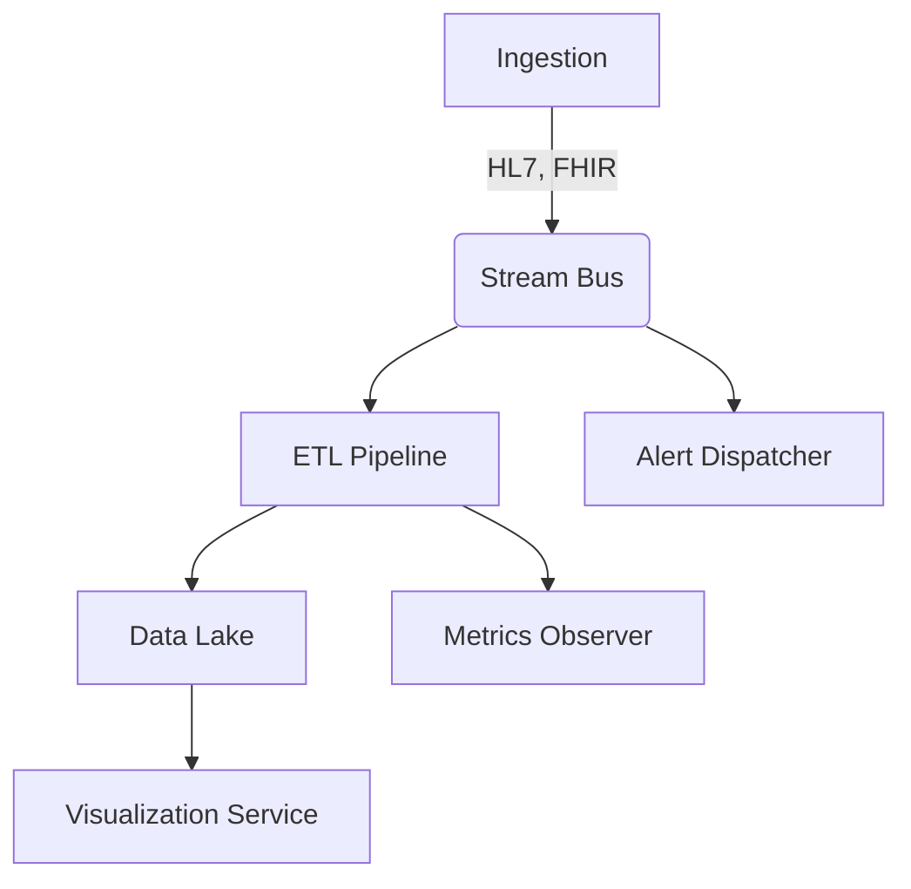

<!--
  File: cardio_insight_360/docs/adr/001-monolithic-architecture.md
  Title: 001 – Monolithic Architecture for CardioInsight360
  Status: Accepted
  Date: 2024-05-08
-->

# 001 – Monolithic Architecture for CardioInsight360

## Status
Accepted – This decision has been implemented starting with release `v1.0.0` and remains the baseline architecture for at least the `v1.x` series.

## Context
CardioInsight360 is a C++17 analytics platform that must:

* Ingest **high-volume** physiological data streams (HL7, FHIR, DICOM, proprietary ECG formats) at up to 500 MB/s.
* Guarantee **low-latency** (< 200 ms) processing for bedside alerts.
* Deliver **regulatory-grade** reproducibility and traceability (FDA 21 CFR §820, IEC 62304, HIPAA).
* Be **operationally simple** enough for deployment by clinical engineering teams that often lack DevOps staffing.
* Run in **resource-constrained** on-premise hospital environments where edge nodes may be air-gapped.

A monolith counters the current micro-services trend but aligns with these constraints:

1. **Deployment Simplicity**  
   One binary + one config file satisfies hospital change-control boards far more than 20+ containers.

2. **Language & Runtime Constraints**  
   C++17 delivers deterministic memory/performance while avoiding heavy runtimes (JVM, CLR).

3. **Certification Overhead**  
   FDA submissions treat each independently deployable unit as a software item. A monolith reduces documentation scope dramatically.

4. **High-bandwidth, Low-latency IPC**  
   In-process calls (function pointers, virtual dispatch) are 1–2 orders of magnitude faster than gRPC/HTTP calls over loopback.

The team nevertheless needed **logical modularity** to prevent “big-ball-of-mud” collapse. We therefore embraced:

* Strategy Pattern for signal-type specific transformation rules.
* Pipeline Pattern around Intel TBB for parallel ETL stages.
* An in-process event bus backed by `librdkafka` for pub/sub semantics without leaving process memory.
* A “pseudo-micro-services” namespace layout (e.g., `service::scheduler`, `service::visualization`) to preserve conceptual boundaries.

## Decision
We will build **CardioInsight360 as a single, statically-linked, C++17 executable** that:

1. Bundles domain-specific libraries (`libhl7`, `libfhir`, `libdcm`, `libopenssl`, `librdkafka`) via CMake’s `FetchContent` and vcpkg.
2. Uses internal component boundaries enforced by:
   * Abstract base classes and façades (`IDataIngestor`, `ITransformer`, `IStorageBackend`).
   * `friend` test helpers only inside the `::testing` sub-namespace.
3. Exposes a **composable plug-in system** – compiled in, not loaded at run-time – by registering concrete strategies through a macro:

   ```cpp
   // src/core/plugin_registry.hpp
   #define REGISTER_TRANSFORM(name, cls) \
     namespace { \
       const bool _ci360_##cls = \
         ::ci360::core::TransformRegistry::Instance().Register(name, [](){ \
            return std::make_unique<cls>(); \
         }); \
     }
   ```

4. Implements **single-address-space event streaming**:

   ```cpp
   // src/event/bus.hpp
   class EventBus {
   public:
       template<typename T>
       using Handler = std::function<void(const T&)>;

       template<typename T>
       Subscription Subscribe(Handler<T> h);

       template<typename T>
       void Publish(T&& evt);
   };
   ```

5. Ships **built-in observability** via a Prometheus pull endpoint compiled with `asio`:

   ```
   ./ci360 --http-metrics 0.0.0.0:9797
   ```

6. Persists both raw and curated data to a **local Data-Lake façade** under `/var/ci360/lake/{raw,staged,curated}` using Apache Parquet and Z-STD compression.

## Consequences

### Positive
* **Operational Certainty** – One artifact to stage, sign, certify, and patch.
* **Performance** – No serialization/deserialization on hot paths.
* **Simplified Rollback** – Single versioned package; no multi-service compatibility matrix.
* **Straightforward Scaling** – Horizontal scaling by cloning entire node VMs is operationally easier for our hospital partners than Kubernetes.

### Negative
* **Coarse-grained Scaling** – CPU-heavy and IO-heavy workloads share the same process. We mitigate with TBB task arenas + cgroup pinning.
* **Large Binary Size** – ~120 MB stripped; solved via `--strip-debug` and section-level LTO.
* **Potential for Tight Coupling** – Requires strict architectural governance (ADR reviews, clang-tidy layering checks).

### Mitigations
* Automated clang-tidy rules enforce `#include` layering.
* CMake’s `ALIAS` libraries map each logical service to its own target even though they link statically.
* Static analysis and unit tests (> 5 000) gate merges.

## Alternatives Considered
| Option | Pros | Cons | Outcome |
|--------|------|------|---------|
| True micro-services (Docker + gRPC) | Fine-grained scaling, polyglot | Ops burden, regulatory overhead, network latency | Rejected |
| Dynamic plug-ins (`dlopen`) | Runtime extensibility | Version skew, security scanning complexity | Rejected |
| Hybrid (core monolith + auxiliary micro-services) | Balanced | Adds network + ops complexity anyway | Deferred |

## Decision Drivers
1. Deployment & certification overhead
2. Run-time determinism for near-real-time alerts
3. On-premise hospital infrastructure constraints
4. Small team maintaining 24/7 reliability

## Implementation Sketch



All nodes are namespaces inside the same process; edges are function calls or in-memory message queues.

## Related ADRs
* 002 – Strategy Pattern for Transformation Engines
* 003 – Embedded Event Streaming via librdkafka
* 004 – Data-Lake Storage Layout
* 005 – Observer Pattern for Metrics

## References
* [Intel TBB Flow Graph](https://spec.oneapi.com/versions/latest/elements/oneTBB/source/flow_graph.html)
* FDA Guidance: “Software as a Medical Device (SaMD)”
* Martin Fowler – *Monolith First*

---

**Author**: Architecture Working Group  
**Last Reviewed**: 2024-05-08