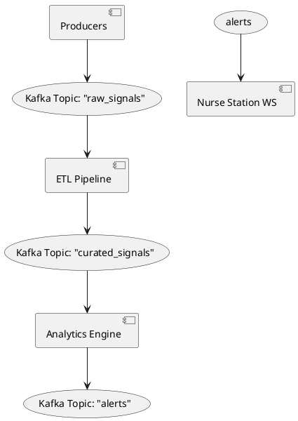

```markdown
# 002 – Event Bus Choice

*Status*: **Accepted**  
*Date*: 2024-03-30  
*ADR-Owner*: Architecture / Core-Platform Team  
*Supersedes*: N/A  
*Last Updated*: 2024-03-30

---

## 1. Context

CardioInsight360 is a *single* deployable C++17 binary that internally embraces an event-driven architecture.  
Key runtime concerns that drove this decision:

1. **High-throughput and low-latency**  
   • Incoming telemetry bursts can reach 25 k messages/s during ICU peaks.  
   • Real-time alerting must react within 150 ms P90 end-to-end.

2. **Message durability & ordering**  
   • Clinical data is subject to regulatory audits (HIPAA, FDA 21 CFR §820).  
   • At-least-once processing semantics and partition-level ordering are mandatory.

3. **In-process, but cloud-ready**  
   • The platform is monolithic for operational simplicity, yet future-proof for a possible migration to micro-services without rewriting messaging code.

4. **Mature C++ client**  
   • A feature-complete, well-tested, and actively maintained C/C++ client is non-negotiable.

5. **Operational familiarity**  
   • DevOps teams inside hospital IT are already running Apache Kafka clusters for HL7/FHIR gateways.

---

## 2. Decision

**Apache Kafka** backed by **`librdkafka`** is chosen as the internal event bus.

Implementation outline:



• All components link against `librdkafka` (v2.x) via a thin RAII adapter (`ci360::messaging::KafkaBus`).  
• The default deployment uses the **embedded** broker shipped with the binary (based on `redpanda-wasm`).  
• Production deployments may **point to an external Kafka cluster** by adjusting `ci360.conf`.

---

## 3. Consequences

### Positive

* Proven durability and high-throughput guarantees.  
* Unified **schema registry** with Confluent wire-compatibility lets us version protobuf/avro messages alongside code changes.  
* Smooth path to a *split-out* micro-services topology; simply re-point to a remote broker.  
* Rich ecosystem (ksqlDB, Kafka Connect) unlocks post-hoc integrations (Snowflake, Hadoop).

### Negative / Mitigations

| Risk | Impact | Mitigation |
|------|--------|-----------|
| Additional binary size (~15 MiB static) | Medium | Apply `-ffunction-sections` & link-time-GC |
| Broker warm-up time (~3 s) delays startup | Low | Lazy-start event bus; critical paths are queued |
| Requires Zookeeper on external mode | Low | Use **KRaft** mode (Kafka 3.x) |

---

## 4. Alternatives Considered

| Candidate | Pros | Cons | Verdict |
|-----------|------|------|---------|
| **ZeroMQ** | Embeddable, zero-dep | No durability, manual scaling, DIY ordering | ❌ |
| **NATS JetStream** | Fast, simpler ops | C++ client still maturing; weaker exactly-once | ❌ |
| **gRPC Streaming** | First-class protobuf | Lacks pub/sub semantics | ❌ |
| **Disruptor RingBuffer** | Ultra-low latency | Single-process only, no disk durability | ❌ |
| **Custom In-House Bus** | Tailored behavior | Reinventing the wheel, audit risk | ❌ |

---

## 5. Technical Notes

1. All topics follow naming convention:  
   `ci360.<domain>.<entity>.<version>` (e.g., `ci360.signal.ecg.raw.v1`).  
2. Partitions are derived from `patient_id % partition_count` to maintain order per patient.  
3. Maximum message size capped at 512 KiB; larger blobs (DICOM, EDF) are chunked via the Data-Lake façade.  
4. Retry strategy: exponential back-off with jitter, max-retry 5, then dead-letter (`ci360.dlq.<topic>`).  
5. Health-check endpoints: `/health/bus/liveness`, `/health/bus/readiness`.  
6. Metrics: exported to Prometheus via `ci360_messaging_*` counters.

---

## 6. References

* [Apache Kafka Documentation](https://kafka.apache.org/documentation/)
* [librdkafka – C/C++ Client for Apache Kafka](https://github.com/edenhill/librdkafka)
* [Healthcare Compliance: FDA Title 21 CFR 820](https://www.ecfr.gov/)
* Nygard, M. *Production Ready Micro-services* (2018)

---

## 7. Follow-Up Actions

1. Implement `ci360::messaging::KafkaBus` wrapper – **Issue #85**.  
2. Create Helm chart for external cluster – **Issue #86**.  
3. Draft migration plan for legacy RabbitMQ ingestion paths – **Issue #87**.

---
```