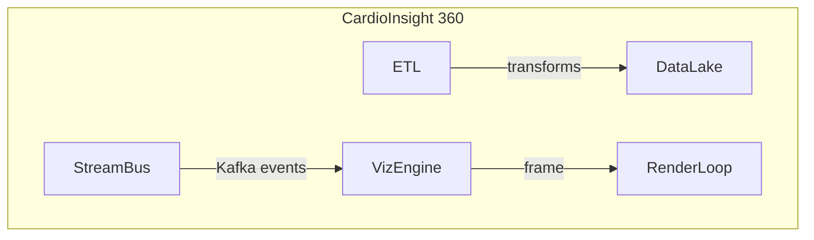

```markdown
<!--
    File: cardio_insight_360/docs/api/visualization_api.md
    Title: Visualization API (C++)
    Project: CardioInsight 360 – Unified Healthcare Analytics Engine
    Copyright © 2024 
    License: Proprietary – All rights reserved.

    NOTE:
    This document describes the **in-process** Visualization API that ships as part
    of the CardioInsight 360 monolithic binary.  Because the entire engine is linked
    into one address space, the Visualization API can be invoked from any other
    subsystem (ETL, Stream Processor, Scheduler, etc.) without network hops.

    C++17 is the baseline language standard; all public interfaces are declared
    `noexcept` and use **value semantics** where feasible.  Thread-safety follows
    the _C++ Core Guidelines_ (Sutter, Alexandrescu) § CP. Because rendering relies
    on GPU pipelines, most calls are non-blocking and return **futures** that can
    be awaited or composed.

    Dependencies
    ------------
    * Intel TBB 2021
    * ImGui 1.90 (embedded)
    * OpenGL 4.6 / Metal 3 / DirectX 12 (abstracted through `ci::gfx` module)
    * spdlog 1.11  (diagnostics)
    * nlohmann::json 3.11 (layout serialization)
-->

# Visualization API (C++)

The Visualization API enables **high-fidelity, real-time dashboards** for ECG,
blood pressure, SpO₂, and hospital-operations KPIs.  It exposes two layers:

1. A **high-level façade** (`ci::viz::DashboardBuilder`) for declarative
   composition of dashboards in less than ten lines of code.
2. A **low-level scene-graph** (`ci::viz::Scene`, `ci::viz::Node`) for highly
   customized visualizations (e.g., isochrone 3-D left-atrium maps).

Both layers interoperate seamlessly with the Data-Lake and Event-Streaming
subsystems, so that visualizations can be **data-driven** and **reactive** out
of the box.



---

## Namespaces

```cpp
namespace ci   {  // CardioInsight root namespace
namespace viz  {  // Visualization subsystem
namespace spec {  // Declarative layout specifications
```


## Quick-Start Example

```cpp
#include <ci/viz/dashboard_builder.hpp>
#include <ci/viz/widgets/ecg_waveform.hpp>
#include <ci/viz/widgets/timeline.hpp>
#include <ci/viz/widgets/metric_card.hpp>
#include <ci/viz/run.hpp>              // boots the in-process render loop
#include <ci/stream/consumer.hpp>      // Kafka consumer façade

using namespace ci::viz;

int main(int argc, char** argv) try
{
    auto dash =
        DashboardBuilder{"Telemetry Suite",  /* title shown on window */
                         Size{1280, 720}}    /* logical resolution        */
        .grid({3, 2})                        /* 3 columns × 2 rows  */
        .add<widgets::ECGWaveform>(GridPos{0, 0}, "lead-II")
        .add<widgets::ECGWaveform>(GridPos{0, 1}, "lead-V1")
        .add<widgets::Timeline>(GridSpan{{1, 0}, {2, 1}}, "alarms")
        .add<widgets::MetricCard>(GridPos{2, 0}, "Heart Rate")
        .add<widgets::MetricCard>(GridPos{2, 1}, "SpO₂");

    // Attach a Kafka stream as live data source
    ci::stream::Consumer ecg_consumer{
        .topic      = "patient-1234.ecg",
        .group_id   = "viz",
        .deserializer = ci::stream::deserializers::ECGSample{},
    };
    dash.bind_data_source("lead-II", ecg_consumer);
    dash.bind_data_source("lead-V1", ecg_consumer);

    // Blocks until the window closes (non-blocking to other threads)
    viz::run(dash);
}
catch (const std::exception& ex)
{
    spdlog::critical("Visualization failed: {}", ex.what());
    return EXIT_FAILURE;
}
```

---

## High-Level API Reference

### class `ci::viz::DashboardBuilder`

A convenience class for declarative dashboard assembly.

| Member Function                              | Description                                    | Complexity |
|----------------------------------------------|------------------------------------------------|------------|
| `explicit DashboardBuilder(std::string title, Size logical_size)` | Constructs a new builder handle. The actual native window is created lazily during `viz::run`. | `O(1)` |
| `DashboardBuilder& grid(GridDims dims)` | Defines a regular grid layout. | `O(1)` |
| `template <class Widget, class... Args> DashboardBuilder& add(GridPos pos, Args&&... args)` | Adds a widget instance at a grid position. | `O(1)` |
| `template <class Widget, class... Args> DashboardBuilder& add(GridSpan span, Args&&... args)` | Adds a widget that spans multiple cells. | `O(1)` |
| `Dashboard build() const` | Releases ownership of the assembled dashboard. | `O(1)` |
| `void bind_data_source(std::string widget_id, std::shared_ptr<stream::ISubscriber>)` | Connects a runtime data source (Kafka, file, synthetic) to a widget. | `O(1)` |

#### Thread Safety

All builder methods are **not** thread-safe.  Builders are typically
constructed on the main/UI thread.  Once `Dashboard` is built, the underlying
scene can be updated concurrently using signal/slot wiring; see
`ci::viz::SceneDispatcher`.

---

### Widget Catalog (Partial)

| Widget                     | Header                                     | Usage                              |
|----------------------------|--------------------------------------------|------------------------------------|
| `ECGWaveform`             | `ci/viz/widgets/ecg_waveform.hpp`          | Real-time ECG strip w/ 500 Hz tick |
| `Timeline`                | `ci/viz/widgets/timeline.hpp`              | Scrolling event/annotation bar     |
| `MetricCard`              | `ci/viz/widgets/metric_card.hpp`           | Large numeric KPIs                 |
| `HeatMap`                 | `ci/viz/widgets/heat_map.hpp`              | 2-D colored surfaces               |
| `VolumeRenderer`          | `ci/viz/widgets/volume_renderer.hpp`       | 3-D CT or MRI volumes              |

Each widget is a subclass of `viz::Component` and can be instantiated through
`DashboardBuilder::add`.

```cpp
class ECGWaveform : public Component
{
public:
    struct Config {
        ECGLead      lead;
        double       gain_mm_per_mv = 10.0;
        double       speed_mm_per_s = 25.0;
        ColourScheme scheme         = ColourScheme::ClinicalBlue;
    };

    explicit ECGWaveform(Config cfg);
    void push_sample(const ecg::Sample&) noexcept;
    // ...
};
```

---

## Low-Level Scene-Graph

Advanced users can bypass `DashboardBuilder` and manipulate the underlying
scene graph directly:

```cpp
#include <ci/viz/scene.hpp>
using namespace ci::viz;

Scene scene;
auto root = scene.create<Node2D>("root");

auto waveform = widgets::ECGWaveform::make({.lead = ECGLead::II});
root->attach_child(waveform);

// Reactive property binding
waveform->bind(&Scene::time_scale, [](double value) {
    spdlog::info("Global time scale changed to {}", value);
});

// The render loop transfers ownership of the scene graph
viz::run(std::move(scene));
```

The scene-graph layer permits arbitrary nesting, transformations
(translate/rotate/scale), layer-based compositing, and custom GPU shaders
through the `ci::gfx` API.

---

## Integration with Analytics Pipelines

Visualization can be inserted as a **sink** stage in ETL or stream jobs:

```cpp
#include <ci/pipeline/builders/job_builder.hpp>
#include <ci/viz/exporters/parquet_heatmap.hpp>

ci::pipeline::JobBuilder job;
job.source("liver-function.cohort")          // Parquet files
   .transform(ci::transform::MovingAverage{.window = 5})
   .sink(viz::exporters::ParquetHeatMap{
         .output_dir = "/var/ci360/viz/heaps",
         .schema     = viz::exporters::HeatMapSchema::Standard });
job.run();
```

Widgets can read the resulting Parquet files lazily via the Data-Lake façade,
removing the need for expensive in-memory shuffles.

---

## Error Handling

The Visualization API follows the **value/exception** model:

* Invalid arguments (e.g., negative DPI) throw `std::invalid_argument`.
* GPU resource exhaustion throws `ci::viz::GraphicsError` (derived from
  `std::runtime_error`).
* Runtime data source disconnections are signaled via
  `ci::viz::DataSourceLost`, which can be caught or observed through
  `ci::viz::Observer`.

All exceptions propagate across the C++ boundary but are internally logged
via `spdlog` at `error` level.

---

## Performance Considerations

* Rendering is capped at 60 FPS by default but adapts to source data rates
  (e.g., 500 Hz ECG → 120 Hz UI refresh).
* Large table widgets defer VBO uploads via persistent mapped buffers.
* When running on headless servers, the engine falls back to EGL off-screen
  contexts for screenshot generation and disables ImGui overlays.

---

## Versioning

The Visualization API adheres to [Semantic Versioning 2.0](https://semver.org/):

* **MAJOR**: Incompatible API changes
* **MINOR**: Backward-compatible functionality
* **PATCH**: Backward-compatible bug fixes

Current version: **3.2.1** (January 2024)


---

## Appendix A – Compile Flags

```
-DWITH_OPENGL=ON           # default renderer
-DWITH_METAL=OFF           # enable on macOS
-DWITH_DIRECTX12=OFF       # enable on Windows
-DWITH_TBB_MALLOC_PROXY=ON # improves allocation telemetry
```

---

## Appendix B – Diagnostics Quick Commands

```
$ ci360 --viz-benchmark
$ ci360 --viz-dump-scene /tmp/scene.json
$ ci360 --viz-screenshot out.png --no-gui
```

---

> **Contact**  
> For commercial support, please contact `support@cardioinsight360.example.com`  
> or open a ticket in the secured customer portal.
```