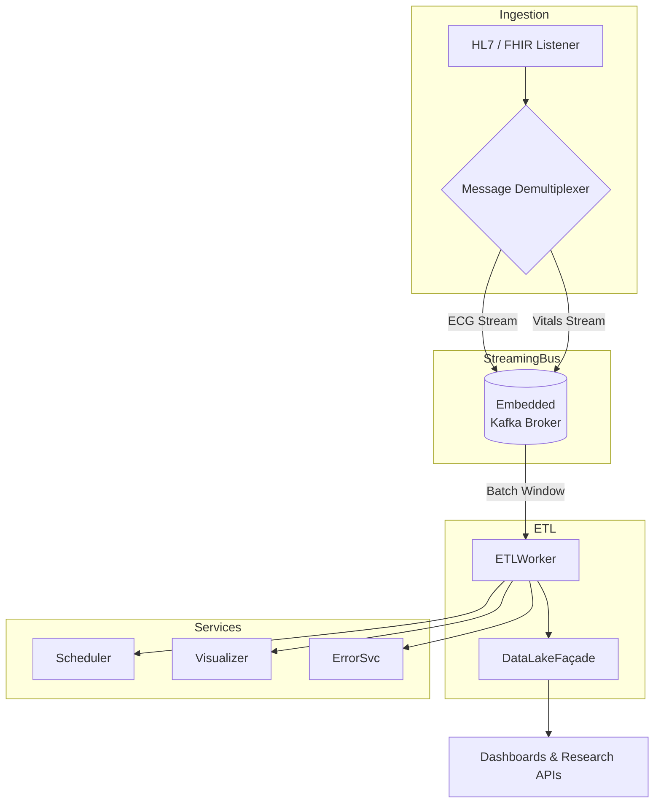

```markdown
# CardioInsight360 – Architecture Overview  
*File: `cardio_insight_360/docs/architecture/README.md`*  
*Last updated: 2024-06-01*

---

## Table of Contents
1. Executive Summary  
2. Layered Architecture  
   2.1. High-Level Component Map  
   2.2. Build & Deployment Model  
3. Core Runtime Patterns  
   3.1. Strategy Pattern – Transform & Validate  
   3.2. Event-Streaming Bus  
   3.3. ETL & Pipeline Pattern  
   3.4. Data-Lake Façade  
   3.5. Pseudo-Microservices Layer  
   3.6. Observer Pattern – Telemetry & Alerting  
4. Threading & Concurrency Model  
5. Data Security & Compliance  
6. Extensibility Points  
7. Failure Domains & Error-Handling Strategy  
8. Directory Layout  
9. Appendix  
   9.1. Example Strategy Plugin (C++17)  
   9.2. Sample Runtime Config (YAML)  

---

## 1. Executive Summary
CardioInsight360 is a **single, self-contained C++17 binary** that delivers high-volume cardiovascular analytics in both near-real-time *and* batch modes.  
The monolithic approach keeps operational complexity low for hospital IT while still **internally** applying well-known distributed-systems patterns:

* **Strategy Pattern** enables plug-and-play data-quality & transformation policies.  
* **Apache Kafka** (via `librdkafka`) provides a low-latency in-process **Event-Streaming bus**.  
* An **ETL Pipeline** leverages **Intel TBB** for data-parallel execution.  
* A **Data-Lake Façade** abstracts hierarchical Parquet storage behind a simple C++ API.  
* A lightweight **pseudo-Microservices** layer offers logical service boundaries without extra deployables.  
* **Observer Pattern** exposes health metrics to Prometheus-compatible collectors.

Result: hospital networks deploy *one* artifact yet benefit from sophisticated, horizontally-scalable analytics.

---

## 2. Layered Architecture

### 2.1. High-Level Component Map



Key: everything executes **inside the same process space**; inter-service calls are in-memory function calls rather than RPC.

### 2.2. Build & Deployment Model
* **Build**: CMake with presets for *Release*, *Instrumented*, *FIPS-Compliant*.  
* **Artifact**: single ELF/PE/Mach-O binary (`cardioinsight360`) + optional CLI helper.  
* **Dependencies** are statically linked where licenses permit (e.g., `librdkafka`, `libpqxx`, `parquet-arrow`).

---

## 3. Core Runtime Patterns

### 3.1. Strategy Pattern – Transform & Validate

Each physiological signal type (ECG, BP, SpO₂) registers a `TransformationStrategy` at runtime.  
Contracts:

```cpp
struct TransformationStrategy {
    virtual std::string schema_id() const = 0;
    virtual ValidatedRecord process(const RawRecord&) = 0;
    virtual ~TransformationStrategy() = default;
};
```

The engine auto-discovers shared libraries in `<prefix>/lib/strategies/*.so` and installs them into a map keyed by `schema_id()`.

### 3.2. Event-Streaming Bus
* Embeds a **single-node Kafka** broker (configured for zero-replication, log-compaction) to avoid external infra.  
* Producers & consumers live in the same process yet adhere to Kafka semantics → switch to real cluster by config only.

### 3.3. ETL & Pipeline Pattern
* **Staged**: `ExtractStage -> TransformStage -> LoadStage`.  
* **Parallel**: per stage and per patient/time-window using **Intel TBB Flow Graph**.  
* **Batch & Real-Time** share code; *real-time* uses tiny windows (2 s) vs *batch* (24 h).

### 3.4. Data-Lake Façade
```cpp
class DataLake {
public:
    WriteHandle open_writer(const PartitionKey&);
    ReadHandle  open_reader(const PartitionSelection&);
};
```
* Physical storage back-end: local FS, NFS, or S3 (via `aws-sdk-cpp`).  
* Layout: `/modality=ecg/year=2024/month=06/day=01/patient_id=<uuid>.parquet`.

### 3.5. Pseudo-Microservices Layer
* Scheduler, Visualization, and Error-Recovery each sit behind an interface enabling independent release cycles, yet are compiled in.  
* Interactions occur via C++20 **Sender/Receiver** channels, not gRPC.

### 3.6. Observer Pattern – Telemetry & Alerting
* All major subsystems derive from `Observable`; metrics are pushed to a central `MetricsRegistry`.  
* A Prometheus exporter scrapes `localhost:9191/metrics`.

---

## 4. Threading & Concurrency Model
* **TBB Task Scheduler** governs fine-grained tasking.  
* Thread-safe singletons are avoided; DI container hands out strictly-scoped instances.  
* Critical sections guarded by `std::shared_mutex`; no global `mutex`es.  
* Hot paths (e.g., ECG R-peak detection) use lock-free ring buffers (`folly::ProducerConsumerQueue`).

---

## 5. Data Security & Compliance
1. HIPAA AES-256 encryption at rest via LUKS or KMS-managed keys (S3).  
2. TLS 1.3 for any remote connectivity (optional).  
3. PHI tokenization configurable per facility.  
4. Role-based access controlled **at CLI layer**; no privilege escalation inside process.  

---

## 6. Extensibility Points
| Extension Type | Mechanism | Loading |
| -------------- | --------- | ------- |
| Transformation Strategy | Shared-lib + C++17 ABI | `dlopen()`/`LoadLibrary` |
| Custom Alert Rules | Embedded Lua 5.4 | Run-time |
| Storage Back-End | Adapter pattern | Compile-time flag |

---

## 7. Failure Domains & Error-Handling Strategy
* **Brown-out > Black-out**: degrade to batch-only mode if Kafka is unstable.  
* **Circuit Breakers** guard external systems (e.g., PACS).  
* **Replay**: deterministic offsets + idempotent writes enable at-least-once semantics.  
* **Crash Resilience**: fully stateless; restart and resume by reading last committed offsets from Data-Lake manifest.

---

## 8. Directory Layout
```
cardio_insight_360/
├─ CMakeLists.txt
├─ src/
│  ├─ core/                  # Domain models & value objects
│  ├─ strategies/            # Built-in transformation plugins
│  ├─ services/              # Pseudo-microservices
│  └─ ui/                    # Qt 6 dashboards
├─ third_party/
├─ data/                     # Sample datasets (git-lfs)
└─ docs/
   ├─ architecture/README.md # <— you are here
   └─ api/
```

---

## 9. Appendix

### 9.1. Example Strategy Plugin (C++17)

```cpp
// File: plugins/strategies/ArrhythmiaValidator.cpp
#include "core/TransformationStrategy.hpp"
#include "domain/ecg/BeatClassifier.hpp"
#include <spdlog/spdlog.h>

class ArrhythmiaValidator final : public TransformationStrategy {
public:
    std::string schema_id() const override { return "ecg.v1"; }

    ValidatedRecord process(const RawRecord& raw) override {
        auto beats = BeatClassifier::detect_beats(raw.payload);
        if (!beats.valid()) {
            throw ValidationError{"Arrhythmia check failed"};
        }
        ValidatedRecord out;
        out.patient_id  = raw.patient_id;
        out.timestamp   = raw.timestamp;
        out.cleaned_electrodes = beats.cleaned_signal();
        return out;
    }
};

extern "C" TransformationStrategy* create_plugin() {
    return new ArrhythmiaValidator{};
}
```

> Compile as:  
> `g++ -std=c++17 -fPIC -shared ArrhythmiaValidator.cpp -o libarrhythmia_validator.so`

### 9.2. Sample Runtime Config (`config.yaml`)
```yaml
ingestion:
  hl7_port: 2575
  fhir_port: 8080
  kafka_socket: inproc://kafka

storage:
  backend: "filesystem"
  root_path: "/var/lib/cardioinsight360/datalake"

security:
  encryption_at_rest: true
  tls:
    enabled: false

services:
  scheduler:
    max_parallel_jobs: 8
  visualization:
    port: 9000
  error_recovery:
    retry_backoff_ms: 500

strategies_path: "/opt/cardioinsight360/plugins/strategies"
```

---

© 2024 CardioInsight360 Contributors. Licensed under the Apache License 2.0.
```