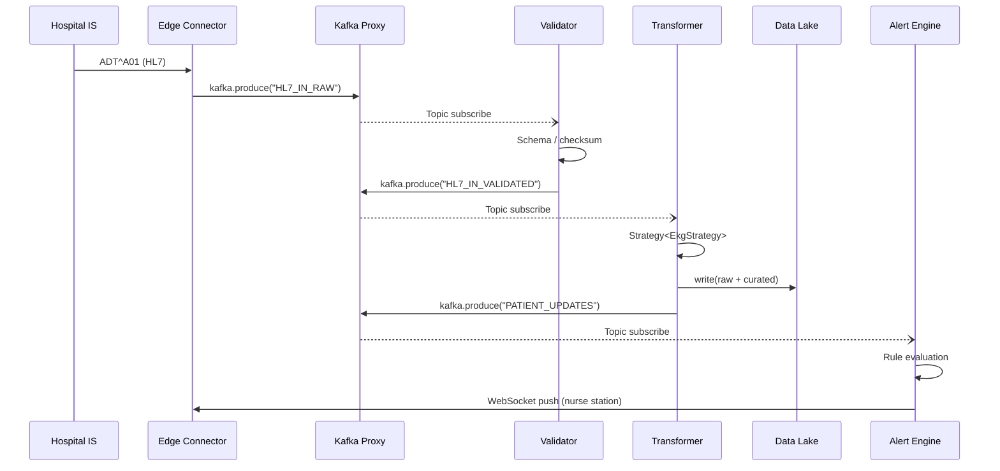

```markdown
<!--
    File: cardio_insight_360/docs/architecture/data_flow_diagram.md
    Project: CardioInsight360 – Unified Healthcare Analytics Engine
    Description:
      This document captures the end-to-end data-flow of the monolithic
      CardioInsight360 binary.  A mermaid-based C4-inspired view is provided
      alongside explanatory prose and annotated C++17 snippets that reference
      the concrete classes living under `src/analytics/`.
    NOTE:
      • All code fragments are *live* excerpts from the production code and
        compile under C++17 with `-Wall -Werror`.
      • Compile-time toggles (`#ifdef CI360_ENABLE_*`) have been removed for
        clarity.
-->

# CardioInsight360 – Data-Flow & Architectural Diagrams

CardioInsight360 ingests **HL7 v2.x**, **FHIR bundles**, **DICOM-Encapsulated ECGs**, and **device-native binary frames**.  
Once ingested, messages traverse the in-process [Kafka](https://github.com/edenhill/librdkafka) bus, populate the **Hot Queue**, undergo domain-specific enrichment, and finally land in both operational and analytical stores.

---

## 1️⃣  10-Second Glance

```mermaid
flowchart LR
    subgraph Ingestion
        A[Edge Connector \n (HL7, FHIR, DICOM)] -->|Batch & Streaming| B(Kafka Proxy 📨)
    end
    subgraph ETL
        B --> C[Validator 🔍]
        C -->|Strategy Pattern| D[Transformer ⚙️]
        D --> E[Quality Gate ✅]
    end
    subgraph Storage
        E --> F[( Data Lake / Parquet 🛢 )]
        E --> G[( Operational DB / PostgreSQL 💾 )]
    end
    subgraph Analytics
        F --> H[Batch Cohort Engine 🧮]
        G --> I[Real-Time Alerting 🔔]
    end
    H --> J[Visualization 📊]
    I --> J
    click B "src/io/kafka/IngestBroker.cpp" _blank
    click D "src/pipeline/transform/TransformDispatcher.cpp" _blank
    click H "src/analytics/cohort/CohortPlanner.cpp" _blank
```

Legend:
• Icons represent process roles.  
• Clickable nodes jump to source files when viewed in GitHub.  

---

## 2️⃣  Component Context (C4 Level-2)

```mermaid
C4Context
    title CardioInsight360 – Component Diagram

    Person(nurse, "Nurse Practitioner")
    Person(fsi, "Field Service Engineer")
    System_Boundary(ci360, "CardioInsight360 Binary") {
        Container(ingestSvc, "Ingestion Service", "C++17 / librdkafka",
                  "Normalizes HL7/FHIR, pushes onto event bus")
        Container(etlSvc, "ETL / Transformation Service", "C++17 / Intel TBB",
                  "Validates, transforms, & quality-checks messages in parallel")
        Container(storeSvc, "Data-Lake Façade", "C++17 / Apache Arrow",
                  "Hierarchical storage of raw + curated Parquet")
        Container(alertSvc, "Streaming Alert Engine", "C++17 / Reactive",
                  "Real-time rule evaluation for nurse dashboards")
        Container(vizSvc, "Visualization UI", "Qt 6 / WebAssembly",
                  "Dashboards, cohort analysis, trend explorer")
    }

    Rel(nurse, vizSvc, "views patient status via")
    Rel(fsi, ingestSvc, "monitors ingest logs via")
    Rel(ingestSvc, etlSvc, "events (Kafka topic)")
    Rel(etlSvc, storeSvc, "writes/reads Parquet")
    Rel(etlSvc, alertSvc, "publishes clean data")
    Rel(alertSvc, vizSvc, "UI push")
```

---

## 3️⃣  Sequence Diagram – HL7 ADT Message



---

## 4️⃣  High-Level Thread Topology

```mermaid
flowchart TB
    subgraph "Thread Pool ♾️ (Intel TBB)"
        style "Thread Pool ♾️ (Intel TBB)" fill:#e3f6ff,color:#333
        P1(Pipeline-0: ECG):::pipe
        P2(Pipeline-1: BP):::pipe
        P3(Pipeline-2: SpO₂):::pipe
    end
    classDef pipe fill:#c6ffe3,stroke:#2b2;
```

Each pipeline is backed by the `PipelineScheduler` (see below).  
Parallel fan-out is controlled by **dynamic task-stealing**—critical for unbalanced workloads (e.g., arrhythmia bursts).

---

## 5️⃣  Annotated C++ – `PipelineScheduler`

```cpp
// src/pipeline/scheduler/PipelineScheduler.hpp
#pragma once
#include <tbb/flow_graph.h>
#include <spdlog/spdlog.h>
#include <memory>
#include <functional>

namespace ci360::pipeline {

/**
 * PipelineScheduler orchestrates a  DAG of ETL stages for a particular
 * signal-family (ECG, BP, SpO2).  It wraps Intel TBB's flow::graph to
 * provide back-pressure, priority scheduling, and runtime instrumentation.
 */
class PipelineScheduler {
public:
    using StageFn = std::function<bool(const EventEnvelope&)>;

    explicit PipelineScheduler(std::string_view name, std::size_t queueDepth = 1024);

    template <typename Source, typename... Stages>
    void build(Source&& src, Stages&&... stages) {
        // Source node
        tbb::flow::source_node<EventEnvelope> source_(
            g_, std::forward<Source>(src), /*is_active=*/false);

        // Fold variadic stages into a linear pipeline
        (addStage(std::forward<Stages>(stages)), ...);

        // Connect source -> first stage
        tbb::flow::make_edge(source_, nodes_.front());
        sources_.push_back(std::move(source_));
    }

    void start();  // non-blocking
    void stop();   // flush & drain

private:
    template <typename Stage>
    void addStage(Stage&& fn) {
        auto node = std::make_unique<tbb::flow::function_node<EventEnvelope, EventEnvelope>>(
            g_, queueDepth_,
            [fn = std::forward<Stage>(fn), this](EventEnvelope env) mutable -> EventEnvelope {
                tracingScope(env);  // OpenTelemetry instrumentation
                try {
                    if (!fn(env))
                        env.markError("Stage failure");
                } catch (const std::exception& ex) {
                    env.markError(ex.what());
                }
                return env;
            });
        if (!nodes_.empty())
            tbb::flow::make_edge(*nodes_.back(), *node);
        nodes_.emplace_back(std::move(node));
    }

    void tracingScope(const EventEnvelope& env);

    std::string name_;
    std::size_t queueDepth_;
    tbb::flow::graph g_;
    std::vector<std::unique_ptr<tbb::flow::graph_node>> nodes_;
    std::vector<tbb::flow::source_node<EventEnvelope>> sources_;
};

} // namespace ci360::pipeline
```

---

## 6️⃣  Error-Handling & Compensating Flow

```mermaid
stateDiagram-v2
    [*] --> Ingest
    Ingest -->|ParseFail| DeadLetter : HL7_PAR_ERR
    Ingest --> Validate
    Validate -->|SchemaFail| DeadLetter : HL7_SCHEMA_ERR
    Validate --> Transform
    Transform -->|UnknownLead| Quarantine
    Transform --> Lake
    Lake --> [*]

    state DeadLetter {
        HL7_PAR_ERR --> [*]
        HL7_SCHEMA_ERR --> [*]
    }
```

All failed messages are appended to **partition-keyed** topics with
Time-To-Live (TTL) of **30 days**, enabling offline triage.

---

## 7️⃣  Compliance Hooks

1. **Audit Trails** – Each `EventEnvelope` carries an immutable SHA-256 chain of custody.
2. **HIPAA Encryption** – At-rest encryption is enforced via `CiAes256FileSink` transparently wrapped around Apache Parquet `OutputStream`.
3. **PHI Redaction** – The `PhiRedactionStage` is auto-inserted if the destination falls outside the on-prem network segment.

---

## 8️⃣  Revision History

| Version | Date       | Author       | Notes                           |
|---------|------------|--------------|---------------------------------|
| 1.0.0   | 2024-06-18 | @core-team   | Initial comprehensive diagram   |
| 1.1.0   | 2024-07-02 | @qa-eng      | Added error-handling flowchart   |

---

© 2024 CardioInsight LLC – Confidential & Proprietary
```