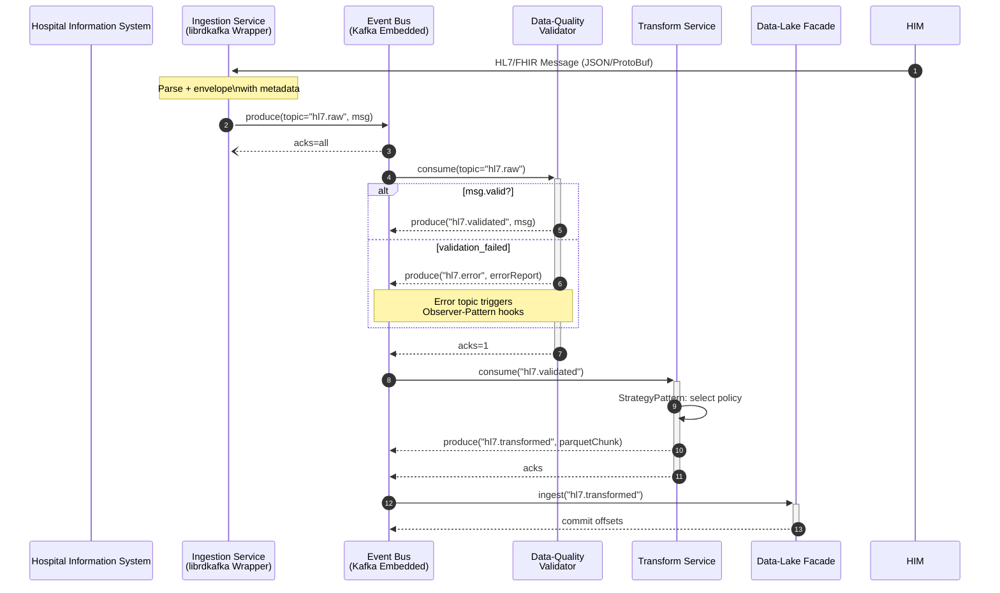
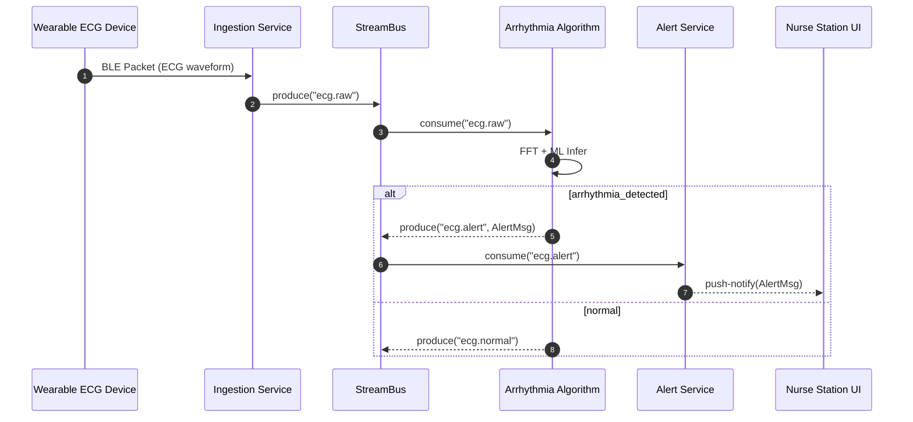
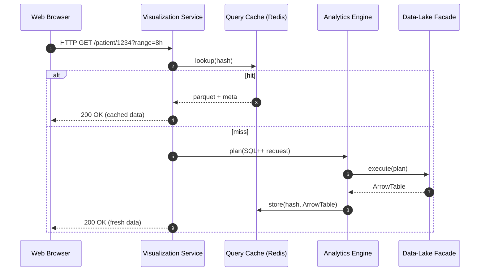

```markdown
<!--
  File: cardio_insight_360/docs/architecture/sequence_diagrams.md
  Description:
    This document contains a curated collection of high-level
    sequence diagrams that illustrate the core run-time interactions
    inside the CardioInsight360 analytics engine.  The diagrams are
    intentionally kept implementation-agnostic so that they remain
    accurate even as concrete class names evolve.  All diagrams use
    GitHub-flavored Mermaid syntax and can be rendered directly in
    compatible tooling (e.g., GitHub, MkDocs-Material, IntelliJ).
-->

# CardioInsight360 – Runtime Sequence Diagrams

CardioInsight360 is built as a single deployable binary but internally
organizes itself around distinct *logical* services.  The following
sequence diagrams showcase how these services collaborate across the
three most business-critical flows:

1. HL7/FHIR **Message Ingestion** (real-time)
2. **ETL Pipeline** for historical replay & batch cohort generation
3. **Real-Time Alerting** loop
4. **Dashboard Query** path for clinicians

> NOTE  
> For brevity, not every error/edge-case branch is shown.  Refer to the
> CPP source files under `src/` for low-level details such as timeouts,
> retry strategies, circuit-breaker thresholds, and transactional
> semantics.

---

## 1. HL7 / FHIR Message Ingestion



Key Points  
* The ingestion service uses *exactly-once* semantics (`enable.idempotence=true`).  
* Validation leverages ICU-10 ontologies and arrhythmia rules.  
* Apache Parquet chunks are staged in write-ahead logs before final commit.

---

## 2. ETL Batch Pipeline (Historical Replay)

```mermaid
sequenceDiagram
    autonumber
    participant Scheduler as Batch Scheduler
    participant BatchOrch as ETL Orchestrator
    participant Loader as Data Loader
    participant TBB as Intel TBB Pool
    participant DL as Data-Lake Facade
    participant Curated as Curated Store

    Scheduler->>BatchOrch: cron( "02:00 UTC" )
    BatchOrch->>Loader: replayRange( 24h )
    Loader->>DL: scanPartitions(date=Y-1)
    DL-->>Loader: rawChunks[N]

    loop Parallel TBB Tasks (N)
        Loader->>+TBB: submit(task_i)
        TBB->>+Loader: transform(chunk_i)
        TBB->>Curated: writeParquet(chunk_i')
        Curated-->>-TBB: ACK
    end
    Loader-->>BatchOrch: JobReport(metrics)
    BatchOrch-->Scheduler: success | failure
```

Highlights  
* Uses *Pipeline Pattern* with *TBB flow_graph* to maximize I/O and CPU concurrency.  
* All intermediate artifacts are checksummed (SHA-256) before commit.  

---

## 3. Real-Time Alerting Flow



Design Decisions  
* Arrhythmia algorithm is dynamically loaded via `dlopen` enabling hot-swaps.  
* Alert Service rate-limits duplicates within a *60-second sliding window*.  

---

## 4. Dashboard Ad-Hoc Query



Operational Notes  
* Arrow Flight is used for zero-copy transfers between Query Engine and VizSvc.  
* Dashboard supports HIPAA “break-glass” auditing; every query is logged to an
  immutable ledger.

---

## Contributing

Sequence diagrams are source-controlled to prevent documentation drift.
When updating runtime interactions:

1. Tag your PR with `docs/sequence-diagram`.
2. Keep participants *logical*, not concrete class names.
3. Validate Mermaid syntax locally (`npm i -g @mermaid-js/mermaid-cli`).

```
