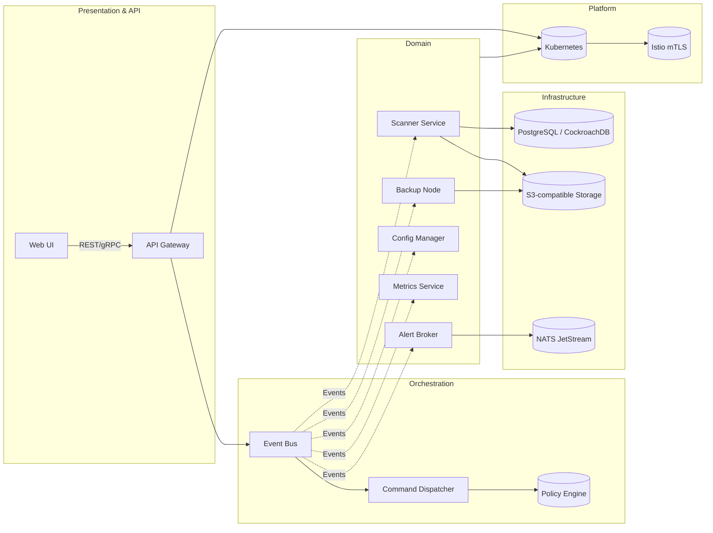

```markdown
# FortiLedger360 – Enterprise Security Suite  
*Layered, Event-Driven service-mesh platform for B2B-grade infrastructure security*  

[](https://github.com/fortitech/FortiLedger360/actions) 
[](LICENSE) 
[](https://gitter.im/FortiLedger360/community)

---

## Table of Contents
1. [Why FortiLedger360?](#why-fortiledger360)
2. [High-Level Architecture](#high-level-architecture)
3. [Getting Started](#getting-started)
   * [Prerequisites](#prerequisites)
   * [Building from Source](#building-from-source)
   * [Running the Demo Stack](#running-the-demo-stack)
4. [Key Concepts](#key-concepts)
5. [Code Walkthrough (C++)](#code-walkthrough-c)
   * [Command & Strategy Pattern](#command--strategy-pattern)
   * [Chain-of-Responsibility Validator](#chain-of-responsibility-validator)
   * [Observer Event Hooks](#observer-event-hooks)
6. [Extending FortiLedger360](#extending-fortiledger360)
7. [Testing & CI/CD](#testing--cicd)
8. [Contributing](#contributing)
9. [License](#license)

---

## Why FortiLedger360?

Modern B2B service providers face a constant trade-off between rapid feature delivery and uncompromising security. FortiLedger360 resolves this conflict by **abstracting deep security mechanics** behind a subscription-ready API, letting product teams monetize features such as:

* **Load-Balancing Tiers** – L4/L7, weighted-round-robin, geo-aware.
* **Real-Time Vulnerability Scanning** – CVE/OWASP feed ingestion with tenant-specific baselines.
* **Automated Backup & DR** – Time-machine style snapshots, cross-region replication.
* **Configuration-Drift Detection** – Declarative intent enforcement with GitOps callbacks.
* **SLA-Bound Alerting** – 24×7 health checks and on-call escalation policies.

---

## High-Level Architecture



* **Event-Driven** – Commands are immutable messages flowing through a central bus (NATS JetStream).  
* **Service-Mesh** – All micro-services communicate via gRPC using mutual TLS, observability, and traffic policies provided by Istio.  
* **Pluggable Strategies** – Customer pricing plans are mapped to runtime-selected strategies (deep vs. shallow scans, warm vs. cold backups, etc.).  
* **Chain-of-Responsibility** – Compliance rules ensure every action passes mandatory checks before execution.  
* **Observer Hooks** – Firehose of events for logging, dashboards, and ML-based anomaly detection.

---

## Getting Started

### Prerequisites
* C++20-compatible compiler (tested with GCC 13 and Clang 17)  
* CMake 3.20+  
* Protobuf 3.21+, gRPC 1.58+  
* OpenSSL 1.1+  
* Docker & Docker Compose (optional for demo stack)

### Building from Source

```bash
git clone --recurse-submodules https://github.com/fortitech/FortiLedger360.git
cd FortiLedger360
mkdir build && cd build
cmake -DCMAKE_BUILD_TYPE=Release ..
cmake --build . --target all -j$(nproc)
ctest --output-on-failure               # Run unit & integration tests
```

### Running the Demo Stack

```bash
# Spin up the core stack: NATS, PostgreSQL, MinIO, Jaeger, Istio sidecars
docker-compose -f infra/docker-compose.yml up -d

# Seed demo data & launch micro-services
./scripts/local-dev/bootstrap.sh
```

Access the web UI at `https://localhost:8443`. Default admin credentials: `admin / fortiledger360!`.

---

## Key ConceptS

| Layer            | Responsibility                                   | Technology                                       |
|------------------|--------------------------------------------------|--------------------------------------------------|
| Presentation     | Web UI, REST, GraphQL, gRPC                      | React, Envoy, OpenAPI                            |
| Orchestration    | Validation, Command dispatch, Policy enforcement | C++20, NATS JetStream, Protobuf Any              |
| Domain           | Business logic, Strategies                       | C++20, gRPC, Plugin-loader                       |
| Infrastructure   | State storage, Object blobs, Message queue       | PostgreSQL, MinIO, NATS                          |
| Platform         | Runtime, Observability, mTLS, Autoscaling        | Kubernetes, Istio, Prometheus, Grafana           |

---

## Code Walkthrough (C++)

### Command & Strategy Pattern

`src/orchestration/commands/InitiateSecurityScan.hpp`

```cpp
#pragma once
#include <domain/strategies/IScanStrategy.hpp>
#include <orchestration/Command.hpp>
#include <infrastructure/NatsBus.hpp>

namespace fortiledger::orchestration {

class InitiateSecurityScan final : public Command {
public:
    InitiateSecurityScan(std::string tenantId,
                         ScanIntensity intensity,
                         std::shared_ptr<domain::IScanStrategy> strategy,
                         infrastructure::NatsBus& bus)
        : _tenantId(std::move(tenantId))
        , _intensity(intensity)
        , _strategy(std::move(strategy))
        , _bus(bus)
    {}

    void execute() override try {
        if (!_strategy) {
            throw std::logic_error("ScanStrategy not set");
        }
        auto traceSpan = Tracer::startSpan("InitiateSecurityScan");
        _strategy->validatePreconditions(_tenantId);

        domain::ScanRequest req{_tenantId, _intensity, std::chrono::system_clock::now()};
        _strategy->scheduleScan(req);

        _bus.publish("scans.initiated", toJson(req));
        traceSpan.finish();
    } catch (const std::exception& ex) {
        Logger::error("Failed to initiate scan: {}", ex.what());
        throw; // Let upper layer map to gRPC error
    }

private:
    std::string _tenantId;
    ScanIntensity _intensity;
    std::shared_ptr<domain::IScanStrategy> _strategy;
    infrastructure::NatsBus& _bus;
};
} // namespace fortiledger::orchestration
```

`src/domain/strategies/DeepScanStrategy.cpp`

```cpp
#include "DeepScanStrategy.hpp"
#include <infrastructure/ScannerClient.hpp>

using namespace fortiledger;

void domain::DeepScanStrategy::scheduleScan(const ScanRequest& req) {
    if (req.intensity != ScanIntensity::Deep) {
        throw std::invalid_argument("DeepScanStrategy can only handle deep scans");
    }
    auto meta = scannerClient_->prepareDeepScan(req.tenantId);
    scannerClient_->dispatch(meta);
}

void domain::DeepScanStrategy::validatePreconditions(const std::string& tenantId) const {
    if (!complianceEngine_->isTenantCompliant(tenantId)) {
        throw NonCompliantTenant{tenantId};
    }
}
```

### Chain-of-Responsibility Validator

`src/orchestration/validators/PolicyChain.hpp`

```cpp
#pragma once
#include <memory>
#include <vector>

namespace fortiledger::orchestration {

class ValidationContext {
public:
    std::string tenantId;
    CommandType  command;
    json         payload;
    // ...
};

class IPolicy {
public:
    virtual ~IPolicy() = default;
    virtual bool check(const ValidationContext&) const = 0;
};

class PolicyChain {
public:
    explicit PolicyChain(std::vector<std::unique_ptr<IPolicy>> policies)
        : _policies(std::move(policies)) {}

    bool validate(const ValidationContext& ctx) const {
        for (const auto& policy : _policies) {
            if (!policy->check(ctx)) {
                return false;
            }
        }
        return true;
    }

private:
    std::vector<std::unique_ptr<IPolicy>> _policies;
};

} // namespace fortiledger::orchestration
```

### Observer Event Hooks

`src/infrastructure/observers/PrometheusObserver.cpp`

```cpp
#include "PrometheusObserver.hpp"
#include <prometheus/counter.h>
#include <prometheus/registry.h>

namespace fortiledger::infrastructure {

PrometheusObserver::PrometheusObserver(std::shared_ptr<prometheus::Registry> registry)
    : scansInitiated_(&prometheus::BuildCounter()
                           .Name("scans_initiated_total")
                           .Help("Total number of scans initiated")
                           .Register(*registry)
                           .Add({}))
{}

void PrometheusObserver::onEvent(const Event& ev) {
    if (ev.type == "scans.initiated") {
        scansInitiated_->Increment();
    }
}

} // namespace fortiledger::infrastructure
```

---

## Extending FortiLedger360

* **Add a new Strategy** – Implement `domain::IScanStrategy`, derive from `PluginBase`, and drop the shared object into `/opt/fortiledger/plugins/`.
* **Integrate a new Storage Backend** – Create an adapter implementing `infrastructure::IObjectStore`.
* **Introduce a Compliance Policy** – Append an `IPolicy` implementation to `PolicyChain`.

Dynamic loading is handled by `Boost.DLL`, and each plugin is sandboxed via seccomp profile to mitigate supply-chain attacks.

---

## Testing & CI/CD

* **Unit Tests** – GoogleTest, run on every PR via GitHub Actions (`make test`).  
* **Integration Tests** – Compose-based ephemeral environment executed nightly.  
* **Static Analysis** – clang-tidy, cppcheck, SonarQube.  
* **Security Scans** – github-code-scanning + Trivy container audits.  
* **Release Pipeline** – SemVer tagging triggers multi-arch Docker images pushed to GHCR.

---

## Contributing

We :heart: contributions! Please read `CONTRIBUTING.md` for code style, commit message format, and branch naming conventions.

```bash
# fork & clone
git clone https://github.com/<your-username>/FortiLedger360.git
cd FortiLedger360
./scripts/setup-dev-env.sh            # installs pre-commit hooks, clang-format, etc.
```

* Open an issue to discuss major feature proposals.  
* Code must compile with `-Wall -Wextra -Werror` on GCC & Clang.  
* Submit unit tests with at least 80 % coverage for new modules.

---

## License

FortiLedger360 is licensed under the **Apache License 2.0** – see the [LICENSE](../LICENSE) file for details.
```