```markdown
# FortiLedger360 – Event Flows  
`docs/architecture/event_flows.md`  
Last-Updated: 2024-05-29  

FortiLedger360 embraces an Event-Driven Architecture (EDA) to guarantee that **user intents** (commands) are **decoupled** from **side-effects** (infrastructure work).  
Every customer interaction enters the platform through the *Presentation/APIs* layer, is validated and enriched by *Orchestration*, materializes into *Domain Events*, and finally touches *Infrastructure/Platform* adapters.

---

## 1. High-Level Flow

```mermaid
sequenceDiagram
    autonumber
    actor Client as 🧑‍💻 Tenant / API Consumer
    participant API as 🌐 Presentation & API
    participant ORCH as 🔄 Orchestration
    participant BUS as 📨 Event-Bus
    participant SCN as 🛡️ ScannerSvc (Domain)
    participant BCK as 💾 BackupSvc (Domain)
    participant INF as 🛠️ Platform Adapter

    Client->>API: POST /v1/scan\n{asset: "web-1", tier:"deep"}
    API->>ORCH: Cmd<InitiateSecurityScan>
    ORCH->>BUS: Publish(Cmd<InitiateSecurityScan>)
    %% Broadcast to interested domain services
    BUS-->>SCN: Cmd<InitiateSecurityScan>
    SCN->>SCN: Validate + Enrich
    SCN->>BUS: Emit(Evt<SecurityScanStarted>)
    BUS-->>INF: Evt<SecurityScanStarted>
    INF->>SCN: gRPC startScan()
    INF-->>BUS: Evt<SecurityScanProgress>
    BUS-->>SCN: Evt<SecurityScanProgress>
    SCN->>BUS: Emit(Evt<SecurityScanCompleted>)
    BUS-->>ORCH: Evt<SecurityScanCompleted>
    ORCH->>Client: 200 OK {"scanId":"...","state":"COMPLETED"}
```



---

## 2. Canonical Event Taxonomy

| Layer              | Prefix | Example                     |
|--------------------|--------|-----------------------------|
| Command            | `Cmd`  | `Cmd<InitiateSecurityScan>` |
| Domain Event       | `Evt`  | `Evt<SecurityScanStarted>`  |
| Integration Event  | `Int`  | `Int<InvoiceGenerated>`     |
| Query / Response   | `Qry`  | `Qry<TenantUsage>`          |

---

## 3. Core C++ Building Blocks

Below snippets are **abridged** but compile-ready.  
Complete sources reside in `src/eventing/`.

### 3.1 Transport-Agnostic Envelope

```cpp
// eventing/Envelope.hpp
#pragma once
#include <string>
#include <chrono>
#include <nlohmann/json.hpp>

namespace fl360::eventing {

struct Envelope
{
    std::string id;                 // UUIDv4
    std::string type;               // Fully-qualified class name
    std::chrono::system_clock::time_point timestamp;
    nlohmann::json payload;         // Arbitrary JSON blob
    std::string correlationId;      // For tracing call-chains

    static Envelope wrap(const std::string& type,
                         const nlohmann::json& payload,
                         const std::string& correlation = {});
};

} // namespace fl360::eventing
```

```cpp
// eventing/Envelope.cpp
#include "Envelope.hpp"
#include <uuid.h>          // microsoft/GUID implementation
#include <spdlog/spdlog.h>

namespace fl360::eventing {

Envelope Envelope::wrap(const std::string& type,
                        const nlohmann::json& payload,
                        const std::string& correlation)
{
    Envelope env;
    env.id            = uuids::to_string(uuids::uuid_system_generator{}());
    env.type          = type;
    env.timestamp     = std::chrono::system_clock::now();
    env.payload       = payload;
    env.correlationId = correlation.empty() ? env.id : correlation;
    return env;
}

} // namespace fl360::eventing
```

### 3.2 Command & Event Base Classes

```cpp
// eventing/Message.hpp
#pragma once
#include <string_view>

namespace fl360::eventing {

struct Message {
    virtual ~Message() = default;
    virtual std::string_view name() const noexcept = 0;
};

struct Command : public Message {};
struct DomainEvent : public Message {};
struct IntegrationEvent : public Message {};

} // namespace fl360::eventing
```

### 3.3 Example Command Definition

```cpp
// api/commands/InitiateSecurityScan.hpp
#pragma once
#include "eventing/Message.hpp"
#include <string>

namespace fl360::api::commands {

struct InitiateSecurityScan final : public fl360::eventing::Command
{
    std::string tenantId;
    std::string assetId;
    std::string scanTier;   // deep / quick / continuous

    std::string_view name() const noexcept override
    { return "Cmd<InitiateSecurityScan>"; }
};

} // namespace fl360::api::commands
```

### 3.4 Chain-of-Responsibility Validation Pipeline

```cpp
// orchestration/ValidationChain.hpp
#pragma once
#include <memory>
#include "eventing/Message.hpp"

namespace fl360::orchestration {

class ValidationHandler
{
public:
    using Ptr = std::shared_ptr<ValidationHandler>;
    virtual ~ValidationHandler() = default;

    void linkWith(Ptr next) { next_ = std::move(next); }

    bool validate(const fl360::eventing::Message& msg) const
    {
        if (!check(msg)) return false;
        return !next_ || next_->validate(msg);
    }

protected:
    virtual bool check(const fl360::eventing::Message& msg) const = 0;

private:
    Ptr next_;
};

class TenantQuotaValidator : public ValidationHandler
{
protected:
    bool check(const fl360::eventing::Message& msg) const override;
};

class CompliancePolicyValidator : public ValidationHandler
{
protected:
    bool check(const fl360::eventing::Message& msg) const override;
};

} // namespace fl360::orchestration
```

```cpp
// orchestration/ValidationChain.cpp
#include "ValidationChain.hpp"
#include <spdlog/spdlog.h>

namespace fl360::orchestration {

bool TenantQuotaValidator::check(const eventing::Message& msg) const
{
    spdlog::debug("TenantQuotaValidator: {}", msg.name());
    // TODO: Lookup tenant quota from Redis. Mocked here:
    return true;
}

bool CompliancePolicyValidator::check(const eventing::Message& msg) const
{
    spdlog::debug("CompliancePolicyValidator: {}", msg.name());
    // TODO: Evaluate policies. Mocked:
    return true;
}

} // namespace fl360::orchestration
```

### 3.5 In-Process Event Bus

```cpp
// eventing/InMemoryBus.hpp
#pragma once
#include <functional>
#include <unordered_map>
#include <vector>
#include <shared_mutex>
#include <typeindex>
#include <any>

namespace fl360::eventing {

class InMemoryBus
{
public:
    template<typename TMsg>
    using Handler = std::function<void(const TMsg&)>;

    template<typename TMsg>
    void publish(const TMsg& msg)
    {
        std::shared_lock lock(mutex_);
        auto it = subscribers_.find(std::type_index(typeid(TMsg)));
        if (it == subscribers_.end()) return;

        for (auto& anyCb : it->second)
        {
            auto& cb = *std::any_cast<Handler<TMsg>>(&anyCb);
            try { cb(msg); } catch (const std::exception& ex) {
                // Never kill the bus thread
                spdlog::error("EventBus handler threw: {}", ex.what());
            }
        }
    }

    template<typename TMsg>
    void subscribe(Handler<TMsg> handler)
    {
        std::unique_lock lock(mutex_);
        subscribers_[std::type_index(typeid(TMsg))].push_back(handler);
    }

private:
    std::unordered_map<std::type_index, std::vector<std::any>> subscribers_;
    mutable std::shared_mutex mutex_;
};

} // namespace fl360::eventing
```

### 3.6 Domain Service Example – ScannerSvc

```cpp
// domain/scanner/ScannerService.hpp
#pragma once
#include "eventing/InMemoryBus.hpp"
#include "api/commands/InitiateSecurityScan.hpp"
#include <memory>

namespace fl360::domain::scanner {

class ScannerService
{
public:
    explicit ScannerService(std::shared_ptr<eventing::InMemoryBus> bus);

    void start();

private:
    void handleScan(const api::commands::InitiateSecurityScan& cmd);

    std::shared_ptr<eventing::InMemoryBus> bus_;
};

} // namespace fl360::domain::scanner
```

```cpp
// domain/scanner/ScannerService.cpp
#include "ScannerService.hpp"
#include "eventing/Envelope.hpp"
#include <spdlog/spdlog.h>

namespace fl360::domain::scanner {

ScannerService::ScannerService(std::shared_ptr<eventing::InMemoryBus> bus)
    : bus_{std::move(bus)} {}

void ScannerService::start()
{
    bus_->subscribe<api::commands::InitiateSecurityScan>(
        [this](const auto& cmd) { handleScan(cmd); });
}

void ScannerService::handleScan(const api::commands::InitiateSecurityScan& cmd)
{
    spdlog::info("ScannerSvc received scan request for asset {}", cmd.assetId);

    // Emit a "ScanStarted" domain event
    struct SecurityScanStarted : public eventing::DomainEvent
    {
        std::string scanId;
        std::string_view name() const noexcept override
        { return "Evt<SecurityScanStarted>"; }
    } evt{.scanId = "scan-" + cmd.assetId};

    bus_->publish(evt);

    // Simulate long-running work (omitted)
    // ...

    struct SecurityScanCompleted : public eventing::DomainEvent
    {
        std::string scanId;
        bool        findingsPresent{false};
        std::string_view name() const noexcept override
        { return "Evt<SecurityScanCompleted>"; }
    } completed{.scanId = evt.scanId};

    bus_->publish(completed);
}

} // namespace fl360::domain::scanner
```

---

## 4. Putting It All Together

```cpp
// main.cpp
#include "eventing/InMemoryBus.hpp"
#include "orchestration/ValidationChain.hpp"
#include "domain/scanner/ScannerService.hpp"
#include "api/commands/InitiateSecurityScan.hpp"
#include <spdlog/spdlog.h>

int main()
{
    using namespace fl360;

    auto bus = std::make_shared<eventing::InMemoryBus>();

    // Bootstrap Scanner Domain Service
    domain::scanner::ScannerService scanner{bus};
    scanner.start();

    // Build validation chain
    auto quota   = std::make_shared<orchestration::TenantQuotaValidator>();
    auto policy  = std::make_shared<orchestration::CompliancePolicyValidator>();
    quota->linkWith(policy);

    // Example command coming from API layer
    api::commands::InitiateSecurityScan cmd{
        .tenantId = "tenant-42",
        .assetId  = "web-front-1",
        .scanTier = "deep"
    };

    if (quota->validate(cmd))
    {
        spdlog::info("Validation passed – publishing command");
        bus->publish(cmd);
    }
    else
    {
        spdlog::warn("Validation failed – rejecting command");
    }

    // Block until Ctrl-C (demo only)
    std::this_thread::sleep_for(std::chrono::seconds{3});
}
```

> The snippet demonstrates a minimal **local** topology.  
> In production, the same abstractions map to **NATS JetStream** for publication, and gRPC-based **mesh sidecars** replace the in-process bus.

---

## 5. Failure Handling & Observability

1. **Dead-Letter Queue** – When handler exceptions exceed a retry budget, the `Envelope` is routed to `DLQ.<ServiceName>` with exponential back-off metadata.  
2. **Telemetry** – Each `Envelope` mutates the OpenTelemetry span context (via `correlationId`), enabling distributed tracing across gRPC boundaries.  
3. **Circuit Breaker** – Outbound adapter calls (e.g., S3 backup storage) are protected by a [Polly-style] circuit breaker written in C++20 coroutines.

---

## 6. Next Steps

* Review `docs/runbook.md` for on-call escalation maps.  
* Consult `docs/architecture/service_mesh.md` for multi-cluster rollout patterns.  
* Study `tests/integration/` for contract tests executed in CI via GitHub Actions.

```
