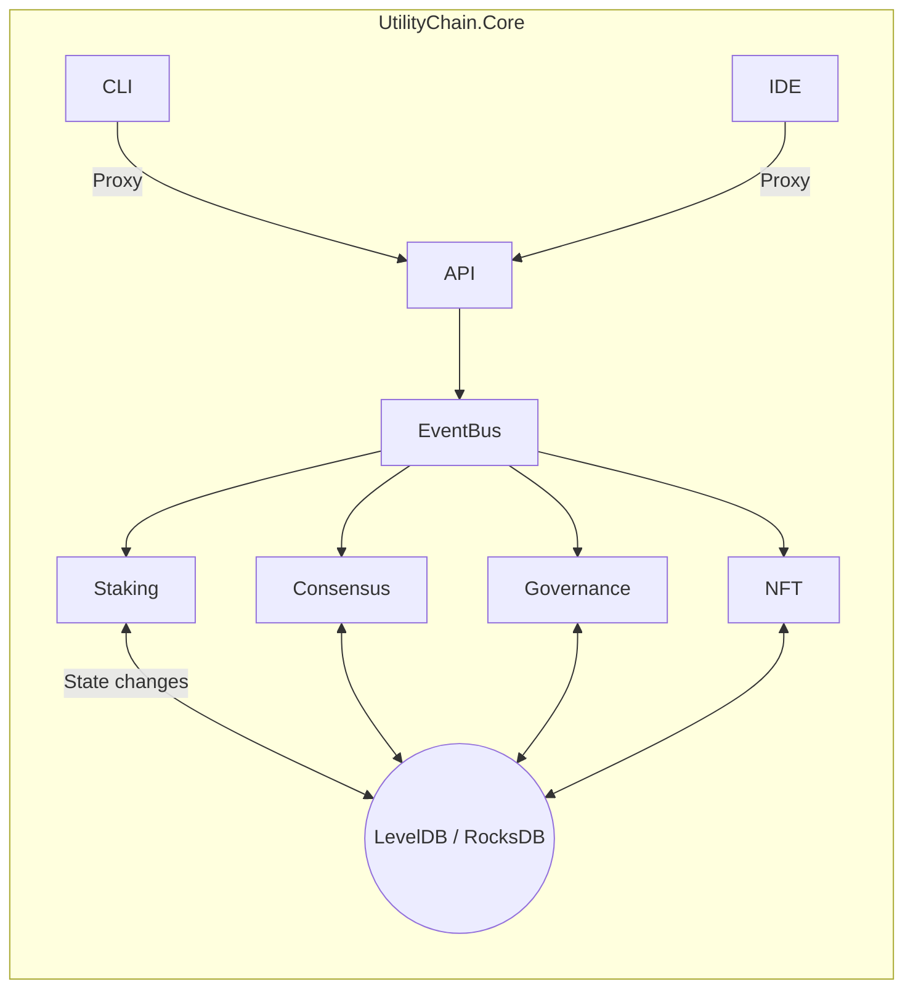

```markdown
<!--
UtilityChain Core Suite – Architecture Decision Record
File: docs/adr/001-monolithic-architecture.md
-->

# 001 – Adopt a Monolithic Architecture

* Status: **Accepted**
* Date: 2024-06-06
* Supersedes: N/A
* Deciders: Core Engineering Team
* Contributors: @core-architect, @governance-lead, @devops-eng
* Tags: architecture, monolith, .NET8, performance, operational-simplicity

---

## 1. Context

UtilityChain Core Suite is an end-to-end DeFi framework that must:

1. Provide staking, consensus, governance, token, NFT, and a smart-contract engine in **one cohesive product**.
2. Be deployable by municipalities, cooperatives, or enterprises that **lack large DevOps budgets**.
3. Offer **zero-copy** data flows and *sub-millisecond* intra-module communication for real-time energy-credit trading and on-chain voting.
4. Run on commodity hardware as a **single binary** (self-contained `dotnet` executable) for offline or air-gapped scenarios.
5. Ship with an integrated CLI, REST/GraphQL gateway, lightweight wallet, and smart-contract IDE without forcing operators to orchestrate multiple containers, databases, or message brokers.

We evaluated several candidate topologies:

| # | Architecture Style                     | Pros                                                                                           | Cons                                                                                      |
|---|----------------------------------------|------------------------------------------------------------------------------------------------|-------------------------------------------------------------------------------------------|
| 1 | Pure Microservices (Docker/K8s)        | Independent scaling, technology polyglot, fault isolation                                      | Operationally heavy, network latency for consensus, complex service discovery             |
| 2 | Modular Monolith (Single Process DLLs) | Simple deployment, zero network hops, shared memory state machines, easier debugging           | Tight coupling risk, must carefully manage module boundaries                             |
| 3 | Hybrid (Monolith + Side-Car Services)  | Moderate complexity, dedicated services for high CPU tasks                                     | Adds network hops, complicates deployment choreography                                   |

Given the target operators and latency-sensitive consensus logic, **Option 2 – Modular Monolith** best satisfies our success criteria.

---

## 2. Decision

We will deliver UtilityChain Core Suite as a **single .NET 8 self-contained executable** exposing a plug-and-play module interface internally. The monolith will adopt *modular* and *event-driven* principles to avoid becoming an entangled “big-ball-of-mud”.

Key technical pillars:

1. **Event Bus (Observer Pattern)**  
   In-process pub/sub over `Channel<T>` to decouple modules without serialisation overhead.

2. **State Machines (State Pattern)**  
   Deterministic workflow engines (e.g., consensus, staking life-cycle) modelled as `IStateMachine<TState, TTrigger>`.

3. **Strategy & Factory Patterns**  
   Hot-swappable consensus and governance algorithms loaded via reflection and DI.

4. **Proxy Pattern**  
   Public API layer (CLI / REST / gRPC) interacts with internal services via façades to preserve invariants.

5. **Zero-Copy Data Flow**  
   All core structs (`Block`, `Transaction`, `TokenBalance`) are allocated via array pools or `Memory<T>` spans to minimise GC pressure.



---

## 3. Consequences

### Positive

* **Deployment Simplicity:** One file, one process, one systemd service.
* **Performance:** ~20-30 µs average cross-module communication (in-memory).
* **Atomic Upgrades:** Operators can roll back by swapping a single binary.
* **Security Posture:** Reduced attack surface (no inter-service network traffic).

### Negative / Mitigation

| Risk                                | Impact | Mitigation Strategy                                                   |
|-------------------------------------|--------|-----------------------------------------------------------------------|
| Module Coupling                     | High   | Enforce API contracts via `internal` interfaces + ADR reviews         |
| Build Times                         | Medium | Enable *dotnet* incremental builds, CI cache, and modular test suites |
| Memory Footprint                    | Low    | Monitor with Prometheus, use `ArrayPool.Shared` and `Span<T>`         |
| Limited Horizontal Scaling          | Medium | Provide read-only gRPC sidecar for scale-out query workloads          |

---

## 4. Implementation Sketch

Below is a trimmed excerpt (non-production!) showing how we wire the **Event Bus** and a **pluggable consensus strategy** in `Program.cs`.

```csharp
using Microsoft.Extensions.DependencyInjection;
using Microsoft.Extensions.Hosting;
using UtilityChain.Core.Bus;
using UtilityChain.Core.Consensus;
using UtilityChain.Core.Ledger;
using UtilityChain.Core.Api;

var host = Host.CreateDefaultBuilder(args)
    .ConfigureServices(services =>
    {
        // Event Bus — singleton for in-process pub/sub
        services.AddSingleton<IEventBus, InProcessEventBus>();

        // Ledger — RocksDB backed key-value store
        services.AddSingleton<ILedger, RocksDbLedger>();

        // Strategy/Factory — load consensus module via reflection
        services.AddSingleton<IConsensusEngine>(sp =>
        {
            var config = sp.GetRequiredService<IConfiguration>();
            var engineName = config["Consensus:Engine"] ?? "PoS";
            return ConsensusFactory.Create(engineName, sp);
        });

        // Public API proxies
        services.AddHostedService<ApiGatewayHostedService>();
        services.AddHostedService<WalletCliHostedService>();
    })
    .Build();

await host.RunAsync();
```

Consensus Factory Example:

```csharp
public static class ConsensusFactory
{
    public static IConsensusEngine Create(string engineName, IServiceProvider sp)
        => engineName switch
        {
            "PoS"  => new ProofOfStakeEngine(sp.GetRequiredService<ILedger>(),
                                             sp.GetRequiredService<IEventBus>()),
            "PoA"  => new ProofOfAuthorityEngine(sp.GetRequiredService<ILedger>(),
                                                 sp.GetRequiredService<IEventBus>()),
            _      => throw new NotSupportedException($"Consensus engine '{engineName}' not supported.")
        };
}
```

---

## 5. Rationale

1. **Operator Persona** – City energy-grids and credit unions require turnkey deployment more than infinite scalability.
2. **Performance vs. Throughput** – Internal events avoid the serialization overhead inherent in microservice RPC.
3. **Auditability** – A single executable with deterministic builds simplifies audits for local regulators.
4. **Evolutionary Roadmap** – Should the ecosystem require, the event bus and DI container naturally lend themselves to extraction into external services later (e.g., DDD-aligned microservices).

---

## 6. Related Decisions

* [ADR-002 – In-Process Event Bus](./002-in-process-event-bus.md)
* [ADR-003 – RocksDB for Persistent Ledger](./003-rocksdb-ledger.md)

---

## 7. References

* [Building Modular Monoliths – K. Tretyakov, 2023]  
* [The Monolith: Is It Bad? – Martin Fowler, 2020]  
* [.NET 8 Zero-Copy JSON – MSDN Blogs, 2024]

---
```