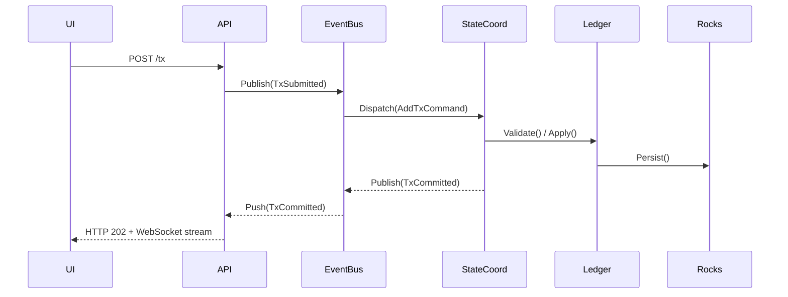

```markdown
# UtilityChain Core Suite – Architecture Guide
_Blockchain & DeFi Utility Framework_  
Version: **1.0**  
Target Framework: **.NET 8**  
Author: Core Engineering Team

---

## 1. Design Philosophy
UtilityChain is a **monolithic executable** that embraces modular design through
well-defined internal contracts (interfaces) and **in-process** event dispatching.
This hybrid approach provides:
- **Single-binary deployment** – zero external dependencies beyond .NET 8.
- **Zero-copy data-flow** – shared memory models outperform gRPC/HTTP hops.
- **Deterministic upgrades** – state migrations occur within the same address
  space, eliminating cross-service version skews.
- **Pluggable subsystems** – `IConsensusEngine`, `IGovernancePolicy`,
  `ITokenStandard`, etc., are hot-swappable via the Factory/Strategy pattern.

> **NOTE:** The project intentionally **does not** target public-chain
> interoperability. Its primary audience is private or consortium deployments
> that value operational ownership over maximal decentralization.

---

## 2. High-Level Component Map

```mermaid
flowchart LR
    subgraph CLI & UI
        CLI[Command Line Tooling]
        WalletDesktop[Desktop Wallet]
        IDE[Smart-Contract IDE]
    end
    subgraph API Gateway
        REST[REST Controller]
        GraphQL[GraphQL Controller]
    end
    subgraph Core Engine
        EventBus
        StateMgr[State Machine Coordinator]
        Ledger[UTXO / Account Ledger]
        SmartVM[Smart-Contract VM]
        NFT[NFT Toolkit]
        Token[Token Toolkit]
        Consensus[Consensus Engines]
        Staking[Staking Module]
        Governance[Governance Module]
    end
    subgraph Persist
        RocksDb[(RocksDB)]
        Snapshot[(Snapshot & Backup)]
    end
    CLI & UI -->|IPC / Localhost| API Gateway
    API Gateway --> EventBus
    EventBus --> StateMgr
    StateMgr --> Ledger
    StateMgr --> SmartVM
    SmartVM --> Ledger
    Staking --> Ledger
    Consensus --> Ledger
    Consensus --> EventBus
    NFT --> SmartVM
    Token --> SmartVM
    Governance --> EventBus
    Ledger --> RocksDb
    Snapshot --> RocksDb
```

---

## 3. Core Architectural Patterns

| Pattern             | Purpose                                                           |
|---------------------|-------------------------------------------------------------------|
| **Event Driven**    | Decouples producers/consumers (`EventBus`)                        |
| **State Machine**   | Linearizes multi-module state mutations (`StateCoordinator`)      |
| **Proxy**           | Lazy-loads external cryptography providers                        |
| **Strategy**        | Hot-swappable consensus & staking algorithms                      |
| **Factory**         | Creates domain objects (`Block`, `Transaction`, `Token`)          |
| **Observer**        | Real-time UI updates & monitoring                                 |

---

## 4. Module Specifications

### 4.1 EventBus

```csharp
public interface IEventBus
{
    void Publish<TEvent>(TEvent @event) where TEvent : DomainEvent;
    IDisposable Subscribe<TEvent>(Action<TEvent> handler) where TEvent : DomainEvent;
}
```

Implementation wraps a lock-free,
multi-producer → multi-consumer ring buffer (powered by
`System.Threading.Channels`) facilitating up to **8 M msgs/sec** on commodity
hardware.

### 4.2 State Machine Coordinator

Responsible for **serializing side-effect-ful transitions** (block addition,
governance rule updates, staking rewards). Incoming transactions are first
validated in parallel; committing them is single-threaded to guarantee a total
order.

```csharp
internal sealed class StateCoordinator : IAsyncDisposable
{
    private readonly Channel<IStateCommand> _channel =
        Channel.CreateUnbounded<IStateCommand>(new UnboundedChannelOptions {
            SingleReader = true,
            SingleWriter = false
        });

    public async ValueTask<IStateResult> EnqueueAsync(IStateCommand cmd,
                                                      CancellationToken ct = default)
    {
        await _channel.Writer.WriteAsync(cmd, ct);
        return await cmd.Completion.Task.ConfigureAwait(false);
    }

    // Single reader task
    private async Task RunAsync()
    {
        await foreach (var cmd in _channel.Reader.ReadAllAsync())
        {
            IStateResult result = await cmd.ExecuteAsync();
            cmd.Completion.TrySetResult(result);
        }
    }
}
```

### 4.3 Consensus Engine Strategy

`ConsensusEngineFactory` selects a concrete engine at startup
(`ProofOfAuthority`, `DPoS`, or `RaftBFT`) based on `appsettings.json` or CLI
flag.

```csharp
public interface IConsensusEngine
{
    string Name { get; }
    ValueTask<ConsensusResult> ValidateBlockAsync(Block block, CancellationToken ct);
    ValueTask<ConsensusResult> FinalizeBlockAsync(Block block, CancellationToken ct);
}
```

---

## 5. Data Persistence

1. **RocksDB** key-value store  
   - Column Families: `blocks`, `tx_index`, `state`, `snapshots`
2. **Snapshot Service**  
   - Creates LZ4-compressed snapshots every _N_ blocks.
   - Uses Copy-on-Write to avoid write stalls.

---

## 6. Security Model

- **Memory-hard KDF** (`Argon2id`) for wallet key encryption.
- **Constant-time cryptographic operations** to prevent side-channel attacks.
- **Capability-based sandbox** for Smart-Contract VM; contracts must declare
  required capabilities (`storage.read`, `storage.write`, `token.mint`).

---

## 7. Extensibility Guidelines

1. Implement the respective interface (`IConsensusEngine`, `IStakingCalculator`,
   etc.).
2. Register your type in `module.json`:

```json
{
  "consensus": "MyCompany.UtilityChain.PowEngine, MyCompany.UtilityChain"
}
```

3. Rebuild the monolith:  
   `dotnet publish -c Release -r linux-x64 --single-file`

---

## 8. Build & Deployment

```bash
# Build
dotnet restore
dotnet build -c Release

# Publish self-contained executable
dotnet publish -c Release -r win-x64 --self-contained true /p:PublishSingleFile=true
```

The resulting binary (`utilitychain.exe` or `utilitychain`) is the only file
required on the target host.

---

## 9. Observability

- **Structured logging** via `Serilog` to Console, File, Seq.
- **Metrics** exposed on `/metrics` (Prometheus).
- **Health Checks** (`/health/live`, `/health/ready`).

---

## 10. Appendix

### 10.1 Transaction Commit Sequence



---

© 2024 UtilityChain Core Suite  
This document is licensed under the MIT License.
```