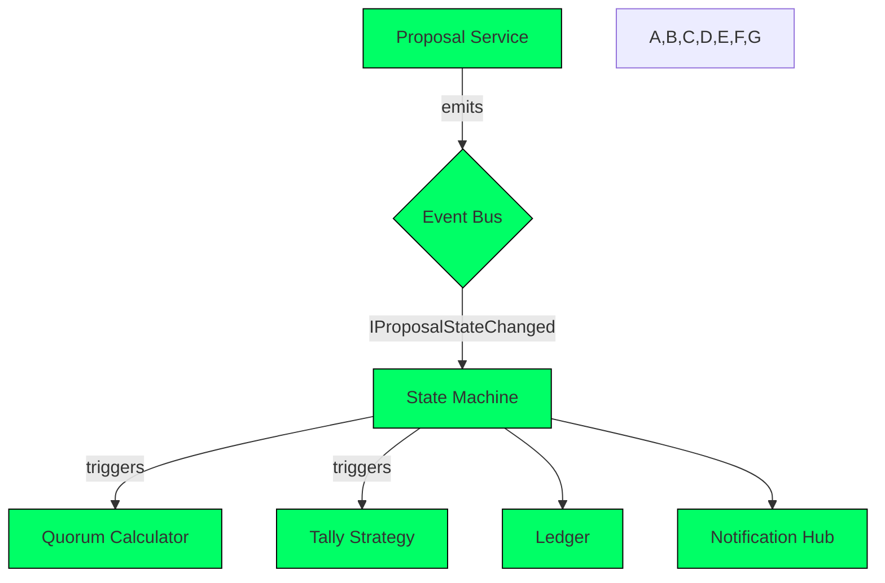

```markdown
# UtilityChain Governance Guide
### File: `docs/guides/05-governance-guide.md`
### Project: UtilityChain Core Suite  
*Version: 1.1 – Tested against UtilityChain 8.0.0*

---

## 1. Introduction

The Governance module coordinates protocol‐level decision-making
(upgrades, parameter tweaks, treasury disbursements, validator
on-boarding, etc.) through a flexible, **event-driven**,
**state-machine** powered workflow.  
It ships with:

* A configurable **proposal life-cycle** (Draft → Voting → Queued → Enacted → Archived).
* Multiple **voting strategies** (1 token = 1 vote, quadratic, stake-weighted).
* **Pluggable quorum policies** and **tally algorithms**.
* Full CLI, REST, and GraphQL surfaces.  
* Built-in **audit trail** persisted via Merkle-linked
  `GovernanceAction` records.

This guide teaches administrators and integrators how to:

1. Bootstrap governance on a fresh chain.
2. Submit and vote on proposals programmatically.
3. Extend the engine with custom policies.

---

## 2. High-Level Architecture



Components live in the `UtilityChain.Governance` namespace and follow the **Strategy** and **Factory** patterns to remain hot-swappable at runtime.

---

## 3. Bootstrapping Governance

### 3.1 Configuration File (`governance.json`)

```jsonc
{
  // Global governance parameters
  "DefaultVotingDuration": "P7D",          // ISO-8601 – 7 days
  "DefaultTimelockDuration": "PT36H",      // 36 hours after proposal passes
  "QuorumPolicy": "SimpleMajority",        // Other: SuperMajority, FixedThreshold
  "TallyStrategy": "StakeWeighted",        // Other: TokenWeighted, Quadratic
  "Authorization": {
    "SubmitProposal": ["Validator", "Treasurer"],
    "Vote": ["Holder"],
    "CancelProposal": ["Validator"]
  }
}
```

Place the file under `~/UtilityChain/config/`.  
At node start-up the `GovernanceOptionsFactory` reads and validates the JSON schema.

### 3.2 CLI Quick-Start

```bash
./utilitychain governance init \
  --config ./config/governance.json \
  --treasury-address 0xTREASURY \
  --authority-keys ./keys/validators.*
```

Successful output:

```
[OK] Governance subsystem initialized
      Quorum Policy    : SimpleMajority
      Tally Strategy   : StakeWeighted
      Authority Roles  : 3
      Version          : 8.0.0
```

---

## 4. Submitting & Voting on Proposals

### 4.1 Programmatic Submission (C#)

```csharp
using UtilityChain.Governance;
using UtilityChain.Governance.Proposals;
using UtilityChain.Cryptography;

// Prepare a proposal that changes the block reward.
var proposal = new ParameterChangeProposal(
    title       : "Adjust Block Reward",
    description : "Reduce reward from 5 UTX to 3 UTX beginning epoch 1500.",
    key         : "block.rewardPerBlock",
    newValue    : "3"
);

// Load a signer (validator key)
var validatorKey = PrivateKey.LoadFromPem("./keys/validator01.pem");

// Build the submission request.
var submitRequest = new ProposalSubmissionRequest(
    Proposal      : proposal,
    Proposer      : validatorKey.Address,
    Signature     : validatorKey.Sign(proposal.Hash())
);

// Send to node
var governanceClient = new GovernanceClient("https://localhost:5443");
SubmissionReceipt receipt = await governanceClient.SubmitProposalAsync(submitRequest);

Console.WriteLine($"Proposal Id  : {receipt.ProposalId}");
Console.WriteLine($"State        : {receipt.State}");
```

### 4.2 Casting a Vote

```csharp
var vote = new Vote(
    proposalId : receipt.ProposalId,
    voter      : myWallet.Address,
    support    : VoteSupport.For       // Against, Abstain
);

var signedVote = new SignedVote(vote, myWallet.Sign(vote.Hash()));

await governanceClient.CastVoteAsync(signedVote);
```

When quorum is met and the voting period ends, the **Timelock**
phase begins automatically. After its expiration the change is
**enacted** and broadcast through the event bus.

---

## 5. Extending Governance

### 5.1 Writing a Custom Quorum Policy

```csharp
using UtilityChain.Governance.Quorum;

namespace EnergyCreditChain.Governance
{
    /// <summary>
    /// Requires 2/3 validator approval *and*
    /// at least 20 % of community token holders.
    /// </summary>
    public sealed class DualChamberQuorum : IQuorumPolicy
    {
        private readonly IValidatorRegistry _validators;
        private readonly ITokenSnapshot _snapshot;

        public DualChamberQuorum(
            IValidatorRegistry validators,
            ITokenSnapshot snapshot)
        {
            _validators = validators;
            _snapshot   = snapshot;
        }

        public bool HasQuorum(ProposalContext ctx)
        {
            var validatorVotes = ctx.Votes
                .Where(v => _validators.IsValidator(v.Voter))
                .ToList();

            var holderVotes = ctx.Votes.Except(validatorVotes).ToList();

            bool validatorPass =
                validatorVotes.Count >= (2 * _validators.Count) / 3;

            bool communityPass =
                holderVotes.Sum(v => _snapshot.GetBalance(v.Voter)) >=
                (_snapshot.TotalSupply * 0.20m);

            return validatorPass && communityPass;
        }
    }
}
```

### 5.2 Registering the Policy

```csharp
// Startup.cs or module initializer
services.AddGovernance(config =>
{
    config.QuorumPolicyFactory = sp =>
        new DualChamberQuorum(
            sp.GetRequiredService<IValidatorRegistry>(),
            sp.GetRequiredService<ITokenSnapshot>());
});
```

Restart the node or trigger a hot-reload (`governance reload`) to activate.

---

## 6. Events & Observability

All governance domain events implement `IGovernanceEvent` and are
published on the internal **Event Bus** as well as the external
gRPC stream `governance.events`.  
Popular events include:

* `ProposalSubmitted`
* `ProposalStateChanged`
* `VoteCast`
* `ProposalExecuted`

Example subscription:

```csharp
await foreach (var evt in governanceClient.SubscribeAsync())
{
    switch (evt)
    {
        case ProposalStateChanged changed:
            logger.LogInformation(
                "Proposal {Id} → {State}",
                changed.ProposalId,
                changed.NewState);
            break;
    }
}
```

Metrics:

| Counter                         | Description                    |
|---------------------------------|--------------------------------|
| `gov_proposals_total`           | Cumulative proposals submitted |
| `gov_votes_total`               | Votes cast                     |
| `gov_execution_latency_seconds` | Timelock → Execution duration  |

Exposed via `./metrics` (Prometheus).

---

## 7. Security Considerations

1. **Replay Protection** – Every signed message includes a
   monotonic nonce verified on chain.
2. **Domain Separation** – EIP-712 typed data ensures signatures
   cannot be reused across modules.
3. **Circuit Breaker** – The `EmergencyPauseProposal` type can halt
   governance execution in critical scenarios.
4. **Upgradability** – Governance contracts live behind a proxy
   bound to the quorum policy; a super-majority is required to
   upgrade.

---

## 8. Troubleshooting

| Symptom                                          | Resolution                                             |
|--------------------------------------------------|--------------------------------------------------------|
| Proposal stuck in *Queued* state                 | Verify Timelock end; check `gov_execution_latency`     |
| `Unauthorized` when submitting                   | Confirm role mapping in `governance.json`              |
| Votes ignored / not tallied                      | Ensure snapshot provider returns correct balances      |
| Node boots with `GovernanceConfigException`      | Validate JSON against schema `schemas/governance.json` |

---

## 9. Additional Resources

* CLI reference: `./utilitychain governance --help`
* REST spec: `swagger/index.html#/Governance`
* GraphQL schema: `./docs/graphql/governance.graphql`
* Source code: `src/UtilityChain.Governance/`

---

© 2024 UtilityChain Core Suite. All rights reserved.
```