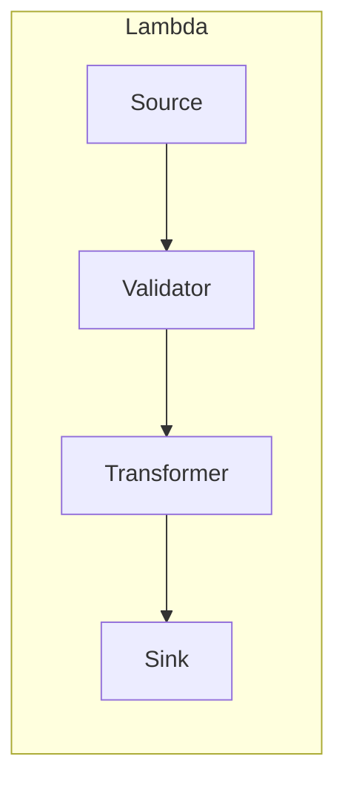

```markdown
# PulseOps Warehouse – .NET SDK & Lambda Micro-Services  
_Expert-grade, serverless data-warehouse solution for knowledge-worker productivity analytics_

---

## Table of Contents
1. [Installation](#installation)
2. [Quick Start](#quick-start)
3. [Namespaces & Key Types](#namespaces--key-types)
4. [Pipeline Composition](#pipeline-composition)
5. [Lambda Handlers](#lambda-handlers)
6. [Transformation Strategies](#transformation-strategies)
7. [Observability & Error Handling](#observability--error-handling)
8. [Extensibility Guide](#extensibility-guide)

---

## Installation
```bash
dotnet add package PulseOps.Warehouse --version x.y.z
```

---

## Quick Start
```csharp
using Amazon.Lambda.Core;
using Amazon.Lambda.KinesisEvents;
using Microsoft.Extensions.DependencyInjection;
using PulseOps.Warehouse;
using PulseOps.Warehouse.Ingestion;
using PulseOps.Warehouse.Transformation;
using PulseOps.Warehouse.Storage;

[assembly: LambdaSerializer(typeof(Amazon.Lambda.Serialization.SystemTextJson.DefaultLambdaJsonSerializer))]

public class Function : KinesisLambdaHandler
{
    public Function() : base(ConfigureServices()) { }

    private static ServiceProvider ConfigureServices()
    {
        var services = new ServiceCollection();

        // Register built-ins
        services.AddPulseOpsWarehouse(configuration =>
        {
            configuration
                .UseS3DataLake("pulseops-lake")   // Storage Layer
                .UseJsonCalendarIngestor()       // Source Layer
                .UseFocusTimeStrategy();         // Transformation Layer
        });

        // Add application-specific overrides here
        return services.BuildServiceProvider();
    }
}
```

---

## Namespaces & Key Types
| Namespace | Purpose |
|-----------|---------|
| `PulseOps.Warehouse` | SDK entry-points & extension methods |
| `PulseOps.Warehouse.Core` | Cross-cutting abstractions (`IPipeline`, `IDataRecord`, `IDomainEvent`) |
| `PulseOps.Warehouse.Ingestion` | Source connectors & validators |
| `PulseOps.Warehouse.Transformation` | KPI transformation strategies |
| `PulseOps.Warehouse.Storage` | Data-Lake (S3, Redshift Spectrum) & Lake-House utilities |
| `PulseOps.Warehouse.Monitoring` | Structured logging, metrics & DLQ fan-out |

---

## Pipeline Composition
All micro-services adhere to the **Pipeline Pattern**:



### Core Abstractions
```csharp
namespace PulseOps.Warehouse.Core
{
    public interface IPipeline
    {
        ValueTask ExecuteAsync(CancellationToken ct = default);
    }

    public interface IDataSource<out T> where T : IDataRecord
    {
        IAsyncEnumerable<T> ReadAsync(CancellationToken ct = default);
    }

    public interface ITransformer<in TIn, TOut>
        where TIn  : IDataRecord
        where TOut : IDataRecord
    {
        ValueTask<TOut> TransformAsync(TIn input, CancellationToken ct = default);
    }

    public interface IDataSink<in T> where T : IDataRecord
    {
        ValueTask WriteAsync(IAsyncEnumerable<T> records, CancellationToken ct = default);
    }
}
```

### Building a Custom Pipeline
```csharp
var pipeline = new PipelineBuilder()
    .WithSource(new CalendarEventSource(kinesisEvent))
    .WithValidator(new JsonSchemaValidator<CalendarEvent>(Schemas.CalendarV1))
    .WithTransformer(new FocusTimeTransformer())
    .WithSink(new ParquetDataLakeSink("s3://pulseops-lake/focus-time/"))
    .Build();

await pipeline.ExecuteAsync(ctx.CancellationToken);
```

---

## Lambda Handlers
Out-of-the-box handlers wrap `IPipeline` composition, wiring DI, logging, and DLQ routing.

```csharp
namespace PulseOps.Warehouse
{
    public abstract class KinesisLambdaHandler : IDisposable
    {
        private readonly IServiceProvider _services;
        private readonly ILogger _log;

        protected KinesisLambdaHandler(IServiceProvider services)
        {
            _services = services;
            _log = _services.GetRequiredService<ILogger<KinesisLambdaHandler>>();
        }

        public async Task HandleAsync(KinesisEvent evnt, ILambdaContext ctx)
        {
            using var scope = _services.CreateScope();
            var pipelineFactory = scope.ServiceProvider.GetRequiredService<IPipelineFactory>();

            try
            {
                var pipeline = pipelineFactory.Create(evnt);
                await pipeline.ExecuteAsync(ctx.CancellationToken);
            }
            catch (Exception ex)
            {
                _log.LogError(ex, "Pipeline failure – message parked to DLQ");
                await scope.ServiceProvider
                           .GetRequiredService<IDeadLetterQueue>()
                           .PublishAsync(evnt, ex);
                throw; // Forces Lambda retry + alarms
            }
        }

        public void Dispose() => ( _services as IDisposable )?.Dispose();
    }
}
```

---

## Transformation Strategies
Pluggable runtime strategies governed by the **Strategy Pattern**:

```csharp
public interface IMetricStrategy
{
    KPI Compute(IReadOnlyCollection<ActivityRecord> activities);
}

public sealed class FocusTimeStrategy : IMetricStrategy
{
    public KPI Compute(IReadOnlyCollection<ActivityRecord> activities)
    {
        var focusMinutes = activities
           .Where(a => a.Type == ActivityType.Coding || a.Type == ActivityType.Design)
           .Sum(a => a.DurationMinutes);

        var totalMinutes = activities.Sum(a => a.DurationMinutes);
        return new KPI("FocusTimeRatio", focusMinutes / totalMinutes);
    }
}
```

Switch strategies via DI:

```csharp
services.AddTransient<IMetricStrategy, DeploymentLeadTimeStrategy>();
```

---

## Observability & Error Handling
1. **Structured Logging** – Serilog JSON templates enriched with request-id, tenant-id, and Lambda metadata.  
2. **Metrics** – Custom CloudWatch metrics emitted via `IMetricsDispatcher`, enabling SLO dashboards.  
3. **Dead-Letter Queue (DLQ)** – All unrecoverable events are serialized and shipped to an SQS queue with a 14-day TTL; a dedicated Lambda fan-out publishes PagerDuty incidents.  
4. **Tracing** – AWS X-Ray segments automatically instrumented by `PulseOps.Warehouse.Diagnostics`.

```csharp
try
{
    await pipeline.ExecuteAsync(ct);
    _metrics.Increment("Pipeline.Success");
}
catch (ValidationException vex)
{
    _log.Warning(vex, "Validation failed – event discarded");
    _metrics.Increment("Pipeline.ValidationError");
}
catch (Exception ex)
{
    _log.Error(ex, "Unhandled pipeline failure");
    await _dlq.PublishAsync(eventData, ex);
    _metrics.Increment("Pipeline.FatalError");
    throw;
}
```

---

## Extensibility Guide
1. **Add a New Source Connector**
   ```csharp
   public class GitHubWebhookSource : IDataSource<GitHubEventRecord>
   {
       private readonly APIGatewayProxyRequest _request;
       public GitHubWebhookSource(APIGatewayProxyRequest request) => _request = request;

       public async IAsyncEnumerable<GitHubEventRecord> ReadAsync(
           [EnumeratorCancellation] CancellationToken ct = default)
       {
           var json = await GetPayloadAsync(_request, ct);
           yield return JsonSerializer.Deserialize<GitHubEventRecord>(json)!;
       }
   }
   ```

2. **Create a Custom Validator**
   ```csharp
   public class SemanticVersionValidator : IValidator<DeploymentEvent>
   {
       private static readonly Regex SemVer = new(@"^\d+\.\d+\.\d+$");
       public Task ValidateAsync(DeploymentEvent record, CancellationToken ct = default)
       {
           if (!SemVer.IsMatch(record.ReleaseTag))
               throw new ValidationException($"Invalid sem-ver: {record.ReleaseTag}");
           return Task.CompletedTask;
       }
   }
   ```

3. **Register in DI**
   ```csharp
   services
       .AddTransient<IDataSource<GitHubEventRecord>, GitHubWebhookSource>()
       .AddTransient<IValidator<DeploymentEvent>, SemanticVersionValidator>();
   ```

---

© PulseOps, Inc. All rights reserved.
```