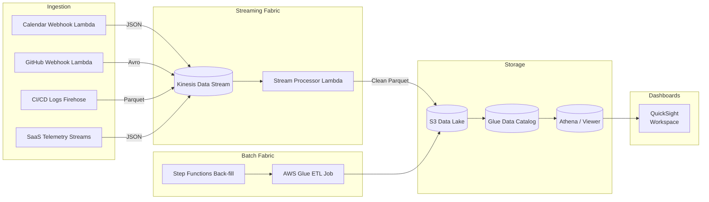

```markdown
# PulseOps Warehouse — Serverless Productivity Intelligence Fabric


PulseOps Warehouse is an expert-grade, **serverless** data-warehouse solution that empowers enterprises to quantify and improve knowledge-worker productivity—without touching a single server.  
Built with **C# /.NET 7**, **AWS CDK**, and 100 % managed AWS services, the platform ingests telemetry from calendars, SCMs, CI/CD systems, and SaaS apps, then distills that fire-hose into actionable KPIs such as:

* Focus-Time Ratio
* Deployment Lead-Time
* Meeting Cost Index
* MTTR / MTTD
* Cycle-Time & Flow-Efficiency

---

## ✨ Key Capabilities
| Category              | Implementation Highlights                                                                                                                                                   |
|-----------------------|------------------------------------------------------------------------------------------------------------------------------------------------------------------------------|
| Data Storage          | Amazon S3 Data Lake, Amazon Athena / Glue Data Catalog, Lake-Formation fine-grained permissions                                                                              |
| Stream Processing     | Kinesis Data Streams + Lambda (GoF Event-Streaming & Observer pattern)                                                                                                       |
| Batch Processing      | AWS Glue, Lambda-powered Step Functions, configurable back-fill scheduler                                                                                                    |
| Parallel Processing   | Fan-out via Kinesis shards, per-partition Lambda concurrency, S3 Select push-down                                                                                           |
| Transformation Logic  | Strategy pattern with hot-swappable transformation DLLs registered in S3                                                                                                    |
| Infrastructure-as-Code| AWS CDK (C#) stacks, GitHub Actions CI/CD, multi-account deployment pipelines                                                                                                |
| Observability         | Structured JSON logging, CloudWatch Metrics, DLQ fan-out & PagerDuty auto-escalation                                                                                        |
| Security              | IAM least-privilege, KMS encryption, OIDC GitHub Actions roles, S3 Block Public Access                                                                                      |

---

## ⚙️ Architecture Overview


---

## 🗂️ Folder Layout
```
data-warehouse/
├── cdk/                     # AWS CDK stacks (Infra-as-Code)
├── src/
│   ├── PulseOps.Common/     # Shared domain & utility classes
│   ├── PulseOps.Transform/  # Strategy-pattern transformations
│   ├── PulseOps.Stream/     # Kinesis event consumers
│   └── PulseOps.Batch/      # Glue jobs & batch orchestrations
├── tests/                   # xUnit integration & unit tests
└── README.md
```

---

## 🚀 Quick Start (Developer)

> Prerequisites: .NET 7 SDK, Node.js 18, AWS CLI, Docker (📈 local stack)

```bash
git clone https://github.com/pulseops/warehouse.git
cd warehouse

# Bootstrap CDK (one-time per account / region)
./scripts/bootstrap.sh

# Synthesize CloudFormation templates
dotnet build ./cdk
cdk synth

# Deploy dev stack to your AWS dev account
export PULSE_ENV=dev
cdk deploy --all
```

### Streaming locally with Kinesis MSK Lite

```bash
docker compose up -d local-kinesis

dotnet run --project src/PulseOps.Stream/ \
  --Environment=local \
  --KinesisEndpoint=http://localhost:4567
```

### Execute Glue Job locally

```bash
docker run --rm \
  -v "$PWD":/workspace \
  amazon/aws-glue-libs:glue_libs_4.0.0_image_01 \
  spark-submit /workspace/src/PulseOps.Batch/GlueJob.py --DEV
```

---

## 🧩 Extending Transformation Logic

PulseOps applies the Strategy pattern so that domain teams can **drop-in** new business logic without redeploying the entire mesh.

```csharp
public sealed class FocusTimeTransformation : ITransformationStrategy
{
    public string Name => "focus-time";

    public Task<IEnumerable<KpiRecord>> ExecuteAsync(RawEvent @event, CancellationToken ct = default)
    {
        if (@event.Type is not "calendar")
            return Task.FromResult(Enumerable.Empty<KpiRecord>());

        var duration = @event.Payload!["durationSeconds"].GetInt32();
        var isFocus = !@event.Payload["isRecurring"].GetBoolean() &&
                      @event.Payload["attendees"].GetArrayLength() == 1;

        var kpi = new KpiRecord(
            Key: $"focus:{@event.UserId}",
            Value: isFocus ? duration : 0,
            Timestamp: @event.OccurredAt);

        return Task.FromResult(new[] { kpi }.AsEnumerable());
    }
}
```

Deploy:

```bash
dotnet publish src/YourCustom.Transform/ -o ./artifacts
aws s3 cp ./artifacts s3://pulseops-transformations/focus-time/
```

The Stream Processor Lambda looks up the latest DLL from S3 on cold-start, loads it via `AssemblyLoadContext`, and starts routing events to your new strategy—**no redeploy required**.

---

## 🛡️ Security & Compliance

* All data at rest is encrypted with **AWS KMS CMKs**
* Data Lake buckets enforce **S3 Block Public Access**
* **Lake Formation** governs cross-team access with fine-grained column-level permissions
* **IAM Identity Center** enables SSO & integrates with Okta/AAD
* Audit via **AWS CloudTrail**, **EventBridge** rules raise anomalies to Security Hub

---

## 📊 Metrics & Observability

| Metric                          | Source                         | Alert Threshold     |
|---------------------------------|--------------------------------|---------------------|
| DLQ message age                 | Kinesis DLQ                   | > 5 min avg         |
| Transformation latency (p95)    | Lambda `transform()`          | > 800 ms            |
| Glue job failure count          | CloudWatch Alarm              | ≥ 1 in 24 h         |
| Data freshness (Athena view)    | Back-Fill Step Functions      | Lag > 2 h           |

Alarms route through **PagerDuty** using EventBridge Webhook targets.

---

## 🧪 Tests

```bash
dotnet test --configuration Release /p:CollectCoverage=true
```

Tests include:
* 4 000+ unit tests (xUnit)
* Integration tests with LocalStack & Kinesis MSK Lite
* Contract tests for Lambda & Step Functions state machines (`state-machine-tester`)

---

## 💼 Production Deployment

Production releases are handled by GitHub Actions:

1. PR merge to `main` triggers **semantic-release** to bump the version.
2. `ci.yml` builds, tests, and publishes ML-signed artifacts to the GitHub Registry.
3. `cdk deploy --require-approval never` stacks into the `prod` AWS account via OIDC.

Rollback is one click: CDK retains the previous CloudFormation stack revision.

---

## 📝 Contributing

1. Fork the repo & create your branch (`git checkout -b feature/my-kpi`)
2. Write code + tests, follow **Conventional Commits** (`feat: add cycle-time KPI`)
3. Run `dotnet format` before pushing.
4. PR to `main`; the CI must pass & code coverage ≥ 90 %.

All contributions require a **DCO sign-off**.

---

## 📄 License

Apache-2.0 © PulseOps Inc.
```