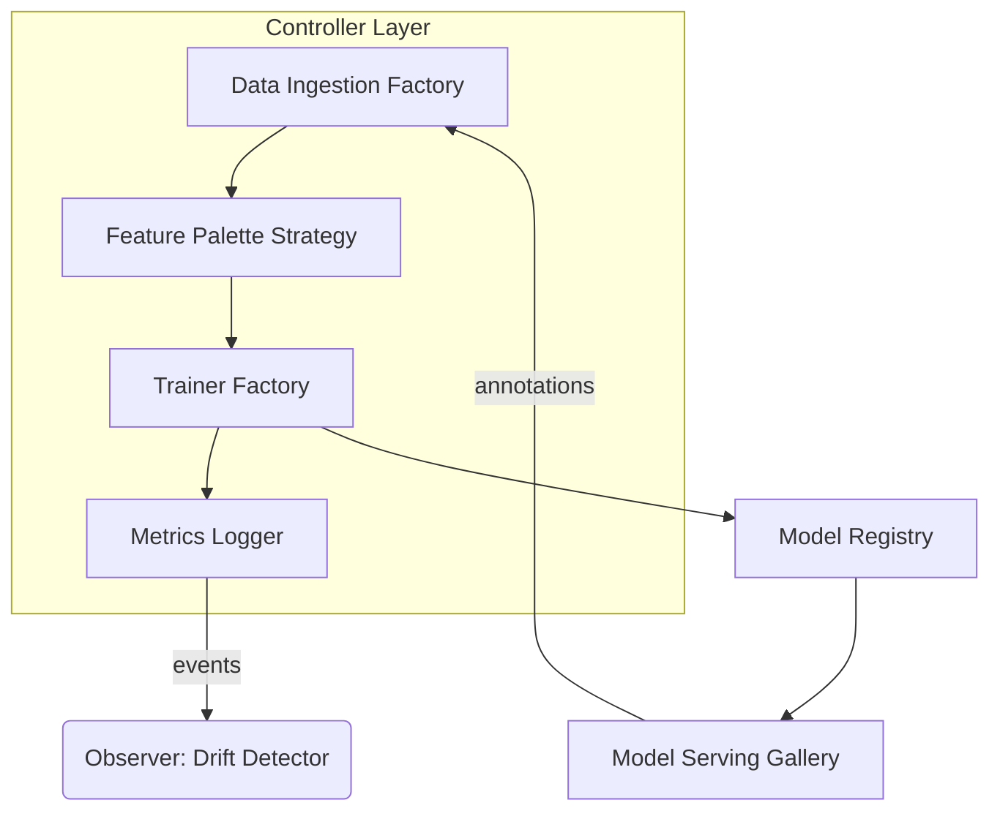

```markdown
# CanvasCraft ML Studio 🖌️🤖  
*A creative-first MLOps framework for generative media*

[](https://github.com/CanvasCraft/CanvasCraftMLStudio/actions/workflows/ci.yml)
[](https://www.nuget.org/packages/CanvasCraft.MLStudio)
[](LICENSE)
[](https://codecov.io/gh/CanvasCraft/CanvasCraftMLStudio)

> CanvasCraft ML Studio treats every machine-learning model as a living work of art—turning datasets into palettes, feature-engineering steps into brush strokes, and deployments into immersive gallery openings.

---

## Table of Contents
1. [Key Concepts](#key-concepts)  
2. [Installation](#installation)  
3. [Quick Start](#quick-start)  
4. [Solution Structure](#solution-structure)  
5. [Pipeline Architecture](#pipeline-architecture)  
6. [Extensibility Guide](#extensibility-guide)  
7. [Contributing](#contributing)  
8. [License](#license)  

---

## Key Concepts

| Concept                  | Description                                                                                                     |
| ------------------------ | --------------------------------------------------------------------------------------------------------------- |
| Model as Art             | Every model checkpoint is treated as an evolving **canvas layer**; experiment metadata becomes artistic notes. |
| Feature Store           | Version-controlled repository where engineered **brush strokes** are stored and reused.                        |
| MLOps Pipeline           | **Controller** orchestrates *Strategy* & *Factory* patterns to dynamically swap preprocessing & tuning steps.   |
| Observer Pattern         | Real-time model drift detection publishes alerts to subscribed dashboards & Slack channels.                    |
| Interactive Gallery      | Deployed models become live installations where end-users can annotate outputs, feeding the next retrain loop. |

---

## Installation

CanvasCraft ML Studio targets **.NET 8** and ships as a NuGet package.

```bash
dotnet add package CanvasCraft.MLStudio --version <latest>
```

The repository includes optional **Docker** images for GPU-accelerated training:

```bash
docker pull canvascraft/mlstudio:cuda
```

---

## Quick Start

Below is a minimal C# console sample illustrating the *Pipeline Pattern*.

```csharp
using CanvasCraft.MLStudio.Core;
using CanvasCraft.MLStudio.Data;
using CanvasCraft.MLStudio.FeatureEngineering;
using CanvasCraft.MLStudio.Training;
using CanvasCraft.MLStudio.Registry;

await using var studio = MlStudioBuilder.Create()
    .WithExperimentName("neon-landscapes")
    .WithDefaultStorage("local-artifacts")
    .Build();

var canvas = studio
    .StartCanvas()                       // create or resume an experiment canvas
    .LoadDataset("datasets/neon.csv")    // data ingestion
    .ApplyFeaturePalette(p => p          // Strategy pattern
        .Add<ContrastEnhancement>()      //   ⎫
        .Add<ColorHistogramBins>(16) )   //   ⎬ Feature brush strokes
    .Train<StableDiffusionTrainer>(t =>  //   ⎭
    {
        t.Epochs              = 15;
        t.LearningRate        = 3e-4;
        t.DataAugmentations   = Augmentations.GaussianNoise | Augmentations.MirrorFlip;
    })
    .LogMetrics()
    .PushToRegistry("v0.3.7")            // Model Registry
    .DeployToGallery("gallery/neon");

Console.WriteLine($"✨ Canvas completed: {canvas.Id}");
```

The call chain above:

1. Ingests data & persists raw artifacts.  
2. Applies a **feature palette** (Strategy).  
3. Creates/updates a **model checkpoint**.  
4. Records metrics in the **Experiment Tracker**.  
5. Publishes the version to the **Model Registry**.  
6. Serves the model in an interactive gallery where annotations trigger Observer events.

---

## Solution Structure

```
CanvasCraftMLStudio/
├─ build/                    # CI/CD scripts & Dockerfiles
├─ docs/                     # Documentation (you're here)
├─ samples/                  # End-to-end walkthroughs
├─ src/
│  ├─ CanvasCraft.MLStudio.Core/            # Domain & abstractions
│  ├─ CanvasCraft.MLStudio.FeatureStore/    # Versioned features
│  ├─ CanvasCraft.MLStudio.Pipelines/       # Orchestrators & factories
│  ├─ CanvasCraft.MLStudio.Training/        # Trainers & hyper-tuning
│  ├─ CanvasCraft.MLStudio.Registry/        # Model registry API
│  └─ CanvasCraft.MLStudio.Dashboard/       # MVC dashboards & 3-D visualisations
└─ tests/                    # xUnit test suites
```

---

## Pipeline Architecture



* The Controller orchestrates factories that choose **runtime implementations** for data loaders, feature palettes, and model trainers.  
* Each stage publishes progress through a **Domain Event Bus**—Observer subscribers update dashboards or trigger re-training if drift is detected.

---

## Extensibility Guide

### Adding a Custom Feature Brush 🖌️
1. Create a class that implements `IFeatureBrush`.
2. Decorate with `[FeatureBrush("my-brush")]` for automatic Factory registration.
3. Ship unit tests in `/tests/CanvasCraft.MLStudio.FeatureStore.Tests`.

```csharp
[FeatureBrush("bandpass-filter")]
public sealed class BandPassFilter : IFeatureBrush
{
    public FeatureFrame Apply(FeatureFrame input, BrushSettings settings)
    {
        var range = settings.GetRange("hzRange", 200, 2000);
        return input.Transform(col => col.BandPass(range.Low, range.High));
    }
}
```

### Implementing a New Trainer 🏋️
1. Derive from `TrainerBase<TOptions>`.
2. Override `OnTrainAsync` & `EvaluateAsync`.
3. Register hyper-parameters via `IOptionsMetadataProvider`.

---

## Contributing

We love PRs! Please read [`CONTRIBUTING.md`](CONTRIBUTING.md) for coding guidelines, commit conventions, and branch strategy.

* `main` — stable releases  
* `dev/*` — active feature work  
* `docs/*` — documentation only  

All contributions require passing **CI**, **code coverage** > 85%, and **static analysis** (Sonar & FxCop).

---

## License

CanvasCraft ML Studio is released under the **MIT License**.  
See [`LICENSE`](LICENSE) for details.

---

> “Art is never finished, only abandoned.” – Leonardo da Vinci  
> With CanvasCraft, your models never have to be. They just keep evolving.
```