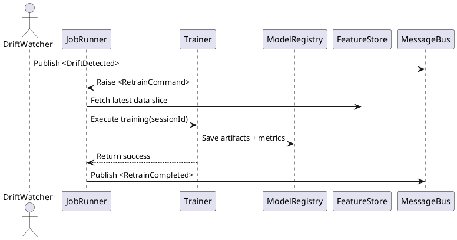

```markdown
# CanvasCraft ML Studio – C4 Architecture Model  
> File: `CanvasCraftMLStudio/docs/architecture/c4-model.md`  
> Revision: 1.0   |   Status: Living Document   |   Last Updated: <!--DATE_GENERATED-->

CanvasCraft ML Studio (a.k.a. **`ml_training`**) is an MVC–driven, end-to-end MLOps workbench that lets creative professionals “paint” with data.  
This document describes the system using the [C4 model](https://c4model.com/) (Context, Container, Component, Code) to give all stakeholders—artists, data scientists, and dev-ops engineers—a shared mental model of **how the pieces fit together**.

---

## 0. Conventions

* Diagrams are expressed in [PlantUML] with the [`C4-PlantUML`](https://github.com/plantuml-stdlib/C4-PlantUML) extension.  
* To render locally:  
  ```bash
  docker run --rm -v $(pwd):/workspace plantuml/plantuml -o ./out ./docs/architecture/*.puml
  ```
* Arrows follow **C4 guidelines** (→ for synchronous, ↔ for bidirectional, … for async).

---

## 1. System Context

```plantuml
@startuml CanvasCraft_Context
!includeurl https://raw.githubusercontent.com/plantuml-stdlib/C4-PlantUML/master/C4_Context.puml
LAYOUT_TOP_DOWN()

Person(artist, "Creative Professional", "Uses the studio to craft generative media")
Person(dataScientist, "Data Scientist", "Prepares data, trains, and evaluates models")
Person(ops, "MLOps Engineer", "Automates pipeline & infra")
System_Boundary(canvasCraft, "CanvasCraft ML Studio") {
  System_Ext(modelGallery, "Interactive Model Gallery", "Publishes real-time model outputs to end-users")
  System_Ext(notificationSvc, "Notification Service", "Sends drift alerts via email / Slack")
  System(canvas, "CanvasCraft ML Studio", "MVC-driven MLOps workbench")
}

artist  --> canvas  : Explore / iterate on models, remix datasets  
dataScientist --> canvas : Train & evaluate models  
ops        --> canvas : Configure CI/CD & infra  
canvas --> modelGallery : Deploy models / publish inference API  
canvas --> notificationSvc : Push monitoring alerts  
@enduml
```

---

## 2. Container Diagram

```plantuml
@startuml CanvasCraft_Containers
!includeurl https://raw.githubusercontent.com/plantuml-stdlib/C4-PlantUML/master/C4_Container.puml
LAYOUT_WITH_LEGEND()
System_Boundary(canvasCraft, "CanvasCraft ML Studio") {

  Container(WebApp, "MVC Web App", "ASP.NET Core", "UI dashboards, asset hub, and REST interface")
  Container(PipelineSvc, "Pipeline Orchestrator", "Worker Service (.NET BackgroundService)", "Implements the MLOps pipeline pattern")
  Container(FeatureStore, "Feature Store", "Azure SQL / PostgreSQL", "Versioned features, statistics")
  Container(ModelRegistry, "Model Registry", "Blob Storage + Metadata Index", "Versioned model checkpoints & lineage")
  Container(MessageBus, "Event Bus", "Azure Service Bus / RabbitMQ", "Reactive glue (Observer)")
  ContainerAuth(AuthSvc, "Identity Service", "Azure AD / Auth0", "SSO, OAuth2")

  WebApp  --> AuthSvc : AuthN/AuthZ  
  WebApp  --> PipelineSvc : REST # Training job requests  
  PipelineSvc --> FeatureStore : Read/Write features  
  PipelineSvc --> ModelRegistry : Save/Load model artifacts  
  PipelineSvc ..> MessageBus : Publish drift & metric events  
  MessageBus --> WebApp : Notify UI dashboards  
  PipelineSvc --> MessageBus : ↔ async triggers (retraining)  
}
@enduml
```

---

## 3. Component Diagram – Pipeline Orchestrator

Focus on the **`PipelineSvc`** container.

```plantuml
@startuml Pipeline_Components
!includeurl https://raw.githubusercontent.com/plantuml-stdlib/C4-PlantUML/master/C4_Component.puml
LAYOUT_WITH_LEGEND()
Container(PipelineSvc, "Pipeline Orchestrator")

Component(Ingestion,   "Data Ingestion Strategy", ".NET Class Library", "Loads data from diverse sources")
Component(PrepFactory, "Preprocessing Factory", ".NET Class Library", "Creates preprocessing pipelines (brushes)")
Component(FeatureEng,  "Feature Engineering Palette", ".NET Class Library", "Transforms raw data → engineered features")
Component(Trainer,     "Model Trainer", ".NET Class Library", "Executes hyperparameter tuning & training loops")
Component(Evaluator,   "Model Evaluator", ".NET Class Library", "Computes metrics, visualizations")
Component(Watcher,     "Drift Watcher (Observer)", ".NET Class Library", "Monitors live data & model drift")
Component(JobRunner,   "Pipeline Runner", ".NET Class Library", "Coordinates steps via Strategy Pattern")

PipelineSvc --> JobRunner
JobRunner  --> Ingestion
JobRunner  --> PrepFactory
JobRunner  --> FeatureEng
JobRunner  --> Trainer
JobRunner  --> Evaluator
JobRunner  --> Watcher
@enduml
```

### Key Design Patterns

* **Strategy** – Multiple `IPreprocessingBrush` implementations selected at runtime.  
* **Factory** – `BrushFactory` produces concrete preprocessing brushes.  
* **Observer** – `DriftWatcher` subscribes to metric streams and fires alerts.  
* **Pipeline Pattern** – `PipelineRunner` stages execute in sequence with back-pressure & checkpoints.  

---

## 4. Component Interfaces (C#)

The snippet below shows the critical contracts referenced above.

```csharp
namespace CanvasCraft.ML.Pipeline.Abstractions;

/// <summary>
/// A disposable unit of work that represents a step in the MLOps pipeline.
/// </summary>
public interface IPipelineStep : IAsyncDisposable
{
    string Name { get; }

    /// <summary>
    /// Executes the step asynchronously. 
    /// A <see cref="CancellationToken"/> allows graceful shutdown.
    /// </summary>
    Task<PipelineContext> ExecuteAsync(PipelineContext context, CancellationToken token = default);
}

/// <summary>
/// Strategy pattern – interchangeable data-preprocessing brushes.
/// </summary>
public interface IPreprocessingBrush : IPipelineStep
{
    PreprocessingType Type { get; }
}

public interface IBrushFactory
{
    IPreprocessingBrush Create(BrushConfiguration configuration);
}

/// <summary>
/// Factory pattern – produces preprocessing brushes at runtime.
/// </summary>
public sealed class BrushFactory : IBrushFactory
{
    private readonly IServiceProvider _sp;

    public BrushFactory(IServiceProvider sp) => _sp = sp;

    public IPreprocessingBrush Create(BrushConfiguration cfg)
    {
        return cfg.Type switch
        {
            PreprocessingType.Normalization
                => ActivatorUtilities.CreateInstance<NormalizationBrush>(_sp, cfg),
            PreprocessingType.Augmentation
                => ActivatorUtilities.CreateInstance<AugmentationBrush>(_sp, cfg),
            _ => throw new NotSupportedException($"Brush '{cfg.Type}' is not supported.")
        };
    }
}

/// <summary>
/// Observer pattern – watches metrics and publishes drift alerts via the event bus.
/// </summary>
public interface IDriftWatcher
{
    IAsyncEnumerable<ModelDriftEvent> WatchAsync(ModelVersion model, CancellationToken token);
}
```

---

## 5. Sequence – Retraining Triggered by Drift



---

## 6. Quality Attributes

* **Scalability** – Orchestrator steps run in containers; heavy compute offloaded to GPU nodes.  
* **Modifiability** – Strategy & Factory patterns isolate algorithm swaps.  
* **Observability** – OpenTelemetry instrumentation, Prometheus metrics, structured logs.  
* **Security** – OAuth2 / OpenID Connect, scoped API tokens, at-rest encryption of artifacts.  

---

## 7. Mapping Code → Deployment

Container | Technology            | Runtime
--------- | --------------------- | -------------
`WebApp`  | ASP.NET Core MVC      | .NET 8 (Linux)
`PipelineSvc` | Worker Service + Micro-batch tasks | .NET 8 (Linux), GPU-enabled
`FeatureStore` | Azure SQL / PostgreSQL | PaaS
`ModelRegistry` | Azure Blob Storage, Cosmos DB index | PaaS
`MessageBus` | Azure Service Bus | PaaS
`AuthSvc` | Azure AD / Auth0 | SaaS

---

## 8. Decision Log (excerpt)

| # | Date | Decision | Rationale |
|---|------|----------|-----------|
| 8 | 2024-05-03 | Use **Strategy** for preprocessing | Enables plug-in of new artistic “brushes” w/out changing orchestration code |
| 13| 2024-05-12 | Store raw + engineered data in **Feature Store** | Reproducibility for creative iterations |
| 21| 2024-05-18 | Adopt **C4-PlantUML** | Single source of truth for diagrams, git-friendly |

---

## 9. How to Contribute

1. Fork & clone repository  
2. Update diagrams under `docs/architecture/*.puml`  
3. Run `./build-docs.ps1` (PowerShell) or `make docs` (Linux/Mac)  
4. Submit Pull Request referencing ticket  

---

© CanvasCraft ML Studio — Creative Commons Attribution-NoDerivatives 4.0  
```