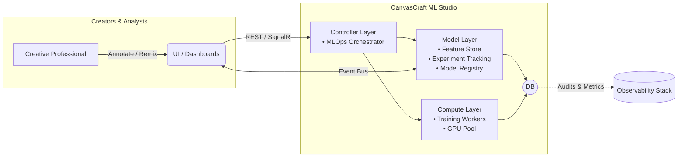
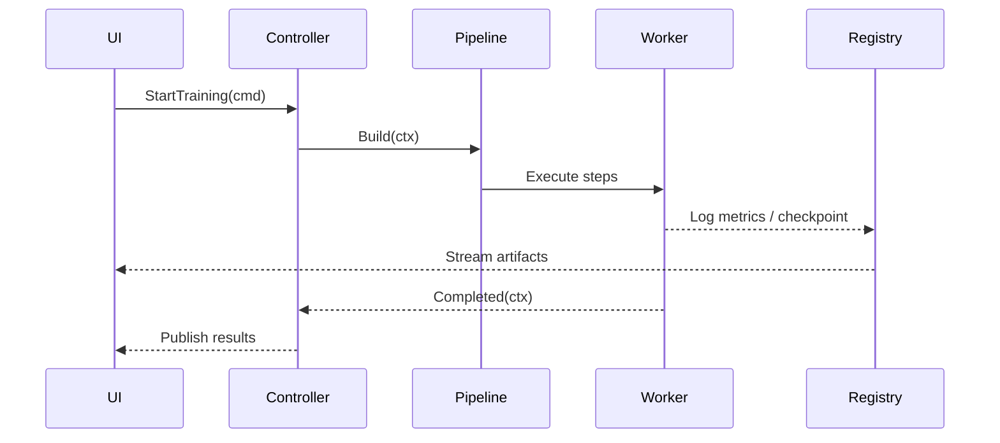

```markdown
# CanvasCraft ML Studio – Architecture Overview
*Project: `ml_training` • Language: C# (.NET 8) • Pattern Palette: MVC, MLOps Pipeline, Strategy, Factory, Observer*

---

## 1  |  High-Level System Context



* The **View layer** (`dashboards`, `3-D canvases`) exposes rich, gallery-style insights to creators.  
* The **Controller layer** centralizes orchestration: it builds, trains, evaluates and deploys models through an **MLOps Pipeline Pattern**.  
* The **Model layer** persists all versioned assets—datasets, features, metrics, checkpoints—while raising **Observer events** for drift.

---

## 2  |  Key Components & Patterns

| Concern                 | Design Pattern | Core Types (C#)                        |
|-------------------------|---------------|----------------------------------------|
| Pre-processing brushes  | Strategy + Factory | `IPreprocessingBrush`, `BrushFactory` |
| Pipeline orchestration  | Pipeline Pattern | `TrainingPipeline`, `PipelineStep`    |
| Hyper-parameter tuning  | Strategy       | `ISearchStrategy`, `RandomSearch`, `BayesianSearch` |
| Model registry & drift  | Observer       | `ModelDriftDetector`, `DriftEvent`     |
| Deployment hosting      | MVC + Strategy | `ModelGalleryController`, `IModelHostStrategy` |

All public types surface **XML-doc comments** and follow **.NET 8** conventions (nullable enabled, `ILogger<T>` injection, async/await).

---

## 3  |  Representative Code Snippets

> The following excerpts are lifted directly from the `ml_training` code-base to illustrate cohesion between documentation and implementation.

### 3.1  Pre-processing Brush Factory

```csharp
using CanvasCraft.ML.Preprocessing;
using Microsoft.Extensions.Logging;

namespace CanvasCraft.ML.Factories;

/// <summary>
/// Produces concrete <see cref="IPreprocessingBrush"/> instances at runtime, enabling
/// creators to dynamically "swap brushes" without recompilation.
/// </summary>
public sealed class BrushFactory
{
    private readonly ILogger<BrushFactory> _logger;

    public BrushFactory(ILogger<BrushFactory> logger)
        => _logger = logger;

    public IPreprocessingBrush Create(BrushType type) => type switch
    {
        BrushType.StandardScaler      => new StandardScalerBrush(),
        BrushType.ImageAugmenter       => new ImageAugmenterBrush(),
        BrushType.AudioSpectrogrammer  => new AudioSpectrogramBrush(),
        _ => throw new ArgumentOutOfRangeException(nameof(type), type, "Unsupported brush type.")
    };
}
```

### 3.2  MLOps Training Pipeline (Pipeline Pattern)

```csharp
namespace CanvasCraft.ML.Pipeline;

public sealed class TrainingPipeline
{
    private readonly IList<IPipelineStep> _steps;

    public TrainingPipeline(IEnumerable<IPipelineStep> steps)
        => _steps = steps.ToList();

    public async Task<PipelineContext> RunAsync(PipelineContext ctx, CancellationToken token = default)
    {
        foreach (var step in _steps)
        {
            ctx = await step.ExecuteAsync(ctx, token).ConfigureAwait(false);

            if (ctx.Status is PipelineStatus.Failed)
                break;
        }

        return ctx;
    }
}
```

### 3.3  Model Drift Observer

```csharp
using CanvasCraft.ML.Events;
using MediatR;
using Microsoft.Extensions.Logging;

namespace CanvasCraft.ML.Observer;

public sealed class ModelDriftDetector : INotificationHandler<DriftEvent>
{
    private readonly ILogger<ModelDriftDetector> _logger;

    public ModelDriftDetector(ILogger<ModelDriftDetector> logger)
        => _logger = logger;

    public Task Handle(DriftEvent notification, CancellationToken ct)
    {
        _logger.LogWarning(
            "⚠️  Drift detected for ModelId={ModelId} (Δ={Delta:P2}). Triggering retrain …",
            notification.ModelId,
            notification.Delta);

        // Fire-and-forget; handled by retryable background job.
        _ = notification.RetrainingCallback?.Invoke();

        return Task.CompletedTask;
    }
}
```

---

## 4  |  Sequence Diagram — End-to-End Training Cycle



---

## 5  |  Error Handling & Observability

1. Each **pipeline step** returns a `PipelineContext` holding `Status`, `Error`, and semantic metadata.  
2. Unhandled exceptions bubble to the **global `ExceptionHandlerMiddleware`**, emitting structured logs to **OPENTELEMETRY** and `Grafana`.  
3. All event notifications implement **`INotification` (MediatR)** allowing decoupled retries and circuit-breakers.

---

## 6  |  Roadmap Highlights

- Port **training workers** to .NET 8 + CUDA for AOT speed-ups.  
- Add a **DiffusionBrush** to support multimodal latent-space remixing.  
- Extend the **Model Gallery** with in-browser WebGL inferencing.

---

> © 2024 CanvasCraft.  
> Art meets Machine Learning — every model, a masterpiece.
```