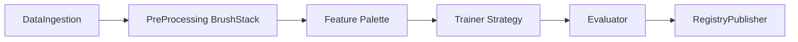
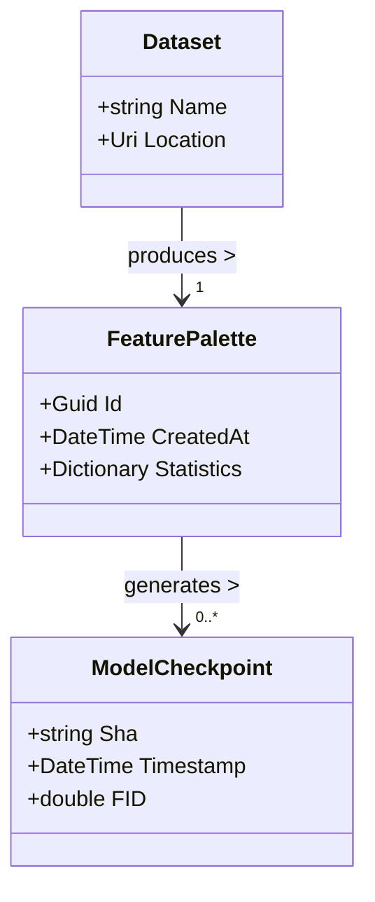

```markdown
---
title: CanvasCraft ML Studio – Developer Guide
description: A practical, code-centric guide for extending and maintaining the CanvasCraft ML Studio (ml_training) MVC solution.
lastUpdated: 2024-03-03
---

> “Every model is a living canvas—code is the brush.” 
> – CanvasCraft Engineering Manifesto

# Table of Contents
1. [Project Overview](#project-overview)  
2. [Getting Started](#getting-started)  
3. [Solution Layout](#solution-layout)  
4. [Architectural Patterns](#architectural-patterns)  
5. [Pipeline Runtime Walkthrough](#pipeline-runtime-walkthrough)  
6. [Extensibility Points](#extensibility-points)  
7. [Adding a Custom Pre-Processing Brush](#adding-a-custom-pre-processing-brush)  
8. [Unit & Integration Testing](#unit--integration-testing)  
9. [Observability & Monitoring](#observability--monitoring)  
10. [Troubleshooting](#troubleshooting)  
11. [Appendix A – Domain Model UML](#appendix-a--domain-model-uml)

---

## Project Overview
CanvasCraft ML Studio marries **Model–View–Controller (MVC)** with **MLOps**, enabling creative iterations on generative AI models. The *ml_training* project is responsible for the entire offline workflow:

* Ingest **datasets** (images, audio, sequences).
* Perform **feature engineering** via composable “brushes.”
* Execute **hyper-parameter tuning**.
* Log artifacts to **Experiment Tracker**, **Feature Store**, and **Model Registry**.
* Emit events to **Model Monitoring** observers.


## Getting Started
```bash
# Clone including submodules (UI & infra scripts)
git clone --recurse-submodules https://github.com/CanvasCraft/CanvasCraftMLStudio.git
cd CanvasCraftMLStudio

# Restore & build the training suite
dotnet restore
dotnet build src/CanvasCraft.ML.Training.sln -c Release

# Run the gallery dashboard locally (requires Node 18+ for the View layer)
npm --prefix ui/gallery install
npm --prefix ui/gallery run dev
```

### Prerequisites
* .NET 8 SDK
* CUDA 11.8 (if training on GPU)
* PostgreSQL 15 (Feature Store & Experiments DB)
* Redis 7.x (messaging + parameter cache)

---

## Solution Layout

```text
CanvasCraftMLStudio/
 ├── src/
 │   ├── CanvasCraft.ML.Core/           # Domain entities & contracts
 │   ├── CanvasCraft.ML.Pipeline/       # Pipeline Pattern implementation
 │   ├── CanvasCraft.ML.Runtime/        # Orchestration & DI
 │   └── CanvasCraft.ML.Tests/          # Unit & integration tests
 ├── docs/
 │   └── guides/developer-guide.md
 ├── ui/
 │   └── gallery/                       # 3-D “Gallery” front-end
 └── docker-compose.yaml                # Local infra stack
```

---

## Architectural Patterns

### 1. Pipeline Pattern
Each training run is expressed as an immutable `PipelineDefinition` (similar to Airflow DAG). The runtime compiles it into a directed execution graph.



### 2. Strategy + Factory
* **Strategy**: Swap algorithms at runtime (`ITrainerStrategy`, `IHpTunerStrategy`).
* **Factory**: Resolve concrete brushes from configuration yml via `BrushFactory`.

### 3. Observer
Real-time `MetricEvent`s notify subscribers (email, Slack, Grafana) when a model drifts.

### 4. MVC
* **Model** – Encapsulates datasets, features, and checkpoints.  
* **View** – WebGL gallery dashboards.  
* **Controller** – `TrainingController` orchestrates training sessions.

---

## Pipeline Runtime Walkthrough

```csharp
await using var runtime = new PipelineRuntime(options =>
{
    options.ExperimentName  = "orchid-remix-v3";
    options.DataSource      = new S3DataSource("s3://creative-orchids/");
    options.Device          = ComputeDevice.Gpu;
});

runtime.RegisterObserver(new DriftAlertObserver());
runtime.RegisterObserver(new SlackNotifierObserver());

var definition = PipelineDefinition.Create(builder =>
{
    builder.UseBrush<GaussianNoiseBrush>(p => p.NoiseRatio = 0.07)
           .UsePalette<RgbHistogramPalette>()
           .UseTrainer<StyleGanTrainer>()
           .UseEvaluator<FréchetInceptionEvaluator>()
           .PublishToRegistry(tag: "latest");
});

await runtime.ExecuteAsync(definition, CancellationToken.None);
```

Execution flow:
1. PipelineRuntime resolves dependencies through **Microsoft.Extensions.DependencyInjection**.
2. Each stage is wrapped in a **TelemetryScope** emitting structured logs + traces.
3. Exceptions are bubbled into the **ErrorChannel** for unified handling.

---

## Extensibility Points

| Extension | Interface | Typical Use-Case |
|-----------|-----------|------------------|
| Brush     | `IPreProcessingBrush` | Noise injection, color jitter |
| Palette   | `IFeaturePalette`     | Spectrogram extraction        |
| Tuner     | `IHpTunerStrategy`    | Optuna vs. Hyperband          |
| Trainer   | `ITrainerStrategy`    | GAN, Diffusion, RNN           |
| Observer  | `IPipelineObserver`   | Slack alert, Prometheus push  |

Dependency injection is configured in **`Startup.cs`**:

```csharp
services.Scan(scan => scan
    .FromAssemblyOf<IPreProcessingBrush>()
    .AddClasses(c => c.AssignableTo<IPreProcessingBrush>())
    .AsImplementedInterfaces()
    .WithSingletonLifetime());
```

---

## Adding a Custom Pre-Processing Brush

### 1. Create the Brush

```csharp
using CanvasCraft.ML.Core.Contracts;
using SixLabors.ImageSharp;
using SixLabors.ImageSharp.Processing;

namespace CanvasCraft.ML.Brushes;

/// <summary>
/// Applies a watercolor-style blur to soften edges.
/// </summary>
public sealed class WatercolorBrush : IPreProcessingBrush
{
    public string Name => "watercolor";

    [Range(0.0, 10.0)]
    public double Radius { get; init; } = 2.5;

    public Task<Image<Rgba32>> ApplyAsync(
        Image<Rgba32> image,
        BrushContext context,
        CancellationToken token = default)
    {
        if (image is null) throw new ArgumentNullException(nameof(image));

        image.Mutate(x => x.GaussianBlur((float)Radius));
        return Task.FromResult(image);
    }
}
```

### 2. Unit Test It

```csharp
public class WatercolorBrushTests
{
    [Fact]
    public async Task ApplyAsync_ShouldBlurImage()
    {
        // arrange
        var brush  = new WatercolorBrush { Radius = 5 };
        await using var source = await TestImageFactory.LoadAsync("orchid.png");

        // act
        await brush.ApplyAsync(source, BrushContext.Empty);

        // assert
        Assert.True(source.Metadata.GetBlurMetric() > 0.7);
    }
}
```

### 3. Reference in a Pipeline

```yaml
name: orchid-remix-v4
device: gpu
brushStack:
  - type: WatercolorBrush
    radius: 4.0
palette: RgbHistogramPalette
trainer: StyleGanTrainer
```

---

## Unit & Integration Testing

Run the full battery:

```bash
dotnet test src/CanvasCraft.ML.Tests --filter Category!=Slow
```

CI (GitHub Actions) matrix:

* `dotnet test` for .NET 8, Ubuntu 22.04 & Windows 2022  
* `nvidia-docker` job for GPU tests (labelled **Slow**)  
* Code Coverage enforced ≥ 85 %

---

## Observability & Monitoring

Key metrics are emitted via the `IMetricSink` abstraction.

```csharp
public record LossMetric(string Phase, double Value) : MetricBase("loss");

metricSink.Record(new LossMetric("train", loss));
```

The default sinks:

* **Prometheus** – scraped every 15 s.  
* **OpenTelemetry** – traces + structured logs (Serilog).  
* **WebSocket** – real-time View dashboards.

---

## Troubleshooting

| Symptom | Cause | Resolution |
|---------|-------|-----------|
| `CudaOutOfMemoryException` | Batch size too high | Reduce `trainer.batchSize` in config. |
| `PipelineStageTimeoutException` | Slow I/O | Check S3 bandwidth / pre-signed URL validity. |
| Metrics not visible | Prometheus pushgateway not reachable | Verify `docker-compose logs metrics`. |

---

## Appendix A – Domain Model UML



> **Need help?** Reach us at `#canvascraft-dev` on Slack or open an issue at  
> https://github.com/CanvasCraft/CanvasCraftMLStudio/issues

Happy painting! 🎨🤖
```