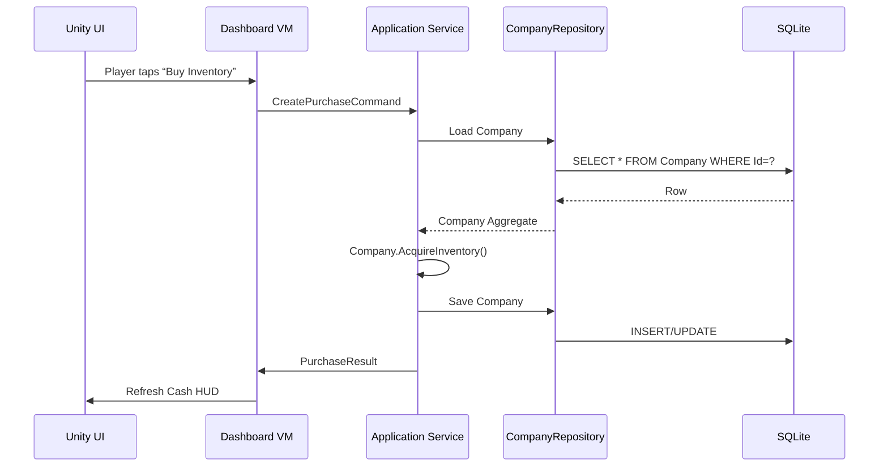

```markdown
# TycoonVerse – Technical Architecture Guide
*(Project codename: “Enterprise Empire Simulator”)*  

> Revision: **v1.2**  
> Last-Updated: **2024-05-22**  
> Maintainer: **architecture@tycoonverse.io**

---

## 1. Purpose

This document serves as the canonical description of TycoonVerse’s high-level and low-level architecture.  
It explains *how* and *why* the codebase is structured, which patterns are enforced, and where future
contributors should plug in new functionality without introducing **tech-debt** or **regression risk**.

---

## 2. Architectural Overview

```mermaid
flowchart LR
    subgraph Presentation [Unity Front-End (MVVM)]
        UI[3-D Dashboards / HUD]
        VM[View-Models (C#)]
    end
    subgraph Application [Application Layer]
        CQRS[Commands · Queries · Orchestrators]
    end
    subgraph Domain [Domain Core]
        Entities
        VOs(Value Objects)
        DomainServices
        DomainEvents
    end
    subgraph Infrastructure
        Db[(SQLite)]
        Net[API Gateway Adapter]
        Device[Platform Services\n(Biometrics · Camera · GPS)]
        Telemetry[(Analytics Sink)]
    end
    UI --> VM --> CQRS
    CQRS -->|Repository Pattern| Domain
    Domain -- DomainEvents --> CQRS
    CQRS -->|UnitOfWork| Db
    CQRS --> Net
    VM -->|Observer Pattern| Telemetry
    Device --> VM
    style Domain fill:#fffbe6,stroke:#cba600,stroke-width:2px
```

Core tenets:

1. **Strict separation of concerns** across four layers.  
2. **Domain-Driven Design (DDD)** vocabulary throughout (`Entity`, `ValueObject`, `AggregateRoot`).  
3. **Ports & Adapters** (Hexagonal) boundary between *Application* and *Infrastructure*.  
4. **Offline-first** execution path backed by deterministic event sourcing & conflict resolution.  

---

## 3. Directory Layout

```
TycoonVerse/
 ├─ Assets/                                   # Unity scenes / prefabs
 ├─ Src/
 │   ├─ TycoonVerse.Domain/                   # Entities, ValueObjects, DomainEvents
 │   ├─ TycoonVerse.Application/              # CQRS, Use-Cases, DTOs
 │   ├─ TycoonVerse.Infrastructure/           # Data, Network, Platform adapters
 │   ├─ TycoonVerse.Presentation/             # MVVM view-models & transient UI helpers
 │   └─ TycoonVerse.Tests/                    # xUnit + NUnit tests
 └─ Docs/
     └─ architecture.md                       # ← You are here
```

---

## 4. Key Patterns & Their Enforcement

| Pattern          | Rationale                                     | Enforced By                              |
|------------------|-----------------------------------------------|-----------------------------------------|
| Singleton        | Avoid duplicate platform service handles      | `Lazy<T>` + DI container (`ServiceLifeTime.Singleton`) |
| Observer         | Real-time UI refresh & analytics pipeline     | `ReactiveProperty<T>` (UniRx)           |
| Repository       | Data persistence abstraction                 | Interface in `TycoonVerse.Domain`       |
| Factory          | Dynamic creation of game objects / offers     | Static `*Factory` classes               |
| MVVM             | UI testability & designer-developer workflow  | `ViewModelBase` + Unity binding layer   |

> NOTE: **Static classes** are banned unless flagged `// [StaticAllowed]` in code review.

---

## 5. Sample Code Snippets

### 5.1 Domain Entity (simplified)

```csharp
namespace TycoonVerse.Domain.Entities
{
    /// <summary>
    /// Aggregate root representing a company owned by the player.
    /// </summary>
    public sealed class Company : IAggregateRoot
    {
        public Guid Id { get; }
        public CompanyName Name { get; private set; }
        public Money Cash { get; private set; }

        private readonly List<IDomainEvent> _domainEvents = new();

        public Company(Guid id, CompanyName name, Money seedCapital)
        {
            Id = id;
            Name = name;
            Cash = seedCapital;
        }

        public IReadOnlyCollection<IDomainEvent> DomainEvents => _domainEvents.AsReadOnly();

        public void AcquireInventory(InventoryLot lot)
        {
            if (Cash < lot.TotalCost)
                throw new InvalidOperationException("Insufficient funds.");

            Cash -= lot.TotalCost;
            _domainEvents.Add(new InventoryPurchasedEvent(Id, lot));
        }

        public void ClearDomainEvents() => _domainEvents.Clear();
    }
}
```

### 5.2 Repository Adapter (Infrastructure)

```csharp
namespace TycoonVerse.Infrastructure.Persistence
{
    internal sealed class CompanyRepository : ICompanyRepository
    {
        private readonly SQLiteAsyncConnection _db;

        public CompanyRepository(SQLiteAsyncConnection db) => _db = db;

        public async Task<Company?> GetByIdAsync(Guid id, CancellationToken ct)
        {
            var dto = await _db.Table<CompanyDto>().FirstOrDefaultAsync(x => x.Id == id);
            return dto?.ToDomain();
        }

        public async Task SaveAsync(Company aggregate, CancellationToken ct)
        {
            await _db.InsertOrReplaceAsync(CompanyDto.FromDomain(aggregate));
        }
    }
}
```

### 5.3 View-Model (MVVM + Observer)

```csharp
public sealed class CompanyDashboardViewModel : ViewModelBase
{
    private readonly ICompanyQueryService _query;
    private readonly IEventBus _bus;

    public ReactiveProperty<decimal> Cash { get; } = new();

    public CompanyDashboardViewModel(ICompanyQueryService query, IEventBus bus)
    {
        _query = query;
        _bus = bus;
        _bus.Subscribe<InventoryPurchasedEvent>(OnInventoryPurchased);
    }

    public override async Task InitializeAsync(Guid companyId, CancellationToken ct)
    {
        var dto = await _query.GetSnapshotAsync(companyId, ct);
        Cash.Value = dto.Cash;
    }

    private void OnInventoryPurchased(InventoryPurchasedEvent e) =>
        Cash.Value -= e.Lot.TotalCost.Value;
}
```

---

## 6. Sequence Diagram – *Inventory Purchase*



---

## 7. Cross-Cutting Concerns

1. **Dependency Injection**  
   *Microsoft.Extensions.DependencyInjection* bootstraps at runtime.  
   Each Unity scene receives a scoped container to avoid memory leaks.

2. **Logging & Crash Reporting**  
   *Serilog* sinks to both local file ring-buffer and *Backtrace* cloud.

3. **Analytics & A/B Testing**  
   Events are queued locally via LiteDB; flush interval = *15 s* or on scene exit.

4. **Biometric Authentication**  
   Wrapped in an `IBiometricService` adapter; falls back to PIN if unavailable.

5. **Offline Sync**  
   Domain events are appended to an *Event Store* (LiteDB).  
   A background worker replicates to server once `INetworkProbe.IsOnline == true`.

---

## 8. Error-Handling Strategy

| Layer          | Strategy                                               |
|----------------|--------------------------------------------------------|
| Domain         | Throw specific exceptions (never swallow).            |
| Application    | Map domain errors to `Result<T>` objects.             |
| Presentation   | Display user-friendly toast / dialog via `IUIService`.|
| Infrastructure | Circuit-breaker (Polly) for network & I/O retries.    |

---

## 9. Performance Targets

| Metric                     | Budget                                  |
|----------------------------|-----------------------------------------|
| Cold start (Android)       | ≤ 5 sec on Pixel 4                      |
| Frame-time (UI Scenes)     | ≤ 16 ms (60 FPS)                        |
| Save-game size             | ≤ 2 MB                                  |
| Telemetry overhead         | ≤ 2 % CPU / frame                       |

---

## 10. Extending the Game Loop

Follow these steps to introduce a new feature (ex. **Payroll**):

1. Model aggregates & events under `TycoonVerse.Domain`.  
2. Define commands/queries & handlers in `TycoonVerse.Application`.  
3. Implement repository + adapters in `Infrastructure`.  
4. Expose UI via new Scene or Prefab, bind to a fresh View-Model.  
5. Add tests at **all** levels; code coverage must not drop below **85 %**.  
6. Document the change in `CHANGELOG.md`.

---

## 11. Tooling & CI/CD

* GitHub Actions → dotnet build | test | codecov | AddressSanitizer  
* Unity Batch-mode → *Asset-bundles* & *Android AAB*  
* Fastlane → TestFlight / Google Play Internal  

---

## 12. Glossary

* **Aggregate Root** – Cluster of domain objects treated as a single unit.  
* **CQRS** – Command Query Responsibility Segregation.  
* **Value Object** – Immutable object defined solely by its data.  
* **Unit of Work** – Transactional batching of repository operations.  

---

© 2024 TycoonVerse Studios. All Rights Reserved.
```