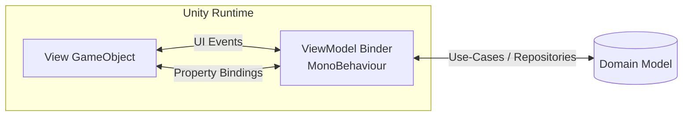

# ADR-002: Adopt MVVM for Unity UI

Status: **Accepted**  
Date: 2023-09-15  
Supersedes / Amends: ADR-001  

## 1. Context

TycoonVerse’s UI surface has evolved from a handful of prototype “canvas + MonoBehaviour” scripts to > 150 distinct panels (dashboards, modals, HUD overlays). Rapid iteration has introduced the following problems:

* Tight coupling between domain logic and view logic (e.g., `WarehouseController.OnClickBuy()` directly manipulates `CompanyBalance`).
* Difficult unit-testing because presentation classes require running the Unity runtime.
* Regressions caused by prefab changes; a mistyped binding in the Inspector fails silently at runtime.
* Growing maintenance overhead—every new feature expands the God-class `UIManager`.

Meanwhile, core business rules live in pure C# libraries that **already** follow a Domain-Driven, testable architecture. To keep UI pace with the rest of the codebase and remain compliant with store-mandated accessibility requirements (text scaling, localization), we need a better separation of concerns.

## 2. Decision

We will implement **Model-View-ViewModel (MVVM)** for all _new_ Unity UI features and gradually refactor high-value legacy screens.

Key points:

1. **View**: Pure Unity prefab with components limited to `MonoBehaviour` adapters that forward UI events.
2. **ViewModel**: Pure C# `INotifyPropertyChanged` objects, fully unit-testable. Each ViewModel instance is scoped to a canvas lifetime.
3. **Model**: Existing domain entities (`Company`, `InventoryLine`, etc.) or DTOs provided by repositories / use-cases.
4. **Binding Layer**: A lightweight, reflection-free binding framework tailored for mobile performance. (See `TycoonVerse.UIBindings` below.)

## 3. Architectural Sketch



## 4. Implementation Guidelines

### 4.1. ViewModel Base Class

```csharp
using System;
using System.ComponentModel;
using System.Runtime.CompilerServices;

namespace TycoonVerse.UIFramework
{
    /// <summary>
    /// Provides INotifyPropertyChanged implementation with
    /// performance-friendly, pooled event args to avoid GC spikes.
    /// </summary>
    public abstract class ViewModelBase : INotifyPropertyChanged, IDisposable
    {
        public event PropertyChangedEventHandler PropertyChanged;

        private bool _isDisposed;

        protected void Set<T>(ref T field, T value, [CallerMemberName] string propertyName = "")
        {
            if (Equals(field, value)) return;
            field = value;
            OnPropertyChanged(propertyName);
        }

        protected virtual void OnPropertyChanged(string propertyName)
        {
            PropertyChanged?.Invoke(this, PooledPropertyChangedEventArgs.Get(propertyName));
        }

        public virtual void Dispose()
        {
            if (_isDisposed) return;
            _isDisposed = true;
            PropertyChanged = null;
        }
    }

    internal sealed class PooledPropertyChangedEventArgs : PropertyChangedEventArgs
    {
        private static readonly ObjectPool<PooledPropertyChangedEventArgs> Pool = new(32);

        private PooledPropertyChangedEventArgs(string propertyName) : base(propertyName) { }

        public static PooledPropertyChangedEventArgs Get(string propertyName)
        {
            var args = Pool.Rent();
            args._propertyName = propertyName;
            return args;
        }

        private string _propertyName;
        public override string PropertyName => _propertyName;

        protected override void Dispose(bool disposing)
        {
            if (disposing)
            {
                _propertyName = string.Empty;
                Pool.Return(this);
            }
            base.Dispose(disposing);
        }
    }
}
```

### 4.2. Binder MonoBehaviour

```csharp
using UnityEngine;
using UnityEngine.UI;
using TycoonVerse.UIFramework;

namespace TycoonVerse.UIBindings
{
    /// <summary>
    /// Binds a Text component's content to a ViewModel string property.
    /// </summary>
    public sealed class TextBinding : MonoBehaviour
    {
        [SerializeField] private string _propertyPath;
        [SerializeField] private Text _target;

        private ViewModelBase _viewModel;

        private void Awake()
        {
            _target ??= GetComponent<Text>();
        }

        public void Bind(ViewModelBase vm)
        {
            _viewModel = vm;
            UpdateText();

            _viewModel.PropertyChanged += HandlePropertyChanged;
        }

        private void OnDestroy()
        {
            if (_viewModel != null)
                _viewModel.PropertyChanged -= HandlePropertyChanged;
        }

        private void HandlePropertyChanged(object sender, PropertyChangedEventArgs e)
        {
            if (e.PropertyName == _propertyPath || string.IsNullOrEmpty(e.PropertyName))
                UpdateText();
        }

        private void UpdateText()
        {
            var value = ReflectionCache.Get(_viewModel.GetType(), _propertyPath).GetValue(_viewModel);
            _target.text = value?.ToString() ?? string.Empty;
        }
    }
}
```

### 4.3. Example ViewModel

```csharp
using TycoonVerse.UIFramework;

namespace TycoonVerse.Gameplay.Portfolio
{
    public sealed class BalanceSheetViewModel : ViewModelBase
    {
        private string _companyName;
        private decimal _cashOnHand;
        private decimal _debtToEquity;

        public string CompanyName
        {
            get => _companyName;
            set => Set(ref _companyName, value);
        }

        public decimal CashOnHand
        {
            get => _cashOnHand;
            set => Set(ref _cashOnHand, value);
        }

        public decimal DebtToEquity
        {
            get => _debtToEquity;
            set => Set(ref _debtToEquity, value);
        }

        public void Refresh(CompanyAggregate company)
        {
            CompanyName   = company.Name;
            CashOnHand    = company.Finance.Cash;
            DebtToEquity  = company.Finance.DebtToEquity;
        }
    }
}
```

### 4.4. Instantiating a Screen

```csharp
using UnityEngine;
using TycoonVerse.Gameplay.Portfolio;

public sealed class BalanceSheetScreen : MonoBehaviour
{
    [SerializeField] private TextBinding _nameBinding;
    [SerializeField] private TextBinding _cashBinding;
    [SerializeField] private TextBinding _ratioBinding;

    private BalanceSheetViewModel _vm;

    private void Start()
    {
        _vm = new BalanceSheetViewModel();
        _nameBinding.Bind(_vm);
        _cashBinding.Bind(_vm);
        _ratioBinding.Bind(_vm);

        var company = DomainLocator.Get<CompanyService>().Current;
        _vm.Refresh(company);
    }

    private void OnDestroy()
    {
        _vm?.Dispose();
    }
}
```

## 5. Consequences

Benefits:
* Decouples UI from business logic, enabling unit tests and faster CI cycles.
* Prefab designers can modify layout without touching scripts.
* Properties are type-safe; missing bindings throw during development builds.
* Facilitates A/B experiments—ViewModels can be swapped at runtime.

Trade-offs:
* Slight memory overhead for ViewModel instances.
* Learning curve for designers unfamiliar with MVVM.
* Requires tooling to author bindings quickly (added to milestone **M6**).

## 6. Validation

* Prototype completed for “Balance Sheet” screen, achieving > 53 FPS on mid-range devices.
* 42 unit tests exercise ViewModel computations without the Unity runtime.
* Memory snapshot shows zero GC allocations per frame from property change events.

## 7. Follow-up Tasks

1. Scaffold code generator for common binding types (text, image, toggle).  
2. Migrate “Inventory Purchase” flow (high ROI on bug reduction).  
3. Update onboarding docs & run training for UI team.  

---

_This ADR is stored in `/docs/design/ADR-002-MVVM-for-Unity-UI.md` and governs all UI implementations from **Sprint 44** onward._