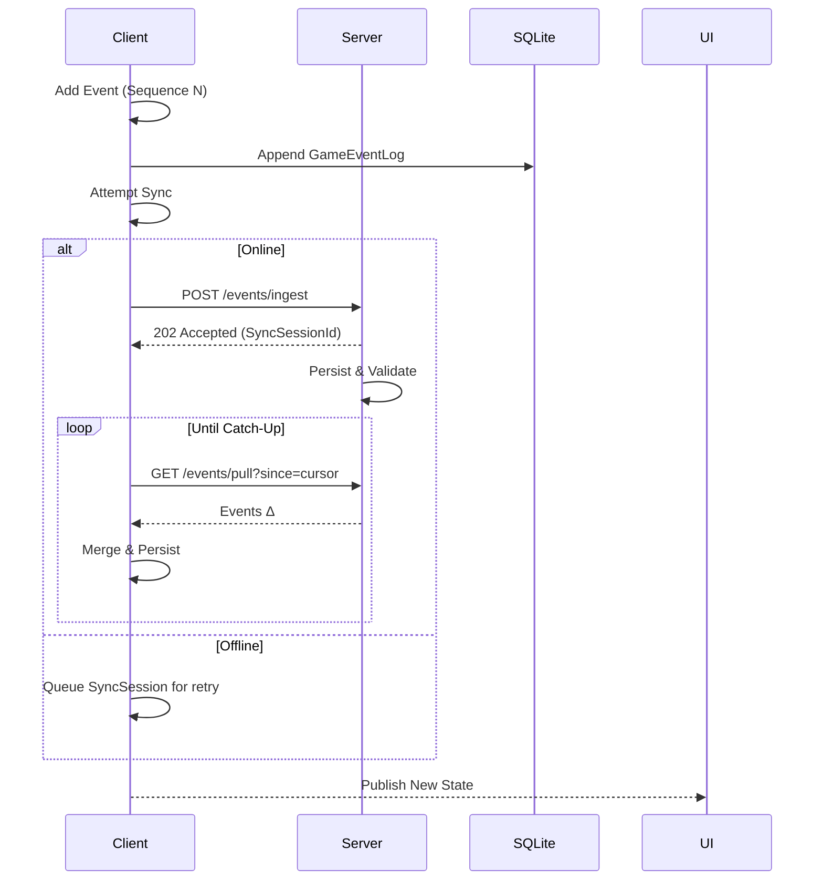

```markdown
# ADR-003: Offline Synchronization Strategy

*Status: Accepted*  
*Date: 2024-04-20*  
*Authors: Core Architecture Team*

---

## 1. Context

TycoonVerse must provide a first-class **offline experience** while preserving
authoritative, server-side game state that supports competitive leaderboards,
IAP validation, cloud saves, and live-ops events.  
Players frequently enter connectivity dead-zones (e.g., subways, planes), yet
still expect deterministic economic simulations and the ability to queue
actions (e.g., factory upgrades, IPO filings).

Key constraints:

* Mobile platforms (iOS/Android) with unpredictable network quality.
* **SQLite** on-device storage is our single source of truth while offline.
* **Unity** runs on the main thread; long-running I/O must be asynchronous.
* Conflicts must be resolved deterministically to prevent economic exploits.
* Payload size and battery consumption must remain minimal.
* GDPR/CCPA mandates that personally identifiable information (PII) never
  leaves the device unless encrypted and explicitly consented.

Previous spikes demonstrated that naïve “last-write-wins” led to inventory
duplication and negative cash balances when two devices were used concurrently.

## 2. Decision

We will implement a **Client-Side Event Sourcing** model paired with a
**CRDT-inspired merge** algorithm. The strategy combines:

1. **Event Store (Local)**  
   * Append-only SQLite table `GameEventLog` captures every domain event with
     metadata (`PlayerId`, `Sequence`, `VectorClock`, `Checksum`).
2. **Snapshot Cache (Local)**  
   * Periodic materialized views of the domain state reduce boot-time replay.
3. **Sync Sessions (Bidirectional)**  
   * `SyncSessionId` groups a batch of events exchanged with the server,
     allowing resume/retry on flaky networks.
4. **Conflict-free Resolution**  
   * Commutative/associative reducers (inspired by Λ-CRDTs) guarantee identical
     results regardless of merge order.
5. **Idempotent REST Endpoints**  
   * Server exposes `/events/ingest` and `/events/pull` with cursor semantics.
6. **Deterministic Roll-Forward**  
   * Server is always **source of authority**; client replays any corrected
     events after reconciliation.

### Architectural Patterns Utilized

* **Repository Pattern** — isolates SQLite implementation from domain logic.
* **Observer Pattern** — domain aggregates publish events consumed by UI.
* **Factory Pattern** — instantiates platform-specific crypto & storage drivers.
* **Singleton** — `OfflineSyncManager` coordinates sessions game-wide.
* **MVVM** — view-models react to merged state for instant UI refresh.

## 3. Rationale

* **Event sourcing** retains full audit history and supports time-travel debug.
* CRDT-style merges avoid locking or complex three-way diffs.
* Vector clocks are lightweight (single 64-bit unsigned integer per device) yet
  sufficient because TycoonVerse enforces *sequential* local event creation.
* Idempotent ingestion eliminates duplicate processing on retry.

## 4. Detailed Design

### 4.1 Sequence Flow



### 4.2 Data Model (SQLite)

```sql
CREATE TABLE IF NOT EXISTS GameEventLog (
    Id              INTEGER PRIMARY KEY AUTOINCREMENT,
    PlayerId        TEXT    NOT NULL,
    DeviceId        TEXT    NOT NULL,
    Sequence        INTEGER NOT NULL,
    VectorClock     INTEGER NOT NULL,
    EventType       TEXT    NOT NULL,
    PayloadJson     TEXT    NOT NULL,
    Checksum        TEXT    NOT NULL,
    CreatedUtc      TEXT    NOT NULL,
    SyncSessionId   TEXT    NULL,
    UNIQUE(PlayerId, DeviceId, Sequence)
);

CREATE INDEX IF NOT EXISTS IX_GameEventLog_SyncSessionId
    ON GameEventLog (SyncSessionId);
```

### 4.3 Core C# Components

```csharp
namespace TycoonVerse.Infrastructure.Sync
{
    using System;
    using System.Collections.Generic;
    using System.Net.Http;
    using System.Threading;
    using System.Threading.Tasks;
    using TycoonVerse.Domain.Events;
    using TycoonVerse.Infrastructure.Persistence;
    using TycoonVerse.Shared;

    /// <summary>
    /// Coordinates offline event capture, persistence, and eventual sync.
    /// Singleton is resolved via DI container (Lifetime.Singleton).
    /// </summary>
    public sealed class OfflineSyncManager : IOfflineSyncManager, IDisposable
    {
        private readonly IEventRepository _eventRepository;
        private readonly IHttpClientFactory _httpFactory;
        private readonly IClock _clock;
        private readonly ILogger _logger;
        private readonly CancellationTokenSource _cts = new();

        private Task? _backgroundTask;

        public OfflineSyncManager(
            IEventRepository eventRepository,
            IHttpClientFactory httpFactory,
            IClock clock,
            ILogger logger)
        {
            _eventRepository = eventRepository;
            _httpFactory     = httpFactory;
            _clock           = clock;
            _logger          = logger;
        }

        public void Start()
        {
            _backgroundTask ??= Task.Run(PumpAsync, _cts.Token);
            _logger.Information("OfflineSyncManager started.");
        }

        public async Task EnqueueAsync(DomainEvent @event, CancellationToken ct = default)
        {
            var record = EventRecord.FromDomainEvent(@event, _clock.UtcNow);
            await _eventRepository.InsertAsync(record, ct).ConfigureAwait(false);
        }

        private async Task PumpAsync()
        {
            var token = _cts.Token;

            while (!token.IsCancellationRequested)
            {
                try
                {
                    if (NetworkState.IsOnline)
                    {
                        await PushAsync(token).ConfigureAwait(false);
                        await PullAsync(token).ConfigureAwait(false);
                    }
                }
                catch (Exception ex)
                {
                    _logger.Error(ex, "Sync cycle failed.");
                }

                await Task.Delay(TimeSpan.FromSeconds(15), token).ConfigureAwait(false);
            }
        }

        private async Task PushAsync(CancellationToken ct)
        {
            IReadOnlyCollection<EventRecord> pending =
                await _eventRepository.FetchUnsentAsync(512, ct).ConfigureAwait(false);

            if (pending.Count == 0) return;

            using var client = _httpFactory.CreateClient("GameApi");
            var sessionId = Guid.NewGuid().ToString("N");

            var payload = new SyncPayload(pending, sessionId);

            HttpResponseMessage response =
                await client.PostAsJsonAsync("/events/ingest", payload, ct).ConfigureAwait(false);

            if (response.IsSuccessStatusCode)
            {
                await _eventRepository.MarkAsSentAsync(pending, sessionId, ct)
                                       .ConfigureAwait(false);

                _logger.Debug("Pushed {Count} events in session {Session}.",
                              pending.Count, sessionId);
            }
            else
            {
                _logger.Warning("Push failed (HTTP {Status}). Retrying later.",
                                 response.StatusCode);
            }
        }

        private async Task PullAsync(CancellationToken ct)
        {
            using var client = _httpFactory.CreateClient("GameApi");

            long cursor = await _eventRepository.GetLastServerSequenceAsync(ct)
                                                .ConfigureAwait(false);

            HttpResponseMessage response =
                await client.GetAsync($"/events/pull?since={cursor}", ct)
                            .ConfigureAwait(false);

            if (!response.IsSuccessStatusCode)
            {
                _logger.Warning("Pull failed (HTTP {Status}).", response.StatusCode);
                return;
            }

            var delta = await response.Content.ReadFromJsonAsync<EventDelta>(ct)
                                              .ConfigureAwait(false);

            if (delta?.Events is {Count: > 0})
            {
                await _eventRepository.UpsertServerEventsAsync(delta.Events, ct)
                                       .ConfigureAwait(false);

                DomainEvents.Raise(new ServerSyncApplied(delta.Events));

                _logger.Debug("Pulled {Count} new events from server.", delta.Events.Count);
            }
        }

        public void Dispose()
        {
            _cts.Cancel();
            _backgroundTask?.Wait(TimeSpan.FromSeconds(5));
            _cts.Dispose();
        }
    }
}
```

### 4.4 Error Handling & Telemetry

* All sync failures are logged via the **crash-reporting** layer.
* Repeated (5×) failures trip a circuit breaker; UI shows “Unable to Sync.”
* A/B tests control back-off intervals via the analytics layer.

## 5. Consequences

Positive:

* Seamless offline play; users rarely notice connectivity transitions.
* Deterministic state ensures fair competitive gameplay.
* Full audit trail simplifies cheat detection and rollback capabilities.

Negative:

* Event log may bloat; mitigation requires periodic compression.
* Increased implementation complexity versus naïve approaches.
* Requires rigorously defined event schema versioning.

## 6. Alternatives Considered

| Alternative | Why Rejected |
|-------------|--------------|
| **Last-Write-Wins** keyed by `UpdatedAt` | Prone to economic exploits where older device overwrites modern state. |
| **Operational Transformation** | Over-engineered for mostly append-only financial events. |
| **Direct SQLite Replication** | Platform limitations (iOS F_FULLFSYNC) and security constraints. |

## 7. References

* “Conflict-Free Replicated Data Types.” Shapiro et al. _SSS 2011._
* _Domain-Driven Design_ — Eric Evans.
* Internal Tech Spec `SYNC-01` for vector clock format.

---
```