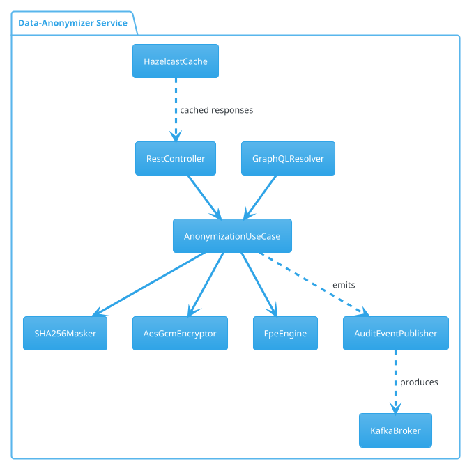

```markdown
# Data-Anonymizer Service  
_A module of **OpsForge Utility Nexus**_

[](https://github.com/opsforge/utility-nexus/actions)
[](https://app.codecov.io/gh/opsforge/utility-nexus)
[](LICENSE)

The **Data-Anonymizer Service** provides one-stop PII masking, redaction, and tokenisation capabilities that comply with GDPR, CCPA, and HIPAA while remaining fully pluggable for custom anonymization strategies. The service is exposed through both REST and GraphQL adapters and adheres to the strict hexagonal architecture employed throughout the OpsForge Utility Nexus.

---

## ✨ Features

* Field-level and record-level anonymization strategies
* Deterministic/non-deterministic tokenisation
* Built-in algorithms: SHA-256, AES-GCM, FPE (Format-Preserving Encryption)
* Stream, batch, and reactive processing modes
* Zero PII persistence — data is held only in-memory
* Fine-grained audit events via Kafka outbound port
* Response caching & rate limiting at the gateway
* Versioned API (`v1`, `v2` beta) with forward-compatibility guarantees

---

## 🏗️  Architecture Snapshot



The core domain (`anonymization`) is technology-agnostic. Adapters such as `RestController` and `GraphQLResolver` live in the `inbound` layer, whereas integrations (`KafkaBroker`, `HazelcastCache`) reside in the `outbound` layer.

---

## 🚀 Quick Start

```bash
# Clone and build
git clone https://github.com/opsforge/utility-nexus.git
cd utility-nexus/utility-services/data-anonymizer-service
./mvnw clean verify

# Run locally with default profile
./mvnw spring-boot:run
```

```properties
# application-local.yaml (excerpt)
spring:
  kafka:
    bootstrap-servers: localhost:9092
utility:
  anonymizer:
    default-strategy: SHA256
    enable-audit: true
```

---

## 🔌 REST API (`/api/v1`)

| Method | Endpoint                | Description                     |
| ------ | ----------------------- | ------------------------------- |
| POST   | `/anonymize`            | Anonymize a JSON payload        |
| GET    | `/strategies`           | List supported strategies       |
| GET    | `/health`               | Liveness & readiness composite  |

### Example Request

```bash
curl -X POST https://gateway.opsforge.io/api/v1/anonymize \
  -H "Content-Type: application/json" \
  -d '{
        "strategy": "SHA256",
        "payload": {
          "ssn": "513-32-2910",
          "email": "alice@example.com",
          "phone": "+1 (303) 555-0176"
        }
      }'
```

### Example Response

```json
{
  "strategy": "SHA256",
  "payload": {
    "ssn": "33b067dfafa5e6d27d9bec888748768517b3d29aa7dfb05d2f3438e14ae4608d",
    "email": "d5548d53d1c1bff9c99886fe3e84521dafa205b2d38198e7e5a5c9f705f5c366",
    "phone": "6cd5f33d1f7e447c0d24f8582954edfebff3c1bc94ee9d53c7df56ea2be181e9"
  },
  "meta": {
    "requestId": "b2b5bb70-5bdd-48f9-a849-12b895225b19",
    "durationMs": 17
  }
}
```

---

## 📡 GraphQL API (`/graphql`)

```graphql
type Mutation {
  anonymize(request: AnonymizeRequestInput!): AnonymizeResponse!
}

input AnonymizeRequestInput {
  strategy: Strategy!
  payload: JSON!
}

type AnonymizeResponse {
  strategy: Strategy!
  payload: JSON!
  meta: Meta!
}

enum Strategy { SHA256 AES_GCM FPE_CUSTOM }

type Meta {
  requestId: ID!
  durationMs: Int!
}
```

### Example Mutation

```graphql
mutation {
  anonymize(request: {
    strategy: AES_GCM
    payload: "{ \"email\": \"alice@example.com\" }"
  }) {
    payload
    meta { durationMs }
  }
}
```

---

## 🔒 Security & Compliance

* JWT Bearer authentication delegated from API Gateway
* Every successful anonymization publishes an `AnonymizationPerformed` event to Kafka for auditability
* In-memory shredding: byte arrays are overwritten after use
* Unit & integration tests enforce zero-PII persistence via containerised S3 + PostgreSQL test beds

---

## 🛠️   Extending Anonymization Strategies

```java
package io.opsforge.anonymizer.domain.strategy;

/**
 * A deterministic alphabet-only masking strategy.
 */
public final class AlphaMaskStrategy implements AnonymizationStrategy {

    @Override
    public MaskedValue anonymize(RawValue rawValue, AnonymizationConfig config) {
        final String masked = rawValue.asString()
                                      .chars()
                                      .mapToObj(c -> Character.isAlphabetic(c) ? "X" : String.valueOf((char) c))
                                      .collect(Collectors.joining());
        return MaskedValue.of(masked);
    }

    @Override
    public StrategyId id() {
        return StrategyId.of("ALPHA_MASK");
    }
}
```

1. Implement `AnonymizationStrategy`.
2. Register via Spring `@Component` or Java `ServiceLoader`.
3. Add documentation and tests — pull requests without tests will not be merged.

---

## 🧪  Testing Matrix

| Layer            | Technology        | Test Framework | Coverage Target |
| ---------------- | ----------------- | -------------- | --------------- |
| Domain           | Pure Java         | JUnit 5        | 95 %            |
| Inbound Adapter  | Spring MVC        | REST-Assured   | 90 %            |
| Outbound Adapter | Kafka Testcontainer | Testcontainers | 85 %            |

Run all suites:

```bash
./mvnw verify -Pcoverage
```

Coverage reports are uploaded to Codecov and gated by pull-request checks.

---

## ⚙️  Configuration Reference (`application.yaml`)

```yaml
utility:
  anonymizer:
    default-strategy: SHA256      # Strategy fallback when not provided
    cacheTtl: 15m                 # Response cache TTL (ISO-8601 duration)
    enabled-strategies:           # Whitelisted strategies
      - SHA256
      - AES_GCM
      - FPE_CUSTOM
    audit:
      enabled: true               # Emit Kafka events
      topic: anonymization.events
spring:
  cache:
    type: hazelcast
  kafka:
    bootstrap-servers: ${KAFKA_BOOTSTRAP:localhost:9092}
management:
  endpoints:
    web:
      exposure:
        include: health,info,prometheus
```

---

## 📈  Observability

* Prometheus metrics exposed at `/actuator/prometheus`
* Distributed tracing via OpenTelemetry + Jaeger
* Correlation IDs propagated using `X-Request-Id` headers

---

## 📜  License

OpsForge Utility Nexus is released under the Apache License 2.0. See [LICENSE](../../LICENSE) for details.

---

## 🤝  Contributing

1. Fork the repo and create your feature branch (`git checkout -b feature/fpe-extension`)
2. Ensure new code is covered with unit/integration tests
3. Follow the existing code style (auto-formatted via spotless)
4. Submit a pull request describing **what** and **why**

Maintainers will review within 3 business days.

---

### 🗺️  Roadmap

- v2 REST endpoints with JSON:API payloads
- pluggable differential privacy engine
- gRPC inbound adapter for low-latency anonymization
- WASM-based masking for edge runtimes

Stay tuned! 🚀
```