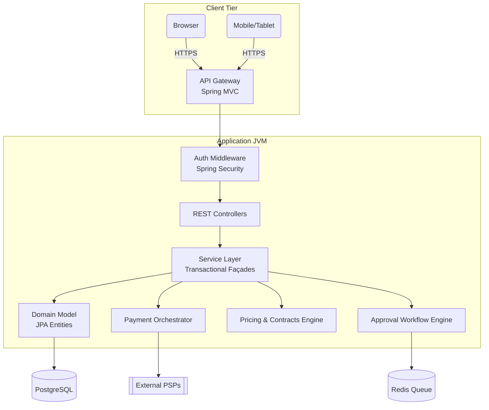
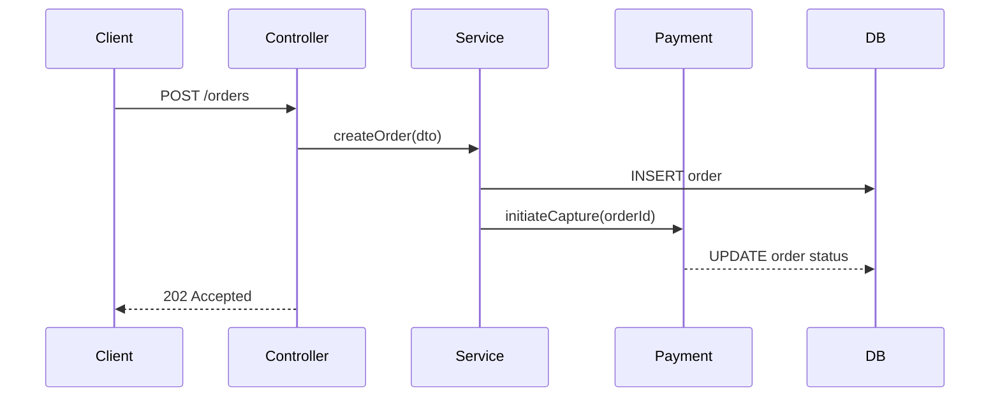
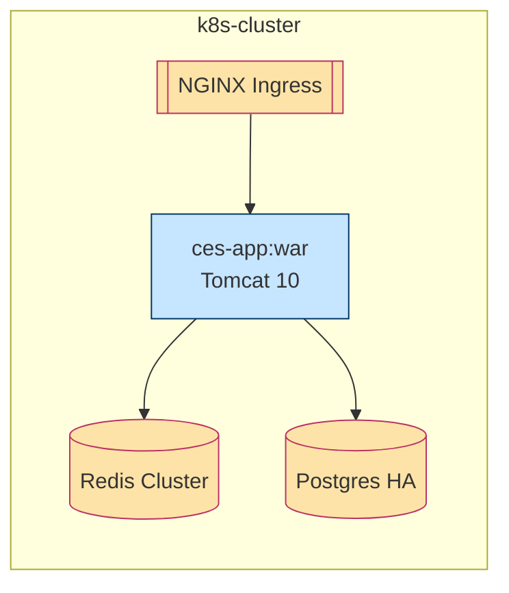

```markdown
# CommerceSphere Enterprise Suite – Architecture Overview
*(Project codename: `web_ecommerce`)*

> Version: **v1.7.0**  
> Last updated: **2024-06-03**  
> Maintainer: **architecture@commercesphere.io**

---

## 1. Executive Summary
CommerceSphere Enterprise Suite (CES) is an **all-in-one B2B commerce platform** delivered as a single JVM-based deployable. The monolithic approach intentionally contrasts with micro-service sprawl, simplifying governance while retaining **strong modular boundaries** enforced through *package-by-component* architecture, Spring Boot’s hierarchical contexts, and a shared JPA domain model.

---

## 2. High-Level Logical Architecture



* All layers run **in-process** to avoid network overhead.  
* Public and admin UIs use the same REST resources safeguarded by **role-based ACLs**.  
* **Spring Transactional** boundaries encapsulate service operations, guaranteeing atomic DB writes and eventual consistency with PSPs via SAGA compensations.

---

## 3. Component Decomposition

| Module                     | Maven GAV (`groupId:artifactId`)  | Responsibility                                                  |
|----------------------------|-----------------------------------|-----------------------------------------------------------------|
| `ces-core`                | `io.commercesphere:ces-core`       | Shared domain model, enumerations, and value objects            |
| `ces-auth`                | `io.commercesphere:ces-auth`       | JWT/OAuth2 flows, SAML integration, MFA                         |
| `ces-payment`             | `io.commercesphere:ces-payment`    | PSP adapters (Adyen, Stripe, Authorize.Net), PCI token vault    |
| `ces-pricing`             | `io.commercesphere:ces-pricing`    | Tiered/contract pricing, promotions, taxes                      |
| `ces-workflow`            | `io.commercesphere:ces-workflow`   | BPMN-based approval and quote workflow engine                   |
| `ces-admin-ui`            | `io.commercesphere:ces-admin-ui`   | Thymeleaf SPA for ops, finance, and audit                       |
| `ces-public-ui`           | `io.commercesphere:ces-public-ui`  | Storefront, search, cart, checkout                              |

> NOTE: Even in a monolith, *module jars* enforce clear **compile-time boundaries** to combat “big-ball-of-mud” risks.

---

## 4. Request Lifecycle Walkthrough (`Place Order`)

1. **Browser** posts `/api/v1/orders` with `Authorization: Bearer <JWT>`.
2. Spring Security’s `JwtAuthenticationFilter` populates `SecurityContext`.
3. `OrderController#createOrder` receives DTO, delegates to `OrderService`.
4. `OrderService`:
   a. Locks inventory via `InventoryService.lock(sku, qty)`.  
   b. Computes contract price via `PricingFacade#getPrice(...)`.  
   c. Persists `Order` aggregate (`@Transactional`).  
   d. Hands off payment to `PaymentFacade` (asynchronous SAGA start).  
5. `PaymentFacade` pushes message to *Redis Stream* for background capture.  
6. Controller returns **202 Accepted** with tracking URL `/orders/{id}`.  
7. Background worker finalizes payment, triggers `OrderPaidEvent`.  
8. Event listener marks order `PAID`, publishes WebSocket notification.

Sequence Diagram *(simplified)*:



---

## 5. Data Model Highlights

• **Order Aggregate**  
```
Order 1─* OrderLine
Order 1─1 ShippingAddress
Order 1─1 Invoice
```

• **Price Rule Engine** uses *rule chains* persisted as JSON blobs enabling **hot-swapping** without redeploy.

---

## 6. Technology & Frameworks

| Concern            | Technology                         | Justification                                          |
|--------------------|------------------------------------|--------------------------------------------------------|
| DI / Bootstrapping | Spring Boot 3.x                    | Mature ecosystem, Actuator, Observability              |
| ORM                | Hibernate 6 + Jakarta Persistence  | Rich mapping, batching                                 |
| DB                 | PostgreSQL 15                      | ACID, native JSONB                                     |
| Caching            | Redis 7 (Cluster)                  | Low-latency catalog & session caching                  |
| Messaging          | Redis Streams                      | Lightweight, in-JVM simplicity                         |
| Build              | Maven Centralized BOM             | Reproducible builds, SBOM generation                   |
| CI/CD              | GitHub Actions → Artifactory → K8s | Policy-driven pipelines, image scanning (Trivy)        |
| Observability      | OpenTelemetry, Grafana, ELK        | Distributed tracing, log correlation                   |

---

## 7. Deployment Topology



* Stateless app pods enable **horizontal scaling**.  
* Persistent data lives solely in PostgreSQL; Redis is a cache/queue and can be rebuilt.

---

## 8. Error Handling & Resilience

1. **Controller Advice** (`@RestControllerAdvice`) translates exceptions to RFC-7807 *Problem Details* JSON.  
2. **Retry Template** wraps outbound PSP calls (`maxAttempts=3`, exp back-off).  
3. Non-recoverable errors push to **Dead Letter Stream** for ops triage.  
4. Circuit Breakers (`Resilience4j`) guard fragile integrations.

---

## 9. Security & Compliance

| Area             | Initiative                                        |
|------------------|---------------------------------------------------|
| Authentication   | OAuth2 + SAML SLO, enforced MFA (TOTP)            |
| Authorization    | Attribute-based (ABAC) within Spring Security DSL |
| PCI DSS          | Cardholder data tokenized, no PAN stored          |
| GDPR             | PII encryption at rest (AES-256), Right-to-Erase  |
| Audit Logging    | Tamper-proof, append-only `audit_log` table       |

---

## 10. Extensibility Guidelines

• **SPI Pattern**: Implement new PSP by dropping a `PaymentProvider` bean on the classpath.  
• **Domain Events**: Prefer `@DomainEvent` over synchronous calls to reduce coupling.  
• **Schema Evolutions**: Use Liquibase change-sets; no `ALTER TABLE` directly in prod.  
• **Customization**: UI allows plug-in Vue components via remote module federation.

---

## 11. Known Trade-offs & Future Work

| Decision                     | Pros                                         | Cons                                         |
|------------------------------|----------------------------------------------|----------------------------------------------|
| Monolith vs Micro-services   | Simplified ops, ACID, cohesive releases      | Large blast radius, longer startup time      |
| Redis Streams over Kafka     | Fewer moving parts, lower latency            | No native replay across envs, single writer  |
| Package-by-component         | High cohesion, discoverability               | Initial learning curve for teams             |

---

## 12. Getting Started for Developers

```bash
# Clone & build
git clone git@github.com:commercesphere/enterprise-suite.git
cd enterprise-suite
mvn clean package -DskipTests

# Run via Docker Compose
docker compose up -d db redis
java -jar ces-app/target/ces-app.jar
```

Access:
* Storefront: `http://localhost:8080/`
* Admin UI: `http://localhost:8080/admin/` (user/pass: `admin/welcome1`)

---

## 13. Appendix

### 13.1 Key Spring Profiles

| Profile      | Purpose                         |
|--------------|---------------------------------|
| `local`      | H2 in-memory DB, MailHog        |
| `staging`    | Full stack, sandbox PSP creds   |
| `production` | PCI lockdown, readonly Actuator |

### 13.2 Glossary

| Term   | Definition                                          |
|--------|-----------------------------------------------------|
| PSP    | Payment Service Provider                            |
| SAGA   | Long-lived transaction pattern with compensations   |
| ABAC   | Attribute-Based Access Control                      |

---

© 2024 CommerceSphere Inc. All rights reserved.
```