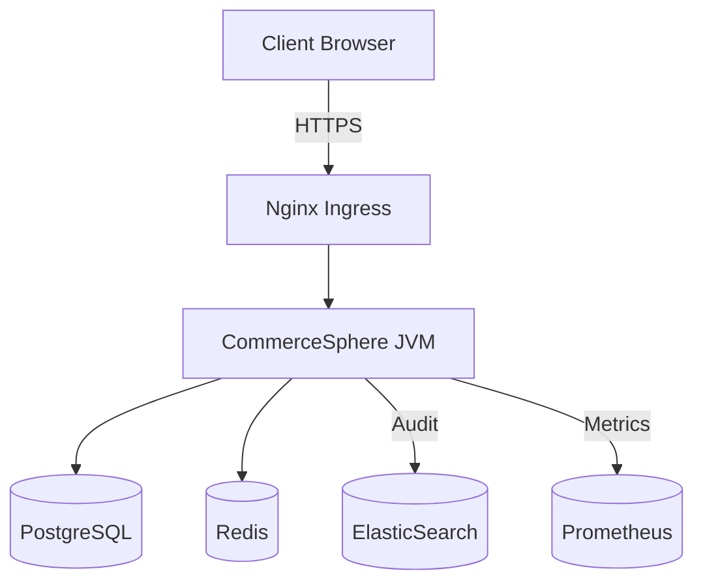

```markdown
# CommerceSphere Enterprise Suite • Setup Guide  
*Version: 1.6.x — Last updated 2024-06-15*  

> This document walks DevOps and system administrators through the **end-to-end
> installation** of the CommerceSphere Enterprise Suite (web_ecommerce).
> Follow the steps in the order presented to achieve a **production-ready,
> highly available** deployment.

---

## 1. Quick-Start (TL;DR)

```bash
# 1. Clone
git clone https://github.com/CommerceSphere/enterprise-suite.git
cd enterprise-suite

# 2. Provision containers and seed data
./gradlew clean build -x test
docker compose -f deploy/docker/docker-compose.prod.yml up -d

# 3. Run database migrations
docker compose exec app java -jar /opt/commerce/manage.jar db migrate config/prod.yml

# 4. Create Super-Admin
docker compose exec app java -jar /opt/commerce/manage.jar bootstrap --admin

# 5. Validate health‐checks
curl -s http://localhost:8080/actuator/health | jq
```

**Result:** The storefront will be live at `https://localhost` with the back-office
(Admin Panel) at `https://localhost/admin`.

---

## 2. Prerequisites

| Component                     | Minimum Version | Notes                                   |
|-------------------------------|-----------------|-----------------------------------------|
| JDK                           | 17 LTS          | AdoptOpenJDK or Temurin recommended     |
| Docker Engine + Docker Compose| 24.0.x / v2.20+ | Swarm or Kubernetes optional            |
| PostgreSQL                    | 14.x            | TimescaleDB extension supported         |
| Redis (optional, caching)     | 7.x             | Enabled by default in HA config         |
| Bash                          | 5.x             | For helper scripts                      |

**Network Ports**

- `80/443` — HTTPS termination (ingress)
- `5432` — PostgreSQL  
- `6379` — Redis  
- `9092` — Kafka (if enabled)

---

## 3. Architecture Primer



The entire suite lives **inside a single JVM** (`CommerceSphere.war`), while
satellite services (PostgreSQL, Redis, ElasticSearch, Prometheus) run as
side-cars. All calls are **in-process** except cache and metrics.

---

## 4. Deployment Modes

1. **Developer (local)** — Embedded H2, no TLS, hot-reloading via Spring DevTools  
2. **Staging** — Ephemeral Docker Compose, TLS via self-signed certs, nightly DB reset  
3. **Production** — Multi-node Docker Swarm / K8s, external PG cluster, Redis sentinel, 
   S3 object storage  

> This guide focuses on **Production**. For local dev see `docs/guides/DEV_ENV.md`.

---

## 5. Configuration Matrix

Environment variables override `application.yml`.

```yaml
# config/prod.yml (excerpt)
server:
  port: 8080
  servlet:
    context-path: /
spring:
  datasource:
    url:  jdbc:postgresql://${DB_HOST:postgres}:${DB_PORT:5432}/${DB_NAME:commerce}
    username: ${DB_USER:commerce_admin}
    password: ${DB_PASS}
  redis:
    host: ${REDIS_HOST:redis}
    port: ${REDIS_PORT:6379}
commerce:
  security:
    jwtSecret: ${JWT_SECRET}
    corsAllowedOrigins: "https://*.your-company.com"
  payment:
    provider: BRAINTREE
    braintree:
      merchantId: ${BTREE_MERCHANT_ID}
      publicKey:  ${BTREE_PUBLIC_KEY}
      privateKey: ${BTREE_PRIVATE_KEY}
```

---

## 6. Database Setup

### 6.1 Containerised PostgreSQL

```bash
docker compose up -d postgres
docker compose exec postgres psql -U postgres -c \
  "CREATE ROLE commerce_admin WITH LOGIN PASSWORD 'ChangeMe123';"
docker compose exec postgres psql -U postgres -c \
  "CREATE DATABASE commerce OWNER commerce_admin;"
```

### 6.2 External Cluster

1. Provision a 3-node **Patroni** or **Cloud SQL** cluster  
2. Create identical role/database as above  
3. Update `config/prod.yml` with FQDN and credentials  
4. Whitelist application subnet in your firewall  

---

## 7. Building the Artifact

```bash
./gradlew clean bootWar -Penv=prod
ls build/libs/commerceSphere-*.war
```

Gradle will embed all dependencies, static assets, and pre-compiled JSPs into
`commerceSphere.war` (~180 MB). The war is then wrapped inside the **app**
Docker image via Jib.

---

## 8. Running Migrations

Liquibase migrations ship inside `manage.jar`.

```bash
java -jar manage.jar db migrate config/prod.yml
```

This command is **idempotent**; safe to run on each deploy.

---

## 9. Bootstrapping an Admin Account

```bash
java -jar manage.jar bootstrap \
  --admin \
  --user=global_admin@your-company.com \
  --password='Sup3r$trong!' \
  --role=SYS_ADMIN
```

The script calls the **UserService** directly (bypassing REST) and records an
audit event.

---

## 10. Starting the Suite

Option A – Docker Compose:

```bash
docker compose -f deploy/docker/docker-compose.prod.yml up -d app
docker compose logs -f app  # wait for "Started CommerceSphereApplication"
```

Option B – Systemd Service:

```bash
sudo cp deploy/systemd/commerceSphere.service /etc/systemd/system/
sudo systemctl daemon-reload
sudo systemctl start commerceSphere
sudo systemctl enable commerceSphere
```

Service file excerpt:

```ini
[Service]
User=commerce
WorkingDirectory=/opt/commerce
ExecStart=/usr/bin/java -Xms1G -Xmx4G -jar commerceSphere.war --spring.profiles.active=prod
Restart=always
SuccessExitStatus=143
StandardOutput=syslog
StandardError=syslog
SyslogIdentifier=commerceSphere
```

---

## 11. Verifying Health

```bash
curl -u health:$(cat .secrets/health_token) \
  https://your-domain.com/actuator/health

curl https://your-domain.com/admin/api/v1/metrics | jq '.system.cpu.usage'
```

Status codes:

- `200 OK` — Healthy  
- `503 Service Unavailable` — DB or Redis unreachable  
- `429 Too Many Requests` — Rate-limiter protecting login  

---

## 12. Backups & Disaster Recovery

| Resource   | Mechanism                   | Frequency | Retention |
|------------|-----------------------------|-----------|-----------|
| PostgreSQL | `pgBackRest` WAL streaming  | 15 min    | 30 days   |
| Redis      | AOF + daily RDB snapshot    | 1 day     | 7 days    |
| Object Store| `rclone` to S3 IA tier     | 1 day     | 90 days   |
| Logs       | Filebeat → ElasticSearch    | Real-time | 45 days   |

Test restores **monthly** using staging environment.

---

## 13. Scaling Guidelines

- JVM Heap: start with `4 G`, observe GC pause, scale vertically before horizontal 
- DB Connections: `maxPoolSize = (CPU * 2) + 4`  
- Redis: enable **cluster mode** after 10 k req/s  
- File uploads: off-load to S3 via pre-signed URLs to keep nodes stateless  

---

## 14. Security Hardening Checklist

- [ ] Replace default JWT secret (`JWT_SECRET`)  
- [ ] Rotate database credentials quarterly  
- [ ] Enable HSTS (`Strict-Transport-Security` header)  
- [ ] Force 2FA for all admin accounts  
- [ ] Audit logs shipped to immutable storage (WORM)  
- [ ] Quarterly penetration test  

---

## 15. Troubleshooting

| Symptom                     | Likely Cause               | Resolution                                    |
|-----------------------------|----------------------------|-----------------------------------------------|
| `HTTP 503` on storefront    | DB connection leak         | Increase Hikari pool / inspect slow queries   |
| Payment gateway timeout     | Wrong firewall egress rule | Allow `*.braintreegateway.com:443`            |
| Catalog import stuck        | Message consumer down      | Restart `kafka-consumer` container            |
| Memory spike during deploy  | JIT recompilation          | Use CDS (Class Data Sharing)                  |

Log levels can be tuned at runtime:

```bash
curl -X POST https://your-domain.com/actuator/loggers/com.company \
     -H 'Content-Type: application/json' \
     -d '{"configuredLevel": "DEBUG"}'
```

---

## 16. Uninstalling

```bash
systemctl stop commerceSphere
docker compose down -v
rm -rf /opt/commerce /var/lib/commerce /etc/systemd/system/commerceSphere.service
```

---

## 17. FAQ

**Q:** Is Oracle DB supported?  
**A:** Not currently; PostgreSQL is required for the JSONB catalog schema.

**Q:** Can I run micro-services instead of monolith?  
**A:** Not out-of-the-box. A 2025Q1 roadmap item explores modularization, but
today **in-process** design is core to performance guarantees.

---

## 18. Change Log

- `v1.6.0` — Added Kafka event bus, OpenTelemetry tracing  
- `v1.5.2` — Upgraded Liquibase to 4.24, fixed PG14 lock regression  
- `v1.5.0` — Initial public release  

---

**Need help?**  
Open a ticket at `https://support.commercesphere.com` or join the Slack channel
`#cs-enterprise-support`.

---
```