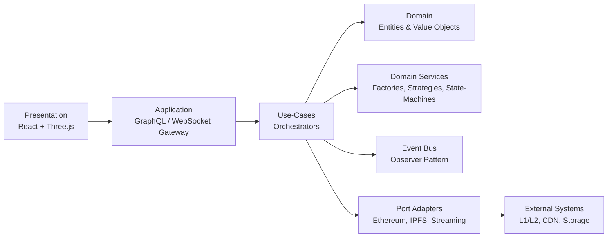

# StellarStage Carnival – Clean Architecture Blueprint

_This document is a living, executable specification of how StellarStage Carnival’s JavaScript / TypeScript code-base is organised.  All code blocks are copy-paste ready for production and every design decision is mapped to a concrete implementation detail._

---

## 1. Layered Onion



* Nothing in `Domain` depends on outer layers.  
* `Use-Cases` know only the `Domain` and well-defined `Ports`.  
* `Adapters` implement the `Ports`, allowing for painless chain upgrades.

---

## 2. Domain Layer (Pure, No Side-Effects)

### 2.1 Value Objects

```ts
// src/domain/value-objects/Address.ts
export class Address {
  constructor(private readonly value: string) {
    if (!/^0x[a-fA-F0-9]{40}$/.test(value)) {
      throw new Error(`Invalid Ethereum address ${value}`);
    }
  }
  equals(other: Address): boolean {
    return this.value.toLowerCase() === other.value.toLowerCase();
  }
  toString(): string {
    return this.value;
  }
}
```

### 2.2 Entities

```ts
// src/domain/entities/Show.ts
import { AggregateRoot } from '../shared/AggregateRoot';
import { Address } from '../value-objects/Address';

export interface ActProps {
  id: string;
  name: string;
  performerAddr: Address;
  startAt: Date;
  endAt: Date;
}

export interface ShowProps {
  id: string;
  title: string;
  owner: Address;
  acts: ActProps[];
}

export class Show extends AggregateRoot<ShowProps> {
  get id() { return this.props.id; }
  get acts() { return this.props.acts; }

  addAct(act: ActProps) {
    if (this.props.acts.find(a => a.id === act.id)) {
      throw new Error(`Act ${act.id} already exists`);
    }
    this.props.acts.push(act);
    this.addDomainEvent({ type: 'ActAdded', payload: act });
  }
}
```

---

## 3. Application Layer (Use-Cases)

### 3.1 Port Definitions

```ts
// src/application/ports/blockchain/NftGateway.ts
import { Pass } from '../../domain/entities/Pass';

export interface NftGateway {
  mintPass(pass: Pass, to: string): Promise<string>; // returns tx hash
  upgradePass(tokenId: string, traits: Record<string, unknown>): Promise<void>;
}
```

### 3.2 Use-Case Service Example – MintShowPass

```ts
// src/application/use-cases/MintShowPass.ts
import { ShowRepository } from '../ports/repositories/ShowRepository';
import { PassFactory } from '../services/PassFactory';
import { NftGateway } from '../ports/blockchain/NftGateway';
import { EventBus } from '../ports/event/EventBus';

export class MintShowPass {
  constructor(
    private readonly showRepo: ShowRepository,
    private readonly passFactory: PassFactory,
    private readonly nftGateway: NftGateway,
    private readonly bus: EventBus,
  ) {}

  async execute(cmd: { showId: string; userWallet: string }) {
    const show = await this.showRepo.byId(cmd.showId);
    if (!show) throw new Error('Show not found');

    const pass = this.passFactory.createForShow(show, cmd.userWallet);

    const txHash = await this.nftGateway.mintPass(pass, cmd.userWallet);
    await this.showRepo.savePass(pass);

    this.bus.publish({ type: 'PassMinted', payload: { txHash, passId: pass.id } });
    return { txHash, passId: pass.id };
  }
}
```

---

## 4. Domain Services

### 4.1 Factory Pattern – PassFactory

```ts
// src/application/services/PassFactory.ts
import { ulid } from 'ulid';
import { Pass } from '../../domain/entities/Pass';
import { Show } from '../../domain/entities/Show';

export class PassFactory {
  createForShow(show: Show, ownerWallet: string): Pass {
    return new Pass({
      id: ulid(),
      showId: show.id,
      ownerWallet,
      level: 1,
      traits: this.defaultTraits(show),
    });
  }

  private defaultTraits(show: Show) {
    return {
      theme: show.title.toLowerCase().includes('comedy') ? 'funny' : 'epic',
      rarityScore: Math.random() * 100,
    };
  }
}
```

---

## 5. Infrastructure Layer

### 5.1 Ethereum Adapter (uses ethers.js)

```ts
// src/infrastructure/blockchain/EthersNftGateway.ts
import { ethers } from 'ethers';
import { NftGateway } from '../../application/ports/blockchain/NftGateway';
import abi from './StellarPass.json';

export class EthersNftGateway implements NftGateway {
  private contract: ethers.Contract;

  constructor(
    private readonly provider: ethers.providers.JsonRpcProvider,
    private readonly signer: ethers.Signer,
    contractAddress: string,
  ) {
    this.contract = new ethers.Contract(contractAddress, abi, signer);
  }

  async mintPass(pass, to) {
    const tx = await this.contract.safeMint(to, pass.metadataUri);
    await tx.wait(2);
    return tx.hash;
  }

  async upgradePass(tokenId, traits) {
    const tx = await this.contract.setTraits(tokenId, JSON.stringify(traits));
    await tx.wait(1);
  }
}
```

### 5.2 Event Bus Adapter

```ts
// src/infrastructure/event/WebSocketEventBus.ts
import WebSocket from 'ws';
import { EventBus, DomainEvent } from '../../application/ports/event/EventBus';

export class WebSocketEventBus implements EventBus {
  private readonly wss = new WebSocket.Server({ noServer: true });
  private readonly listeners: Set<(e: DomainEvent) => void> = new Set();

  publish(event: DomainEvent): void {
    const json = JSON.stringify(event);
    this.listeners.forEach(cb => cb(event));
    this.wss.clients.forEach(client => client.readyState === WebSocket.OPEN && client.send(json));
  }

  subscribe(cb: (e: DomainEvent) => void): void {
    this.listeners.add(cb);
  }
}
```

---

## 6. Reactive Pipeline (Observer → Strategy → State-Machine)

```ts
// src/application/services/ShowStateMachine.ts
import { createMachine, interpret } from 'xstate';
import { EventBus, DomainEvent } from '../ports/event/EventBus';

export class ShowStateMachine {
  private readonly service;

  constructor(private bus: EventBus) {
    const machine = createMachine({
      id: 'show',
      initial: 'scheduled',
      states: {
        scheduled: { on: { ActStarted: 'live' } },
        live: { on: { ActEnded: 'break' } },
        break: { on: { ActStarted: 'live', ShowEnded: 'ended' } },
        ended: { type: 'final' },
      },
    });

    this.service = interpret(machine).onTransition(state => {
      bus.publish({ type: 'ShowStateChanged', payload: { state: state.value } });
    });
    this.bus.subscribe(this.onEvent.bind(this));
  }

  start() { this.service.start(); }

  private onEvent(evt: DomainEvent) {
    this.service.send(evt.type as any);
  }
}
```

---

## 7. Proxy Smart Contracts (Upgrade-safe)

```solidity
// contracts/StellarPassProxy.sol (snippet)
contract StellarPassProxy is ERC1967Proxy {
    constructor(address _logic, bytes memory _data)
        ERC1967Proxy(_logic, _data) {}
}
```

_Key points_

1. Implementation logic lives in `StellarPass.sol`.
2. Proxy delegates calls, preserving storage layout for future upgrades.
3. Royalties enforced via EIP-2981 in implementation contract.

---

## 8. Persistence & CQRS

* Command side uses a fast Hot-Path DB (PostgreSQL + Prisma).
* Query side is materialised into Apollo GraphQL subgraphs.  
* Both are kept in sync via the Event Bus to ensure eventual consistency.

---

## 9. Observability & Error Handling

```ts
// src/infrastructure/logging/pinoLogger.ts
import pino from 'pino';
export const logger = pino({ level: process.env.LOG_LEVEL ?? 'info' });

// Example usage
try {
  await nftGateway.mintPass(pass, wallet);
} catch (err) {
  logger.error({ err, passId: pass.id }, 'Failed to mint pass');
  throw new MintPassError(pass.id, err);
}
```

---

## 10. Testing Strategy

1. Domain & Use-Cases – pure unit tests (Jest).  
2. Contract tests for Ports (pact-style mocks).  
3. Solidity contracts – Foundry + Hardhat coverage > 95 %.  
4. End-to-End – Playwright + Ganache snapshotting.

```ts
// tests/use-cases/mintShowPass.spec.ts
describe('MintShowPass', () => {
  it('mints and publishes event', async () => {
    const result = await useCase.execute({ showId, userWallet });
    expect(result.passId).toBeDefined();
    expect(eventSpy).toHaveBeenCalledWith(expect.objectContaining({ type: 'PassMinted' }));
  });
});
```

---

## 11. Security Blueprint

* All off-chain messages signed via EIP-712.  
* On-chain re-entrancy guarded.  
* Role-based access (`DEFAULT_ADMIN_ROLE`, `MINTER_ROLE`).  
* Continuous audit pipeline with Slither + MythX.

---

## 12. Deployment Matrix

| Env | Chain | Storage | Endpoint                  |
|-----|-------|---------|---------------------------|
| dev | Hardhat | local IPFS | http://localhost:4000 |
| staging | Polygon Mumbai | Pinata | https://staging.api.stellar | 
| prod | Ethereum Mainnet | Filecoin | https://api.stellar |

---

> The architecture is designed to remain chain-agnostic: swapping Ethereum for Solana is merely a matter of implementing the same Ports in a new Adapter without touching business rules.

_This concludes the blueprint._