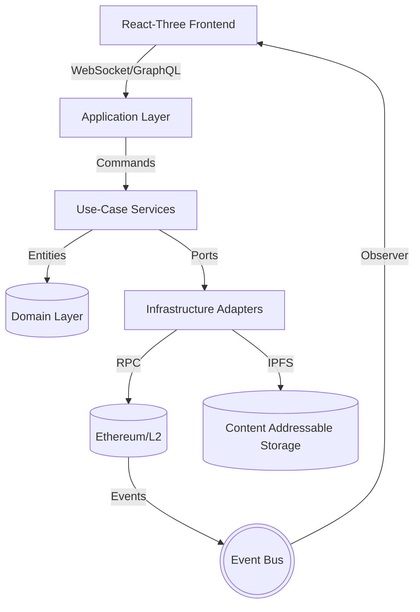

```markdown
# **StellarStage Carnival**
Interactive NFT Showrunner  
_Every seat is a game piece, every moment is on-chain._

[](https://github.com/<org>/StellarStageCarnival/actions/workflows/ci.yml)
[](https://codecov.io/gh/<org>/StellarStageCarnival)

---

## ✨ What Is It?
StellarStage Carnival turns concerts, comedy specials, e-sports tournaments and film festivals into living, blockchain-backed game worlds.

* **Show-Pass NFTs** – upgrade in real time as you cheer, vote or remix footage  
* **On-Chain Loot Drops** – triggered by performers’ live actions  
* **Stake-to-Govern** – fans collectively curate future line-ups  
* **Built-In DeFi Bazaar** – trade perks, footage rights, governance tokens  

The codebase rigorously follows **Clean Architecture**, separating domain logic from infrastructure and UI. Smart contracts are upgradeable via proxy patterns, and every service is test-first, dependency-injected and chain-agnostic.

---

## 🗺️ Repository Layout
```
.
├── docs/                 # ADRs, spec text, whitepaper
├── packages/
│   ├── contracts/        # Solidity (Hardhat)
│   ├── core/             # Domain entities & use-cases (TS)
│   ├── infra/            # Adapters: Ethereum, IPFS, Stream, GraphQL
│   ├── web/              # React-Three + Apollo client
│   └── scripts/          # Dev & ops tooling
├── .github/              # CI/CD workflows
└── docker/               # Container orchestration
```

---

## 🏃‍♀️ Quick Start
```bash
# 1. Clone
git clone https://github.com/<org>/StellarStageCarnival.git
cd StellarStageCarnival

# 2. Bootstrap monorepo
pnpm i

# 3. Spin up local chain, IPFS & graph-node
docker compose up -d localnet

# 4. Deploy proxy contracts & seed fixtures
pnpm --filter @ssc/contracts run deploy:dev

# 5. Launch web client
pnpm --filter @ssc/web dev
```

---

## 🏗️ Architecture (Mermaid)


---

## 🎛️ Selected Design Patterns
* **Factory** – NFT trait generation per show type  
* **Strategy** – dynamic fee curves (flat, bonding, dutch)  
* **State Machine** – Show lifecycle (Draft → Live → Settled → Archived)  
* **Observer & Event-Driven** – on-chain events → real-time UI updates  
* **Proxy** – upgradeable contracts preserving token data & royalties  

---

## 🔐 Environment Variables
Create `.env` at project root:

```dotenv
# ─── Chains ────────────────────────────
CHAIN_RPC_URL=http://127.0.0.1:8545
CHAIN_ID=31337
DEPLOYER_PRIVATE_KEY=0x....

# ─── IPFS & Filecoin ───────────────────
IPFS_API_URL=http://127.0.0.1:5001

# ─── GraphQL ───────────────────────────
GRAPH_ENDPOINT=http://localhost:8000/subgraphs/name/ssc

# ─── Misc ──────────────────────────────
WEB_PORT=3000
```

---

## 🔨 Core Use-Case Example
```typescript
// packages/core/src/use-cases/MintShowPass.ts
import { IShowRepo, INftMinterPort, IClock } from '../ports'
import { Pass } from '../entities/Pass'

export class MintShowPass {
  constructor(
    private readonly minter: INftMinterPort,
    private readonly shows: IShowRepo,
    private readonly clock: IClock
  ) {}

  /**
   * Mints a new Show Pass NFT for the given user & show.
   * Throws if mint window closed or supply exhausted.
   */
  async execute(cmd: { showId: string; userAddress: string }): Promise<Pass> {
    const show = await this.shows.byId(cmd.showId)
    if (!show.canMint(this.clock.now())) {
      throw new Error('Minting period is closed.')
    }
    const tokenId = await this.minter.mint({
      to: cmd.userAddress,
      metadataUri: show.passMetadataUri
    })
    const pass = new Pass({ tokenId, showId: show.id, owner: cmd.userAddress })
    await this.shows.savePass(pass)
    return pass
  }
}
```

---

## 🔁 Sample GraphQL Query
```graphql
query ActiveShows {
  shows(where: { state: "LIVE" }) {
    id
    title
    startTime
    passPrice
    totalMinted
  }
}
```

---

## 🧪 Testing
```bash
# Unit tests (jest + ts-jest)
pnpm test

# Solidity tests (hardhat + viem)
pnpm --filter @ssc/contracts test

# Full e2e (Cypress)
pnpm --filter @ssc/web cypress:run
```
```typescript
describe('MintShowPass', () => {
  it('mints when window is open', async () => {
    const uc = new MintShowPass(minter, shows, clockInMintWindow)
    const pass = await uc.execute({ showId: 'abc', userAddress: bob })
    expect(pass.owner).toBe(bob)
  })
})
```

---

## 🛰️ Deploying to Testnet
```bash
export CHAIN_RPC_URL="https://sepolia.infura.io/v3/$INFURA_ID"
export CHAIN_ID=11155111
pnpm --filter @ssc/contracts run deploy
```
Out comes an upgradeable `ShowPassProxy` + `LootDistributorProxy`, and subgraph mappings are auto-published via `graph-cli`.

---

## 🎯 Contribution Guide
1. Fork & branch off `main`  
2. Follow the [Conventional Commits](https://www.conventionalcommits.org) spec  
3. Write/alter **tests & docs** with your change  
4. `pnpm lint && pnpm typecheck` must be green  
5. Open PR → CI will run full matrix on Node 18/20 & Solidity 0.8.x  

---

## 🗒️ ADR Snapshots
* **ADR-001** Monorepo + PNPM over submodules  
* **ADR-002** Clean Architecture boundary naming  
* **ADR-003** Proxy upgrade strategy (UUPS vs Transparent)  

All ADRs live under `docs/adr`.

---

## 📄 License
Code is released under MIT, smart contracts under GPL-3.0.  
Artwork & footage licensed separately under performer agreements.

---

_StellarStage Carnival © 2024 Stellar Core Labs, LLC_
```