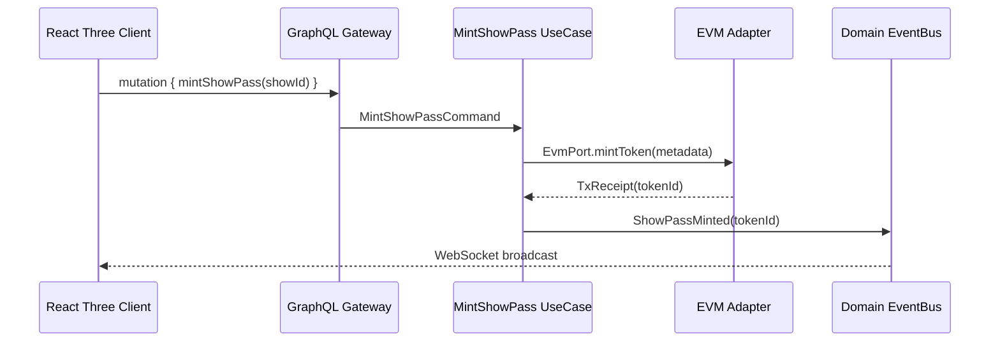

```markdown
# StellarStage Carnival – Clean Architecture Guide
_“Independent of frameworks, UI, database, and blockchain.”_

> This document explains **how** and **why** we apply Uncle Bob’s Clean Architecture to a next-gen, event-driven NFT showrunner.  
> All code samples are written in **TypeScript** and follow our ESLint + Prettier ruleset.

---

## 1. Layered Overview

```mermaid
flowchart LR
  subgraph Domain["DOMAIN (Enterprise)"]
    Show --> Pass
    Show --> Act
    Pass --> Loot
  end

  subgraph UseCases["APPLICATION (_Use-Cases_)"]
    MintShowPass -->|"emits"| StageEvent
    DistributeLoot --> StageEvent
    StakePass --> GovernancePoll
  end

  subgraph Infrastructure["INFRASTRUCTURE (_Adapters_)"]
    EVMAdapter -- tx --> "Ethereum / L2s"
    IPFSAdapter -- pin --> "IPFS / Arweave"
    StreamAdapter -- push --> "Live-Streaming SDK"
  end

  subgraph FrameworksDrivers["INTERFACES (Drivers/UI)"]
    ReactThree --> GraphQLGateway
    ReactThree --> WebSocketClient
  end

  Domain  --> UseCases
  UseCases --> Infrastructure
  Infrastructure --> FrameworksDrivers
```

• **Entities** are pure business objects (no I/O, no libraries).  
• **Use-Cases** orchestrate business flow and enforce invariants.  
• **Adapters** translate between external tech (Ethereum, IPFS) and our ports.  
• **Drivers/UI** consume exposed APIs only—never reach into upstream layers.

---

## 2. Source–Code Layout

```
/src
 │
 ├── domain                  # 💡 Pure business rules
 │   ├── entities            # Show, Act, Pass, Loot
 │   └── value-objects       # Address, TokenId, Timestamp…
 │
 ├── application             # ⛓  Use-Cases
 │   ├── commands            # MintShowPass, StakePass…
 │   ├── events              # Domain & Integration events
 │   └── ports               # I/O boundaries (Blockchains, Storage)
 │
 ├── infrastructure          # 🔌 External adapters
 │   ├── blockchain
 │   ├── storage
 │   └── streaming
 │
 ├── interfaces              # 🎛 Drivers/UI
 │   ├── rest
 │   ├── graphql
 │   └── websocket
 │
 └── tests                   # 🧪  Jest + ts-node
```

The `tsconfig.json` path-alias enforces one-way dependencies:

```jsonc
{
  "compilerOptions": {
    "paths": {
      "@domain/*": ["src/domain/*"],
      "@application/*": ["src/application/*"]
    }
  }
}
```

---

## 3. Dependency Rule

1. _Nothing_ in `domain` imports from `application`, `infrastructure`, or `interfaces`.
2. `application` may depend on `domain` but **not** on `infrastructure`.
3. `infrastructure` implements `@application/ports/*`, so the flow is **outward only**.
4. Cycles are prevented at compile-time by ESLint dependency-cruiser.

---

## 4. Sample Walk-Through: Minting a Show Pass



### 4.1 Use-Case Service (trimmed)

```ts
// src/application/commands/mint-show-pass/MintShowPass.ts
import { IShowRepository } from "@application/ports/repositories";
import { IEvmPort } from "@application/ports/blockchain";
import { EventBus } from "@application/events";

export class MintShowPass {
  constructor(
    private readonly shows: IShowRepository,
    private readonly evm: IEvmPort,
    private readonly bus: EventBus
  ) {}

  async execute({ showId, ownerAddress }: DTO): Promise<Pass> {
    const show = await this.shows.findById(showId);
    if (!show) throw new ShowNotFoundError(showId);

    const metadata = show.buildPassMetadata();
    const { tokenId, txHash } = await this.evm.mintToken(ownerAddress, metadata);

    const pass = show.issuePass(tokenId, ownerAddress, txHash);

    await this.shows.save(show); // domain mutation persisted
    await this.bus.publish(new ShowPassMinted(pass));

    return pass;
  }
}
```

_No framework, no web3.js—only ports._

---

## 5. Ports & Adapters

### 5.1 Port Interface

```ts
// src/application/ports/blockchain/index.ts
export interface IEvmPort {
  mintToken(to: Address, metadata: JsonUri): Promise<{ tokenId: TokenId; txHash: TxHash }>;
  transferToken(tokenId: TokenId, to: Address): Promise<TxHash>;
  readTrait(tokenId: TokenId, key: string): Promise<string>;
}
```

### 5.2 EVM Adapter (implements port)

```ts
// src/infrastructure/blockchain/evm/EvmAdapter.ts
import { ethers } from "ethers";
import abi from "./StellarStagePass.abi.json";
import { IEvmPort } from "@application/ports/blockchain";

export class EvmAdapter implements IEvmPort {
  private contract: ethers.Contract;

  constructor(
    private readonly signer: ethers.Signer,
    private readonly contractAddress: string
  ) {
    this.contract = new ethers.Contract(contractAddress, abi, signer);
  }

  async mintToken(to, metadata) {
    try {
      const tx = await this.contract.safeMint(to, metadata);
      const receipt = await tx.wait(1);
      const event = receipt.events?.find(e => e.event === "Transfer");
      return { tokenId: event?.args?.tokenId.toString(), txHash: receipt.transactionHash };
    } catch (err) {
      throw new MintTokenError(err);
    }
  }

  /* …other methods… */
}
```

---

## 6. Pattern Map

Pattern ——> Where we use it
• Factory Pattern ——> `ShowFactory`, `PassFactory` build valid aggregates.  
• Strategy Pattern ——> `TraitStrategy` chooses rarity algorithms at runtime.  
• State Machine ——> `PassEvolutionState` (e.g., Rookie → Veteran → Legendary).  
• Observer Pattern ——> `EventBus` wires domain + integration events.  
• Proxy Pattern ——> Upgradeable ERC-721 (`TransparentUpgradeableProxy`).  

---

## 7. Real-Time Event Bus

```ts
// src/application/events/EventBus.ts
import { EventEmitter } from "events";

export class EventBus extends EventEmitter {
  async publish(evt: DomainEvent) {
    super.emit(evt.name, evt);
  }

  subscribe<E extends DomainEvent>(eventName: E["name"], handler: (e: E) => void) {
    super.on(eventName, (e: E) => handler(e));
  }
}
```

Adapters register themselves at startup:

```ts
bus.subscribe("ShowPassMinted", (e: ShowPassMinted) => {
  websocketGateway.broadcast(e);
  graphqlIndexer.handle(e);
});
```

---

## 8. Testing

• **Domain**: pure Jest unit tests, no mocks.  
• **Use-Cases**: mock ports with ts-mockito.  
• **Adapters**: run against Hardhat + Ganache in‐memory chains.  
• **E2E**: Playwright triggers GraphQL mutations, asserts on-chain state.  

CI runs `npm run test:coverage` → SonarQube gateway enforces 90 % threshold.

---

## 9. Error Handling Conventions

1. Every layer defines **its own** error types (`PassEvolutionError`), exporting only domain-relevant messages.  
2. Adapters translate low-level errors into port-level exceptions (`MintTokenError`).  
3. Interfaces/UI convert errors to RFC 7807 Problem Details for clients.

---

## 10. Don’ts

✗ No `ethers.js` calls in domain / use-case layers.  
✗ No environment variables inside constructors—use `DependencyInjection`.  
✗ No circular imports.  
✗ No “god” service that spans multiple aggregates.  

---

## 11. Quick Checklist Before PR

- [ ] Does my new file live in the correct layer?
- [ ] Is the dependency arrow pointing outwards only?
- [ ] Are all external libraries isolated behind a port?
- [ ] Have I written/updated tests above 90 % coverage?
- [ ] Did `npm run lint && npm run typecheck` pass?

---

Happy hacking, **Stargazers** 🚀
```