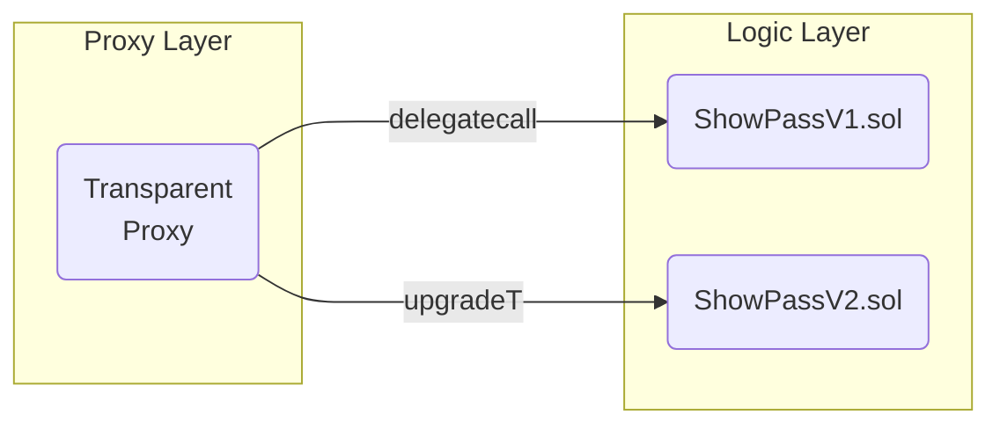

```markdown
# StellarStage Carnival – Smart-Contract Upgradeability Guide
> File: `docs/contracts/UPGRADEABILITY_GUIDE.md`  
> Last updated: 2024-05-29

StellarStage Carnival’s live-show economy is expected to evolve rapidly—new gamification rules, ticketing mechanics, and royalty streams will be introduced every season. To support this pace **without forcing holders to burn & remint their NFTs**, every on-chain component is designed to be _upgradeable_ via the **Transparent Proxy pattern** (OpenZeppelin’s implementation) and protected by rigorous governance and testing gates.

This document is the single source of truth for:
* Contract layout & storage guidelines  
* Safe upgrade workflow (local → testnet → mainnet)  
* Governance & emergency protocols  
* Hardhat + TypeChain scripts and examples  

---

## 1. Architectural Overview



* **Proxy Layer** (immutable): Stores state; delegates calls to the active logic contract.  
* **Logic Layer** (upgradeable): ShowPassV1, V2, etc. Houses business rules only.  
* **Admin Layer** (governed by `CarnivalGovernor`): Owns the proxy and controls `upgradeTo`.

> NOTE: Upgrades never migrate data—the `Proxy` keeps the same storage slots across versions.

---

## 2. Directory Conventions

```
contracts/
  proxy/
    BaseProxy.sol
  pass/
    implementations/
      ShowPassV1.sol
      ShowPassV2.sol
    facets/          # For Diamond-style experiments
scripts/
  upgrades/
    propose-upgrade.ts
    approve-upgrade.ts
    execute-upgrade.ts
```

---

## 3. Writing an Upgradeable Contract

### 3.1. Solidity Rules of Thumb
1. **No constructors** – use `initialize()` instead.  
2. **Never use `selfdestruct`** – breaks the proxy.  
3. **Constants/APIs** – can be added, **never removed or reordered**.  
4. **Storage gap** – reserve `uint256[50] private __gap;` for future vars.

### 3.2. Example – `ShowPassV1.sol`

```solidity
// SPDX-License-Identifier: MIT
pragma solidity ^0.8.20;

import "@openzeppelin/contracts-upgradeable/token/ERC721/extensions/ERC721URIStorageUpgradeable.sol";
import "@openzeppelin/contracts-upgradeable/proxy/utils/UUPSUpgradeable.sol";
import "../proxy/BaseProxy.sol";

contract ShowPassV1 is ERC721URIStorageUpgradeable, UUPSUpgradeable {
    /* ============ State ============ */
    mapping(uint256 => uint256) private _exp; // Fan XP per pass

    /* ============ Initializer ============ */
    function initialize(string memory name_, string memory symbol_) public initializer {
        __ERC721_init(name_, symbol_);
        __UUPSUpgradeable_init();
    }

    /* ============ Core Logic ============ */
    function gainExp(uint256 tokenId, uint256 amt) external {
        require(_exists(tokenId), "PASS_NOT_FOUND");
        _exp[tokenId] += amt;
    }

    /* ============ Upgradability ============ */
    function _authorizeUpgrade(address newImpl) internal override onlyProxyAdmin {}
    
    uint256[49] private __gap; // 49 because we used one slot for _exp
}
```

---

## 4. Storage Layout & Compatibility

Run `npx hardhat storage:layout` before and after every change.  
Breaking changes (detected via `@openzeppelin/upgrades-core`) will **halt the CI**.

Common pitfalls:
* Re-ordering state variables  
* Changing inheritances that inject storage (`Ownable`, `Pausable`)  
* Converting `uint8` → `uint256` (size mismatch)

---

## 5. Upgrade Workflow

1. **Develop** new implementation in a feature branch.  
2. **Unit & drive tests** (`pnpm test:contracts`).  
3. **Propose upgrade** (generates calldata & JSON diff):

```bash
pnpm ts-node scripts/upgrades/propose-upgrade.ts \
  --proxy 0xProxyAddress \
  --impl  contracts/pass/implementations/ShowPassV2.sol
```

4. **Governor review** – core devs & community vote on chain.  
5. **Execute upgrade** (TimeLock enforced):

```bash
pnpm ts-node scripts/upgrades/execute-upgrade.ts --proposal 123
```

6. **Post-upgrade smoke test**: read `version()` & run snapshot tests.

---

## 6. Governance & Emergency

* `CarnivalGovernor` (ERC-5805) owns the proxy admin role.  
* Emergency multisig (5/9) can trigger `_rollback()` if:
  * Severe bug endangering funds
  * DAO vote unreachable within 12h

---

## 7. Hardhat Helper Scripts

### 7.1. `propose-upgrade.ts`

```ts
import { ethers, upgrades } from "hardhat";
import fs from "node:fs/promises";

async function main() {
  const proxy = "0xProxyAddress";
  const NewImpl = await ethers.getContractFactory("ShowPassV2");
  const proposal = await upgrades.prepareUpgrade(proxy, NewImpl);
  await fs.writeFile(
    `./scripts/upgrades/proposals/${Date.now()}.json`,
    JSON.stringify({ proxy, proposal }, null, 2)
  );
  console.log("Upgrade prepared at:", proposal);
}

main().catch((e) => {
  console.error(e);
  process.exit(1);
});
```

### 7.2. `execute-upgrade.ts`

```ts
import { ethers, upgrades } from "hardhat";
import proposal from "./proposals/1685381110.json";

async function main() {
  const admin = await ethers.getSigner("upgrade-admin");
  await upgrades.upgradeProxy(proposal.proxy, proposal.proposal, { signer: admin });
  console.log("Proxy upgraded!");
}

main().catch((e) => {
  console.error(e);
  process.exit(1);
});
```

---

## 8. Test Matrix

| Layer | Tooling                     | Responsibility                       |
|-------|-----------------------------|--------------------------------------|
| Unit  | Hardhat + viem             | Business invariants (XP, rarity)     |
| Integration | Anvil fork + Foundry | Cross-contract interactions          |
| E2E   | Hardhat Network + Mocha    | Upgrade, rollback, governance flow   |

CI runs on every push; mainnet deploy uses the same tagged Docker image.

---

## 9. FAQ

**Q: Can we migrate to a Diamond (EIP-2535) later?**  
A: Yes—the proxy can delegate to a DiamondCutFacet in V3. Storage layout care is mandatory.

**Q: What if an upgrade fails mid-transaction?**  
A: The upgrade is atomic; either `upgradeTo` succeeds or the proxy keeps the old impl.

---

## 10. Appendix – Sample Rollback Script

```ts
// rollback.ts
import { ethers } from "hardhat";
import { TransparentUpgradeableProxy__factory } from "../typechain";

async function main() {
  const proxyAddr = process.argv[2];
  const prevImpl  = process.argv[3];
  if (!proxyAddr || !prevImpl) throw new Error("Usage: rollback <proxy> <prevImpl>");

  const admin = await ethers.getSigner("multisig-emergency");
  const proxy = TransparentUpgradeableProxy__factory.connect(proxyAddr, admin);

  const tx = await proxy.upgradeTo(prevImpl);
  await tx.wait();
  console.log(`Rolled back ${proxyAddr} to ${prevImpl}`);
}

main().catch(console.error);
```

---

Happy building, and may your stages remain stellar!  
– _Carnival Core Devs_
```