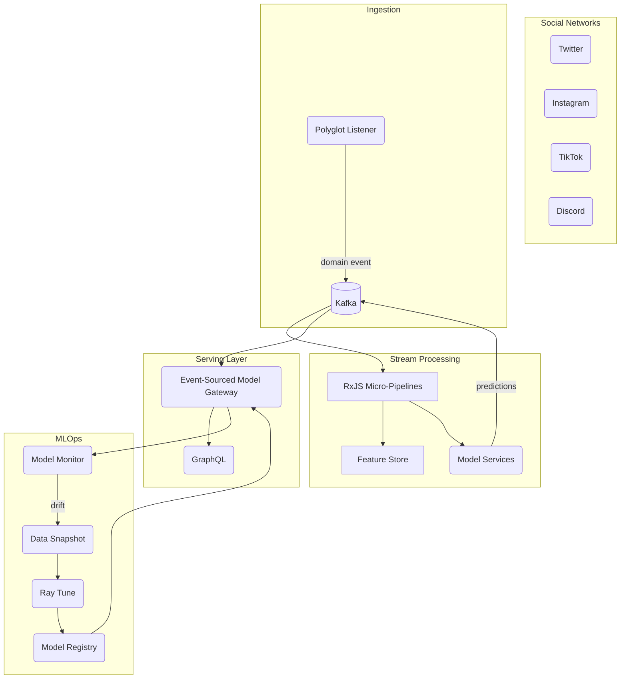

```markdown
# AgoraPulse: Real-Time Social Signal Intelligence        

> Convert the chaotic torrent of modern social chatter into streaming, actionable insights in < 100 ms.

---

## ✨ Key Features
| Domain | Capability | Package |
| ---- | ---- | ---- |
| Event Ingestion | Multi-network, polyglot listener (Twitter, Discord, TikTok, Instagram, Clubhouse…) | `@agorapulse/ingest` |
| Real-Time ML | Sentiment, stance, toxicity, micro-topic detection | `@agorapulse/model-hub` |
| MLOps | Versioning, A/B, Canary, Rollbacks | `@agorapulse/serving`, `@agorapulse/registry` |
| Monitoring | Drift, fairness, SLO alerts | `@agorapulse/monitor` |
| Visualization | Vega-Lite dashboards, Live Map | `@agorapulse/ui` |

---

## 🏗  High-Level Architecture


---

## 🚀 Quick Start

```bash
# 1. Clone
git clone https://github.com/AgoraPulse/ml_nlp.git && cd ml_nlp

# 2. Bootstrap
corepack enable
pnpm install

# 3. Spin-up dependencies (Kafka, MinIO, MLflow, etc.)
docker compose up -d

# 4. Start dev services
pnpm --filter @agorapulse/ingest run dev
pnpm --filter @agorapulse/model-hub run dev
pnpm --filter @agorapulse/serving run dev
```

Open http://localhost:4000 🎉

> **Pro-Tip**: `pnpm nx run-many -t dev -p "@agorapulse/*"` will start everything concurrently.

---

## 🗂️ Monorepo Layout

```
packages/
├─ ingest/          # Event listeners + adapters
├─ core/            # Domain models, shared types
├─ pipelines/       # RxJS operators, feature engineering
├─ model-hub/       # Model training + inference adapters
├─ serving/         # gRPC / GraphQL model gateway
├─ monitor/         # Drift & fairness monitors
└─ ui/              # Next.js Dashboards

infrastructure/
├─ helm/            # Kubernetes charts
└─ terraform/       # Cloud provisioning

.github/
├─ workflows/       # CI/CD pipelines
```

---

## ⚙️ Configuration

Create `.env.local` at the workspace root (all keys are optional & have sane defaults):

```dotenv
# Kafka
KAFKA_BROKERS=localhost:9092
KAFKA_CLIENT_ID=agorapulse

# Storage
MINIO_ENDPOINT=http://localhost:9000
MINIO_ACCESS_KEY=minio
MINIO_SECRET_KEY=miniostorage

# Model Registry
MLFLOW_TRACKING_URI=http://localhost:5000
MODEL_REGISTRY_BUCKET=models

# Auth
JWT_SECRET=🔑super-secret
```

---

## 🧑‍💻 Developer Guide

### Scripts

| Command | Description |
| ------- | ----------- |
| `pnpm dev` | Start hot-reloading service (per-package) |
| `pnpm test` | Jest + ts-jest unit tests |
| `pnpm lint` | ESLint + Prettier |
| `pnpm typecheck` | `tsc` ‑-noEmit |
| `pnpm e2e` | Playwright end-to-end tests |
| `pnpm generate:docs` | Build typedoc & storybook |

### Commit Conventions
We follow [Conventional Commits](https://www.conventionalcommits.org) with `commitlint`.
Semantic releases are automated via GitHub Actions.

---

## 🧪 ML Experiment Lifecycle

1. **Snapshot**  
   `@agorapulse/ingest` dumps parquet slices to `minio://snapshots/{date}` every 1 h.
2. **Sweep**  
   GitHub Action triggers `ray tune` in a K8s job (`infrastructure/helm/ray-cluster`).
3. **Register**  
   Best trials are logged to MLflow; the `ModelFactory` generates a semantic name:  
   `toxicity-bert-{twitter|discord}-{YYYYMMDD}-v{patch}`.
4. **Shadow Deploy**  
   `@agorapulse/serving` listens to `model.registered` events, spins side-car containers, and sets 5 % traffic.
5. **Monitor & Promote**  
   `@agorapulse/monitor` compares live vs. control using a Bayesian t-test; if √, emits `model.promote` → full rollout.

---

## 📈 Observability Stack

| Signal | Tooling |
| ------ | ------- |
| Logs | Pino + Loki |
| Metrics | prom-client + Prometheus + Grafana |
| Traces | OpenTelemetry (OTLP → Tempo) |
| Dashboards | Vega-Lite + Grafana |

---

## ⛑️ Troubleshooting

| Symptom | Fix |
| ------- | --- |
| `ERR_CONNECTION_REFUSED` on MLflow | `docker compose logs mlflow` – ensure port `5000` free |
| Kafka consumer stuck | Use `kafka-topics.sh --delete` for the offending test topic |
| Drift alert spam | Adjust `MONITOR_THRESHOLD_STD` in `.env.local` |

---

## ❓ FAQ

**Q.** Which Node version?  
**A.** ≥ 18.16 LTS (ES2022 features & fetch API used).

**Q.** Can I plug in my own model?  
**A.** Yes—implement `IModelStrategy` interface and register it via `ModelFactory.register('my-model', strategy)`.

---

## 🤝 Contributing

1. Fork → feature branch (`feat/my-awesome-change`)
2. `pnpm i && pnpm test`
3. PR targeting `main`  
   - Pass CI, add unit tests  
   - One commit message per Conventional Commit spec  

---

## 📜 License

Distributed under the MIT License. See `LICENSE` for more information.

---

<sub>© 20XX AgoraPulse, Inc. — Built with ❤️ and TypeScript.</sub>
```