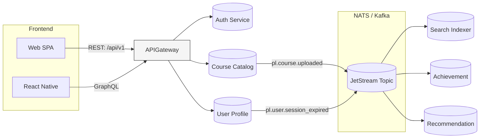

```markdown
# ADR 001 – Adopt a Polyglot, Event-Driven Microservices Architecture

* Status: **Accepted**  
* Date: 2024-05-19  
* Deciders: Architecture Council (CTO, Lead Backend, Lead Frontend, DevOps)  
* Supersedes: N/A  
* See also: 002-database-strategy.md, 003-auth-identity.md

---

## 1. Context  

PulseLearn Campus Hub (PL-CH) must enable:

1. Real-time, bidirectional interactions between thousands of concurrent users (students, teachers, admins).  
2. Rapid feature evolution by autonomous domain-centric teams.  
3. Fault-tolerance and graceful degradation of non-critical functionality (e.g., delayed “BadgeAwarded” events must **not** block quiz submissions).  
4. Polyglot technology choices while enforcing a consistent ops/observability contract.  
5. Compliance with FERPA, GDPR, and internal audit requirements such as end-to-end traceability and PII redaction policies.

The alternatives considered were:

| Candidate                     | Pros                                                                                                    | Cons                                                                                                   |
| ----------------------------- | -------------------------------------------------------------------------------------------------------- | ------------------------------------------------------------------------------------------------------- |
| A) Single-service (monolith)  | Simple to deploy, transactional consistency, easier local dev                                           | Scalability bottlenecks, slower team velocity, long-lived branches, risky deployments                  |
| B) Self-contained services    | Autonomy per bounded context, independent UI + API bundles                                              | Risk of UI duplication, heavier front-end orchestration                                                |
| **C) Microservices + Event Bus** | Loose coupling via events, horizontal scalability, team autonomy, tech polyglot, easier domain modeling | Requires distributed tracing, eventual consistency semantics, operational complexity                   |
| D) Serverless (FaaS only)     | Zero infra management, cost per execution                                                               | Cold starts, vendor lock-in, limited long-running connections, complex local testing                   |

After evaluating traffic patterns, compliance constraints, and organisation structure (5 cross-functional squads), option **C** was chosen.

---

## 2. Decision  

We will build **PulseLearn Campus Hub** as an **event-driven microservices system**:

1. **Domain-Oriented Microservices**  
   • Each service owns a bounded context & data store (e.g., `UserProfile`, `LearningPath`, `Achievement`, `Notification`).  
   • Services communicate asynchronously via a Kafka compatible bus (NATS JetStream in staging, Confluent Cloud in prod).  
   • REST/gRPC APIs remain for synchronous “query” use-cases and external integrations (admin panel, LTI).  

2. **Event Taxonomy**  
   • All domain events adopt the CloudEvents 1.0 spec.  
   • Topic naming: `pl.<boundedContext>.<eventName>.<version>` (e.g., `pl.achievement.badge_awarded.v1`).  
   • Payloads are validated with versioned Avro schemas stored in Schema Registry.  

3. **Shared Platform Libraries**  
   • We ship an OSS-friendly **`@pl/platform`** JavaScript package that wraps NATS/Kafka producers & consumers, tracing, and idempotency utilities (see snippet below).  
   • Analogous libraries will exist for Python, Go, and Java to keep polyglot parity.  

4. **Observability & Resilience**  
   • OpenTelemetry for distributed tracing, correlated logs, metrics (`traceId` + `spanId` pass via W3C `traceparent`).  
   • Circuit breakers (opossum) guard cross-service HTTP calls.  
   • Retry, DLQ, and “parking lot” patterns for poison messages.  

5. **Security**  
   • mTLS between services (Linkerd service mesh).  
   • SPIFFE IDs for zero-trust identity.  
   • PII encrypted at rest (PostgreSQL + envelope encryption).  

---

## 3. Consequences  

Positive:  
✓ Independent deployability enables <15 min release cadence per squad.  
✓ Horizontal scaling by workload (e.g., `RecommendationService` auto-scales via KEDA based on Kafka lag).  
✓ Failure isolation—`SearchIndexer` crash has no direct impact on “QuizCompletion” UX.  

Negative:  
✗ Added operational overhead: CI/CD pipelines, playbooks, Terraform modules per service.  
✗ Data consistency becomes eventual; we must adopt Saga patterns for workflows like “PurchaseCourse → ActivateAccess → EmitInvoice”.  
✗ On-call complexity: PagerDuty rotations per squad, plus a shared SRE roster for platform components (Kafka, Linkerd, Istio ingress).

---

## 4. Implementation Sketch  

### Mermaid: High-level view



### Shared JS Event Library (`@pl/platform`)

```javascript
// @pl/platform/lib/event-bus.js
import { connect, StringCodec } from 'nats';
import { v4 as uuid } from 'uuid';
import * as otel from '@opentelemetry/api';

/**
 * EventBus singleton to publish/subscribe CloudEvents-compliant messages.
 */
export class EventBus {
  static instance;

  /**
   * Initialise a NATS connection (lazy).
   * @param {object} config - {servers: string, jwt?: string, nkey?: string}
   */
  static async init(config) {
    if (!EventBus.instance) {
      EventBus.instance = new EventBus(config);
      await EventBus.instance._connect();
    }
    return EventBus.instance;
  }

  constructor(config) {
    this.config = config;
    this.sc = StringCodec();
  }

  async _connect() {
    try {
      this.nc = await connect(this.config);
      this.js = this.nc.jetstream();
      console.info('[EventBus] Connected to NATS');
    } catch (err) {
      console.error('[EventBus] Connection error', err);
      throw err;
    }
  }

  /**
   * Publish a CloudEvent to the given topic.
   * @param {string} topic - e.g. "pl.achievement.badge_awarded.v1"
   * @param {object} data - event payload
   * @param {object} [options] - headers, trace context, etc.
   */
  async publish(topic, data, options = {}) {
    if (!this.nc) throw new Error('EventBus not initialised');
    const span = otel.trace.getTracer('pl-platform').startSpan(`publish:${topic}`);
    try {
      const event = {
        id: uuid(),
        source: 'pulselearn-campus-hub',
        specversion: '1.0',
        type: topic,
        time: new Date().toISOString(),
        datacontenttype: 'application/json',
        data,
      };
      // propagate trace context
      const headers = this._buildHeaders(span, options.headers);
      await this.js.publish(topic, this.sc.encode(JSON.stringify(event)), { headers });
      span.setStatus({ code: otel.SpanStatusCode.OK });
    } catch (err) {
      span.setStatus({ code: otel.SpanStatusCode.ERROR, message: err.message });
      throw err;
    } finally {
      span.end();
    }
  }

  /**
   * Subscribe to a topic with durable consumer semantics.
   * @param {string} topic
   * @param {string} durableName
   * @param {(evt: object) => Promise<void>} handler
   */
  async subscribe(topic, durableName, handler) {
    const subOpts = { durable: durableName, manualAck: true, ackWait: 60_000 };
    const sub = await this.js.subscribe(topic, subOpts);
    console.info(`[EventBus] Subscribed to ${topic}`);

    (async () => {
      for await (const m of sub) {
        const span = otel.trace.getTracer('pl-platform').startSpan(`consume:${topic}`);
        try {
          const evt = JSON.parse(this.sc.decode(m.data));
          await handler(evt);
          m.ack();
          span.setStatus({ code: otel.SpanStatusCode.OK });
        } catch (err) {
          console.error('[EventBus] Handler error', err);
          // let JetStream redeliver, or add to DLQ via a header
          span.setStatus({ code: otel.SpanStatusCode.ERROR, message: err.message });
        } finally {
          span.end();
        }
      }
    })().catch((err) => console.error('[EventBus] Async iteration error', err));
  }

  _buildHeaders(span, extra = {}) {
    const headers = this.nc.headers();
    const ctx = otel.trace.setSpan(otel.context.active(), span);
    otel.propagation.inject(ctx, headers, {
      set: (carrier, key, value) => carrier.set(key, value),
    });
    Object.entries(extra).forEach(([k, v]) => headers.set(k, v));
    return headers;
  }
}
```

### Saga Orchestration Example (Enroll Premium Course)

```javascript
// services/payment/src/enrollCourseSaga.js
import { EventBus } from '@pl/platform';
import { db } from '../db';
import { generateInvoice } from '../billing';
import { logger } from '../logger';

export async function registerEventHandlers() {
  const bus = await EventBus.init({ servers: process.env.NATS_URL });

  // listen to PaymentCaptured
  await bus.subscribe('pl.payment.captured.v1', 'enroll-premium-course', async (evt) => {
    const { userId, courseId, paymentId } = evt.data;
    logger.info('Payment captured', { userId, courseId, paymentId });

    // Step 1: Activate access in course service (synchronous call)
    try {
      await activateCourseAccess(userId, courseId);
    } catch (err) {
      logger.error('Course activation failed', err);
      // emit compensating event
      await bus.publish('pl.payment.refund_requested.v1', { paymentId, reason: 'COURSE_ACTIVATION_FAILED' });
      return;
    }

    // Step 2: Emit EnrollmentGranted event
    await bus.publish('pl.enrollment.granted.v1', { userId, courseId });

    // Step 3: Issue invoice (local DB + external PDF generator)
    try {
      const invoiceId = await generateInvoice({ userId, paymentId });
      await db.invoice.markSent(invoiceId);
    } catch (err) {
      logger.error('Invoice generation failed', err);
      // Non-blocking; instructor & finance will be alerted via DLQ consumer
    }
  });
}
```

---

## 5. Alternatives Explored (But NOT Chosen)

* **Monolith + Event Module** – insufficient isolation; high coordination cost for multi-squad development.  
* **Pure Serverless** – latency and unpredictable cost for high-frequency message streams (quizzes, edits).  
* **gRPC-only Service Mesh** – synchronous coupling failed chaos testing when `AnalyticsService` induced 40 % error rate.

---

## 6. Validation & Next Steps

1. Platform Team to spin up NATS + JetStream in staging (k8s operator).  
2. Each squad migrates at least one bounded context to the new pattern by Sprint 14.  
3. Evaluate Confluent vs Redpanda for prod by Q3.  
4. Conduct load test: 50k concurrent websocket sessions, publish 2k events/s, < 200 ms P99 end-to-end latency.  

---

## 7. References

* “Building Event-Driven Microservices” – O’Reilly, 2021  
* CloudEvents 1.0 Spec – https://cloudevents.io/  
* JetStream Acknowledgements – https://docs.nats.io/jetstream/consumers/ack_policy  
* Saga Pattern – https://microservices.io/patterns/data/saga.html  

```