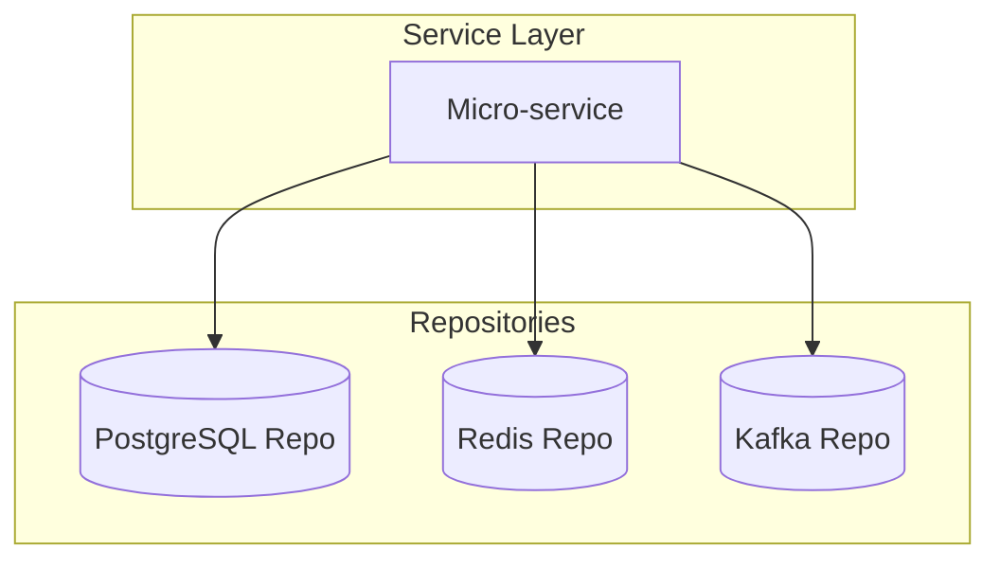

<!--
  ADR 003: Polyglot Persistence
  PulseLearn Campus Hub
  Status: Accepted
  Date: 2024-05-28
-->

# 003 – Polyglot Persistence  

## Status  
Accepted – The decision has been implemented in `v1.4.0`.

## Context  
PulseLearn Campus Hub is an event-driven system with a variety of read/write patterns:

* Write-intensive, append-only domain events (≈8 k eps peak)  
* Read-heavy social timelines that must fan-out to thousands of users in < 150 ms  
* Strongly-consistent, relational data for billing, LMS compliance, and audit logs  
* Full-text search over course content and peer-review comments  
* Graph-style traversals for cohort relationships and content recommendations

A single storage engine cannot optimize for all these needs without unacceptable trade-offs in performance, cost, or developer productivity. We therefore evaluated several strategies:

| Option | Pros | Cons |
| ------ | ---- | ---- |
| 1. Single SQL RDBMS (PostgreSQL) | ACID, mature tooling | Hot partitions, expensive scaling, poor search |
| 2. Single document DB (MongoDB) | Flexible schema, good read scaling | Event ordering issues, multi-doc transactions slower |
| 3. Polyglot persistence *(selected)* | Fit-for-purpose stores, cost-effective | Operational complexity, cross-store transactions |

## Decision  
We adopt **polyglot persistence**: each bounded context chooses the persistence technology that best serves its needs, within guardrails enforced by the Platform Team.

1. **Event Store**  
   *Technology:* Apache Kafka (log), TimescaleDB (cold storage)  
   *Rationale:* Immutability, temporal queries, built-in replication.

2. **User & Billing**  
   *Technology:* PostgreSQL 15 with logical replication  
   *Rationale:* Strong consistency for payments, GDPR data-subject requests.

3. **Realtime Timelines & Notifications**  
   *Technology:* Redis Cluster + Redis Streams  
   *Rationale:* Sub-millisecond fan-out, pub/sub semantics, TTL-based eviction.

4. **Search & Analytics**  
   *Technology:* OpenSearch 2.x  
   *Rationale:* Relevance scoring, aggregations, horizontal scaling.

5. **Graph Recommendations**  
   *Technology:* Neo4j 5.x  
   *Rationale:* Native graph traversals for “students who liked X also liked Y”.

6. **File Storage (Assignments, Media)**  
   *Technology:* S3-compatible object store with signed URLs  
   *Rationale:* Durable, CDN-friendly, off-loads traffic from app servers.

### Access Pattern Enforcement  


Repositories shield business logic from vendor SDKs. All repositories implement:

```ts
// docs/examples/Repository.ts
export interface Repository<T> {
  findById(id: string): Promise<T | null>;
  save(entity: T): Promise<void>;
  delete(id: string): Promise<void>;
}
```

Concrete adapters (e.g., `UserPgRepository`, `TimelineRedisRepository`) live in their respective packages.

### Data-Contracts & Async Sync  
Cross-store ownership is disallowed; instead we replicate immutable projections using Kafka topics suffixed with `.projection`. Consumers materialize local read models, guaranteeing eventual consistency while avoiding distributed transactions.

## Consequences  
Positive
* Services scale independently; no single datastore becomes a bottleneck.
* Teams can evolve schemas without cross-team migration battles.
* Disaster recovery is narrowed to datastore-specific SLAs.

Negative
* Ops: multiple backup/restore, monitoring, and upgrade procedures.
* Observability: needing distributed tracing across store boundaries.
* Onboarding: developers must learn ≥ 3 query DSLs.

Mitigations
* Unified secrets via Vault; IaC modules standardize provisioning.
* Cross-store dashboards in Grafana/Loki/Tempo.
* Internal workshops and cheat-sheets for new engineers.

## Related Decisions  
* ADR-001 – Event-Driven Architecture  
* ADR-002 – Domain-Driven Repository Pattern

## Notes  
This ADR will be revisited after the next academic year or when datastore OPEX exceeds 20 % of infrastructure budget.