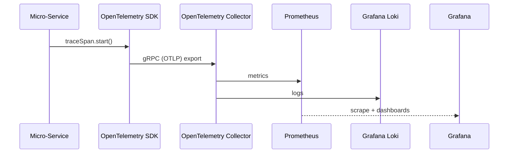

```markdown
# PulseLearn Campus Hub — Architecture Overview
*Version: 1.0.0*  
*Last updated: {{DATE}}*

PulseLearn Campus Hub (Web/Social) is a **reactive micro-service platform** that turns any educational institution into a real-time digital campus.  
This document describes the macro-architecture, service boundaries, technology choices, and key patterns used throughout the code-base.

---

## 1. System-Level Diagram

```mermaid
flowchart LR
    subgraph Browser / Mobile
        A[SPA<br/>(React/Next.js)]
    end

    subgraph Edge
        AGW[API Gateway<br/>(Node.js + Fastify)]
    end

    subgraph Core Services
        Auth[Auth Service]
        Users[User Service]
        Courses[Course Service]
        Events[Event Dispatcher]
        Notif[Notification Service]
        Reco[Recommendation Service]
        Search[Search Indexer]
    end

    subgraph Infra
        Kafka[(Kafka/NATS)]
        DB[(PostgreSQL)]
        Redis[(Redis)]
        S3[(Object Storage)]
        Prom[(Prometheus + Grafana)]
    end

    A -- REST/WebSocket --> AGW
    AGW -- JWT --> Auth
    AGW -- RPC --> Users & Courses
    AGW -- Publish Domain Events --> Kafka
    Kafka --> Events
    Events --> Notif & Reco & Search
    DB <--> Users & Courses
    Redis <--> Notif
    S3 <--> Courses
    Prom --> Grafana
```

---

## 2. Layered Component Model

| Layer             | Responsibility                                  | Protocols                           |
| ----------------- | ----------------------------------------------- | ----------------------------------- |
| Presentation      | React SPA, WebSocket client, SSR pages          | `HTTPS`, `WSS`                      |
| API Gateway       | Rate-limit, authN, authZ, request enrichment    | `HTTP/2`, `gRPC` (internal)         |
| Service Layer     | Business logic, orchestration, validation       | `gRPC`, `Kafka`                     |
| Repository Layer  | Data mappers, ORM (Prisma), caching             | `SQL`, `Redis`                      |
| Event Backbone    | Guaranteed, ordered domain event propagation    | `Kafka`, `NATS JetStream`           |

---

## 3. Technology Stack

| Concern            | Choice                         | Rationale                                              |
| ------------------ | ------------------------------ | ------------------------------------------------------ |
| Runtime            | Node.js (v18 LTS)              | Native ESM, top-level `await`, diagnostics channel     |
| Web Framework      | Fastify (4.x)                  | High-performance, schema-driven, hooks                 |
| ORM                | Prisma (5.x)                   | Type-safe, migrations as code                          |
| Message Bus        | Kafka (3.x) / NATS (2.x)       | At-least-once delivery, back-pressure control          |
| Auth               | Clerk (OIDC) + JWT             | Social logins, MFA, SSO                                |
| Observability      | OpenTelemetry + Prometheus     | Distributed tracing & metrics                          |
| Containerization   | Docker + Helm                  | K8s ready, GitOps deploys                              |
| CI/CD              | GitHub Actions, Renovate       | SemVer releases, automated dependency updates          |

---

## 4. Domain Event Contract (TypeScript)

```ts
/**
 * Base interface for all domain events.
 * Each event must be serializable and contain a unique ID
 * to guarantee idempotent consumption by downstream services.
 */
export interface DomainEvent<T extends Record<string, unknown> = unknown> {
  readonly id: string;                  // ULID
  readonly name: string;                // e.g. "AssignmentSubmitted"
  readonly occurredAt: string;          // ISO-8601 timestamp
  readonly aggregateId: string;         // Entity root ID (e.g. assignmentId)
  readonly payload: T;                  // Raw event data
  readonly version: number;             // Schema evolution support
}
```

---

## 5. Event Emitter (Service ➜ Kafka)

```ts
import { Kafka, Producer } from "kafkajs";
import { DomainEvent } from "../types/events";

export class EventEmitter {
  private readonly producer: Producer;

  constructor(private readonly kafka: Kafka) {
    this.producer = kafka.producer({ allowAutoTopicCreation: false });
  }

  async start(): Promise<void> {
    await this.producer.connect();
  }

  async stop(): Promise<void> {
    await this.producer.disconnect();
  }

  /**
   * Publish a domain event to the message bus.
   * Retries are handled by kafkajs with exponential back-off.
   */
  async emit(event: DomainEvent): Promise<void> {
    await this.producer.send({
      topic: `domain.${event.name}`,
      messages: [
        {
          key: event.aggregateId,
          value: JSON.stringify(event),
          headers: { "x-event-version": `${event.version}` },
        },
      ],
    });
  }
}
```

---

## 6. Event Consumer Skeleton

```ts
import { Kafka, EachMessagePayload } from "kafkajs";
import { logger } from "../utils/logger";
import { processAssignmentSubmitted } from "./handlers/assignmentSubmitted";

const TOPIC = "domain.AssignmentSubmitted";

export async function createAssignmentSubmittedConsumer(kafka: Kafka) {
  const consumer = kafka.consumer({ groupId: "notification-service" });

  await consumer.subscribe({ topic: TOPIC, fromBeginning: false });

  await consumer.run({
    autoCommit: false,
    eachMessage: async (payload: EachMessagePayload) => {
      try {
        const { message, heartbeat, commitOffsetsIfNecessary } = payload;
        const event = JSON.parse(message.value!.toString());

        await processAssignmentSubmitted(event);

        await commitOffsetsIfNecessary();
        await heartbeat(); // keep consumer session alive
      } catch (error) {
        logger.error(error, "Failed to process AssignmentSubmitted");
        // Optionally forward to a dead-letter topic for inspection
      }
    },
  });

  return consumer;
}
```

---

## 7. Repository Pattern (Prisma + Caching)

```ts
import { PrismaClient, User } from "@prisma/client";
import Redis from "ioredis";
import ms from "ms";

export class UserRepository {
  private readonly cacheTtl = ms("10m") / 1000; // seconds

  constructor(
    private readonly prisma: PrismaClient,
    private readonly redis: Redis
  ) {}

  private cacheKey(userId: string): string {
    return `user:${userId}`;
  }

  async findById(userId: string): Promise<User | null> {
    // 1. Check Redis
    const cached = await this.redis.get(this.cacheKey(userId));
    if (cached) return JSON.parse(cached) as User;

    // 2. Fallback to DB
    const user = await this.prisma.user.findUnique({ where: { id: userId } });
    if (user) {
      await this.redis.set(
        this.cacheKey(userId),
        JSON.stringify(user),
        "EX",
        this.cacheTtl
      );
    }
    return user;
  }

  async create(data: Omit<User, "id">): Promise<User> {
    const user = await this.prisma.user.create({ data });
    await this.redis.del(this.cacheKey(user.id)); // bust cache
    return user;
  }
}
```

---

## 8. Example Service (Notification Service)

```ts
import { EventEmitter } from "../events/eventEmitter";
import { NotificationRepository } from "../repositories/notificationRepo";
import { DomainEvent } from "../types/events";

export class NotificationService {
  constructor(
    private readonly repo: NotificationRepository,
    private readonly emitter: EventEmitter
  ) {}

  /**
   * Create a user notification and emit a follow-up domain event.
   */
  async notify(event: DomainEvent<AssignmentPayload>): Promise<void> {
    // Business invariant
    if (!event.payload.recipientId) {
      throw new Error("Recipient ID missing in AssignmentSubmitted event");
    }

    const notification = await this.repo.create({
      userId: event.payload.recipientId,
      title: "New Assignment Submitted",
      body: `${event.payload.authorName} has submitted an assignment.`,
    });

    await this.emitter.emit({
      id: crypto.randomUUID(),
      name: "NotificationCreated",
      occurredAt: new Date().toISOString(),
      aggregateId: notification.id,
      payload: { notificationId: notification.id },
      version: 1,
    });
  }
}
```

---

## 9. Security Considerations

1. **JWT validation** is enforced at the API Gateway with public JWK rotation every 60 minutes.  
2. **TLS 1.3** is mandatory for all edge traffic; internal traffic uses mTLS between micro-services.  
3. **CSP, HSTS, and CSRF** protection headers set by Fastify `helmet` plugin.  
4. **OPA-based policy engine** scopes admin operations (audit logs, PII access).  

---

## 10. Observability Pipeline



Key SLOs  
• P99 API latency < 150 ms  
• Event delivery success ≥ 99.999%  
• Uptime ≥ 99.95%

---

## 11. Deployment Workflow

1. Push to `main` triggers GitHub Action.  
2. Lint, test, build Docker image tagged as `sha`.  
3. Image pushed to GHCR, Helm chart updated with image sha.  
4. ArgoCD auto-syncs chart to staging cluster.  
5. End-to-end Cypress tests run inside cluster.  
6. Manual approval gate promotes to production.

---

## 12. Glossary

| Term                 | Meaning                                         |
| -------------------- | ----------------------------------------------- |
| Domain Event         | Immutable fact about something that happened    |
| Aggregate            | Consistency boundary around a domain entity     |
| CQRS                 | Command Query Responsibility Segregation        |
| SAGA                 | Long-running transaction pattern                |

---

> © PulseLearn, Inc. All Rights Reserved.
```
