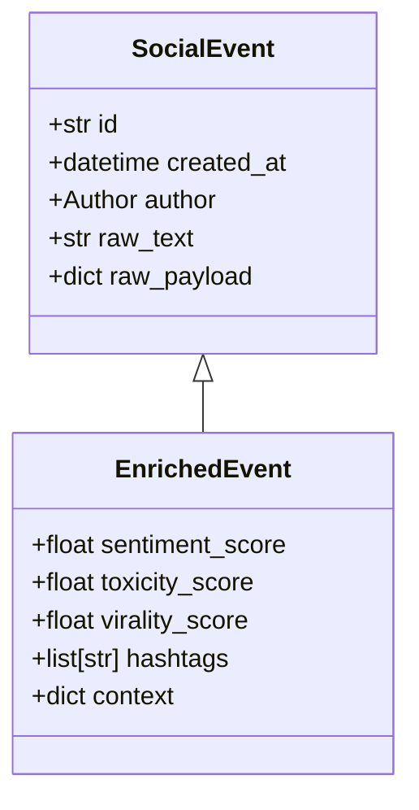

```markdown
# PulseStream Nexus – Public API Reference  
*Version 1.4 – Last updated: 2024-05-19*

PulseStream Nexus is a real-time social-data streaming platform that ingests, transforms, and analyzes community conversations across Twitter/X, Reddit, Mastodon, Discord, and more.  
This document provides a **language-agnostic HTTP/WebSocket specification** and **Python-centric usage examples** for integrating with the Nexus micro-services fleet.

---

## Table of Contents
1. Quick Start
2. Authentication
3. Streaming API
4. Insights & Analytics API
5. Data Models
6. Python SDK Reference
7. Error Handling
8. CLI Utilities
9. Webhooks & Event Forwarders
10. Change Log

---

## 1. Quick Start

```bash
# Install the official Python client
pip install pulsestream-nexus
```

```python
from pulsestream_nexus import NexusClient, StreamFilter

client = NexusClient(api_key='PSN-<YOUR-KEY>')
filter_ = StreamFilter(
    networks=["twitter", "reddit"],
    keywords=["elections", "debate"],
    min_followers=1000,
    sentiment=None  # wild-card
)

# Begin consuming the live stream
for event in client.subscribe(filter_):
    print(f"{event.created_at} | @{event.author.username}: {event.text}")
```

---

## 2. Authentication

All REST and WebSocket calls require an `X-PSN-API-Key` header (or `api_key` query param for browser testing).

| Header                | Description                       |
|-----------------------|-----------------------------------|
| `X-PSN-API-Key`       | Your provisioned API key          |
| `X-PSN-Request-ID`    | Optional correlation UUID         |
| `Content-Encoding`    | `zstd` recommended for large POST |

```http
GET /health HTTP/1.1
Host: nexus.socialstream.ai
X-PSN-API-Key: PSN-xxxxxxxx
```

---

## 3. Streaming API

### 3.1 WebSocket Endpoint

```
wss://stream.pulsestream.ai/streams/{network}/subscribe
```

| Path Param | Type   | Description                             |
|------------|--------|-----------------------------------------|
| `network`  | string | `twitter`, `reddit`, `mastodon`, etc.   |

#### 3.1.1 Query Parameters

| Name           | Type     | Description                             |
|----------------|----------|-----------------------------------------|
| `api_key`      | string   | API key (if not using header)           |
| `filter`       | string   | URL-encoded JSON (filter schema below)  |
| `heartbeat`    | integer  | Seconds between ping/pong (default 30)  |

#### 3.1.2 Filter Schema (excerpt)

```jsonc
{
  "keywords":     ["tesla", "cybertruck"],
  "languages":    ["en"],
  "min_followers": 500,
  "sentiment":    ["NEGATIVE", "NEUTRAL"],
  "toxicity_lt":  0.4
}
```

### 3.2 Example (Python, Async io)

```python
import asyncio
from pulsestream_nexus import NexusAsyncClient, StreamFilter

async def main():
    client = NexusAsyncClient(api_key="PSN-...")
    async for event in client.subscribe(
        StreamFilter(keywords=["mars", "spacex"], languages=["en"])
    ):
        if event.metrics.virality_score > 0.8:
            print("🚀 Viral post detected:", event.url)

asyncio.run(main())
```

---

## 4. Insights & Analytics API

Base URL: `https://api.pulsestream.ai/v1`

| Method | Endpoint                       | Description                               |
|--------|--------------------------------|-------------------------------------------|
| GET    | `/analytics/metrics`           | Aggregated sentiment & toxicity counters  |
| GET    | `/analytics/virality/{postId}` | Virality time-series for a single post    |
| POST   | `/analytics/query`             | Ad-hoc historical window queries          |

### 4.1 Metrics Example

```http
GET /v1/analytics/metrics?network=twitter&interval=5m HTTP/1.1
Host: api.pulsestream.ai
X-PSN-API-Key: PSN-xyz
```

```jsonc
{
  "interval": "5m",
  "network": "twitter",
  "totals": {
    "posts": 18451,
    "positive": 7431,
    "negative": 3122,
    "neutral": 7898,
    "toxicity_mean": 0.12
  },
  "timestamp": "2024-05-19T15:56:07Z"
}
```

---

## 5. Data Models



### 5.1 SocialEvent (ingest)

| Field         | Type       | Description                       |
|---------------|------------|-----------------------------------|
| `id`          | string     | Provider-wide unique identifier   |
| `created_at`  | ISO-8601   | UTC timestamp                     |
| `author`      | object     | `username`, `followers`, `bio`    |
| `text`        | string     | UTF-8 message text                |
| `source`      | string     | `twitter`, `reddit`, etc.         |

### 5.2 EnrichedEvent (additional)

| Field               | Type    | Description                                 |
|---------------------|---------|---------------------------------------------|
| `sentiment`         | enum    | `POSITIVE`, `NEGATIVE`, `NEUTRAL`           |
| `sentiment_score`   | float   | `[-1.0, 1.0]`                               |
| `toxicity`          | float   | Jensen toxicity `0.0 → 1.0`                 |
| `virality_score`    | float   | Internal ranking metric `0.0 → 1.0`         |
| `geo`               | object  | `lat`, `lon`, `country_code`                |

---

## 6. Python SDK Reference

```python
from pulsestream_nexus.client import NexusClient
from pulsestream_nexus.filters import StreamFilter
from pulsestream_nexus.analytics import AnalyticsClient
from pulsestream_nexus.models import EnrichedEvent

__all__ = [
    "NexusClient",
    "StreamFilter",
    "AnalyticsClient",
    "EnrichedEvent",
]
```

### 6.1 NexusClient

```python
class NexusClient(BaseClient):
    """
    Thread-safe sync client for interacting with PulseStream Nexus.
    """

    def subscribe(
        self,
        filter_: StreamFilter,
        ack: bool = False,
        timeout: int | None = None,
    ) -> Iterator[EnrichedEvent]:
        """
        Yield real-time EnrichedEvent objects.

        Args:
            filter_: StreamFilter instance
            ack: require broker acknowledgements if True
            timeout: in seconds; None for no timeout

        Raises:
            InvalidFilterError
            AuthenticationError
            StreamClosedError
        """
        ...
```

### 6.2 Custom Transformation Strategy

```python
from pulsestream_nexus.transforms import BaseTransform, register_transform

@register_transform(name="capitalized_hashtags")
class CapitalizedHashtagTransform(BaseTransform):
    """
    Capitalizes all hashtags in the event text.
    Example: #helloWorld → #HelloWorld
    """

    def apply(self, event: EnrichedEvent) -> EnrichedEvent:
        event.hashtags = [h.title() for h in event.hashtags]
        return event
```

The transform becomes available cluster-wide without additional deployment thanks to runtime plugin discovery.

---

## 7. Error Handling

| HTTP Status | Error Code             | Meaning                                   |
|-------------|------------------------|-------------------------------------------|
| `400`       | `PSN-EINVALIDFILTER`   | Malformed filter JSON                     |
| `401`       | `PSN-EAUTH`            | Invalid/expired API key                   |
| `429`       | `PSN-ERATE`            | Rate limit exceeded                       |
| `500`       | `PSN-EPIPE`            | Internal streaming pipeline failure       |

```jsonc
{
  "error": {
    "code": "PSN-EINVALIDFILTER",
    "message": "Field 'keywords' must be a non-empty array of strings.",
    "trace_id": "f6e7d6..."
  }
}
```

---

## 8. CLI Utilities

The package ships with a rich TUI powered by `Textual`.

```bash
# Live tail the global sentiment timeline
psn tail --networks twitter reddit --metrics sentiment --refresh 2s

# Detect viral spikes using the built-in heuristic
psn detect --network mastodon --threshold 0.85
```

---

## 9. Webhooks & Event Forwarders

PulseStream Nexus can POST events directly to your HTTPS endpoint or push them to AWS Kinesis, GCP Pub/Sub, or Apache Kafka topics.

```yaml
# forwarders.yaml
forwarders:
  - type: http
    url: https://hooks.example.com/psn
    batch_size: 100
  - type: kafka
    brokers: kafka-prod-01:9092
    topic: psn.raw.events
    compression: zstd
```

Apply via:

```bash
psn forwarders apply forwarders.yaml
```

---

## 10. Change Log

### 1.4 (2024-05-19)
* Add full support for **Discord** ingest.
* Introduce `toxicity_lt` filter.
* Double throughput on virality service (Spark 3.5 upgrade).

### 1.3 (2024-03-02)
* Added CLI live sentiment TUI.
* Improved error schemas with `trace_id`.

---

© 2024 PulseStream Nexus. All rights reserved.
```