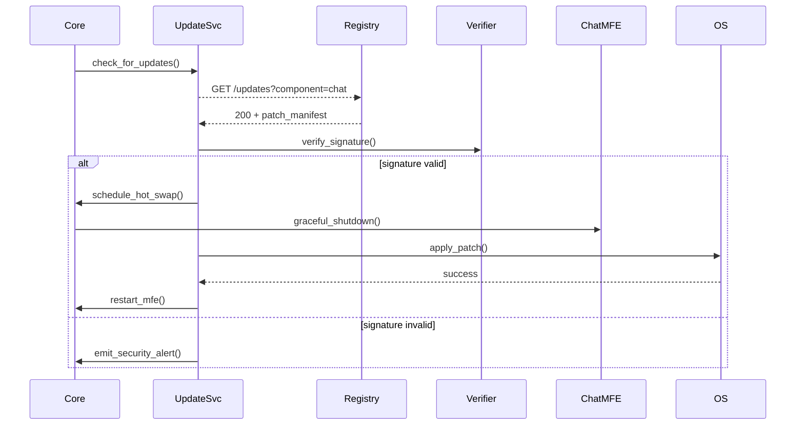

```markdown
<!--
docs/architecture.md
FlockDesk – Social Workspace Orchestrator
========================================
This document is part of the public developer SDK and licensed under the Apache 2.0
license.  It is version-controlled, reviewed, and distributed with every build. All
changes require a pull-request and at least one approval from the Architecture guild.
-->

# 1. High-Level Overview

FlockDesk turns a traditional desktop into a **collaborative social hub** by running
multiple _micro-front-ends_ (MFEs) in parallel—chat, presence, whiteboard, etc.—all
talking to a shared **local event bus**.  
Each MFE is an **independently deployable** Python (PySide6) process that can be
upgraded, restarted, or replaced without affecting the others.

```
+----------------------+         +-----------------------+
|  Chat MFE (PySide6)  |         |  Whiteboard MFE       |
|  ↳ Plugin: Polls     |         |  ↳ Plugin: StickyNote |
+----------+-----------+         +-----------+-----------+
           |                                 |
           |   (JSON / MsgPack over IPC)     |
+----------v---------------------------------v---------+
|                Local Event Bus (ZeroMQ)             |
+----------------+------------------------------------+
                 |
        +--------v----------+
        |  Core Orchestrator|
        |    (Headless)     |
        +--------+----------+
                 |
        +--------v----------+
        |  Update Service   |
        +-------------------+
```

# 2. Architectural Principles

| Principle                     | Description                                                                              |
| ----------------------------- | ---------------------------------------------------------------------------------------- |
| Micro-front-end isolation     | Each UI module runs in its own process and sandbox.                                      |
| Plugin-first mindset          | New functionality can be sideloaded at runtime; no restart required.                    |
| Event-driven communication    | Loose coupling via a high-throughput, in-memory event bus (ZeroMQ PUB/SUB).             |
| MVVM separation               | View ↔ ViewModel ↔ Model boundaries enforced to simplify unit testing and theming.       |
| Fail-fast & fault containment | Crashes are sandboxed to the offending service; diagnostics are forwarded to Sentry.     |
| Hot-swappable updates         | Each component can be individually updated while the system remains online.             |

# 3. Component Breakdown

Component            | Process | Language   | Responsibility
-------------------- | ------- | ---------- | ------------------------------------------------------------
Core Orchestrator    | 1       | Python     | Lifecycle of MFEs, IPC routing, global preferences
Event Bus            | 1       | C++/Python | ZeroMQ bridge; topic routing; back-pressure handling
Chat MFE             | 1       | Python     | Qt UI, messaging timeline, emoji reactions
Whiteboard MFE       | 1       | Python     | Vector drawing canvas, shape sync, PDF export
Presence Service     | 1       | Python     | Online/offline state, WebSocket gateway to cloud
Plugin Host(s)       | N       | Python     | Sandboxed runtime per plugin, same MVVM stack
Update Service       | 1       | Python     | Delta patching, signed binary validation, rollback
Crash Reporter       | 1       | Python     | Captures unhandled exceptions, minidumps, log bundles

# 4. Event Bus Specification

The bus is an **in-process** ZeroMQ `PUB/SUB` broker started by the Core Orchestrator.

Topic naming
```
flockdesk.<domain>.<aggregate>.<verb>
e.g. flockdesk.chat.message.sent
     flockdesk.whiteboard.element.updated
     flockdesk.presence.user.online
```

Envelope
```json
{
  "id"       : "5b54…",        // UUIDv7
  "topic"    : "flockdesk.chat.message.sent",
  "payload"  : { … },          // MsgPack binary
  "meta"     : {
      "ts"        : 1684846112.345,
      "schema"    : "chat/v2",
      "correl_id" : "…"        // For tracing
  }
}
```

Quality-of-service  
• In-memory for < 1 MiB/s messages  
• Falls back to on-disk ring-buffer when back-pressure > 80 %  
• Max delivery latency target ≤ 15 ms

# 5. Plugin System

1. **Discovery**: Plugins are `.fdplug` zip archives dropped into `$FLOCKDESK_HOME/plugins/`.
2. **Sandbox**: Each plugin is executed in its own interpreter with restricted `import` hooks.
3. **Lifecycle hooks**

```python
class PollPlugin(BasePlugin):
    def on_load(self, bus: EventBus, context: PluginContext) -> None: ...
    def on_unload(self) -> None: ...
```

4. **Versioning** follows _Semantic Versioning 2.0_ plus **capability contracts**.
5. **Security**: All plugins must be signed; the public key is embedded in the client.

# 6. MVVM Layering

```
┌───────────────┐  Binding   ┌─────────────────────────────┐
│    View       │ <────────> │  ViewModel (Reactive PyRx)  │
└───────────────┘            └─────────────┬───────────────┘
                                           │
                                           ▼
                                 ┌──────────────────────┐
                                 │    Domain Model      │
                                 └──────────────────────┘
```

1. **View**: Qt `.ui` files (Designer) + QSS themes.
2. **ViewModel**: Reactive streams, no direct Qt widgets allowed.
3. **Model**: Pure-Python domain logic; unit-test-only target.

# 7. Process Model and IPC

Communications matrix (simplified):

| From →\To ↓ | Core | Event Bus | Chat | Whiteboard | Plugin |
|-------------|------|-----------|------|------------|--------|
| Core        | —    | TCP IPC   | Spawn | Spawn     | Spawn  |
| Event Bus   | —    | —         | SUB   | SUB       | SUB    |
| Chat        | PUB  | SUB       | —     | —         | SUB    |
| Whiteboard  | PUB  | SUB       | —     | —         | SUB    |
| Plugin      | PUB  | SUB       | —     | —         | —      |

IPC transport selection at runtime:
```
if platform.system() == "Windows":
    transport = "ipc://flockdesk_{pid}.ipc"
else:
    transport = "unix:///tmp/flockdesk_{pid}.sock"
```

# 8. Auto-Update Service

Mermaid sequence:



Rollback strategy  
• Each deploy stores _N = 3_ previous versions in `~/.flockdesk/rollback/`  
• A failed start triggers automatic rollback and Sentry alert.

# 9. Error Handling & Crash Reporting

1. Every process installs `sys.excepthook` → `CrashReporter.capture()`.
2. Dumps contain: stack trace, last 5 000 bus messages, hardware stats, plugin list.
3. Privacy-first: PII scrubbing uses regex patterns maintained in `docs/pii_patterns.yml`.
4. Uploads are rate-limited (5 per hour) and compressed with Zstandard.

# 10. Security Considerations

• All IPC channels enforce `CurveZMQ` encryption (NaCl).  
• Secrets are stored via OS keyring (Keychain, DPAPI, GNOME Keyring).  
• The plugin sandbox blocks `subprocess`, `socket`, and `ctypes` by default.  
• CVE scanner (Grype) runs in CI; PRs fail if severity ≥ HIGH.

# 11. Data Flow Walk-through

Use-case: _User drags a PDF into the Whiteboard and shares it in chat._

1. Whiteboard publishes `flockdesk.whiteboard.asset.imported`.
2. Core Orchestrator enriches payload with cloud-storage URL.
3. Chat MFE subscribes and renders a chat bubble with the shared preview.
4. Presence Service updates typing indicators.
5. Plugins listening for `asset.imported` may perform side effects (e.g., embed in note).

# 12. Extending FlockDesk

Minimal hello-world plugin:

```python
# hello_world_plugin.py
from flockdesk.sdk import BasePlugin, EventBus

class HelloWorldPlugin(BasePlugin):
    name        = "Hello World"
    description = "Shows a toast every time a message is sent."
    version     = "1.0.0"

    def on_load(self, bus: EventBus, ctx):
        self._sub = bus.subscribe("flockdesk.chat.message.sent", self._on_message)

    def _on_message(self, evt):
        bus.publish("flockdesk.ui.toast.show", {"text": "👋 Hello from plugin!"})

    def on_unload(self):
        self._sub.dispose()
```

# 13. Glossary

Term                 | Meaning
-------------------- | --------------------------------------------------
MFE                  | Micro-front-end, isolated GUI process
Event Bus            | Local ZeroMQ PUB/SUB broker
Plugin               | Dynamically loaded extension packaged as `.fdplug`
MVVM                 | Model-View-ViewModel pattern for UI separation
CurveZMQ             | ZeroMQ’s built-in elliptic-curve encryption
Core Orchestrator    | Headless process supervising all others

---

_Last updated: {{ git_commit_hash }} • Build: {{ build_number }}_
```