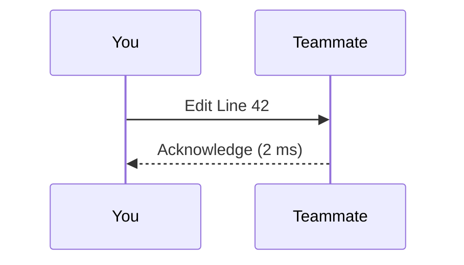

```markdown
---
title: FlockDesk User Guide
description: Learn everything you need to get productive with FlockDesk—setup, day-to-day workflows, power-user tips, and troubleshooting.
version: 1.0
last_updated: "2024-04-26"
---

# 02 • User Guide

Welcome to **FlockDesk**—your social workspace orchestrator.  
This guide walks you through daily usage, configuration, and advanced workflows.  
If you are looking for API documentation instead, see `docs/api/`.

---

## Table of Contents

1. [Getting Started](#getting-started)  
2. [Workspace Basics](#workspace-basics)  
3. [Live Collaboration](#live-collaboration)  
4. [Plugins & Extensions](#plugins--extensions)  
5. [Themes & Layouts](#themes--layouts)  
6. [Keyboard Shortcuts](#keyboard-shortcuts)  
7. [Settings & Preferences](#settings--preferences)  
8. [Troubleshooting](#troubleshooting)  
9. [FAQ](#faq)  
10. [Feedback & Support](#feedback--support)  

---

## Getting Started

### 1. System Requirements

| OS | Minimum Version | Notes |
|----|-----------------|-------|
| Windows | 10 21H2 | x64 only |
| macOS | 12 (Monterey) | Apple Silicon & Intel supported |
| Linux | Ubuntu 22.04 LTS | Wayland & X11 |

> Tip: FlockDesk is GPU-accelerated. Install the latest graphics drivers for best experience.

### 2. Installation

```bash
# Using the cross-platform installer (recommended)
curl -L https://downloads.flockdesk.io/latest | bash
```

The installer:
1. Verifies SHA-256 checksum & detached PGP signature
2. Installs into `~/FlockDesk` (Linux/macOS) or `%LOCALAPPDATA%\FlockDesk` (Windows)
3. Adds FlockDesk to your PATH and desktop menu
4. Registers the **FlockDesk Update Service** for automatic patch delivery

> Updating is hands-free. Only major (x.0) upgrades require confirmation.

### 3. First Launch

Run:

```bash
flockdesk
```

At first boot you will:
1. Sign in or create a FlockDesk ID
2. Grant microphone/screen-share permissions
3. Import or create your first **Workspace** (think: Slack team, Discord server)

---

## Workspace Basics

### Windows, Panels, & Docking

FlockDesk uses a **multi-window docking system** (powered by Qt’s `QMainWindow` + `QDockWidget`):

- Drag a panel by its tab to float it.
- Drop it on any edge to snap.
- Hold `Ctrl` while dragging to form tab groups.


### Presence & Status

Your status (online, away, do-not-disturb, invisible) syncs across all devices in <150 ms using the internal **Presence Service** over the event bus.

```python
from flockdesk.sdk import presence

# Example: Toggle DND for 60 minutes
presence.set_status("dnd", ttl=3600)
```

### File Sharing

Drag a file onto any chat window or press `Ctrl+U`.

Uploads are chunked, encrypted in-flight (TLS 1.3) and at rest (AES-256-GCM).  
Large files (≥2 GiB) seamlessly switch to the **Chunked Transfer Protocol (CTP)** without user intervention.

---

## Live Collaboration

### 1. Whiteboard

Open: `Tools ▸ Whiteboard` (`Ctrl+W`).

Features:
- Infinite canvas with tile-based rendering
- Real-time co-drawing (OT-based conflict resolution)
- Sticky-note mode (`N`)
- Laser pointer (`L`)

### 2. Co-Editing

Any text buffer originating in FlockDesk (code snippets, markdown notes, etc.) can be live-edited.



Under the hood:
- Operational Transformation (OT)
- Vector clocks for versioning
- CRDT fallback for high-latency peers

### 3. Screen Sharing

Press `Ctrl+Alt+S` or click the monitor icon.  
FlockDesk uses **WebRTC** with Selective Forwarding Unit (SFU) topology.

Privacy Controls:
- Window / Screen / App selection
- On-screen annotation
- Blur sensitive regions

---

## Plugins & Extensions

FlockDesk’s superpower is its **plugin-first architecture**.  

### Installing from Marketplace

1. Open `Marketplace` (`Ctrl+M`)
2. Browse or search (e.g. “Pomodoro Timer”)
3. Click **Install** → **Grant permissions**

### Sideloading

```bash
flockdesk plugins install my_widget.fdext
```

### Plugin Lifecycle

```python
# Every plugin implements IPlugin
class PollPlugin(IPlugin):
    def on_load(self, ctx: PluginContext):
        self.bus = ctx.event_bus
        self.bus.subscribe("chat.message", self._on_msg)

    def _on_msg(self, payload):
        if payload.text.startswith("/poll"):
            self._open_poll_dialog()

    def on_unload(self):
        self.bus.unsubscribe_all(self)
```

- Isolation: Each plugin lives in its own PySide6 process sandbox.
- Hot-reload: State is serialized via CBOR and restored on upgrade.

---

## Themes & Layouts

### Theme Switching

`View ▸ Themes` → pick *Light*, *Dark*, or *Match System*.  
Custom themes are **CSS-like QSS** files. Save in:

```
%APPDATA%\FlockDesk\themes     (Windows)
~/.config/flockdesk/themes     (Linux)
~/Library/Application Support/FlockDesk/themes  (macOS)
```

They appear automatically in the theme picker.

### Layout Profiles

Layouts (window arrangement, panel visibility, tabs) are synced via your FlockDesk ID.

CLI:

```bash
flockdesk layout save "4K-Monitor"
flockdesk layout load "Mobile-Portrait"
```

---

## Keyboard Shortcuts

| Action | Shortcut (Windows/Linux) | Shortcut (macOS) |
|--------|--------------------------|------------------|
| Quick Switcher | `Ctrl+K` | `⌘K` |
| Mute/Unmute | `Ctrl+Shift+M` | `⌘⇧M` |
| Toggle Whiteboard | `Ctrl+W` | `⌘W` |
| Global Push-to-Talk | `F10` | `F10` |
| Cycle Theme | `Ctrl+T` | `⌘T` |

Customize via `File ▸ Preferences ▸ Shortcuts`.

---

## Settings & Preferences

Settings are versioned and stored in **TOML**:

```toml
# ~/.config/flockdesk/settings.toml
[general]
language = "en_US"
telemetry = true

[chat]
font_family = "Inter"
show_timestamps = true
```

Programmatic access:

```python
from flockdesk.sdk import settings

settings.set("chat.font_family", "JetBrains Mono")
settings.save()
```

---

## Troubleshooting

### Crashes

1. The **CrashGuard** module restarts the affected micro-UI.  
2. A Sentry report is queued (opt-in).  
3. Logs are stored in:

   ```
   ~/.local/share/flockdesk/logs/{date}.log
   ```

Include the log file when contacting support.

### Common Issues

| Symptom | Fix |
|---------|-----|
| High CPU during screen share | Disable **FXAA** in `Settings ▸ Video` |
| “Cannot reach Event Bus” | Check if `flockdesk-bus` process is blocked by firewall |
| Audio echo | Enable **Echo Cancellation** or use headphones |

---

## FAQ

**Q:** _Is my data end-to-end encrypted?_  
**A:** Yes, for 1-to-1 DMs. Group channels use server-side encryption with rotating keys.

**Q:** _Can I host FlockDesk on-premises?_  
**A:** A self-hosted edition is in private beta. Contact sales.

**Q:** _Does FlockDesk support Wayland?_  
**A:** 100%. Clipboard & drag-and-drop are native.

---

## Feedback & Support

- **Bug Reports:** `Help ▸ Report Issue` (attaches logs & diagnostics)
- **Feature Requests:** https://ideas.flockdesk.io
- **Community Chat:** `#flockdesk-users` on Matrix
- **Email:** support@flockdesk.io

Thank you for using FlockDesk ♥
```