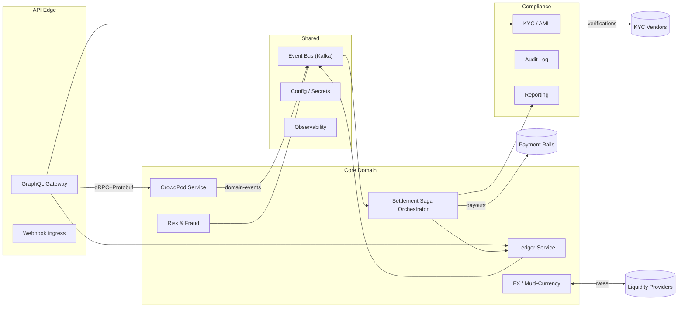
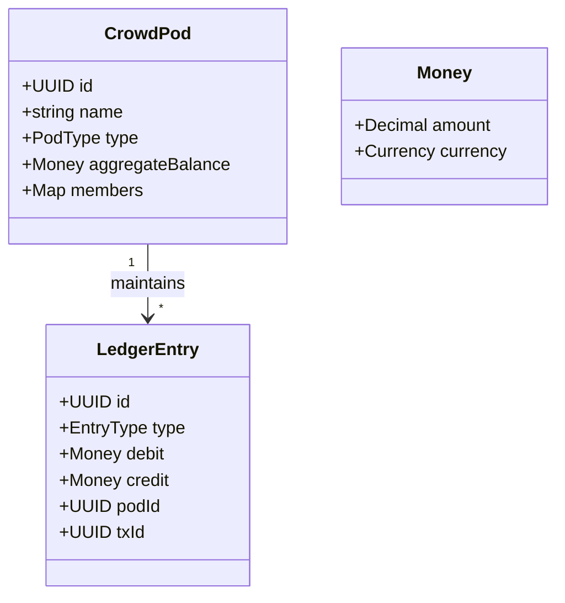

```markdown
# CrowdPay Connect – Architecture Overview
*Version: 1.2.0 – Last updated: 2024-06-06*

CrowdPay Connect is a **social-first, component-based** fintech platform that enables communities to create dynamic payment circles called **“CrowdPods.”**  
This document provides a concise, implementation-oriented view of the platform’s architecture, including service boundaries, data flows, code snippets, and security considerations.

---

## 1 Macro Architecture



### Service Responsibility Matrix (condensed)
• CrowdPod Service – CRUD, membership, role-based access  
• Ledger Service – double-entry bookkeeping, balance snapshots  
• Risk & Fraud – real-time scoring, velocity rules, graph-based anomaly detection  
• FX Service – managed currency conversion with SLA-backed liquidity  
• Saga Orchestrator – long-running transactions across services/PSPs  
• Compliance Suite – KYC, AML monitoring, GDPR/CCPA tooling  

---

## 2 Domain Model Highlights



---

## 3 Event Sourcing + CQRS

All mutating commands generate immutable domain events persisted to the **Event Store** (`PostgreSQL` + `wal2json`). Read models are projected asynchronously to Materialized Views (`TimescaleDB`).

### Minimal Python Event Sourcing Skeleton

```python
"""
crowdpay_connect/eventsourcing.py
Production-grade, simplified for documentation.
"""
from __future__ import annotations
from dataclasses import dataclass, asdict
from datetime import datetime, timezone
from typing import Protocol, List, Dict, Callable, Type
import json
import uuid
import logging

logger = logging.getLogger("crowdpay.events")
logger.setLevel(logging.INFO)


# ---------- Event Definitions -----------------------------------------------
@dataclass(frozen=True, slots=True)
class Event(Protocol):
    aggregate_id: uuid.UUID
    occurred_at: datetime


@dataclass(frozen=True, slots=True)
class PodCreated(Event):
    name: str
    currency: str


@dataclass(frozen=True, slots=True)
class FundsDeposited(Event):
    amount: str  # minor units
    currency: str


# ---------- Serializer / Store ----------------------------------------------
class JsonEventSerializer:
    """Serialize events to JSON preserving full type metadata."""
    @staticmethod
    def serialize(event: Event) -> str:
        payload = {"type": event.__class__.__qualname__, **asdict(event)}
        return json.dumps(payload, default=str)

    @staticmethod
    def deserialize(raw: str) -> Event:
        payload = json.loads(raw)
        typ = _event_registry[payload.pop("type")]
        return typ(**payload)  # type: ignore[arg-type]


_event_registry: Dict[str, Type[Event]] = {
    cls.__qualname__: cls for cls in (PodCreated, FundsDeposited)
}


class PostgresEventStore:
    """Blocking, transactional event store (simplified)."""

    def __init__(self, conn):
        self._conn = conn

    def append(self, events: List[Event]) -> None:
        with self._conn.cursor() as cur:
            for event in events:
                cur.execute(
                    """
                    INSERT INTO event_store (aggregate_id, occurred_at, payload)
                    VALUES (%s, %s, %s)
                    """,
                    (
                        str(event.aggregate_id),
                        event.occurred_at.isoformat(),
                        JsonEventSerializer.serialize(event),
                    ),
                )
        self._conn.commit()
        logger.info("Persisted %d events", len(events))
```

---

## 4 Saga Pattern for Settlement

CrowdPay Connect settles complex flows atomically using a **distributed Saga**. Compensation actions are idempotent and *replay-safe*.

### Pythonic Saga Orchestrator (high-level)

```python
"""
crowdpay_connect/settlement/saga.py
Production-grade (trimmed).
"""
from typing import Callable, List, Dict
import asyncio
import logging

log = logging.getLogger("crowdpay.saga")

class Step:
    def __init__(
        self,
        forward: Callable[..., asyncio.Future],
        compensate: Callable[..., asyncio.Future],
        name: str,
    ):
        self.forward = forward
        self.compensate = compensate
        self.name = name


class Saga:
    def __init__(self, steps: List[Step]):
        self.steps = steps
        self._completed: List[Step] = []

    async def execute(self, ctx: Dict) -> None:
        try:
            for step in self.steps:
                log.info("➡️  Executing step: %s", step.name)
                await step.forward(ctx)
                self._completed.append(step)
            log.info("✅ Saga completed successfully")
        except Exception as exc:
            log.warning("⚠️  Saga failed: %s – triggering compensations", exc)
            await self._rollback(ctx)
            raise

    async def _rollback(self, ctx: Dict) -> None:
        for step in reversed(self._completed):
            log.info("↩️  Compensating: %s", step.name)
            try:
                await step.compensate(ctx)
            except Exception as e:
                log.error("Compensation failed for %s: %s", step.name, e)
```

---

## 5 Security By Design

1. **Zero-Trust** – gRPC mutual-TLS between microservices, rotated every 24 h.  
2. **E2E Encryption** – user PII encrypted with envelope keys (AWS KMS).  
3. **Auth-Z** – CrowdPods leverage fine-grained policy via *Open Policy Agent*.  
4. **Audit Trail** – every state-change event is hashed and anchored on an L2 public blockchain for tamper-evidence.  

---

## 6 Sample Payment Flow

```mermaid
sequenceDiagram
    participant U as User
    participant G as GraphQL Gateway
    participant P as CrowdPod Svc
    participant L as Ledger Svc
    participant R as Risk
    participant S as Saga Orch
    participant PSP as Payment Rail

    U->>G: createCharge(multiCurrency=True)
    G->>P: POST /pods/{id}/charge
    P-->>R: risk.assess()
    R-->>P: score=Low
    P->>S: startSaga(chargeId)
    S->>L: reserveFunds()
    L-->>S: reserved
    S->>PSP: captureFunds()
    PSP-->>S: ok
    S->>L: commitFunds()
    L-->>S: committed
    S-->>P: sagaCompleted
    P-->>G: 200 OK
    G-->>U: Payment Success 🚀
```



---

## 7 Operational Concerns

• **Observability** – OpenTelemetry traces exported to Grafana Cloud (`tempo`, `loki`, `mimir`).  
• **Resilience** – Circuit-breakers (`pybreaker`) guard all external PSPs.  
• **Blue-Green Deployments** – orchestrated via Argo Rollouts; canary analysis automated.  
• **Chaos Tests** – weekly fault injection with Gremlin to validate compensation logic.  

---

## 8 Roadmap & Pending Work

- Social graph-based credit line *βeta* – Q4 2024  
- Tokenized reward layer (NFT-backed badges) – Q1 2025  
- ISO 20022 message connector – Q2 2025  

> For detailed ADRs and protobuf contract definitions, refer to  
> `docs/architecture/adr/` and `proto/contracts/`.

---
© 2024 CrowdPay Connect – All rights reserved.
```