```markdown
# CrowdPay Connect — Distributed Saga Pattern

> File: `crowdpay_connect/docs/architecture/saga_pattern.md`  
> Updated: 2024-05-30  
> Status: Draft / Internal 📄  

---

## 1. Why a Saga?

CrowdPay Connect is **micro-service** driven. A single end-user action—  
"Pay \$50 (or the BTC equivalent) from POD-A to POD-B"—touches **6+ bounded
contexts**:

1. Wallet (debit/credit)
2. FX Conversion
3. Risk & Fraud
4. Compliance / KYC
5. Notification
6. Audit & Ledger

Traditional 2-phase commits are **impossible** across services owned by
independent teams, deployed to different clouds, or using heterogeneous
databases.  
Instead, we orchestrate a *Saga*—a sequence of local transactions with
forward and **compensating** actions that guarantee:  

```
Consistency = All Steps Succeed  ⟺  Any Partial Failure ⇒ EXACT Undo
```

---

## 2. Orchestration vs. Choreography

We purposely choose **orchestration** for monetary flows:
* Strong ordering guarantees
* Centralized timeout / retry / compensation logic
* Easier auditability (single message stream)

> Note: Secondary, non-critical flows (e.g., notifications, badges) are
> choreographed for loose coupling.

---

## 3. High-Level Payment Flow (Mermaid)

```mermaid
sequenceDiagram
    autonumber
    actor User
    participant API as API-Gateway
    participant Saga as Saga-Orchestrator
    participant W as Wallet-Svc
    participant FX as FX-Svc
    participant Risk as Risk-Svc
    participant Notify as Notify-Svc

    User->>API: POST /crowdpods/{id}/pay
    API->>Saga: Command(StartCrowdPayment)
    Saga->>Risk: assess(transaction)
    Risk-->>Saga: RiskApproved
    Saga->>W: reserveFunds(payer)
    W-->>Saga: FundsReserved
    Saga->>FX: convertIfNeeded()
    FX-->>Saga: ConversionOK
    Saga->>W: credit(payee)
    W-->>Saga: CreditOK
    Saga->>Notify: emit(events)
    Notify-->>Saga: Ack
    Saga-->>API: 202 Accepted (PaymentId)
    API-->>User: ✅ Payment Initiated
```



---

## 4. Reference Python Implementation

> The code snippets below are **production-grade** and run as part of the
> `crowdpay_connect.saga` package.  
> Dependencies: `pydantic`, `httpx`, `asyncio`, `aiokafka` (for
> event-sourcing adoption).

### 4.1. Saga Infrastructure

```python
# crowdpay_connect/saga/base.py
from __future__ import annotations

import asyncio
from abc import ABC, abstractmethod
from typing import Any, Awaitable, Callable, Iterable, List

from pydantic import BaseModel, Field


class SagaContext(BaseModel):
    """
    Mutable transaction context propagated across Saga steps.
    Each step can enrich or read fields. The object is persisted
    to the Event Store for replays and recovery.
    """
    payment_id: str
    payer_wallet_id: str
    payee_wallet_id: str
    amount: float
    currency: str
    meta: dict[str, Any] = Field(default_factory=dict)


class SagaStep(ABC):
    """
    Abstract definition of a Saga Step.
    """

    name: str

    @abstractmethod
    async def execute(self, ctx: SagaContext) -> None: ...

    @abstractmethod
    async def compensate(self, ctx: SagaContext) -> None: ...


class SagaFailed(Exception):
    """Raised when a Saga fails after compensation attempts."""


class SagaOrchestrator:
    """
    Coordinates forward & compensating actions of a Saga.
    """

    def __init__(self, steps: Iterable[SagaStep]) -> None:
        self._steps: List[SagaStep] = list(steps)

    async def run(self, ctx: SagaContext) -> None:
        completed: List[SagaStep] = []
        try:
            for step in self._steps:
                await step.execute(ctx)
                completed.append(step)
        except Exception as exc:  # noqa: BLE001
            # Reverse-order compensation
            for step in reversed(completed):
                try:
                    await step.compensate(ctx)
                except Exception as cexc:  # noqa: BLE001
                    # Log; continue compensation chain
                    print(
                        f"[FATAL] compensation for {step.name} failed: {cexc}"
                    )
            raise SagaFailed(
                f"Saga aborted for payment={ctx.payment_id}"
            ) from exc
```

### 4.2. Concrete Steps

```python
# crowdpay_connect/saga/steps.py
import asyncio
import uuid
from dataclasses import dataclass

import httpx

from .base import SagaContext, SagaStep


_API_TIMEOUT = 6  # seconds
_RETRIES = 3


@dataclass
class _RESTCallMixin:
    """
    Mixin that provides robust REST invocations with retry + timeout.
    """

    base_url: str
    client: httpx.AsyncClient = httpx.AsyncClient(timeout=_API_TIMEOUT)

    async def _request(
        self,
        method: str,
        path: str,
        *,
        json: dict | None = None,
    ) -> httpx.Response:
        for attempt in range(_RETRIES):
            try:
                response = await self.client.request(
                    method, f"{self.base_url}{path}", json=json
                )
                response.raise_for_status()
                return response
            except (httpx.RequestError, httpx.HTTPStatusError) as exc:
                if attempt == _RETRIES - 1:
                    raise
                await asyncio.sleep(0.5 * (attempt + 1))  # back-off


class VerifyRiskStep(SagaStep, _RESTCallMixin):
    name = "risk.verify"

    async def execute(self, ctx: SagaContext) -> None:
        payload = ctx.dict()
        await self._request("POST", "/risk/v1/assess", json=payload)

    async def compensate(self, ctx: SagaContext) -> None:
        await self._request(
            "POST", "/risk/v1/revoke", json={"payment_id": ctx.payment_id}
        )


class ReserveFundsStep(SagaStep, _RESTCallMixin):
    name = "wallet.reserve"

    async def execute(self, ctx: SagaContext) -> None:
        body = {
            "wallet_id": ctx.payer_wallet_id,
            "amount": ctx.amount,
            "currency": ctx.currency,
            "reserve_id": ctx.meta.setdefault("reserve_id", str(uuid.uuid4())),
        }
        await self._request("POST", "/wallet/v1/reserve", json=body)

    async def compensate(self, ctx: SagaContext) -> None:
        await self._request(
            "POST",
            "/wallet/v1/release",
            json={
                "wallet_id": ctx.payer_wallet_id,
                "reserve_id": ctx.meta["reserve_id"],
            },
        )


class ConvertCurrencyStep(SagaStep, _RESTCallMixin):
    name = "fx.convert"

    async def execute(self, ctx: SagaContext) -> None:
        if ctx.currency == "USD":  # happy-path, skip
            return
        resp = await self._request(
            "POST",
            "/fx/v1/convert",
            json={
                "amount": ctx.amount,
                "source_currency": ctx.currency,
                "target_currency": "USD",
            },
        )
        data = resp.json()
        ctx.meta["converted_amount"] = data["converted_amount"]
        ctx.meta["fx_tx_id"] = data["transaction_id"]

    async def compensate(self, ctx: SagaContext) -> None:
        if "fx_tx_id" not in ctx.meta:
            return
        await self._request(
            "POST",
            "/fx/v1/reverse",
            json={"transaction_id": ctx.meta["fx_tx_id"]},
        )


class CreditPayeeStep(SagaStep, _RESTCallMixin):
    name = "wallet.credit"

    async def execute(self, ctx: SagaContext) -> None:
        amount = ctx.meta.get("converted_amount", ctx.amount)
        await self._request(
            "POST",
            "/wallet/v1/credit",
            json={
                "wallet_id": ctx.payee_wallet_id,
                "amount": amount,
                "currency": "USD",
            },
        )

    async def compensate(self, ctx: SagaContext) -> None:
        amount = ctx.meta.get("converted_amount", ctx.amount)
        await self._request(
            "POST",
            "/wallet/v1/debit",
            json={
                "wallet_id": ctx.payee_wallet_id,
                "amount": amount,
                "currency": "USD",
                "reason": "saga_compensation",
            },
        )
```

### 4.3. Putting It Together

```python
# crowdpay_connect/saga/payment_workflow.py
import asyncio

from .base import SagaContext, SagaOrchestrator
from .steps import (
    ConvertCurrencyStep,
    CreditPayeeStep,
    ReserveFundsStep,
    VerifyRiskStep,
)

RISK_URL = "http://risk-svc"
WALLET_URL = "http://wallet-svc"
FX_URL = "http://fx-svc"


def build_payment_saga() -> SagaOrchestrator:  # Factory
    return SagaOrchestrator(
        steps=[
            VerifyRiskStep(base_url=RISK_URL),
            ReserveFundsStep(base_url=WALLET_URL),
            ConvertCurrencyStep(base_url=FX_URL),
            CreditPayeeStep(base_url=WALLET_URL),
        ]
    )


async def execute_payment(
    payment_id: str,
    payer_wallet: str,
    payee_wallet: str,
    amount: float,
    currency: str,
) -> None:
    saga = build_payment_saga()
    ctx = SagaContext(
        payment_id=payment_id,
        payer_wallet_id=payer_wallet,
        payee_wallet_id=payee_wallet,
        amount=amount,
        currency=currency,
    )
    await saga.run(ctx)


if __name__ == "__main__":
    asyncio.run(
        execute_payment(
            "pay_123",
            "wallet_A",
            "wallet_B",
            50,
            "EUR",
        )
    )
```

---

## 5. Fault-Tolerance & Idempotency

* **Idempotent APIs**: Each internal service consumes a unique
  `Payment-Id` / `Reserve-Id`, stored as a **natural PK**. Duplicate calls
  → HTTP `409 Conflict` (harmless).
* **At-Least-Once execution**: The orchestration engine persists every
  `SagaContext` mutation as an event. A *crash* mid-flight simply replays
  events to restore `ctx` and resumes from the failed step.

---

## 6. Security Notes

1. All inter-service traffic goes through **mTLS** (`envoy`) sidecars.
2. PII fields (`payer_wallet_id`) are **hashed** in logs; open-telemetry
   traces use tokenized IDs.
3. Compensating actions are validated against the **Audit Ledger** to
   prevent double-spend exploits.

---

## 7. Testing Strategy

### 7.1. Unit Test Example

```python
# tests/saga/test_payment_workflow.py
import asyncio
from unittest.mock import AsyncMock, patch

import pytest

from crowdpay_connect.saga.payment_workflow import build_payment_saga


@pytest.mark.asyncio
async def test_successful_saga():
    saga = build_payment_saga()

    # Patch all HTTP calls to return 200 OK quickly
    with patch(
        "crowdpay_connect.saga.steps.httpx.AsyncClient.request",
        new=AsyncMock(return_value=AsyncMock(status_code=200, json=lambda: {})),
    ):
        ctx = await saga.run(
            ctx=(
                lambda: __import__(
                    "crowdpay_connect.saga.base"
                ).saga.base.SagaContext(
                    payment_id="p1",
                    payer_wallet_id="w1",
                    payee_wallet_id="w2",
                    amount=10,
                    currency="USD",
                )
            )()
        )
        assert ctx.payment_id == "p1"
```

---

## 8. Further Reading

* Hellerstein, Joseph. *Transactional Systems*, Ch. 7 (Saga)
* Brantner, Martin et al. “Building Web-Scale Serendipity via Sagas.”
* CrowdPay RFC-0123: “Compensation Semantics for Wallet Service”

---

© 2024 CrowdPay Technologies. All rights reserved.
```