```markdown
---
title: "PCI DSS Scope and Segmentation Strategy"
description: >
  Defines the PCI DSS scope for the **CrowdPay Connect** platform, identifies all
  system components that store, process, or transmit cardholder data (CHD) or
  sensitive authentication data (SAD), and documents the segmentation controls
  that isolate the Cardholder Data Environment (CDE) from the remainder of the
  micro-service estate.
last-reviewed: 2023-12-02
owner: "Security & Compliance Engineering"
revision: "v1.2.0"
---

# PCI DSS Scope

CrowdPay Connect is classified as a **Level 2 Service Provider** under PCI DSS
v4.0 because we process < 1 M Visa + Mastercard transactions annually through
our multi-currency payment services.

This document explains **what is in scope**, **what is out of scope**, and **how
segmentation is enforced**—allowing auditors to quickly verify that CrowdPay’s
technical and operational controls align with the 12 PCI requirements.

---

## 1  System Architecture (High-Level)

```mermaid
flowchart TD
    subgraph AWS["AWS (VPC–Prod)"]
        direction TB
        classDef CDE fill:#ffeeee,stroke:#d33
        classDef Public fill:#e0f1ff,stroke:#0072ce

        A[Internet]:::Public -->|TLS 1.2| ELB[Elastic Load Balancer]:::Public
        ELB -->|mTLS 8080| API_GW[API Gateway<br/>(Public Edge)]:::Public

        subgraph App["Kubernetes EKS Cluster"]
            direction TB
            API_GW -->|Istio mTLS 8443| Payment_Svc[Payment Service<br/>(Go)]:::CDE
            API_GW -->|Istio mTLS 8443| KYC_Svc[KYC Service<br/>(Python)]:::Public
            API_GW -->|Istio mTLS 8443| Social_Svc[Social Graph<br/>(Node)]:::Public
        end

        subgraph Data["Encrypted Data Stores"]
            direction LR
            Payment_Svc -->|AES-256| Vault[HSM-backed Hashicorp Vault]:::CDE
            Payment_Svc -->|TLS/1.3| Token_DB[PostgreSQL Token Store]:::CDE
            KYC_Svc -->|TLS/1.3| KYC_DB[DynamoDB]:::Public
        end
    end
```

Anything shaded **red** represents the Cardholder Data Environment (CDE). All
other segments are **public zone services** that are restricted from CHD/SAD.

---

## 2  Data Flows

```mermaid
sequenceDiagram
    participant C as Cardholder
    participant M as Merchant App
    participant GW as CrowdPay API Gateway
    participant PS as Payment Service (CDE)
    participant TS as Token Store
    participant ACQ as Acquirer

    C->>M: Enters PAN in iFrame
    M->>GW: Tokenized PAN (JWT)
    GW->>PS: Validate JWT + Forward
    PS->>TS: Store Token ↔ PAN (AES-256)
    PS->>ACQ: Forward Auth Request (PCI-Compliant)
    ACQ-->>PS: Auth Response
    PS-->>GW: Authorization Token
    GW-->>M: API 200 OK (tokenRef)
```



CHD is restricted to the **Payment Service** and **Token Store** only. Tokenized
values are used everywhere else.

---

## 3  Inventory of In-Scope Components

| Layer             | Component / Service                       | Reason in Scope                          | PCI Req Ref |
|-------------------|-------------------------------------------|------------------------------------------|-------------|
| Application       | `payment-service` (Go, container)         | Stores/processes PAN before tokenization | 3, 6, 7, 8  |
| Data              | `token_store` (PostgreSQL w/ pgcrypto)    | Stores encrypted PAN                     | 3, 10       |
| Security Control  | `vault` (FIPS 140-2 HSM)                  | Key management for tokenization & FDE    | 3           |
| Network           | Istio service-mesh ingress/egress rules   | Segmentation firewall                    | 1           |
| Infrastructure    | Kubernetes worker nodes (CDE node-pool)   | Host CDE pods                            | 1, 2        |

All other services—`kyc-service`, `social-service`, `risk-engine`,
`audit-service`, etc.—**never store or process CHD** and are outside the PCI
scope.

---

## 4  Segmentation & Access Controls

1. **Network Firewalls**  
   • Only the **Payment Service** can initiate outbound TLS traffic to the
   acquiring bank IP ranges.  
   • ACLs block east-west traffic from non-CDE namespaces.

2. **Kubernetes Namespaces**  
   • `cde-prod` namespace is isolated with its own Calico network policy.  
   • Pods run with [restricted PodSecurityProfiles].

3. **Service Mesh Policy**  
   • Istio `AuthorizationPolicy` denies traffic to CDE workloads unless the
   incoming request carries a **SPIFFE SVID** belonging to `payment-service`.

4. **IAM**  
   • `payment_service` role is the **only** principal permitted to call
   `vault:pki/decrypt` APIs.

---

## 5  Compensating Controls for Shared Services

| Control           | Justification                                                                                     |
|-------------------|----------------------------------------------------------------------------------------------------|
| **HSM-backed encryption** | Protects PAN at rest; crypto operations executed inside dedicated HSM boundary.            |
| **Dual control & split knowledge** | Root CA keys for tokenization require two separate security officers to sign.       |
| **Continuous IAM attestation** | Automated policy-as-code (OPA) validates no privilege creep occurs in the CDE roles. |

---

## 6  Example Tokenization Workflow (Python)

```python
"""Minimal tokenization client used by non-CDE services."""

from dataclasses import dataclass
from typing import Optional
import httpx

API_BASE = "https://api.crowdpay-connect.com"
TOKENIZE_ENDPOINT = f"{API_BASE}/v1/payments/tokenize"
TIMEOUT_SECONDS = 3


@dataclass(frozen=True)
class TokenizedPan:
    token: str
    scheme: str
    last4: str
    exp_month: int
    exp_year: int


class TokenizationError(RuntimeError):
    """Raised when tokenization fails or returns an unexpected status."""

    def __init__(self, message: str, status_code: Optional[int] = None) -> None:
        super().__init__(message)
        self.status_code = status_code


def tokenize_pan(pan: str, exp: str, cvv: str) -> TokenizedPan:
    """
    Sends raw PAN data to the CDE over mTLS. The caller **must** run in a
    non-browser environment to prevent PAN exposure in client logs.
    """
    payload = {"pan": pan, "exp": exp, "cvv": cvv}

    # Transport is pre-configured with client-side certificates & HSTS pinning
    with httpx.Client(timeout=TIMEOUT_SECONDS, verify="/etc/ssl/cde-ca.pem") as client:
        resp = client.post(TOKENIZE_ENDPOINT, json=payload)

    if resp.status_code != 201:
        raise TokenizationError(
            f"Tokenization failed: {resp.text}", status_code=resp.status_code
        )

    data = resp.json()
    return TokenizedPan(
        token=data["token"],
        scheme=data["scheme"],
        last4=data["last4"],
        exp_month=data["exp_month"],
        exp_year=data["exp_year"],
    )
```

The above client **never stores the raw PAN on disk**; memory is zeroized using
the Python garbage collector once the function returns.

---

## 7  Logging & Monitoring

Requirement 10 mandates **audit logging**—all CDE services:

• Emit logs via `stderr` => Fluent Bit => Amazon Kinesis Firehose  
• Include PCI-recommended fields (user, type, date, success, origination)  
• Are immutable and write-once within 24 hours of creation  
• Are retained for **13 months** (12 months + current month)

---

## 8  Responsibility Matrix

| PCI DSS Control         | CrowdPay (Platform) | Merchants (CrowdPod Owners) | Notes                               |
|-------------------------|:-------------------:|:---------------------------:|-------------------------------------|
| 1  – Network Security   | ✅                  | 🚫                          | Merchants never touch infra         |
| 2  – System Hardening   | ✅                  | 🚫                          |                                     |
| 3  – Protect CHD        | ✅                  | 🚫                          | Tokenization enforced               |
| 4  – Encrypt Transmit   | ✅                  | 🚫                          | End-to-end TLS v1.2+                |
| 5  – AV & Malware       | ✅                  | 🚫                          | EDR agents + Falco                  |
| 6  – Secure Dev         | ✅                  | 🚫                          | SDLC with SAST/DAST                 |
| 7  – Access Control     | ✅                  | 🚫                          | Least privilege (OPA Gatekeeper)    |
| 8  – AuthN              | ✅                  | 🚫                          | mTLS + hardware tokens              |
| 9  – Physical Security  | AWS                | 🚫                          | SOC 1 report covers env             |
| 10 – Logging            | ✅                  | 🚫                          | Centralized, immutable              |
| 11 – Testing            | ✅                  | 🚫                          | ASV scans, quarterly penetration    |
| 12 – Policy             | ✅                  | 🚫                          | Annual review                       |

---

## 9  Compliance Validation

* **ASV Scans** — Quarterly external & internal scans executed by **ControlScan**  
* **Quarterly Pen-Test** — CREST-certified red-team covers social & API horizon  
* **ROC** *(Report on Compliance)* — Performed annually by *K3DES Qualified
  Security Assessor* (QSA)  
* **AOC** *(Attestation of Compliance)* — Distributed to enterprise partners
  under NDA (FedRAMP equivalency accepted)

---

## 10  Revision History

| Date (YYYY-MM-DD) | Version | Author                | Change Summary                               |
|-------------------|---------|-----------------------|---------------------------------------------|
| 2023-12-02        | 1.2.0   | J. Roux (CISO)        | Segregated CDE worker node-pool in EKS       |
| 2023-09-15        | 1.1.0   | H. Chen (SRE)         | Added Istio mTLS policy + SPIFFE SVID gates  |
| 2023-06-08        | 1.0.0   | A. Nadir (Lead Eng)   | Initial PCI scope definition                 |

---

> **NOTE:** This document is considered *controlled* under CrowdPay’s change-
> management program (S-002). Any modification must follow the **Pull-Request
> with 2-person review** workflow, and a QSA must sign off on material scope
> changes before merging to `main`.
```