```markdown
---
title: CrowdPay Connect – Production Deployment Strategy  
description: End-to-end guide for provisioning infrastructure, packaging micro-services, and performing safe, compliant roll-outs of the CrowdPay Connect platform.  
last_updated: "2024-05-31"
---

# Deployment Strategy

> **Audience:** DevOps engineers, SREs, and FinTech compliance stakeholders  
> **Applies to:** `main` branch (production) and all long-lived environment branches (`staging`, `sandbox`)

CrowdPay Connect is a distributed, event-sourced platform written in Python 3.12. The system is composed of independently deployable micro-services that communicate over **gRPC** and **NATS JetStream**. The platform is packaged as **OCI images** and deployed to a **Kubernetes (K8s)** control-plane across multiple regions.

This document describes:

1. Infrastructure topology  
2. CI/CD workflow (build, test, sign, publish, deploy)  
3. Secrets & key management  
4. Release strategies (canary, blue/green, hot-patch)  
5. Observability, scaling, and disaster recovery  
6. Compliance checkpoints

---

## 1. Infrastructure Topology

| Layer                    | Technology                                   | Notes                                                                  |
|--------------------------|----------------------------------------------|------------------------------------------------------------------------|
| Edge / Ingress          | AWS ALB + AWS WAF                            | Enforces geo-blocking & rate-limiting before traffic reaches K8s       |
| Service Mesh            | Istio 1.21                                   | mTLS, traffic splitting, and circuit-breaking                          |
| Compute                 | EKS (Kubernetes 1.29)                        | Managed node groups w/ Bottlerocket AMIs                               |
| Data Layer              | Aurora PostgreSQL, DynamoDB, Redis, Kafka    | RDS for relational, Dynamo for ledger snapshots, Redis for caching     |
| Event Store             | CockroachDB (multi-region)                   | Strongly consistent, supports global Saga transactions                 |
| Object Storage          | S3 w/ Object Lock (compliance mode)          | Immutable audit logs                                                   |
| Secrets                 | HashiCorp Vault + AWS KMS                    | PKI root CA rotated every 90 days                                      |
| IaC                     | Terraform 1.8 + Terragrunt                   | Zero-touch, Git-driven environments                                    |
| CI/CD                   | GitHub Actions + Argo CD                     | SBOM signing via Cosign                                                |

### 1.1 Region Matrix

| Environment | Primary | Secondary (fail-over) |
|-------------|---------|-----------------------|
| Production  | `us-east-1` | `us-west-2` |
| Staging     | `us-east-1` | *single-region*     |
| Sandbox     | `us-east-1` | *single-region*     |

---

## 2. CI/CD Workflow

```mermaid
graph TD
    checkout["🛎️ GitHub Push"]
    build["🛠️ Build & Unit Tests"]
    lint["🔍 Static Analysis (ruff, mypy)"]
    scan["🛡️ Trivy Scan"]
    sign["🔏 Cosign SBOM"]
    push["📦 Push OCI Image"]
    cd["🚀 Argo CD Sync"]

    checkout --> build --> lint --> scan --> sign --> push --> cd
```



### 2.1 Sample GitHub Actions Workflow (`.github/workflows/ci.yml`)

```yaml
name: ci
on:
  push:
    branches: [main, staging, sandbox]

permissions:
  contents: read
  id-token: write  # needed for OIDC

jobs:
  build-test-sign:
    runs-on: ubuntu-latest
    steps:
      - uses: actions/checkout@v4

      - name: Set up Python
        uses: actions/setup-python@v5
        with:
          python-version: "3.12"

      - name: Install Poetry
        run: pipx install poetry==1.8.*

      - name: Install deps
        run: poetry install --no-root

      - name: Run unit tests
        run: poetry run pytest -q

      - name: Static analysis
        run: |
          poetry run ruff check .
          poetry run mypy .

      - name: Build image
        run: |
          docker build -t ${{ env.IMAGE }}:${{ github.sha }} .
          docker scan --accept-license ${{ env.IMAGE }}:${{ github.sha }}

      - name: SBOM + Cosign Sign
        env:
          COSIGN_EXPERIMENTAL: "1"
        run: |
          syft ${{ env.IMAGE }}:${{ github.sha }} -o spdx-json > sbom.json
          cosign sign --key awskms://arn:aws:kms:us-east-1:123:key/abcd ${{ env.IMAGE }}:${{ github.sha }}

      - name: Push to ECR
        run: |
          aws ecr get-login-password | docker login --username AWS --password-stdin ${{ env.AWS_REGISTRY }}
          docker push ${{ env.IMAGE }}:${{ github.sha }}

  deploy:
    needs: build-test-sign
    uses: ./.github/workflows/deploy.yml
```

---

## 3. Secrets & Key Management

1. **Vault** is the single source of truth for application secrets.  
2. Short-lived JSON Web Tokens (15 min) are minted via OIDC between GitHub Actions and Vault.  
3. Service-to-service traffic is encrypted with **Istio’s mTLS** (X.509 certificates rotated every 24 h).  
4. Customer PII is encrypted at rest using **AES-256-GCM** keys held in **AWS KMS** with automatic rotation.  
5. All database credentials are injected as **Kubernetes sealed secrets** at deploy-time.

---

## 4. Release Strategies

| Type       | Use-case                                | Tooling (Istio)    |
|------------|-----------------------------------------|--------------------|
| Canary     | Gradual exposure for risky features     | `VirtualService`   |
| Blue/Green | Large upgrades requiring instant rollback | `DestinationRule`  |
| Hot-Patch  | CVE fixes on critical paths             | `istioctl` + `kubectl rollout restart` |

### 4.1 Canary Roll-out Example

```yaml
apiVersion: networking.istio.io/v1beta1
kind: VirtualService
metadata:
  name: risk-engine
spec:
  hosts: ["risk-engine.svc.cluster.local"]
  http:
    - route:
        - destination:
            host: risk-engine
            subset: v2
          weight: 10
        - destination:
            host: risk-engine
            subset: v1
          weight: 90
```

Traffic gradually shifts from `v1` ➜ `v2` while Prometheus SLOs (`latency_p99`, `error_rate`) are monitored by **Argo Rollouts**. A breach in thresholds triggers an automatic rollback.

---

## 5. Observability & Scaling

* **Prometheus Operator** – metrics aggregation  
* **Grafana Cloud** – dashboards & on-call alert routing (PagerDuty)  
* **Tempo** – distributed tracing (OpenTelemetry SDK integrated in Python codebase)  
* **Loki** – log aggregation with structured JSON logs

Horizontal Pod Autoscaling (HPA) is driven by custom metrics:

```yaml
apiVersion: autoscaling/v2
kind: HorizontalPodAutoscaler
metadata:
  name: settlement-svc
spec:
  scaleTargetRef:
    apiVersion: apps/v1
    kind: Deployment
    name: settlement-svc
  minReplicas: 3
  maxReplicas: 20
  metrics:
    - type: Pods
      pods:
        metric:
          name: saga_latency_ms
        target:
          type: AverageValue
          averageValue: 1500m  # 1.5s
```

---

## 6. Database Migration Strategy

Python services use **Alembic** for schema migrations. Migrations are executed **before** the application containers receive live traffic:

```bash
$ python -m crowdpay_connect.db.migrate head
```

Argo CD hooks ensure idempotency:

```yaml
# k8s/helm/values.yaml
hooks:
  - exec:
      command: ["python", "-m", "crowdpay_connect.db.migrate", "head"]
    hook: PreSync
    timeout: 300
```

---

## 7. Disaster Recovery

1. Point-in-time backups of Aurora and CockroachDB every 5 minutes.  
2. Cross-region replication (`us-east-1` ⇆ `us-west-2`) with automatic promotion.  
3. Immutable S3 backups stored for 7 years (regulatory).  
4. Quarterly fail-over drills validated via **GameDay** scripts.

---

## 8. Compliance Checkpoints

| Regulatory Domain | Control                                                                | Evidence Source |
|-------------------|------------------------------------------------------------------------|-----------------|
| PCI-DSS 4.0       | Cardholder data segmented in isolated VPC and encrypted at rest        | AWS Artifact, Vault audit |
| SOC 2 (Type 2)    | All code changes peer-reviewed & CI logs retained 1 year               | GitHub, S3 logs |
| GDPR              | Encryption keys stored inside EU for EU residents                      | AWS KMS EU-Central |
| ISO 27001         | Automated vulnerability scans (Trivy) on every commit                 | GitHub Actions |
| FINTRAC           | KYC/KYB logs audited & forwarded to regulator within 24 h              | Event Store exports |

---

## 9. Rollback Playbook

```bash
# 1. Pin traffic to stable version
istioctl manifest apply -f traffic_shift_to_v1.yaml

# 2. Revert Argo CD application
argocd app rollback crowdpay-connect v1.2.3

# 3. Verify health checks
kubectl get pods -l app=crowdpay-connect -w

# 4. Post-mortem
./scripts/generate_post_mortem.sh --incident "$INCIDENT_ID"
```

---

## 10. Frequently Asked Questions

**Q:** *How long does a zero-downtime release take?*  
**A:** Typical canary releases ramp from 5 % ➜ 100 % in ~15 minutes, assuming SLOs hold.

**Q:** *Can we deploy from local machines?*  
**A:** No. All production deployments must originate from signed GitHub Actions using OIDC-backed identities.

**Q:** *What if Vault is unavailable?*  
**A:** Kubernetes pulls last-known good secrets from SealedSecrets; expiry is 6 h, after which pods restart once Vault recovers.

---

## 11. Appendix

### 11.1 Terraform Module Tree

```bash
terraform/
├── environments
│   ├── prod
│   ├── staging
│   └── sandbox
├── modules
│   ├── eks
│   ├── network
│   ├── rds
│   ├── cockroachdb
│   └── vault
└── terragrunt.hcl
```

### 11.2 Helm Chart Values (`crowdpay-connect/values.yaml`)

```yaml
image:
  repository: 1234.dkr.ecr.us-east-1.amazonaws.com/crowdpay-connect
  tag: "{{ .Values.image.tag }}"
env:
  PYTHONUNBUFFERED: "1"
  DJANGO_SETTINGS_MODULE: "crowdpay_connect.settings.production"
resources:
  requests:
    cpu: "250m"
    memory: "512Mi"
  limits:
    cpu: "2"
    memory: "2048Mi"
affinity:
  podAntiAffinity:
    preferredDuringSchedulingIgnoredDuringExecution:
      - weight: 100
        podAffinityTerm:
          topologyKey: "failure-domain.beta.kubernetes.io/zone"
          labelSelector:
            matchLabels:
              app: crowdpay-connect
```

---

© 2024 CrowdPay Connect. All rights reserved.
```