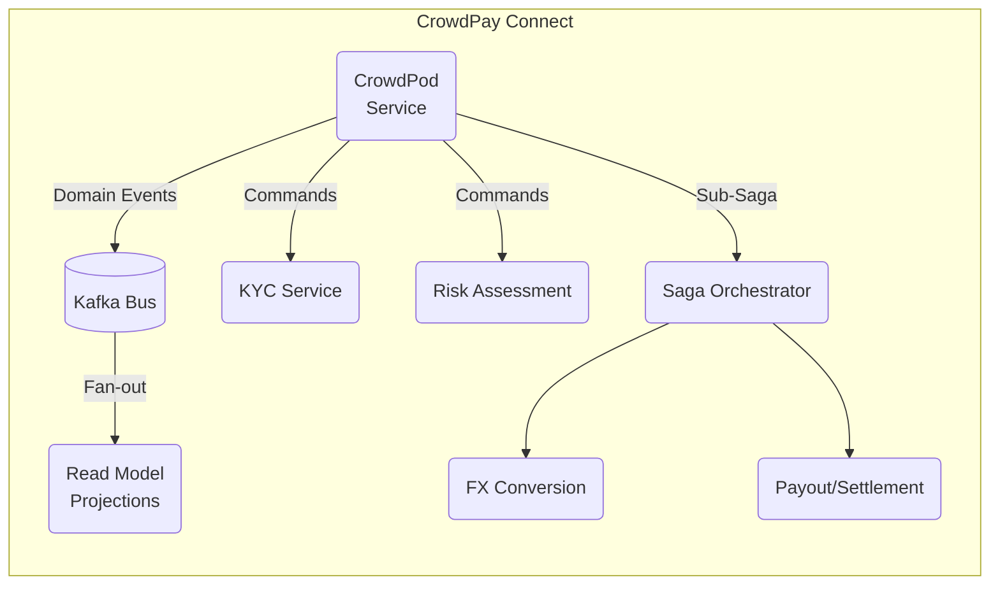
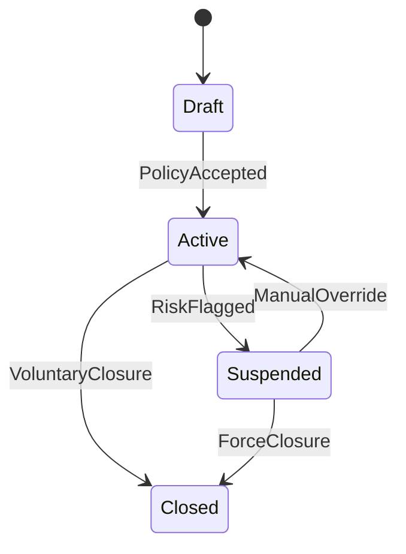

```markdown
# CrowdPay Connect – `crowdpod_service`
Social-first pooled-wallet & dynamic payment-circle micro-service

---

## Table of Contents
1. [Service Overview](#service-overview)
2. [High-level Architecture](#high-level-architecture)
3. [Getting Started](#getting-started)
4. [Domain Concepts](#domain-concepts)
5. [Public API](#public-api)
6. [Event-Sourcing Contracts](#event-sourcing-contracts)
7. [Running the Test-Suite](#running-the-test-suite)
8. [Security & Compliance](#security--compliance)
9. [Operational Playbook](#operational-playbook)
10. [Contributing](#contributing)
11. [License](#license)

---

## Service Overview
`crowdpod_service` orchestrates the lifecycle of **CrowdPods**—secure, autonomous wallets
that allow groups to pool, split, lend, or donate funds across
multiple currencies.  
It encapsulates:

* Creation / configuration of a CrowdPod & its **governance policy**
* Membership & role management (`ADMIN`, `TREASURER`, `MEMBER`, `OBSERVER`)
* Multi-currency balance tracking with real-time FX conversion
* Integration with:
  * `risk_assessment` micro-component  
  * `kyc_verification` service  
  * `settlement` & `ledger` domains
* Saga coordination for cross-border settlements
* Event-sourcing audit trail and CQRS read-models

---

## High-level Architecture


Key architectural patterns:
* **Security-by-Design** – E2E encryption, zero-trust auth-z
* **CQRS + Event Sourcing** – Write model = immutable event log; read model = MongoDB
* **Saga Pattern** – Long-running, multi-step money movement workflow
* **Audit Trail** – Non-repudiable, tamper-evident ledger of all actions


---

## Getting Started

### Prerequisites
* Python `3.11+`
* Docker `24+`
* `poetry >=1.6`
* Local dev services: `Kafka`, `MongoDB`, `Redis`

### Quick Start
```bash
# 1. Clone monorepo & cd
git clone git@github.com:crowdpay/connect.git
cd connect/services/crowdpod_service

# 2. Bootstrap environment
poetry install

# 3. Spin up infra
docker compose -f docker/docker-compose.dev.yml up -d kafka mongodb redis

# 4. Run service
poetry run uvicorn crowdpod_service.app:app --reload --host 0.0.0.0 --port 8080
```

Service should now be reachable at  
`http://localhost:8080/healthz`

---

## Domain Concepts
| Concept              | Description                                                                                 |
|----------------------|---------------------------------------------------------------------------------------------|
| CrowdPod             | Autonomous wallet + governance policy                                                      |
| Governance Policy    | JSON schema detailing voting quorum, spending limits, risk tiers                           |
| Member               | User with a specific role within a CrowdPod                                                |
| Contribution Cycle   | Periodic funding window (e.g. weekly, monthly)                                             |
| Pledge               | Promise to contribute funds; becomes a `Contribution` on settlement                        |
| Reputation Score     | Gamified metric derived from on-chain & off-chain behaviour                                |

### State Diagram (simplified)


---

## Public API

### Authentication
All endpoints are secured via **OAuth 2.1** (client-credential flow) and signed with **JWT**.
Scopes follow the pattern: `crowdpod:{pod_id}:{permission}`.

### Endpoints (excerpt)
| Method | Path                              | Scope                             | Description                        |
|--------|-----------------------------------|-----------------------------------|------------------------------------|
| GET    | `/pods/{pod_id}`                  | `read`                            | Retrieve CrowdPod metadata         |
| POST   | `/pods`                           | `write`                           | Create a new CrowdPod              |
| PATCH  | `/pods/{pod_id}/policy`           | `admin`                           | Update governance policy           |
| POST   | `/pods/{pod_id}/members`          | `admin`                           | Add member                         |
| GET    | `/pods/{pod_id}/balance`          | `read`                            | Multi-currency balance snapshot    |
| POST   | `/pods/{pod_id}/pledges`          | `write`                           | Create funding pledge              |
| POST   | `/pods/{pod_id}/actions/close`    | `admin`                           | Finalise & close CrowdPod          |

#### Example – Create a CrowdPod
```http
POST /pods HTTP/1.1
Authorization: Bearer <jwt>
Content-Type: application/json

{
  "name": "Summer Trip 2025",
  "currency": "EUR",
  "policy": {
    "spending_limit": 5000,
    "voting_quorum": 0.66,
    "risk_tier": "STANDARD"
  }
}
```

Response
```json
{
  "pod_id": "pod_7fb754b2",
  "status": "DRAFT",
  "created_at": "2024-05-22T14:11:02Z"
}
```

---

## Event-Sourcing Contracts
Events are Kafka messages using **CloudEvents v1.0** envelope and **Avro** payload.
Topic naming: `crowdpay.crowdpod.v1.<event_name>`.

### `CrowdPodCreated` (v1)
```avro
{
  "type":"record",
  "name":"CrowdPodCreated",
  "namespace":"com.crowdpay.crowdpod",
  "fields":[
    {"name":"pod_id",          "type":"string"},
    {"name":"owner_id",        "type":"string"},
    {"name":"currency",        "type":"string"},
    {"name":"policy",          "type":{"type":"bytes","logicalType":"json"}},
    {"name":"created_at",      "type":{"type":"long","logicalType":"timestamp-millis"}}
  ]
}
```

### Event Flow
1. `CrowdPodCreated`
2. `PolicyAccepted`
3. `MemberJoined`
4. `FundsPledged`
5. `PledgeSettled`
6. `PodClosed`

Consumers update materialised read-models (MongoDB) and publish integration events
for downstream bounded contexts (ledger, notifications, analytics).

---

## Running the Test-Suite
```bash
poetry run pytest -n auto -q
```
Tests include:
* Property-based tests (hypothesis) on FX conversions
* Contract tests (pact) for HTTP & Kafka integrations
* Mutation tests (mutmut) to enforce coverage quality gate `≥ 85 %`

Generate coverage report:
```bash
pytest --cov=crowdpod_service --cov-report=xml
```

---

## Security & Compliance
* **PII encryption**: AES-256 / AWS KMS
* **KYC**: Integrated with SumSub & Onfido adaptors
* **AML**: Real-time screening via DowJones Watchlist
* **PSD2 / Open Banking**: Dedicated consent flows
* **GDPR**: Right-to-be-forgotten via asynchronous erasure command

Threat modelling is performed per commit using `threatplaybook`.
See `docs/threat-models/latest.tm7`.

---

## Operational Playbook
Health probes:
```bash
curl -s http://localhost:8080/healthz      # liveness
curl -s http://localhost:8080/readyz       # readiness
```

### Observability
* Tracing: OpenTelemetry (exported to OTLP / Jaeger)
* Metrics: Prometheus (`/metrics`)
* Logs: JSON structured, shipped to Grafana Loki

### Scaling Guidelines
| QPS           | Pods | Replicas | CPU | Memory |
|--------------:|-----:|---------:|----:|-------:|
| 0 – 500       | 1    | 2        | 200m| 256Mi  |
| 500 – 2 000   | 1    | 4        | 400m| 512Mi  |
| 2 000 +       | 2    | 6 +      | 1 CPU| 1 Gi |

---

## Contributing
1. Fork → Feature Branch (`feat/<ticket>-<slug>`) → PR
2. Pre-commit hooks (`black`, `ruff`, `mypy`)
3. CI pipeline must pass (unit, security, license, e2e)
4. PR requires 1 approval from core maintainers

### Issue Labels
* `bug`
* `enhancement`
* `good first issue`
* `security`
* `blocked`

---

## License
CrowdPay Connect is licensed under the **Apache License 2.0**.  
See [`LICENSE`](../../LICENSE) for full text.
```