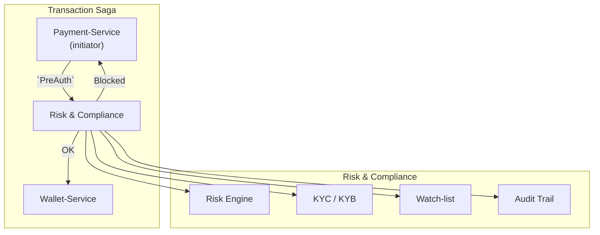

```markdown
# Risk & Compliance Service  
_CrowdPay Connect – FinTech Payment Platform_

> Secure-by-design micro-service implementing **real-time risk analysis**, **policy based KYC/AML checks**, and **Reg-tech grade compliance reporting** for all monetary movements inside CrowdPay Connect.

---

## 1. Service Responsibilities
* Perform synchronous **pre-transaction risk scoring** (fraud, credit, AML red-flag).
* Orchestrate **Know-Your-Customer (KYC)** and **Know-Your-Business (KYB)** verification with third-party providers.
* Stream **audit-ready compliance events** to the central Event Store (CQRS/Event Sourcing).
* Enforce **country-specific regulations** (EU-PSD2, US-FinCEN, FCA, MAS, etc.).
* Expose **REST + gRPC** interfaces for other services, plus **async outbox** for Saga rollback.

---

## 2. High-Level Architecture



*Written with Security-by-Design: defense in depth, principle of least privilege, encrypted secrets, traceable audit.*

---

## 3. Getting Started

### 3.1 Environment Variables

| Variable                           | Description                                     | Default              |
| --------------------------------- | ----------------------------------------------- | -------------------- |
| `RISK_DB_DSN`                      | PostgreSQL DSN for internal state               | `postgresql://…`     |
| `EVENT_BUS_BROKER_URL`             | Kafka / NATS broker for event sourcing          | `kafka://localhost`  |
| `KYC_PROVIDER_API_KEY`             | External KYC vendor API key                     | _required_           |
| `APP_SECRET_KEY`                   | HMAC key for JWT / signing                      | _required_           |
| `SERVICE_HOST` & `SERVICE_PORT`    | HTTP host/port                                  | `0.0.0.0` / `8083`   |
| `LOG_LEVEL`                        | Logging verbosity                               | `INFO`               |

### 3.2 Run Locally (Docker)

```bash
# Launch all dependencies
docker compose -f compose.local.yml up -d

# Start the service with hot-reload
poetry install
poetry run uvicorn risk_compliance_service.main:app --reload
```

---

## 4. API Quick Reference

### 4.1 REST

| Method | Path                                 | Description                               |
| ------ | ------------------------------------ | ----------------------------------------- |
| POST   | `/v1/pre-transaction/evaluate`       | Real-time risk + KYC decision             |
| GET    | `/v1/customers/{customer_id}/status` | Aggregated KYC/KYB outcome                |
| GET    | `/healthz`                           | Liveness / readiness                      |

Sample request:

```http
POST /v1/pre-transaction/evaluate HTTP/1.1
Content-Type: application/json

{
  "transaction_id": "tx_9866f93c",
  "source_user_id": "user_42",
  "dest_user_id": "user_99",
  "amount": {
    "value": "120.45",
    "currency": "EUR"
  },
  "ip_address": "178.23.1.77",
  "device_fingerprint": "a9119d98-…"
}
```

Successful response:

```json
{
  "transaction_id": "tx_9866f93c",
  "decision": "ALLOW",
  "score": 0.13,
  "kyc_required": false,
  "reference_id": "risk_eval_e325401c"
}
```

### 4.2 gRPC

See `proto/risk_engine.proto`.

---

## 5. Event Contracts

The service emits structured CloudEvents to the `risk_compliance.events` topic.

```jsonc
{
  "specversion": "1.0",
  "type": "risk.decision.v1",
  "source": "risk-compliance-service",
  "subject": "tx_9866f93c",
  "time": "2023-10-11T07:22:15Z",
  "data": {
    "decision": "BLOCK",
    "score": 0.97,
    "reason": "sanction_match",
    "blocked_by": "watchlist"
  }
}
```

---

## 6. Local Development

1. Format & lint:

   ```bash
   poetry run ruff .
   poetry run black .
   ```

2. Run unit tests & coverage:

   ```bash
   poetry run pytest -q --cov=risk_compliance_service
   ```

3. Protobuf (re)generation:

   ```bash
   make proto
   ```

---

## 7. Folder Structure

```
risk_compliance_service/
├── adapters/        # Ports & drivers (DB, Kafka, vendor SDKs)
├── core/            # Domain models, rules engine, policy DSL
├── api/             # FastAPI routers, gRPC stubs
├── jobs/            # Async workers (outbox, scheduler)
├── tests/           # Pytest unit / integration tests
└── README.md        # (this file)
```

---

## 8. Security & Compliance

* 🍃 Zero-trust, mutual TLS between services.
* 🔐 AES-256 encryption for PII at rest, envelope encryption for keys (AWS KMS/Azure KeyVault).
* 🛡️ WAF + rate limiting in API-Gateway.
* 📜 All decisions are audit-logged (immutable, tamper-evident).
* ⚙️ Periodic SOC 2 & PCI-DSS penetration tests.

---

## 9. SLA & Performance

| Metric                     | Target |
| -------------------------- | ------ |
| P95 Decision Latency       | < 120 ms |
| 99.9% Uptime               | ≥ 99.95 % |
| Data Retention (PII)       | 7 years (configurable) |

---

## 10. Contributing

Pull Requests welcome!  
Please follow the guidelines in `CONTRIBUTING.md` and ensure:

1. 🌐 All external calls are mocked in tests (no real vendor charges).
2. 🔬 ≥ 85 % test coverage.
3. 🧪 New rules have property-based tests (Hypothesis).

---

## 11. Changelog

See [CHANGELOG.md](../CHANGELOG.md) for release notes.

---

© 2023–present CrowdPay Connect
```