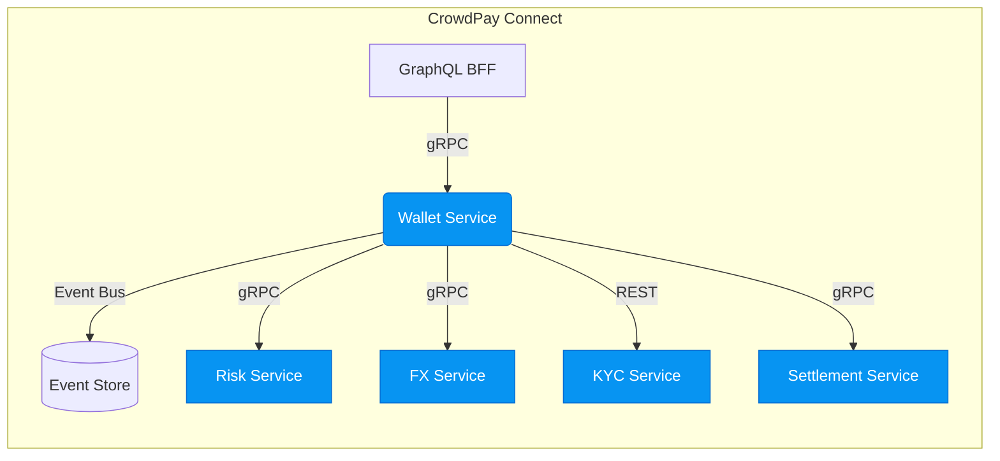

# CrowdPay Connect · Wallet Service  
A micro-service for managing custodial, multi-currency wallets that power CrowdPods.

---

## Table of Contents
1. [Context](#context)  
2. [Architecture](#architecture)  
3. [Domain Model](#domain-model)  
4. [Public API](#public-api)  
5. [Python SDK Example](#python-sdk-example)  
6. [Running Locally](#running-locally)  
7. [Environment Variables](#environment-variables)  
8. [Migrations & DB Tasks](#migrations--db-tasks)  
9. [Testing](#testing)  
10. [Security & Compliance](#security--compliance)  
11. [Observability](#observability)  
12. [Contributing](#contributing)  
13. [License](#license)  

---

## Context
The **Wallet Service** is the financial heart of CrowdPay Connect. Each `CrowdPod` (group wallet) and each `User` (personal wallet) is backed by a secure ledger account that:

* Maintains accurate balances in multiple currencies
* Emits immutable events for every state transition (`WalletCredited`, `WalletDebited`, `TransferCompleted`, etc.)
* Participates in distributed Saga workflows for funding, FX conversion, and settlement
* Enforces KYC/KYB, real-time risk scoring, and velocity limits

---

## Architecture


Key patterns used:

| Concern                     | Implementation Detail                                   |
|-----------------------------|---------------------------------------------------------|
| Event Sourcing              | [EventStoreDB](https://eventstore.com/) (stream-per-wallet) |
| CQRS                        | Command layer (write) & SQL projection layer (read)     |
| Distributed Transactions    | [Saga Pattern](https://microservices.io/patterns/data/saga.html) mediated by the Orchestrator service |
| Security by Design          | End-to-end protobuf encryption + JWT/OAuth2 scopes      |
| Audit Trail                 | Tamper-evident append-only event logs                   |

---

## Domain Model
```text
+----------------------------+
|         Wallet            <|
+----------------------------+
| id : UUID                  |
| owner_id : UUID            |
| kind : Enum(POD, USER)     |
| status : Enum(ACTIVE..)    |
| base_currency : ISO4217    |
+----------------------------+
        ^        ^
        |        +-- has many ---> CurrencyBalance
        |
        +-- emits events ----> WalletEvent*
```

Sample events (all protobuf-encoded):

* `WalletOpened`
* `WalletCredited`
* `WalletDebited`
* `WalletFrozen`
* `TransferInitiated`
* `TransferCompleted`
* `CurrencyConverted`

---

## Public API
OpenAPI docs are auto-generated and served at `/docs`.  
The excerpt below shows high-value endpoints:

| Verb | Path                              | Description                             | Auth Scope | Side-Effects          |
|------|-----------------------------------|-----------------------------------------|------------|-----------------------|
| POST | `/v1/wallets`                     | Create a new wallet                     | `wallet:create` | Emits `WalletOpened` |
| GET  | `/v1/wallets/{wallet_id}`         | Fetch wallet projection                 | `wallet:read` | — |
| POST | `/v1/wallets/{id}/credit`         | Credit funds (external funding)         | `wallet:credit` | Saga start (`FundingSaga`) |
| POST | `/v1/wallets/{id}/debit`          | Debit funds (withdraw)                  | `wallet:debit`  | Saga start (`WithdrawSaga`) |
| POST | `/v1/transfer`                    | Peer-to-peer / CrowdPod transfer        | `wallet:transfer` | 2-phase event sequence |
| GET  | `/v1/wallets/{id}/events`         | Paginated event stream                  | `wallet:read` | — |

All write endpoints are **idempotent** via the `Idempotency-Key` header.

---

## Python SDK Example
The project ships with an auto-generated, async SDK. Below is a quick start snippet:

```python
"""
pip install crowdpay-connect-sdk[async]
"""

import asyncio
from crowdpay_connect_sdk.wallet import WalletClient
from crowdpay_connect_sdk.models import (
    NewWalletRequest,
    CreditRequest,
    TransferRequest
)

API_KEY = "cp_live_xxx"  # OAuth2 Bearer token
BASE_URL = "https://api.crowdpayconnect.com"

async def demo():
    async with WalletClient(base_url=BASE_URL, api_key=API_KEY) as client:
        # 1. Open a new CrowdPod wallet
        pod_wallet = await client.create_wallet(
            NewWalletRequest(
                owner_id="3946fb93-9f9a-4c79-b264-6592b8ab4c67",
                kind="POD",
                base_currency="USD",
                metadata={"name": "Summer Trip 2024"}
            )
        )
        print("New wallet:", pod_wallet.id)

        # 2. Credit the wallet with 500 USD
        op = await client.credit_wallet(
            pod_wallet.id,
            CreditRequest(
                amount=500_00,  # minor units
                currency="USD",
                source="CARD",
                reference="ch_1Nx32..."
            )
        )
        await op.wait()  # waits for Saga completion via long-poll

        # 3. Transfer 100 USD to another user wallet
        await client.transfer(
            TransferRequest(
                from_wallet_id=pod_wallet.id,
                to_wallet_id="c5333751-6d63-49b9-91af-37933f163f98",
                amount=100_00,
                currency="USD",
                memo="Deposit for hotel"
            )
        )

if __name__ == "__main__":
    asyncio.run(demo())
```

---

## Running Locally
1. Clone the repo and `cd crowdpay_connect/services/wallet_service`.  
2. `docker compose up -d` (starts Postgres, EventStoreDB, and LocalStack mocks).  
3. `poetry install` or `pip install -r requirements/dev.txt`.  
4. `export $(cat .env.local | xargs)` (env overrides).  
5. `uvicorn wallet_service.app:app --reload`.

Hot-reloading, live OpenAPI docs, and tailing logs are all available out-of-the-box.

---

## Environment Variables
| Key                           | Default                | Description                                   |
|-------------------------------|------------------------|-----------------------------------------------|
| `DATABASE_URL`                | `postgres://...`       | Read/write projection store                   |
| `EVENTSTORE_URI`              | `esdb://...`           | Event sourcing database                       |
| `JWT_PUBLIC_KEY`              | —                      | RSA public key for access-token validation    |
| `RISK_SERVICE_ENDPOINT`       | `http://risk:9000`     | gRPC endpoint                                 |
| `FX_SERVICE_ENDPOINT`         | `http://fx:9000`       | gRPC endpoint                                 |
| `SETTLEMENT_SERVICE_ENDPOINT` | `http://setl:9000`     | gRPC endpoint                                 |
| `WALLET_DEFAULT_LIMIT`        | `10000_00` (minor USD) | 24h total velocity limit                      |
| `ALLOWED_ORIGINS`             | `*`                    | CORS settings                                 |

Values may be loaded via `.env` files (supported by [`python-dotenv`](https://github.com/theskumar/python-dotenv)).

---

## Migrations & DB Tasks
We use [Alembic](https://alembic.sqlalchemy.org/) for schema migrations.

```bash
# Create new revision
alembic revision -m "add wallet limits"

# Apply pending migrations
alembic upgrade head
```

EventStoreDB needs no migrations; streams are created on demand.

---

## Testing
```bash
# Static analysis & type checking
pre-commit run --all-files

# Unit + component tests with coverage
pytest -q --cov=wallet_service --cov-report=term-missing

# Contract tests against running deps
pytest tests/contracts
```

Pipeline status is enforced by GitHub Actions & SonarCloud gates (coverage ≥ 90%, no critical issues).

---

## Security & Compliance
* PCI DSS SAQ-D validated; no card data stored—tokens only.  
* All personally identifiable data (PII) is encrypted at rest via AES-256-GCM.  
* Strict [OWASP top-10](https://owasp.org/www-project-top-ten/) checks via Snyk & Bandit.  
* Real-time fraud signals injected into `/credit` & `/transfer` flows; high-risk transactions are soft declined and escalate to secondary review.  
* Each event carries a tamper-evident HMAC signature (chain-of-trust).  

---

## Observability
* **Metrics** — Prometheus (`wallet_balance_total`, `saga_failure_total`, etc.)  
* **Tracing** — OpenTelemetry exports to Jaeger.  
* **Logging** — JSON logs in ECS-compatible format (12-factor).  

Dashboards live in `grafana/`. Run `docker compose up grafana`.

---

## Contributing
1. Fork, branch from `main` using conventional commits (`feat:`, `fix:`, …).  
2. Ensure `make lint test` passes locally.  
3. Submit a PR; the CI pipeline auto-deploys a review app.  
4. Two approvals & green checks ⇒ merge.

We follow the [Contributor Covenant](https://www.contributor-covenant.org/).

---

## License
`Apache-2.0`. See `LICENSE` in the repo root.

Enjoy building the future of social finance 🚀